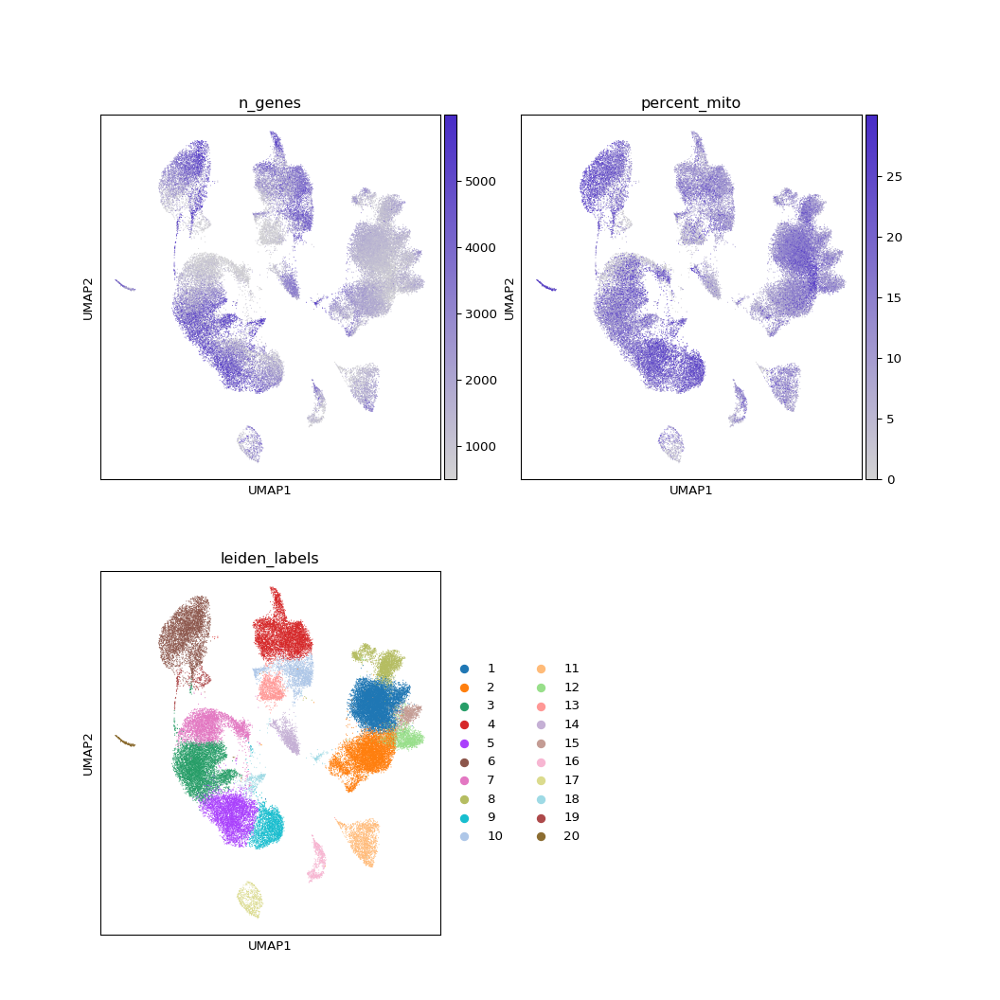
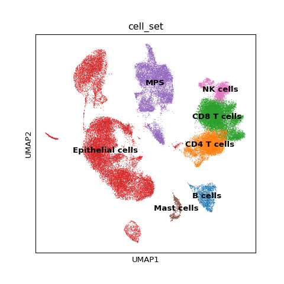
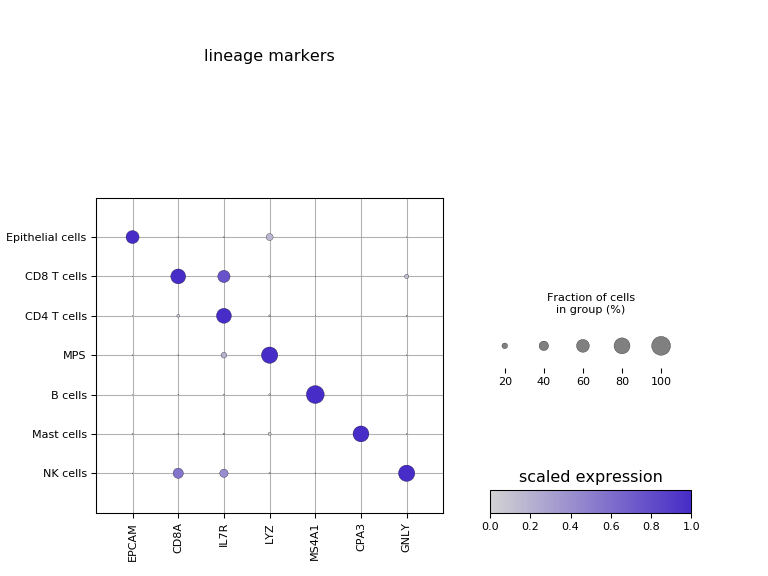
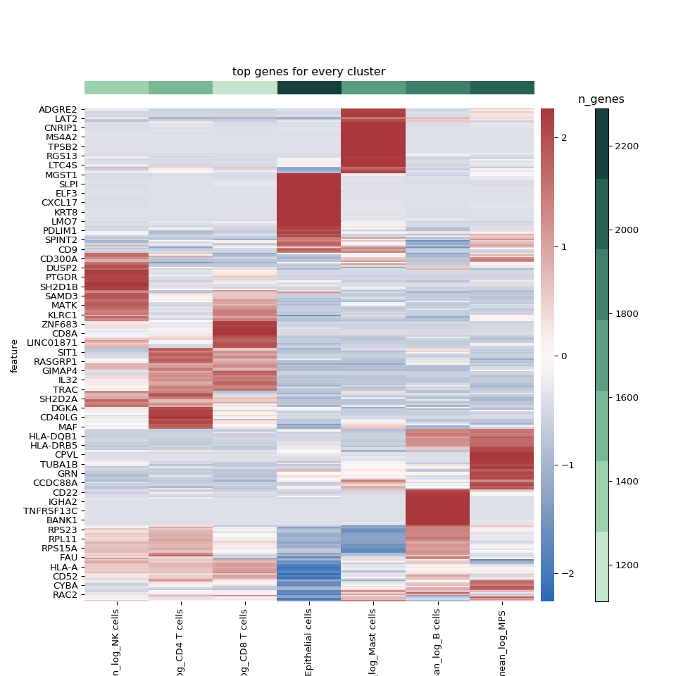
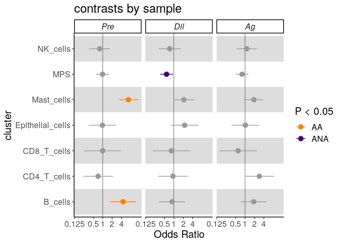

Figure 1
================

``` r
library(reticulate)
use_python("/home/nealpsmith/.conda/envs/sc_analysis/bin/python")
```

**For figure 1, we wanted to perform a general clustering of our cells to define the major lineages we captured. With these main lineages defined, we wanted to see if there were any major differences in abundance between our groups/conditions**

First, we need to aggregate the matrices and assess the data quality. Here we use Pegasus to create a count matrix and to calcluate some quality-control statistics (% mitochondrial UMIs, number of genes per cell). From there, we can plot these statistics to determine the proper cutoffs to define the quality cells. Based on the distributions, we chose to include cells with &lt; 30% mitochondrial reads and &gt; 500 genes.

``` python
import pegasus as pg
import scanpy as sc
import pandas as pd
import matplotlib.colors as clr
import matplotlib.pyplot as plt
import matplotlib as mpl

# Set a colormap
colormap = clr.LinearSegmentedColormap.from_list('gene_cmap', ["#d3d3d3" ,'#482cc7'], N=200)

# Aggregate the matrices
pg.aggregate_matrices(csv_file = "/home/nealpsmith/projects/medoff/cellranger/aggregate_matrix.csv",
                      what_to_return = "/home/nealpsmith/projects/medoff/data/all_data.h5sc")

all_data = pg.read_input("/home/nealpsmith/projects/medoff/data/all_data.h5sc")
pg.qc_metrics(all_data, percent_mito = 30)

# Plot the percent mito/n genes
fig, ax = plt.subplots(1)
x = all_data.obs["n_genes"]
y = all_data.obs["percent_mito"]
_ = ax.hexbin(x, y, mincnt=1, xscale = "log")
_ = ax.set_xticks([10, 100, 1000])
_ = ax.get_xaxis().set_major_formatter(mpl.ticker.ScalarFormatter())
_ = ax.axvline(500, color="red")
_ = ax.axhline(30, color="red")
_ = plt.xlabel("Number of genes")
_ = plt.ylabel("percent mitochondrial UMIs")
```


Next we log-normalized the data, selected highly variable features and performed PCA.

``` python
# pg.filter_data(all_data)
# pg.log_norm(all_data)
# pg.highly_variable_features(all_data, consider_batch = False)
# pg.pca(all_data)
```

To account for technical variability between samples, we used the Harmony algorithm to align the pricniple component scores. These adjust PCs were used for downstrseam leiden clustering and UMAP dimensionality reduction. Once we have the data in UMAP space, we can look at our QC metrics, along with our basic leiden clustering.

``` python
# pg.run_harmony(all_data, n_jobs = 5)
# pg.neighbors(all_data, rep = "pca_harmony")
# pg.diffmap(all_data, rep = "pca_harmony")
# pg.leiden(all_data, rep = "pca_harmony")
# pg.umap(all_data, rep = "pca_harmony")
# pg.write_output("/home/nealpsmith/projects/medoff/data/all_data_harmonized.h5ad")

# Read in the harmonized data
harmonized_data = pg.read_input("/home/nealpsmith/projects/medoff/data/all_data_harmonized.h5ad")
figure = sc.pl.umap(harmonized_data, color = ["n_genes", "percent_mito", "leiden_labels"],
                    cmap = colormap, return_fig = True, show = False, ncols = 2)
figure.set_size_inches(11, 11)
figure
```



Now that the data is in UMAP space, we can use cannonical markers to try to define major lineages.

``` python

lin_genes = ["EPCAM", "CD8A", "IL7R", "LYZ", "MS4A1", "CPA3", "GNLY"]
figure = sc.pl.umap(harmonized_data, color = lin_genes,
           cmap = colormap, ncols = 3, return_fig = True, show = False,
                    wspace = 0.2, hspace = 0.3)
figure.set_size_inches(10, 7)
```


Using all of this info (along with other DEG info), we can assign the clusters to our major lineages.

``` python
cell_clust_dict = {
        "1" : "CD8 T cells",
        "2" : "CD4 T cells",
        "3" : "Epithelial cells",
        "4" : "MPS",
        "5" : "Epithelial cells",
        "6" : "Epithelial cells",
        "7" : "Epithelial cells",
        "8" : "NK cells",
        "9" : "Epithelial cells",
        "10" : "MPS",
        "11" : "B cells",
        "12" : "CD8 T cells",
        "13" : "MPS",
        "14" : "MPS",
        "15" : "CD8 T cells",
        "16" : "Mast cells",
        "17" : "Epithelial cells",
        "18" : "Epithelial cells",
        "19" : "Epithelial cells",
        "20" : "Epithelial cells"
    }
harmonized_data.obs["cell_set"] = [cell_clust_dict[clust] for clust in harmonized_data.obs["leiden_labels"]]

figure = sc.pl.umap(harmonized_data, color = "cell_set", return_fig = True, show = False, legend_loc = "on data")
figure.set_size_inches(5, 5)
figure
```



Looking at the major lineage markers in a dot plot, we can appreciate how specific they are for our new assignments.

``` python
plot = sc.pl.dotplot(harmonized_data, lin_genes, groupby="cell_set",
                     show=False, return_fig=True, title="lineage markers",
                     cmap=colormap, standard_scale = "var",
                     categories_order = ["Epithelial cells", "CD8 T cells", "CD4 T cells",
                                                               "MPS", "B cells", "Mast cells", "NK cells"])

axes_dict = plot.get_axes()
axes_dict["mainplot_ax"].set_axisbelow(True)
axes_dict["mainplot_ax"].grid()
_ = axes_dict["color_legend_ax"].set_title("scaled expression")
figure = plt.gcf()
figure.set_size_inches(8, 6)
figure
```



# Marker genes

In addition to cannonical gene visualization, we wanted to create unbiased gene lists for our defined lineages. Here, we selected genes that had an AUROC &gt; 0.75 or were significant by pseudobulk analyses (these are explained in more detail in the figure 2 and 3 notebooks). We can visualize these markers with a heatmap.

``` python

import numpy as np
import seaborn as sns
from mpl_toolkits.axes_grid1 import make_axes_locatable
import matplotlib as mpl

### Lets make a heatmap ###
de_res = harmonized_data.varm["de_cell_set"]
de_res = pd.DataFrame(de_res)
de_res = de_res.fillna(0)

# Get p value columns
names = [name for name in de_res.columns if name.startswith("pseudobulk_p_val")]

import statsmodels.stats.multitest as stats
for name in names :
    clust = name.split(":")[1]
    de_res["pseudobulk_q_val:{clust}".format(clust = clust)] = stats.fdrcorrection(de_res[name])[1]

de_res = de_res.to_records(index=False)
harmonized_data.varm["de_cell_set"] = de_res

top_genes = {}
for clust in sorted(set(harmonized_data.obs["cell_set_clean"])) :
    df_dict = {"auc": harmonized_data.varm["de_cell_set"]["auroc:{clust}".format(clust=clust)],
               "pseudo_q" : harmonized_data.varm["de_cell_set"]["pseudobulk_q_val:{clust}".format(clust = clust)],
               "pseudo_p" : harmonized_data.varm["de_cell_set"]["pseudobulk_p_val:{clust}".format(clust = clust)],
               "pseudo_log_fc" : harmonized_data.varm["de_cell_set"]["pseudobulk_log_fold_change:{clust}".format(clust = clust)],
               "percent" : harmonized_data.varm["de_cell_set"]["percentage:{clust}".format(clust = clust)]}
    df = pd.DataFrame(df_dict, index=harmonized_data.var.index)
    # Lets limit to genes where at least 20% cells express it
    df = df[df["percent"] > 20]
    df = df.sort_values(by=["auc"], ascending=False)
    auc_df = df.iloc[0:50]
    # genes = df.index.values
    # Get top 50 genes (first by AUC, then by pseudobulk)
    genes = auc_df[auc_df["auc"] >= 0.75].index.values
    n_from_pseudo = 50 - len(genes)
    if n_from_pseudo > 0 :
        # Dont want to repeat genes
        pseudobulk = df.drop(genes)
        pseudobulk = pseudobulk[(pseudobulk["pseudo_q"] < 0.05)]
        pseudobulk = pseudobulk.sort_values(by="pseudo_log_fc", ascending=False).iloc[0:n_from_pseudo,
                     :].index.values
        pseudobulk = [name for name in pseudobulk if name not in genes]
        genes = np.concatenate((genes, pseudobulk))

    print("Cluster {clust}: {length}".format(clust = clust, length = len(genes)))
    top_genes[clust] = genes
    # for gene in genes :
    #     if gene not in top_genes :
    #         top_genes.append(gene)

heatmap_genes = []
repeated_genes = [] # Get genes that are not unique, do not want to annotate them
for key in top_genes.keys() :
    for gene in top_genes[key] :
        if gene not in heatmap_genes :
            heatmap_genes.append(gene)
        else :
            repeated_genes.append(gene)

# Get the genes for annotation: top markers that are not in repeated genes
annot_genes = {}
for clust in top_genes.keys() :
    non_rep_genes = [gene for gene in top_genes[clust] if gene not in repeated_genes and not gene.startswith("RP")]
    annot_genes[clust] = non_rep_genes

# Write out the annotation genes for the heatmap (making with ComplexHeatmap)
annot_genes = pd.DataFrame(dict([ (k,pd.Series(v)) for k,v in annot_genes.items() ]))
annot_genes = annot_genes.rename(columns = {clust : "{clust}".format(clust=clust) for clust in annot_genes.columns})
# Lets add the colors for each cluster from the UMAP
clust_cols = dict(zip(sorted(set(harmonized_data.obs["cell_set"])),
                      harmonized_data.uns["cell_set_colors"]))
clust_cols = pd.DataFrame(clust_cols,
                          index = ["col"]).rename(columns = dict(zip(clust_cols.keys(),
                                                                     ["{clust}".format(clust = clust) for clust
                                                                      in clust_cols.keys()])))

annot_genes = annot_genes.append(clust_cols)

# Also need to add mean gene counts
# Get the mean gene counts for sidebar
gene_val_list = []
gene_val_dict = {}
for clust in sorted(set(harmonized_data.obs["cell_set"])) :
    gene_vals = harmonized_data.obs["n_genes"][harmonized_data.obs["cell_set"] == clust]

    mean = np.mean(gene_vals)
    gene_val_list.append(mean)
    gene_val_dict[clust] = mean

# Append these mean gene counts to the dataframe
annot_genes = annot_genes.append(pd.DataFrame(gene_val_dict,
                          index = ["mean_genes"]).rename(columns = dict(zip(gene_val_dict.keys(),
                                                                     ["{clust}".format(clust = clust) for clust
                                                                      in gene_val_dict.keys()]))))


# Get the mean expression of the top genes from each cluster
de_df = {"mean_log_{clust}".format(clust = clust) : harmonized_data.varm["de_cell_set"]["mean_logExpr:{clust}".format(clust = clust)] for clust in sorted(set(harmonized_data.obs["cell_set"]))}
de_df = pd.DataFrame(de_df, index = harmonized_data.var.index)

heatmap_df = de_df.loc[heatmap_genes]


colors = sns.color_palette("ch:2.5,-.2,dark=.2", n_colors = len(gene_val_list)).as_hex()
# Put the gene values in order lowest to highest
sorted_cols = sorted(gene_val_list)

fig, ax = plt.subplots(1, 1, figsize = (10, 10))
divider = make_axes_locatable(ax)
axDivY = divider.append_axes( 'right', size=0.2, pad= 0.1)
axDivY2 = divider.append_axes( 'right', size=0.2, pad= 0.2)
axDivY3 = divider.append_axes( 'right', size=0.2, pad= 0.2)
axDivY4 = divider.append_axes( 'top', size=0.2, pad= 0.2)

ax1 = sns.clustermap(heatmap_df, method = "ward", row_cluster =True, col_cluster =True, z_score = 0, cmap = "vlag")
col_order = np.array([name.split("_")[-1] for name in ax1.data2d.columns])
index = [sorted_cols.index(gene_val_dict[clust]) for clust in col_order]
plt.close()
ax1 = sns.heatmap(ax1.data2d, cmap = "vlag", ax = ax, cbar_ax = axDivY)
ax2 = axDivY2.imshow(np.array([[min(gene_val_list), max(gene_val_list)]]), cmap = mpl.colors.ListedColormap(list(colors)),
                     interpolation = "nearest", aspect = "auto")
axDivY2.set_axis_off()
axDivY2.set_visible(False)
_ = plt.colorbar(ax2, cax = axDivY3)
_ = axDivY3.set_title("n_genes")
ax3 = axDivY4.imshow(np.array([index]),cmap=mpl.colors.ListedColormap(list(colors)),
              interpolation="nearest", aspect="auto")
axDivY4.set_axis_off()
_ = plt.title("top genes for every cluster")
plt.show()
```



To make things more readable, we also made a heatmap where we kept the columns clustered such that phenotypically similar clusters were grouped together, but manually ordered the rows.

``` python
n_heatmap_genes = {}
heatmap_genes = []
for key in col_order :
    cnt = 0
    for gene in top_genes[key] :
        if gene not in heatmap_genes :
            heatmap_genes.append(gene)
            cnt+=1
    n_heatmap_genes[key] = cnt

n_heatmap_genes = pd.DataFrame(n_heatmap_genes, index = ["n_genes"]).rename(columns = dict(zip(n_heatmap_genes.keys(),
                                                                                               ["{clust}".format(clust = clust) for
                                                                                                clust in n_heatmap_genes.keys()])))
# Add number of genes in the heatmap for each clusters
annot_genes = annot_genes.append(n_heatmap_genes)
annot_genes = annot_genes.reset_index()
annot_genes = annot_genes.fillna('')

# Get the mean expression of the top genes from each cluster
de_df = {"mean_log_{clust}".format(clust = clust) : harmonized_data.varm["de_cell_set"]["mean_logExpr:{clust}".format(clust = clust)] for clust in sorted(set(harmonized_data.obs["cell_set_clean"]))}
de_df = pd.DataFrame(de_df, index = harmonized_data.var.index)

heatmap_df = de_df.loc[heatmap_genes]

# Get rid of the "mean log" name in heatmap_df
heatmap_df.columns = heatmap_df.columns.str.replace("mean_log_", "")

# Get the mean gene counts for sidebar
gene_val_list = []
gene_val_dict = {}
for clust in sorted(set(harmonized_data.obs["cell_set_clean"])) :
    gene_vals = harmonized_data.obs["n_genes"][harmonized_data.obs["cell_set_clean"] == clust]

    mean = np.mean(gene_vals)
    gene_val_list.append(mean)
    gene_val_dict[clust] = mean

colors = sns.color_palette("ch:2.5,-.2,dark=.2", n_colors = len(gene_val_list)).as_hex()
# Put the gene values in order lowest to highest
sorted_cols = sorted(gene_val_list)

fig, ax = plt.subplots(1, 1, figsize = (10, 10))
divider = make_axes_locatable(ax)
axDivY = divider.append_axes( 'right', size=0.2, pad= 0.1)
axDivY2 = divider.append_axes( 'right', size=0.2, pad= 0.2)
axDivY3 = divider.append_axes( 'right', size=0.2, pad= 0.2)
axDivY4 = divider.append_axes( 'top', size=0.2, pad= 0.2)

# color_label_list =[random.randint(0,14) for i in range(14)]
ax1 = sns.clustermap(heatmap_df, method = "ward", row_cluster =False, col_cluster =True, z_score = 0, cmap = "vlag")
col_order = np.array([name.split("_")[-1] for name in ax1.data2d.columns])
index = [sorted_cols.index(gene_val_dict[clust]) for clust in col_order]
plt.close()
heatmap_carpet = ax1.data2d


ax1 = sns.heatmap(ax1.data2d, cmap = "vlag", ax = ax, cbar_ax = axDivY)
ax2 = axDivY2.imshow(np.array([[min(gene_val_list), max(gene_val_list)]]), cmap = mpl.colors.ListedColormap(list(colors)),
                     interpolation = "nearest", aspect = "auto")
axDivY2.set_axis_off()
axDivY2.set_visible(False)
plt.colorbar(ax2, cax = axDivY3)
axDivY3.set_title("n_genes")
ax3 = axDivY4.imshow(np.array([index]),cmap=mpl.colors.ListedColormap(list(colors)),
              interpolation="nearest", aspect="auto")
axDivY4.set_axis_off()
plt.title("top genes for every cluster")
plt.show()
```


``` python
plt.close()
```


Finally, we wanted to make a publication-ready figure using the wonderful `ComplexHeatmap` package, where we can add some annotations for each cluster and add spaces between clusters to make it even more readable.

``` r
library(ComplexHeatmap)
library(tidyverse)
library(magrittr)
library(circlize)

heatmap_data <- reticulate::py$heatmap_carpet
annotation_info <- reticulate::py$annot_genes
rownames(annotation_info) <- annotation_info$index
annotation_info$index <- NULL

for (c in colnames(annotation_info)){
  annotation_info[[c]] <- unlist(annotation_info[[c]])
}
# Change the column names to be cleaner
# colnames(heatmap_data) <- paste("", unlist(strsplit(colnames(heatmap_data), "_"))[3*(1:length(colnames(heatmap_data)))])

# Make column names consistent with heatmap data
colnames(annotation_info) <- str_replace(colnames(annotation_info), "_", " ")

# Lets just get the genes
annotation_genes <- unique(as.character(unlist(annotation_info[1:7,])))
annotation_genes <- annotation_genes[annotation_genes != ""]

# Now lets organize the color info that will be used for annotations
col_info = annotation_info %>%
  t() %>%
  as.data.frame() %>%
  dplyr::select(-mean_genes) %>%
  rownames_to_column(var = "cluster") %>%
  reshape2::melt(id.vars = c("cluster", "col")) %>%
  select(-variable)

#Get the gene colors
gene_cols = c()
for (gene in annotation_genes){
  color = as.character(filter(col_info, value == gene)["col"][[1]])
  gene_cols = c(gene_cols, color)
}

# Get the cluster colors
clust_cols <- c()
for (clust in colnames(heatmap_data)){
  color <- col_info %>%
    dplyr::select(cluster, col) %>%
    distinct() %>%
    filter(cluster == clust)
  clust_cols <- c(clust_cols, as.character(color$col))
}

mean_genes <- annotation_info["mean_genes",] %>%
  mutate_each(funs(as.numeric(as.character(.)))) %>%
  select(colnames(heatmap_data)) # To order them like they will be ordered in the heatmap (same as how GEX data was read in)

gene_col_fun <- colorRamp2(c(min(mean_genes), max(mean_genes)), c("#1d111d", "#bbe7c8"))
gene_bar <-  HeatmapAnnotation("mean # genes" = as.numeric(mean_genes), col = list("mean # genes" = gene_col_fun), show_legend = FALSE)
gene_lgd <- Legend(col_fun = gene_col_fun, title = "# genes", legend_height = unit(4, "cm"), title_position = "topcenter")


heatmap_col_fun = colorRamp2(c(min(heatmap_data), 0, max(heatmap_data)), c("purple", "black", "yellow"))
heatmap_lgd = Legend(col_fun = heatmap_col_fun, title = "z-score", legend_height = unit(4, "cm"), title_position = "topcenter")

lgd_list <- packLegend(heatmap_lgd, gene_lgd, column_gap = unit(1,"cm"), direction = "horizontal")

split <- c()
for (clust in colnames(heatmap_data)){
  n_split <- as.numeric(as.character(annotation_info["n_genes", clust]))
  split <- c(split, rep(gsub("Cluster ", "", clust), n_split))
}
split <- factor(split, levels = as.character(unique(split)))

# Make block annotation
left_annotation =   HeatmapAnnotation(blk = anno_block(gp = gpar(fill = clust_cols, col = clust_cols)),
                                      which = "row", width = unit(1.5, "mm"))

heatmap_list = Heatmap(heatmap_data, name = "z-score", col = heatmap_col_fun, cluster_rows = FALSE, cluster_columns = TRUE,
                       cluster_row_slices = FALSE, row_km = 1, cluster_column_slices = FALSE,
                       clustering_method_columns = "ward.D2", clustering_distance_columns = "euclidean",
                       column_dend_reorder = FALSE, top_annotation = gene_bar, show_heatmap_legend = FALSE,
                       column_names_gp = gpar(col = clust_cols, fontface = "bold"),
                       split = split, left_annotation = left_annotation, show_column_names = FALSE, row_title_rot = 0) +
  rowAnnotation(link = anno_mark(at = match(annotation_genes, rownames(heatmap_data)),labels = annotation_genes,
                                 labels_gp = gpar(col = gene_cols, fontsize = 8, fontface = "bold")))

draw(heatmap_list, heatmap_legend_list =lgd_list, padding = unit(c(0.5, 0.5, 2, 2), "cm"), cluster_rows = FALSE,
     cluster_row_slices = FALSE)
```


# Cell Abundance analyses

Next, we were interested in differences in lineage abundances across our groups/timepoints. Looking at the embedding density across UMAP space, we can see there are biases in what types of cells were recovered from different sample types.

``` python
harmonized_data.obs["pheno_tmpt"] = ["_".join([pheno, tmpt]) for pheno, tmpt in zip(harmonized_data.obs["phenotype"], harmonized_data.obs["sample"])]
sc.tl.embedding_density(harmonized_data, basis = "umap", groupby = "pheno_tmpt", key_added = "pheno_tmpt_dens")
figure = sc.pl.embedding_density(harmonized_data, basis = "umap", key = "pheno_tmpt_dens",
                                 return_fig = True, show = False,
                                 wspace = 0.2, hspace = 0.4, ncols = 3)
figure.set_size_inches(10, 7)
```


To determine which clusters were associated with particular group at a given condition, we used a mixed-effects association logistic regression model similar to that described by Fonseka et al. We fit a logistic regression model for each cell cluster. Each cluster was modelled independently as follows : `cluster ~ 1 + condition:group + condition + group + (1 | id)`

The least-squares means of the factors in the model were calculated and all pairwise contrasts between the means of the groups at each condition (e.g. AA vs AC within baseline, AA vs AC within allergen, etc.) were compared. The OR with confidence interval for each sample/condition combination were plotted.

``` python
cell_info = harmonized_data.obs
```


``` r
library(lme4)
library(ggplot2)
library(emmeans)

get_abund_info <- function(dataset, cluster, contrast, random_effects = NULL, fixed_effects = NULL){
  # Generate design matrix from cluster assignments
  cluster <- as.character(cluster)
  designmat <- model.matrix(~ cluster + 0, data.frame(cluster = cluster))
  dataset <- cbind(designmat, dataset)
  # Create output list to hold results
  res <- vector(mode = "list", length = length(unique(cluster)))
  names(res) <- attributes(designmat)$dimnames[[2]]

  # Create model formulas
  model_rhs <- paste0(c(paste0(fixed_effects, collapse = " + "),
                        paste0("(1|", random_effects, ")", collapse = " + ")),
                      collapse = " + ")

  # Initialize list to store model objects for each cluster
  cluster_models <- vector(mode = "list",
                           length = length(attributes(designmat)$dimnames[[2]]))
  names(cluster_models) <- attributes(designmat)$dimnames[[2]]

  for (i in seq_along(attributes(designmat)$dimnames[[2]])) {
    test_cluster <- attributes(designmat)$dimnames[[2]][i]

    # Make it a non-intercept model to get odds for each variable
    full_fm <- as.formula(paste0(c(paste0(test_cluster, " ~ 1 + ", contrast, " + "),
                                   model_rhs), collapse = ""))

    full_model <- lme4::glmer(formula = full_fm, data = dataset,
                              family = binomial, nAGQ = 1, verbose = 0,
                              control = glmerControl(optimizer = "bobyqa"))

    pvals <-lsmeans(full_model, pairwise ~ "phenotype | sample")

    p_val_df <- summary(pvals$contrasts)
    p_val_df$cluster <- test_cluster

    ci <- eff_size(pvals, sigma = sigma(full_model), edf = df.residual(full_model))
    ci_df <- summary(ci) %>%
    dplyr::select(sample, asymp.LCL, asymp.UCL)
    ci_df$cluster <- test_cluster

    info_df <- left_join(p_val_df, ci_df, by = c("sample", "cluster"))

    cluster_models[[i]] <- info_df

  }
  return(cluster_models)
}

# A function to make a forest plot for the differential abundance analyses
plot_contrasts <- function(d, x_breaks_by = 1, wrap_ncol = 6, y_ord = FALSE) {
  # if (y_ord != FALSE){
  #   d$cluster <- factor(d$cluster, levels = y_ord)
  # }
  ggplot() +
    annotate(
      geom = "rect",
      xmin = -Inf,
      xmax = Inf,
      ymin = seq(from = 1, to = length(unique(d$cluster)), by = 2) - 0.5,
      ymax = seq(from = 1, to = length(unique(d$cluster)), by = 2) + 0.5,
      alpha = 0.2
    ) +
    geom_vline(xintercept = 0, size = 0.2) +
    geom_errorbarh(
      data = d,
      mapping = aes(
        xmin = asymp.LCL, xmax = asymp.UCL, y = cluster,
        color = sig
      ),
      height = 0
    ) +
    geom_point(
      data = d,
      mapping = aes(
        x = estimate, y = cluster,
        color = sig
      ),
      size = 3
    ) +
    scale_color_manual(
      name = "P < 0.05",
      values = c("#FF8000", "#40007F", "grey60"),
      breaks = c("AA", "ANA")
    ) +
    scale_x_continuous(
      breaks = log(c(0.125, 0.5, 1, 2, 4)),
      labels = function(x) exp(x)
    ) +
    scale_y_discrete(
      # expand = c(0, 0),
      # breaks = seq(1, length(unique(d$cluster))),
      labels = levels(plot_df$cluster),
    ) +
    # annotation_logticks(sides = "b") +
    expand_limits(y = c(0.5, length(unique(d$cluster)) + 0.5)) +
    # facet_grid(~ GeneName) +
    facet_wrap(~ sample, ncol = wrap_ncol) +
    theme_classic() +
    theme(
      strip.text = element_text(face = "italic"),
      text = element_text(size = 15)
    ) +
    labs(
      title = "contrasts by sample",
      x = "Odds Ratio",
      y = "cluster"
    )
}

clust_df <- reticulate::py$cell_info
clust_df$cell_set_clean <- gsub(" ", "_", clust_df$cell_set_clean)

abund_info <- get_abund_info(clust_df, cluster = clust_df$cell_set_clean,
                              contrast = "sample:phenotype",
                              random_effects = "id",
                              fixed_effects = c("sample", "phenotype"))
```

    ## Since 'object' is a list, we are using the contrasts already present.
    ## Since 'object' is a list, we are using the contrasts already present.

    ## Warning in checkConv(attr(opt, "derivs"), opt$par, ctrl = control$checkConv, :
    ## Model failed to converge with max|grad| = 0.00229565 (tol = 0.002, component 1)

    ## Since 'object' is a list, we are using the contrasts already present.
    ## Since 'object' is a list, we are using the contrasts already present.
    ## Since 'object' is a list, we are using the contrasts already present.
    ## Since 'object' is a list, we are using the contrasts already present.
    ## Since 'object' is a list, we are using the contrasts already present.

``` r
plot_df <- do.call(rbind, abund_info)
plot_df$direction <- ifelse(plot_df$estimate > 0, "AA", "ANA")

plot_df$cluster <- factor(gsub("cluster", "", plot_df$cluster))
plot_df$sig <- ifelse(plot_df$p.value < 0.05, plot_df$direction, "non_sig")

plot_df$sample <- factor(plot_df$sample, levels = c("Pre", "Dil", "Ag"))
plot_contrasts(plot_df)
```


