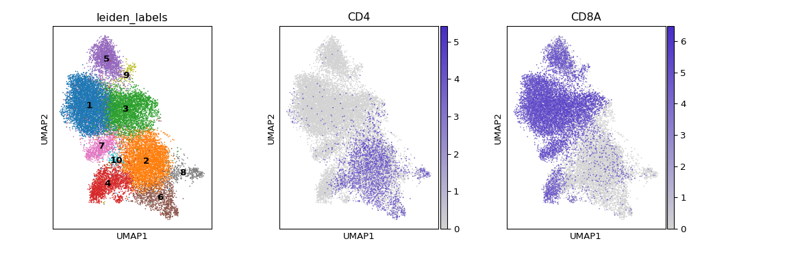
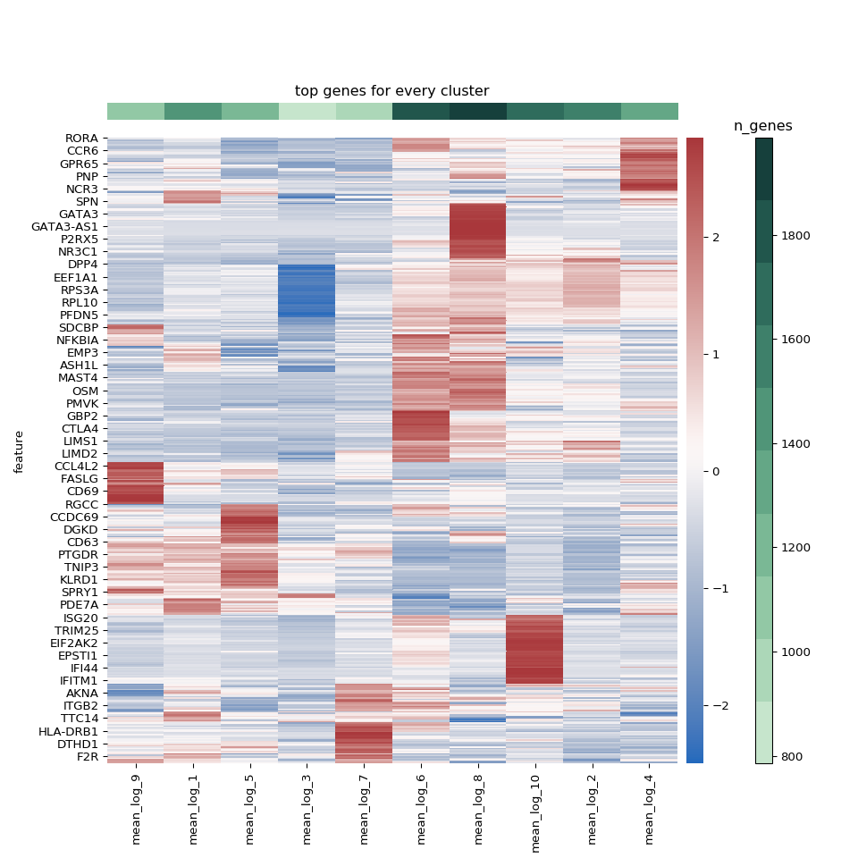
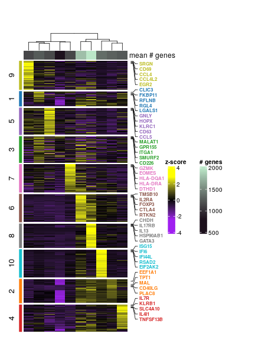
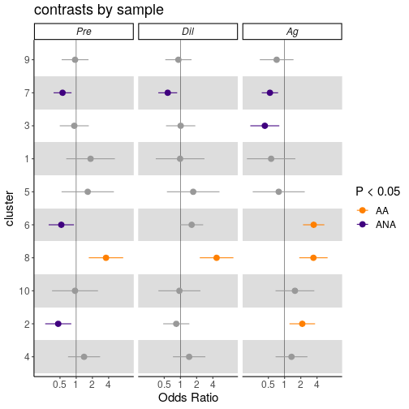

```r
library(reticulate)
use_python("/home/nealpsmith/.conda/envs/sc_analysis/bin/python")
```

**For figure 2, we wanted to focus in on the T cells.  We subsetted our main data object to just the T cell clusters.
From there we had a few goals : Find heterogeneity among the T cells, determine which T cell clusters are enriched in
AA and ANA and look for DEGs among the T cells.**

First, we isolated just the T cells from our original data object.  NK cells were segregated and removed.  Next, we
wanted to determine the optimal number of clusters for our T cells.


```python
import pegasus as pg
import numpy as np
import pandas as pd
import concurrent.futures
from sklearn.metrics.cluster import adjusted_rand_score
import random
import time
import logging
logger = logging.getLogger(__name__)
import leidenalg
import concurrent.futures
import os
from pegasus.tools import construct_graph
from scipy.sparse import csr_matrix

# Use Rand index to determine leiden resolution to use
def rand_index_plot(
        W,  # adata.uns['W_' + rep] or adata.uns['neighbors']
        resamp_perc=0.9,
        resolutions=(0.3, 0.5, 0.7, 0.9, 1.1, 1.3, 1.5, 1.7, 1.9),
        max_workers=25,
        n_samples=25,
        random_state=0
    ):
    assert isinstance(W, csr_matrix)
    rand_indx_dict = {}
    n_cells = W.shape[0]
    resamp_size = round(n_cells * resamp_perc)

    for resolution in resolutions:

        true_class = leiden(W, resolution, random_state)

        with concurrent.futures.ProcessPoolExecutor(max_workers=max_workers) as executor:
            futures = [executor.submit(_collect_samples, W, resolution, n_cells, resamp_size, true_class, random_state)
                       for i in range(n_samples)]
            rand_list = [f.result() for f in futures]

        rand_indx_dict[str(resolution)] = rand_list
        print("Finished {res}".format(res=resolution))
    return rand_indx_dict
def leiden(W, resolution, random_state=0):

    start = time.perf_counter()

    G = construct_graph(W)
    partition_type = leidenalg.RBConfigurationVertexPartition
    partition = leidenalg.find_partition(
        G,
        partition_type,
        seed=random_state,
        weights="weight",
        resolution_parameter=resolution,
        n_iterations=-1,
    )

    labels = np.array([str(x + 1) for x in partition.membership])

    end = time.perf_counter()
    n_clusters = len(set(labels))
    logger.info(f"Finished leiden clustering for res = {resolution}. Get {n_clusters} clusters. "
                f"Time spent = {end-start:.2f}s.")

    return pd.Series(labels)

def _collect_samples(W, resolution, n_cells, resamp_size, true_class, random_state=0):
    samp_indx = random.sample(range(n_cells), resamp_size)
    samp_data = W[samp_indx][:, samp_indx]
    true_class = true_class[samp_indx]
    new_class = leiden(samp_data, resolution, random_state)
    return adjusted_rand_score(true_class, new_class)
```


```python
import matplotlib.pyplot as plt
import seaborn as sns

t_cell_harmonized = pg.read_input("/home/nealpsmith/projects/medoff/data/t_cell_harmonized.h5ad")

# rand_indx_dict = rand_index_plot(W = t_cell_harmonized.uns["W_pca_harmony"],
#                                       resolutions  = [0.3, 0.5, 0.7, 0.9, 1.1, 1.3, 1.5, 1.7, 1.9],
#                                       n_samples = 2)
#
# plot_df = pd.DataFrame(rand_indx_dict).T
# plot_df = plot_df.reset_index()
# plot_df = plot_df.melt(id_vars="index")
# plot_df.to_csv(os.path.join(file_path(), "data", "ari_plots", "t_cell_harmonized_ARI.csv"))
```

```
## 2021-10-19 10:49:21,263 - pegasus - INFO - Time spent on 'read_input' = 1.45s.
```

```python
plot_df = pd.read_csv("/home/nealpsmith/projects/medoff/data/ari_plots/t_cell_harmonized_ARI.csv")
fig, ax = plt.subplots(1)
_ = sns.boxplot(x="index", y="value", data=plot_df, ax = ax)
for box in ax.artists:
    box.set_facecolor("grey")
ax.artists[5].set_facecolor("red") # The one we chose!
ax.spines['right'].set_visible(False)
ax.spines['top'].set_visible(False)
ax.tick_params(axis='both', which='major', labelsize=15)
_ = ax.set_ylabel("Adjusted Rand index", size = 20)
_ = ax.set_xlabel("leiden resolution", size = 20)
_ = plt.axhline(y = 0.9, color = "black", linestyle = "--")
fig.tight_layout()
fig
```


Based on this rand index approach, we can see that a leiden resolution of 1.3 is the highest resolution where the
soultion remains quite stable.  Given this, we went forward with clustering at this resolution.  We can immediately
appreciate this seperation of CD4 and CD8 clusters


```python
import scanpy as sc
import matplotlib.colors as clr
colormap = clr.LinearSegmentedColormap.from_list('gene_cmap', ["#d3d3d3" ,'#482cc7'], N=200)

# pg.leiden(t_cell_harmonized, resolution = 1.3, rep = "pca_harmony")

figure = sc.pl.umap(t_cell_harmonized, color = ["leiden_labels", "CD4", "CD8A"],
                    return_fig = True, show = False, legend_loc = "on data", ncols = 3,
                    wspace = 0.3, cmap = colormap)
figure.set_size_inches(12, 4)
figure
```



#Marker genes

First we can look at marker genes by AUROC.  The motivation here is to determine for each cluster which specific genes
are good classifiers for cluster membership.  These stats were calculated using the Pegasus ```de_analysis``` function.


```python
# pd.set_option("display.max_columns", 10)
# pd.set_option("display.max_rows", 25)

# pg.de_analysis(t_cell_harmonized, cluster = "leiden_labels", auc = True,
#                n_jobs = len(set(t_cell_harmonized.obs["leiden_labels"])))

top_auc = {}
top_genes = {}
for clust in sorted(set(t_cell_harmonized.obs["leiden_labels"]), key = int) :
    df_dict = {"auc": t_cell_harmonized.varm["de_res"]["auroc:{clust}".format(clust=clust)]}
    df = pd.DataFrame(df_dict, index=t_cell_harmonized.var.index)
    genes = df[df["auc"] >= 0.75].index.values
    top_genes[clust] = genes

top_gene_df = pd.DataFrame(dict([(k,pd.Series(v)) for k,v in top_genes.items() ]))
top_gene_df = top_gene_df.rename(columns = {clust : "cluster_{clust}".format(clust=clust) for clust in top_genes.keys()})
top_gene_df = top_gene_df.replace(np.nan, "")
top_gene_df
```


We can see from the above AUROC genes, that we don't have a strong enough signal from some clusters to get a good sense
of their phenotype solely on that.  So we can also find markers using an OVA pseudobulk approach.  To do this, we first
created a psedudobulk matrix by summing the UMI counts across cells for each unique cluster/sample combination, creating
a matrix of n genes x (n samples * n clusters).  Using this matrix with DESeq2, For each cluster, we used an input model
gene ~ in_clust where in_clust is a factor with two levels indicating if the sample was in or not in the cluster being
tested. Genes with an FDR < 5% were considered marker genes.


```python
# import neals_python_functions as nealsucks
# # Read in the raw count data
# raw_data = pg.read_input("/home/nealpsmith/projects/medoff/data/all_data.h5sc")
# raw_data = raw_data[t_cell_harmonized.obs_names]
# raw_data = raw_data[:, t_cell_harmonized.var_names]
# raw_data.obs = t_cell_harmonized.obs[["leiden_labels", "Channel"]]
#
# # Create the matrix
# raw_sum_dict = {}
# cell_num_dict = {}
# for samp in set(raw_data.obs["Channel"]):
#     for clust in set(raw_data.obs["leiden_labels"]):
#         dat = raw_data[(raw_data.obs["Channel"] == samp) & (raw_data.obs["leiden_labels"] == clust)]
#         if len(dat) == 0:
#             continue
#         cell_num_dict["samp_{samp}_{clust}".format(samp=samp, clust=clust)] = len(dat)
#         count_sum = np.array(dat.X.sum(axis=0)).flatten()
#         raw_sum_dict["samp_{samp}_{clust}".format(samp=samp, clust=clust)] = count_sum
#
# count_mtx = pd.DataFrame(raw_sum_dict, index=raw_data.var.index.values)
#
# meta_df = pd.DataFrame(cell_num_dict, index=["n_cells"]).T
# meta_df["cluster"] = [name.split("_")[-1] for name in meta_df.index.values]
# meta_df["sample"] = [name.split("_")[-2] for name in meta_df.index.values]
# meta_df["phenotype"] = [name.split("_")[-3] for name in meta_df.index.values]
# meta_df["id"] = ["_".join(name.split("_")[0:2]) for name in meta_df.index.values]
#
# clust_df = pd.DataFrame(index=count_mtx.index)
# # Lets run pseudobulk on clusters
# for clust in set(t_cell_harmonized.obs["leiden_labels"]):
#     print(clust)
#     meta_temp = meta_df.copy()
#     meta_temp["isclust"] = ["yes" if cluster == clust else "no" for cluster in meta_temp["cluster"]]
#
#     assert all(meta_temp.index.values == count_mtx.columns)
#     # Run DESeq2
#     deseq = nealsucks.analysis.deseq2.py_DESeq2(count_matrix=count_mtx, design_matrix=meta_temp,
#                                                 design_formula="~ isclust")
#     deseq.run_deseq()
#     res = deseq.get_deseq_result()
#     clust_df = clust_df.join(res[["pvalue"]].rename(
#         columns={"pvalue": "pseudobulk_p_val:{clust}".format(clust=clust)}))

de_res = t_cell_harmonized.varm["de_res"]
# de_res = pd.DataFrame(de_res, index=res.index)
# de_res = de_res.join(clust_df)
de_res = pd.DataFrame(de_res, index = t_cell_harmonized.var_names)
de_res = de_res.fillna(0)
names = [name for name in de_res.columns if name.startswith("pseudobulk_p_val")]

import statsmodels.stats.multitest as stats
for name in names :
    clust = name.split(":")[1]
    de_res["pseudobulk_q_val:{clust}".format(clust = clust)] = stats.fdrcorrection(de_res[name])[1]

de_res = de_res.to_records(index=False)
t_cell_harmonized.varm["de_res"] = de_res

top_genes = {}
for clust in sorted(set(t_cell_harmonized.obs["leiden_labels"]), key = int) :
    df_dict = {"auc": t_cell_harmonized.varm["de_res"]["auroc:{clust}".format(clust=clust)],
               "pseudo_q" : t_cell_harmonized.varm["de_res"]["pseudobulk_q_val:{clust}".format(clust = clust)],
               "pseudo_p" : t_cell_harmonized.varm["de_res"]["pseudobulk_p_val:{clust}".format(clust = clust)],
               "pseudo_log_fc" : t_cell_harmonized.varm["de_res"]["pseudobulk_log_fold_change:{clust}".format(clust = clust)],
               "percent" : t_cell_harmonized.varm["de_res"]["percentage:{clust}".format(clust = clust)]}
    df = pd.DataFrame(df_dict, index=t_cell_harmonized.var.index)
    # Lets limit to genes where at least 20% cells express it
    df = df[df["percent"] > 20]
    # df = df.sort_values(by=["auc"], ascending=False)
    # df = df.iloc[0:15]
    # genes = df.index.values
    # Get top 50 genes (first by AUC, then by pseudobulk)
    genes = df[df["auc"] >= 0.75].index.values

    n_from_pseudo = 50 - len(genes)
    if n_from_pseudo > 0 :
        # Dont want to repeat genes
        pseudobulk = df.drop(genes)
        pseudobulk = pseudobulk[(pseudobulk["pseudo_q"] < 0.05)]
        pseudobulk = pseudobulk.sort_values(by = "pseudo_log_fc", ascending = False).iloc[0:n_from_pseudo,:].index.values
        pseudobulk = [name for name in pseudobulk if name not in genes]
        genes = np.concatenate((genes, pseudobulk))

    print("Cluster {clust}: {length}".format(clust = clust, length = len(genes)))
    top_genes[clust] = genes
```

```
## Cluster 1: 26
## Cluster 2: 50
## Cluster 3: 50
## Cluster 4: 50
## Cluster 5: 50
## Cluster 6: 50
## Cluster 7: 50
## Cluster 8: 50
## Cluster 9: 50
## Cluster 10: 50
```

```python
top_gene_df = pd.DataFrame(dict([(k,pd.Series(v)) for k,v in top_genes.items() ]))
top_gene_df = top_gene_df.rename(columns = {clust : "cluster_{clust}".format(clust=clust) for clust in top_genes.keys()})
top_gene_df = top_gene_df.replace(np.nan, "")
top_gene_df
```


Now with the AUROC and OVA marker genes, we can visualize the markers with a heatmap.  First, we looked at the data with
a heatmap where both the rows and columns were clustered.


```python
from mpl_toolkits.axes_grid1 import make_axes_locatable
import matplotlib as mpl
heatmap_genes = []
repeated_genes = [] # Get genes that are not unique, do not want to annotate them
for key in top_genes.keys() :
    for gene in top_genes[key] :
        if gene not in heatmap_genes :
            heatmap_genes.append(gene)
        else :
            repeated_genes.append(gene)

# Get the genes for annotation: top markers that are not in repeated genes
annot_genes = {}
for clust in top_genes.keys() :
    non_rep_genes = [gene for gene in top_genes[clust] if gene not in repeated_genes and not gene.startswith("RP")]
    annot_genes[clust] = non_rep_genes

# Write out the annotation genes for the heatmap (making with ComplexHeatmap)
annot_genes = pd.DataFrame(dict([ (k,pd.Series(v)) for k,v in annot_genes.items() ]))
annot_genes = annot_genes.rename(columns = {clust : "cluster_{clust}".format(clust=clust) for clust in annot_genes.columns})
# Lets add the colors for each cluster from the UMAP
clust_cols = dict(zip(sorted(set(t_cell_harmonized.obs["leiden_labels"]), key = int),
                      t_cell_harmonized.uns["leiden_labels_colors"]))
clust_cols = pd.DataFrame(clust_cols,
                          index = ["col"]).rename(columns = dict(zip(clust_cols.keys(),
                                                                     ["cluster_{clust}".format(clust = clust) for clust
                                                                      in clust_cols.keys()])))

annot_genes = annot_genes.append(clust_cols)

# Also need to add mean gene counts
# Get the mean gene counts for sidebar
gene_val_list = []
gene_val_dict = {}
for clust in sorted(set(t_cell_harmonized.obs["leiden_labels"]), key = int) :
    gene_vals = t_cell_harmonized.obs["n_genes"][t_cell_harmonized.obs["leiden_labels"] == clust]

    mean = np.mean(gene_vals)
    gene_val_list.append(mean)
    gene_val_dict[clust] = mean

# Append these mean gene counts to the dataframe
annot_genes = annot_genes.append(pd.DataFrame(gene_val_dict,
                          index = ["mean_genes"]).rename(columns = dict(zip(gene_val_dict.keys(),
                                                                     ["cluster_{clust}".format(clust = clust) for clust
                                                                      in gene_val_dict.keys()]))))


# Get the mean expression of the top genes from each cluster
de_df = {"mean_log_{clust}".format(clust = clust) : t_cell_harmonized.varm["de_res"]["mean_logExpr:{clust}".format(clust = clust)] for clust in sorted(set(t_cell_harmonized.obs["leiden_labels"]), key = int)}
de_df = pd.DataFrame(de_df, index = t_cell_harmonized.var.index)

heatmap_df = de_df.loc[heatmap_genes]


colors = sns.color_palette("ch:2.5,-.2,dark=.2", n_colors = len(gene_val_list)).as_hex()
# Put the gene values in order lowest to highest
sorted_cols = sorted(gene_val_list)

fig, ax = plt.subplots(1, 1, figsize = (10, 10))
divider = make_axes_locatable(ax)
axDivY = divider.append_axes( 'right', size=0.2, pad= 0.1)
axDivY2 = divider.append_axes( 'right', size=0.2, pad= 0.2)
axDivY3 = divider.append_axes( 'right', size=0.2, pad= 0.2)
axDivY4 = divider.append_axes( 'top', size=0.2, pad= 0.2)

# color_label_list =[random.randint(0,14) for i in range(14)]
ax1 = sns.clustermap(heatmap_df, method = "ward", row_cluster =True, col_cluster =True, z_score = 0, cmap = "vlag")
col_order = np.array([name.split("_")[-1] for name in ax1.data2d.columns])
index = [sorted_cols.index(gene_val_dict[clust]) for clust in col_order]
plt.close()
ax1 = sns.heatmap(ax1.data2d, cmap = "vlag", ax = ax, cbar_ax = axDivY)
ax2 = axDivY2.imshow(np.array([[min(gene_val_list), max(gene_val_list)]]), cmap = mpl.colors.ListedColormap(list(colors)),
                     interpolation = "nearest", aspect = "auto")
axDivY2.set_axis_off()
axDivY2.set_visible(False)
_ = plt.colorbar(ax2, cax = axDivY3)
_ = axDivY3.set_title("n_genes")
ax3 = axDivY4.imshow(np.array([index]),cmap=mpl.colors.ListedColormap(list(colors)),
              interpolation="nearest", aspect="auto")
axDivY4.set_axis_off()
_ = plt.title("top genes for every cluster")
plt.show()
```



To make things more readable, we also made a heatmap where we kept the columns clustered such that phenotypically
similar clusters were grouped together, but manually ordered the rows to make it more readable.


```python
n_heatmap_genes = {}
heatmap_genes = []
for key in col_order :
    cnt = 0
    for gene in top_genes[key] :
        if gene not in heatmap_genes :
            heatmap_genes.append(gene)
            cnt+=1
    n_heatmap_genes[key] = cnt

n_heatmap_genes = pd.DataFrame(n_heatmap_genes, index = ["n_genes"]).rename(columns = dict(zip(n_heatmap_genes.keys(),
                                                                                               ["cluster_{clust}".format(clust = clust) for
                                                                                                clust in n_heatmap_genes.keys()])))
# Add number of genes in the heatmap for each clusters
annot_genes = annot_genes.append(n_heatmap_genes)
annot_genes = annot_genes.reset_index()
annot_genes = annot_genes.fillna('')

# annot_genes.to_csv(os.path.join(file_path(), "data", "heatmap_info", "t_cell_harmonized_annotation_genes.csv"))

# Get the mean expression of the top genes from each cluster
de_df = {"mean_log_{clust}".format(clust = clust) : t_cell_harmonized.varm["de_res"]["mean_logExpr:{clust}".format(clust = clust)] for clust in sorted(set(t_cell_harmonized.obs["leiden_labels"]), key = int)}
de_df = pd.DataFrame(de_df, index = t_cell_harmonized.var.index)

heatmap_df = de_df.loc[heatmap_genes]

# Get the mean gene counts for sidebar
gene_val_list = []
gene_val_dict = {}
for clust in sorted(set(t_cell_harmonized.obs["leiden_labels"]), key = int) :
    gene_vals = t_cell_harmonized.obs["n_genes"][t_cell_harmonized.obs["leiden_labels"] == clust]

    mean = np.mean(gene_vals)
    gene_val_list.append(mean)
    gene_val_dict[clust] = mean

colors = sns.color_palette("ch:2.5,-.2,dark=.2", n_colors = len(gene_val_list)).as_hex()
# Put the gene values in order lowest to highest
sorted_cols = sorted(gene_val_list)

fig, ax = plt.subplots(1, 1, figsize = (10, 10))
divider = make_axes_locatable(ax)
axDivY = divider.append_axes( 'right', size=0.2, pad= 0.1)
axDivY2 = divider.append_axes( 'right', size=0.2, pad= 0.2)
axDivY3 = divider.append_axes( 'right', size=0.2, pad= 0.2)
axDivY4 = divider.append_axes( 'top', size=0.2, pad= 0.2)

# color_label_list =[random.randint(0,14) for i in range(14)]
ax1 = sns.clustermap(heatmap_df, method = "ward", row_cluster =False, col_cluster =True, z_score = 0, cmap = "vlag")
col_order = np.array([name.split("_")[-1] for name in ax1.data2d.columns])
index = [sorted_cols.index(gene_val_dict[clust]) for clust in col_order]
plt.close()

# Write the current heatmap data out, want to try making the heatmap in R where it might look nicer
# ax1.data2d.to_csv(os.path.join(file_path(), "data", "heatmap_info", "t_cell_harmonized_heatmap_data.csv"))
heatmap_carpet = ax1.data2d


ax1 = sns.heatmap(ax1.data2d, cmap = "vlag", ax = ax, cbar_ax = axDivY)
ax2 = axDivY2.imshow(np.array([[min(gene_val_list), max(gene_val_list)]]), cmap = mpl.colors.ListedColormap(list(colors)),
                     interpolation = "nearest", aspect = "auto")
axDivY2.set_axis_off()
axDivY2.set_visible(False)
_ = plt.colorbar(ax2, cax = axDivY3)
_ = axDivY3.set_title("n_genes")
ax3 = axDivY4.imshow(np.array([index]),cmap=mpl.colors.ListedColormap(list(colors)),
              interpolation="nearest", aspect="auto")
axDivY4.set_axis_off()
_ = plt.title("top genes for every cluster")
plt.show()
```


Finally, we wanted to make a publication-ready figure using the wonderful ```ComplexHeatmap``` package, where we can
add some annotations for each cluster and add spaces between clusters to make it even more readable.


```r
library(ComplexHeatmap)
library(tidyverse)
library(magrittr)
library(circlize)

heatmap_data <- reticulate::py$heatmap_carpet
annotation_info <- reticulate::py$annot_genes
rownames(annotation_info) <- annotation_info$index
annotation_info$index <- NULL


for (c in colnames(annotation_info)){
  annotation_info[[c]] <- unlist(annotation_info[[c]])
}
# Change the column names to be cleaner
colnames(heatmap_data) <- paste("Cluster", unlist(strsplit(colnames(heatmap_data), "_"))[3*(1:length(colnames(heatmap_data)))], sep = " ")

# Make column names consistent with heatmap data
colnames(annotation_info) <- sapply(str_replace(colnames(annotation_info), "_", " "), str_to_title)

# Lets just get the genes
annotation_genes <- unique(as.character(unlist(annotation_info[1:5,])))
annotation_genes <- annotation_genes[annotation_genes != ""]

# Now lets organize the color info that will be used for annotations
col_info = annotation_info %>%
  t() %>%
  as.data.frame() %>%
  dplyr::select(-mean_genes) %>%
  rownames_to_column(var = "cluster") %>%
  reshape2::melt(id.vars = c("cluster", "col")) %>%
  select(-variable)

# Get the gene colors
gene_cols = c()
for (gene in annotation_genes){
  color = as.character(filter(col_info, value == gene)["col"][[1]])
  gene_cols = c(gene_cols, color)
}

# Get the cluster colors
clust_cols <- c()
for (clust in colnames(heatmap_data)){
  color <- col_info %>%
    dplyr::select(cluster, col) %>%
    distinct() %>%
    filter(cluster == clust)
  clust_cols <- c(clust_cols, as.character(color$col))
}

mean_genes <- annotation_info["mean_genes",] %>%
  mutate_each(funs(as.numeric(as.character(.)))) %>%
  select(colnames(heatmap_data)) # To order them like they will be ordered in the heatmap (same as how GEX data was read in)

gene_col_fun <- colorRamp2(c(min(mean_genes), max(mean_genes)), c("#1d111d", "#bbe7c8"))
gene_bar <-  HeatmapAnnotation("mean # genes" = as.numeric(mean_genes), col = list("mean # genes" = gene_col_fun), show_legend = FALSE)
gene_lgd <- Legend(col_fun = gene_col_fun, title = "# genes", legend_height = unit(4, "cm"), title_position = "topcenter")


heatmap_col_fun = colorRamp2(c(min(heatmap_data), 0, max(heatmap_data)), c("purple", "black", "yellow"))
heatmap_lgd = Legend(col_fun = heatmap_col_fun, title = "z-score", legend_height = unit(4, "cm"), title_position = "topcenter")

lgd_list <- packLegend(heatmap_lgd, gene_lgd, column_gap = unit(1,"cm"), direction = "horizontal")

split <- c()
for (clust in colnames(heatmap_data)){
  n_split <- as.numeric(as.character(annotation_info["n_genes", clust]))
  split <- c(split, rep(gsub("Cluster ", "", clust), n_split))
}
split <- factor(split, levels = as.character(unique(split)))

# Make block annotation
left_annotation =   HeatmapAnnotation(blk = anno_block(gp = gpar(fill = clust_cols, col = clust_cols)), which = "row", width = unit(1.5, "mm"))

heatmap_list = Heatmap(heatmap_data, name = "z-score", col = heatmap_col_fun, cluster_rows = FALSE, cluster_columns = TRUE,
                       cluster_row_slices = FALSE, row_km = 1, cluster_column_slices = FALSE,
                       clustering_method_columns = "ward.D2", clustering_distance_columns = "euclidean",
                       column_dend_reorder = FALSE, top_annotation = gene_bar, show_heatmap_legend = FALSE,
                       column_names_gp = gpar(col = clust_cols, fontface = "bold"),
                       split = split, left_annotation = left_annotation, show_column_names = FALSE) +
  rowAnnotation(link = anno_mark(at = match(annotation_genes, rownames(heatmap_data)),labels = annotation_genes,
                                 labels_gp = gpar(col = gene_cols, fontsize = 8, fontface = "bold")))

draw(heatmap_list, heatmap_legend_list =lgd_list, padding = unit(c(0.5, 0.5, 2, 2), "cm"), cluster_rows = FALSE,
     cluster_row_slices = FALSE)
```



**Differential abundance analysis

To determine which clusters were associated with particular group at a given condition, we used a mixed-effects
association logistic regression model similar to that described by Fonseka et al.  We fit a logistic regression model
for each cell cluster. Each cluster was modelled independently as follows :
```cluster ~ 1 + condition:group + condition + group + (1 | id)```

The least-squares means of the factors in the model were calculated and all pairwise contrasts between the means of the
groups at each condition (e.g. AA vs AC within baseline, AA vs AC within allergen, etc.) were compared.  The OR with
confidence interval for each sample/condition combination were plotted.


```python
cell_info = t_cell_harmonized.obs
```


```r
library(lme4)
library(ggplot2)
library(emmeans)

# A function to perform the mixed-effects logistic regression modelling, returning, p-values, odds-ratio and confidence intervals
get_abund_info <- function(dataset, cluster, contrast, random_effects = NULL, fixed_effects = NULL){
  # Generate design matrix from cluster assignments
  cluster <- as.character(cluster)
  designmat <- model.matrix(~ cluster + 0, data.frame(cluster = cluster))
  dataset <- cbind(designmat, dataset)
  # Create output list to hold results
  res <- vector(mode = "list", length = length(unique(cluster)))
  names(res) <- attributes(designmat)$dimnames[[2]]

  # Create model formulas
  model_rhs <- paste0(c(paste0(fixed_effects, collapse = " + "),
                        paste0("(1|", random_effects, ")", collapse = " + ")),
                      collapse = " + ")

  # Initialize list to store model objects for each cluster
  cluster_models <- vector(mode = "list",
                           length = length(attributes(designmat)$dimnames[[2]]))
  names(cluster_models) <- attributes(designmat)$dimnames[[2]]

  for (i in seq_along(attributes(designmat)$dimnames[[2]])) {
    test_cluster <- attributes(designmat)$dimnames[[2]][i]

    # Make it a non-intercept model to get odds for each variable
    full_fm <- as.formula(paste0(c(paste0(test_cluster, " ~ 1 + ", contrast, " + "),
                                   model_rhs), collapse = ""))

    full_model <- lme4::glmer(formula = full_fm, data = dataset,
                              family = binomial, nAGQ = 1, verbose = 0,
                              control = glmerControl(optimizer = "bobyqa"))

    pvals <-lsmeans(full_model, pairwise ~ "phenotype | sample")

    p_val_df <- summary(pvals$contrasts)
    p_val_df$cluster <- test_cluster

    ci <- eff_size(pvals, sigma = sigma(full_model), edf = df.residual(full_model))
    ci_df <- summary(ci) %>%
    dplyr::select(sample, asymp.LCL, asymp.UCL)
    ci_df$cluster <- test_cluster

    info_df <- left_join(p_val_df, ci_df, by = c("sample", "cluster"))

    cluster_models[[i]] <- info_df

  }
  return(cluster_models)
}

# A function to make a forest plot for the differential abundance analyses
plot_contrasts <- function(d, x_breaks_by = 1, wrap_ncol = 6, y_ord = FALSE) {
  # if (y_ord != FALSE){
  #   d$cluster <- factor(d$cluster, levels = y_ord)
  # }
  ggplot() +
    annotate(
      geom = "rect",
      xmin = -Inf,
      xmax = Inf,
      ymin = seq(from = 1, to = length(unique(d$cluster)), by = 2) - 0.5,
      ymax = seq(from = 1, to = length(unique(d$cluster)), by = 2) + 0.5,
      alpha = 0.2
    ) +
    geom_vline(xintercept = 0, size = 0.2) +
    geom_errorbarh(
      data = d,
      mapping = aes(
        xmin = asymp.LCL, xmax = asymp.UCL, y = cluster,
        color = sig
      ),
      height = 0
    ) +
    geom_point(
      data = d,
      mapping = aes(
        x = estimate, y = cluster,
        color = sig
      ),
      size = 3
    ) +
    scale_color_manual(
      name = "P < 0.05",
      values = c("#FF8000", "#40007F", "grey60"),
      breaks = c("AA", "ANA")
    ) +
    scale_x_continuous(
      breaks = log(c(0.125, 0.5, 1, 2, 4)),
      labels = function(x) exp(x)
    ) +
    scale_y_discrete(
      # expand = c(0, 0),
      # breaks = seq(1, length(unique(d$cluster))),
      labels = levels(plot_df$cluster),
    ) +
    # annotation_logticks(sides = "b") +
    expand_limits(y = c(0.5, length(unique(d$cluster)) + 0.5)) +
    # facet_grid(~ GeneName) +
    facet_wrap(~ sample, ncol = wrap_ncol) +
    theme_classic() +
    theme(
      strip.text = element_text(face = "italic"),
      text = element_text(size = 15)
    ) +
    labs(
      title = "contrasts by sample",
      x = "Odds Ratio",
      y = "cluster"
    )
}

clust_df <- reticulate::py$cell_info

abund_info <- get_abund_info(clust_df, cluster = clust_df$leiden_labels,
                            contrast = "sample:phenotype",
                            random_effects = "id",
                            fixed_effects = c("sample", "phenotype"))

plot_df <- do.call(rbind, abund_info)
plot_df$direction <- ifelse(plot_df$estimate > 0, "AA", "ANA")


plot_df$cluster <- as.numeric(gsub("cluster", "", plot_df$cluster))
plot_df$sig <- ifelse(plot_df$p.value < 0.05, plot_df$direction, "non_sig")
cl_order <- c(9, 7, 3, 1, 5, 6, 8, 10, 2, 4)
plot_df$cluster <- factor(plot_df$cluster, levels = rev(cl_order))
plot_df$sample <- factor(plot_df$sample, levels = c("Pre", "Dil", "Ag"))
plot_contrasts(plot_df)
```


