Figure 3
================

``` r
library(reticulate)
use_python("/home/nealpsmith/.conda/envs/sc_analysis/bin/python")
```

**For figure 3, we wanted to focus on the epithelial cells in our dataset. We subsetted our main data object to just the epithelial clusters. From there, we wanted to determine the heterogeneity among the epithelial cells and look for phenotypic differences between the conditions and groups.**

First, we isolated just the epithelial clusters from our original data object. Next, we wanted to determine the optimal number of clusters for our epithelial cells. Briefly, similar to Reyes et al., we quantified cluster stability at many Leiden resolutions to determine which one should be used for downstream analyses. First, data was clustered at many different resolutions ranging from 0.3 to 1.9. Next, we iteratively subsampled 90% of the data (20 iterations) and at each iteration, we made a new clustering solution with the subsampled data and used the Adjusted Rand Index (ARI) to compare it to the clustering solution from the full data.

``` python
import pegasus as pg
import numpy as np
import pandas as pd
import concurrent.futures
from sklearn.metrics.cluster import adjusted_rand_score
import random
import time
import leidenalg
import concurrent.futures
import os
from pegasus.tools import construct_graph
from scipy.sparse import csr_matrix

# Use Rand index to determine leiden resolution to use
def rand_index_plot(
        W,  # adata.uns['W_' + rep] or adata.uns['neighbors']
        resamp_perc=0.9,
        resolutions=(0.3, 0.5, 0.7, 0.9, 1.1, 1.3, 1.5, 1.7, 1.9),
        max_workers=25,
        n_samples=25,
        random_state=0
    ):
    assert isinstance(W, csr_matrix)
    rand_indx_dict = {}
    n_cells = W.shape[0]
    resamp_size = round(n_cells * resamp_perc)

    for resolution in resolutions:

        true_class = leiden(W, resolution, random_state)

        with concurrent.futures.ProcessPoolExecutor(max_workers=max_workers) as executor:
            futures = [executor.submit(_collect_samples, W, resolution, n_cells, resamp_size, true_class, random_state)
                       for i in range(n_samples)]
            rand_list = [f.result() for f in futures]

        rand_indx_dict[str(resolution)] = rand_list
        print("Finished {res}".format(res=resolution))
    return rand_indx_dict
def leiden(W, resolution, random_state=0):

    start = time.perf_counter()

    G = construct_graph(W)
    partition_type = leidenalg.RBConfigurationVertexPartition
    partition = leidenalg.find_partition(
        G,
        partition_type,
        seed=random_state,
        weights="weight",
        resolution_parameter=resolution,
        n_iterations=-1,
    )

    labels = np.array([str(x + 1) for x in partition.membership])

    end = time.perf_counter()
    n_clusters = len(set(labels))
    return pd.Series(labels)

def _collect_samples(W, resolution, n_cells, resamp_size, true_class, random_state=0):
    samp_indx = random.sample(range(n_cells), resamp_size)
    samp_data = W[samp_indx][:, samp_indx]
    true_class = true_class[samp_indx]
    new_class = leiden(samp_data, resolution, random_state)
    return adjusted_rand_score(true_class, new_class)
```


``` python
import matplotlib.pyplot as plt
import seaborn as sns

epithelial_harmonized = pg.read_input("/home/nealpsmith/projects/medoff/data/epithelial_harmonized_for_github.h5ad")

# rand_indx_dict = rand_index_plot(W = epithelial_harmonized.uns["W_pca_harmony"],
#                                       resolutions  = [0.3, 0.5, 0.7, 0.9, 1.1, 1.3, 1.5, 1.7, 1.9],
#                                       n_samples = 2)
#
# plot_df = pd.DataFrame(rand_indx_dict).T
# plot_df = plot_df.reset_index()
# plot_df = plot_df.melt(id_vars="index")
# plot_df.to_csv(os.path.join(file_path(), "data", "ari_plots", "epithelial_harmonized_ARI.csv"))
plot_df = pd.read_csv("/home/nealpsmith/projects/medoff/data/ari_plots/epithelial_harmonized_ARI.csv")
fig, ax = plt.subplots(1)
_ = sns.boxplot(x="index", y="value", data=plot_df, ax = ax)
for box in ax.artists:
    box.set_facecolor("grey")
ax.artists[6].set_facecolor("red") # The one we chose!
ax.spines['right'].set_visible(False)
ax.spines['top'].set_visible(False)
ax.tick_params(axis='both', which='major', labelsize=15)
_ = ax.set_ylabel("Adjusted Rand index", size = 20)
_ = ax.set_xlabel("leiden resolution", size = 20)
_ = plt.axhline(y = 0.9, color = "black", linestyle = "--")
fig.tight_layout()
fig
```


Based on this rand index approach, we can see that a leiden resolution of 1.5 is the highest resolution where the median ARI of all iterations was &gt; 0.9. Given this, we started our clustering at this resolution.

``` python
import scanpy as sc
import matplotlib.colors as clr
colormap = clr.LinearSegmentedColormap.from_list('gene_cmap', ["#d3d3d3" ,'#482cc7'], N=200)

# pg.leiden(epithelial_harmonized, resolution = 1.5, rep = "pca_harmony", random_state = 2)

sc.pl.umap(epithelial_harmonized, color = ["leiden_labels"], legend_loc = "on data")
```


After visually assessing many genes and through expert annotation, we could see that there was a small cluster of serous cells in cluster 1. Given we know that serous cells have a distinct biological function, we manually segregated these cells to be their own cluster. We can see this small cluster of cells by looking at the legacy markers AZGP1 and PRR4.

``` python
sc.pl.umap(epithelial_harmonized, color = ["AZGP1", "PRR4"], cmap = colormap)
```


We segregated these cells out by thier UMAP coordinates. Below is the new

``` python
# epithelial_harmonized.obs["new_clusters"] = epithelial_harmonized.obs["leiden_labels"]
# categories = np.array(["1", "2", "3", "4", "5", "6", "7", "8", "9", "10", "11", "12", "13", "14"])
# epithelial_harmonized.obs["new_clusters"] = pd.Categorical(epithelial_harmonized.obs["new_clusters"],
#                                                            categories=categories)
# epithelial_harmonized.obs["new_clusters"][
#     ((epithelial_harmonized.obsm["X_umap"][:, 0] > -2.2) & (epithelial_harmonized.obsm["X_umap"][:, 0] < -1)) & (
#             (epithelial_harmonized.obsm["X_umap"][:, 1] < -4.7) & (
#                 epithelial_harmonized.obsm["X_umap"][:, 1] > -7))] = "14"

# sc.pl.umap(epithelial_harmonized, color = "new_clusters", legend_loc = "on data")

# Change the cluster numbers (we re-ordered them to be the same order as in the heatmap shown later in the notebook)
# new_clust_nums = { "11" : "1",
#                    "2" : "2",
#                    "8" : "3",
#                    "9" : "4",
#                    "12" : "5",
#                    "10" : "6",
#                    "5" : "7",
#                    "3" : "8",
#                    "6" : "9",
#                    "13" : "10",
#                    "4" : "11",
#                    "1" : "12",
#                    "7" : "13",
#                    "14" : "14"
#              }
# epithelial_harmonized.obs["new_clusters"] = [new_clust_nums[cl] for cl in epithelial_harmonized.obs["new_clusters"]]
colors = [epithelial_harmonized.uns["new_clusters_colors"][int(n)-1] for n in sorted(set(epithelial_harmonized.obs["new_clusters"]), key = int)]
sc.pl.umap(epithelial_harmonized, color = "new_clusters", legend_loc = "on data", palette = colors)
# Adjust this for later plotting
# epithelial_harmonized.uns["new_clusters_colors"] = epithelial_harmonized.uns["new_clusters_colors"][10, 1, 7, 8, 11, 9, 4, 2, 5, 12, 3, 0, 6, 13]
```

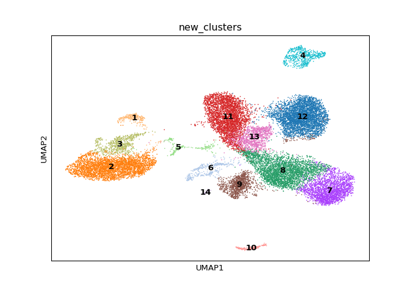

# Marker genes

First we can look at marker genes by AUROC. The motivation here is to determine for each cluster which specific genes are good classifiers for cluster membership. These stats were calculated using the Pegasus `de_analysis` function.

``` python
# pg.de_analysis(epithelial_harmonized, cluster = "new_clusters", auc = True,
#                n_jobs = len(set(epithelial_harmonized.obs["new_clusters"])), result_key="de_res_new")

top_auc = {}
top_genes = {}
for clust in sorted(set(epithelial_harmonized.obs["new_clusters"]), key = int) :
    df_dict = {"auc": epithelial_harmonized.varm["de_res_new"]["auroc:{clust}".format(clust=clust)]}
    df = pd.DataFrame(df_dict, index=epithelial_harmonized.var.index)
    df = df.sort_values(by=["auc"], ascending=False)
    auc_df = df.iloc[0:50]
    genes = auc_df[auc_df["auc"] >= 0.75].index.values
    top_genes[clust] = genes

top_gene_df = pd.DataFrame(dict([(k,pd.Series(v)) for k,v in top_genes.items() ]))
top_gene_df = top_gene_df.rename(columns = {clust : "cluster_{clust}".format(clust=clust) for clust in top_genes.keys()})
top_gene_df = top_gene_df.replace(np.nan, "")
```


``` r
library(knitr)
kable(reticulate::py$top_gene_df, caption = "genes with AUC > 0.75")
```

<table style="width:100%;">
<caption>genes with AUC &gt; 0.75</caption>
<colgroup>
<col width="7%" />
<col width="6%" />
<col width="7%" />
<col width="6%" />
<col width="6%" />
<col width="6%" />
<col width="6%" />
<col width="6%" />
<col width="6%" />
<col width="7%" />
<col width="7%" />
<col width="7%" />
<col width="7%" />
<col width="7%" />
</colgroup>
<thead>
<tr class="header">
<th align="left">cluster_1</th>
<th align="left">cluster_2</th>
<th align="left">cluster_3</th>
<th align="left">cluster_4</th>
<th align="left">cluster_5</th>
<th align="left">cluster_6</th>
<th align="left">cluster_7</th>
<th align="left">cluster_8</th>
<th align="left">cluster_9</th>
<th align="left">cluster_10</th>
<th align="left">cluster_11</th>
<th align="left">cluster_12</th>
<th align="left">cluster_13</th>
<th align="left">cluster_14</th>
</tr>
</thead>
<tbody>
<tr class="odd">
<td align="left">C20orf85</td>
<td align="left">HSP90AA1</td>
<td align="left">C20orf85</td>
<td align="left">SPRR3</td>
<td align="left">CCNO</td>
<td align="left">PTMA</td>
<td align="left">KRT15</td>
<td align="left">RPL28</td>
<td align="left">RPLP1</td>
<td align="left">ATP6V0B</td>
<td align="left">XBP1</td>
<td align="left">SCGB3A1</td>
<td align="left">KRT7</td>
<td align="left">LYZ</td>
</tr>
<tr class="even">
<td align="left">DYNLL1</td>
<td align="left">DNAH5</td>
<td align="left">CCDC170</td>
<td align="left">KRT13</td>
<td align="left">CDC20B</td>
<td align="left">H2AFZ</td>
<td align="left">DST</td>
<td align="left">AQP3</td>
<td align="left">RPS18</td>
<td align="left">SEC11C</td>
<td align="left">BPIFB1</td>
<td align="left">SCGB1A1</td>
<td align="left">TMSB4X</td>
<td align="left">AZGP1</td>
</tr>
<tr class="odd">
<td align="left">CAPS</td>
<td align="left">C20orf85</td>
<td align="left">C9orf24</td>
<td align="left">EMP1</td>
<td align="left">TUBA1B</td>
<td align="left">STMN1</td>
<td align="left">KRT5</td>
<td align="left">S100A2</td>
<td align="left">RPL13</td>
<td align="left">APLP2</td>
<td align="left">PIGR</td>
<td align="left">SLPI</td>
<td align="left">MUC1</td>
<td align="left">PRR4</td>
</tr>
<tr class="even">
<td align="left">C9orf24</td>
<td align="left">CAPS</td>
<td align="left">C2orf40</td>
<td align="left">S100A9</td>
<td align="left">H2AFZ</td>
<td align="left">TUBA1B</td>
<td align="left">KRT17</td>
<td align="left">CD81</td>
<td align="left">RPS8</td>
<td align="left">ATP6V1G3</td>
<td align="left">SLPI</td>
<td align="left">WFDC2</td>
<td align="left">TMSB10</td>
<td align="left">PIP</td>
</tr>
<tr class="odd">
<td align="left">PRDX5</td>
<td align="left">LRRIQ1</td>
<td align="left">TUBA1A</td>
<td align="left">SCEL</td>
<td align="left">HES6</td>
<td align="left">HMGB2</td>
<td align="left">RPLP1</td>
<td align="left">RPS2</td>
<td align="left">RPS19</td>
<td align="left">RARRES2</td>
<td align="left">TSPAN8</td>
<td align="left">BPIFB1</td>
<td align="left">MSLN</td>
<td align="left">ZG16B</td>
</tr>
<tr class="even">
<td align="left">RSPH1</td>
<td align="left">TUBB4B</td>
<td align="left">SNTN</td>
<td align="left">ECM1</td>
<td align="left">BTG3</td>
<td align="left">TUBB</td>
<td align="left">CD81</td>
<td align="left">RPLP0</td>
<td align="left">RPS12</td>
<td align="left">CD9</td>
<td align="left">CXCL17</td>
<td align="left"></td>
<td align="left">ANXA1</td>
<td align="left">TCN1</td>
</tr>
<tr class="odd">
<td align="left">CALM1</td>
<td align="left">RSPH1</td>
<td align="left">DNAH5</td>
<td align="left">TMPRSS11B</td>
<td align="left">CEP78</td>
<td align="left">PCLAF</td>
<td align="left">S100A2</td>
<td align="left">RPL7A</td>
<td align="left">RPS14</td>
<td align="left">STAP1</td>
<td align="left">WFDC2</td>
<td align="left"></td>
<td align="left">CLDN7</td>
<td align="left">LTF</td>
</tr>
<tr class="even">
<td align="left">HSP90AA1</td>
<td align="left">C2orf40</td>
<td align="left">ERICH3</td>
<td align="left">DUSP5</td>
<td align="left">RANBP1</td>
<td align="left">HMGB1</td>
<td align="left">F3</td>
<td align="left">RPS6</td>
<td align="left">RPS24</td>
<td align="left">ASCL3</td>
<td align="left">CTSC</td>
<td align="left"></td>
<td align="left">SAT1</td>
<td align="left">TPT1</td>
</tr>
<tr class="odd">
<td align="left">TUBB4B</td>
<td align="left">ERICH3</td>
<td align="left">RSPH1</td>
<td align="left">S100A8</td>
<td align="left">NAP1L1</td>
<td align="left">S100A2</td>
<td align="left">BCAM</td>
<td align="left">RPS3</td>
<td align="left">RPL30</td>
<td align="left">TMSB4X</td>
<td align="left">VMO1</td>
<td align="left"></td>
<td align="left">MUC4</td>
<td align="left">PRB3</td>
</tr>
<tr class="even">
<td align="left">TUBA1A</td>
<td align="left">TUBA1A</td>
<td align="left">MORN2</td>
<td align="left">MAL</td>
<td align="left">CDK1</td>
<td align="left">GAPDH</td>
<td align="left">RPL13</td>
<td align="left">RPS7</td>
<td align="left">RPL32</td>
<td align="left">CFTR</td>
<td align="left">CYP2F1</td>
<td align="left"></td>
<td align="left">LCN2</td>
<td align="left">RPL13A</td>
</tr>
<tr class="odd">
<td align="left">ATP5IF1</td>
<td align="left">C9orf24</td>
<td align="left">LRRIQ1</td>
<td align="left">RND3</td>
<td align="left">PCM1</td>
<td align="left">TYMS</td>
<td align="left">RPL3</td>
<td align="left">RPS24</td>
<td align="left">RPS3A</td>
<td align="left">CLNK</td>
<td align="left">AGR2</td>
<td align="left"></td>
<td align="left">UPK1B</td>
<td align="left">RPL21</td>
</tr>
<tr class="even">
<td align="left">FTH1</td>
<td align="left">CCDC170</td>
<td align="left">AGR3</td>
<td align="left">LYPD2</td>
<td align="left">MYB</td>
<td align="left">ZWINT</td>
<td align="left">RPL10A</td>
<td align="left">RPS19</td>
<td align="left">RPS23</td>
<td align="left">HEPACAM2</td>
<td align="left">LCN2</td>
<td align="left"></td>
<td align="left">TACSTD2</td>
<td align="left">PIGR</td>
</tr>
<tr class="odd">
<td align="left">TPPP3</td>
<td align="left">AGR3</td>
<td align="left">TMEM190</td>
<td align="left">KRT78</td>
<td align="left">PTGES3</td>
<td align="left">DUT</td>
<td align="left">RPL32</td>
<td align="left">RPL10A</td>
<td align="left">RPS7</td>
<td align="left">TFCP2L1</td>
<td align="left">SCGB1A1</td>
<td align="left"></td>
<td align="left">TXN</td>
<td align="left">AC020656.1</td>
</tr>
<tr class="even">
<td align="left">CAPSL</td>
<td align="left">DYNLL1</td>
<td align="left">C11orf88</td>
<td align="left">PRSS27</td>
<td align="left">CKS2</td>
<td align="left">TK1</td>
<td align="left">RPL5</td>
<td align="left">MT1X</td>
<td align="left">RPS4X</td>
<td align="left">TMEM61</td>
<td align="left">MSMB</td>
<td align="left"></td>
<td align="left">C15orf48</td>
<td align="left">SSR4</td>
</tr>
<tr class="odd">
<td align="left">PIFO</td>
<td align="left">DNAH12</td>
<td align="left">PIFO</td>
<td align="left">C15orf48</td>
<td align="left">CHCHD2</td>
<td align="left">CENPW</td>
<td align="left">RPL10</td>
<td align="left">RPL32</td>
<td align="left">RPL8</td>
<td align="left">GOLM1</td>
<td align="left">TGM2</td>
<td align="left"></td>
<td align="left">CEACAM6</td>
<td align="left">BPIFB1</td>
</tr>
<tr class="even">
<td align="left">C11orf88</td>
<td align="left">DNAAF1</td>
<td align="left">RP1</td>
<td align="left">EPS8L1</td>
<td align="left">KDELC2</td>
<td align="left">DEK</td>
<td align="left">RPS3</td>
<td align="left">RPL13</td>
<td align="left">RPL10</td>
<td align="left">GNAS</td>
<td align="left">SCGB3A1</td>
<td align="left"></td>
<td align="left">KRT4</td>
<td align="left"></td>
</tr>
<tr class="odd">
<td align="left">C1orf194</td>
<td align="left">CALM1</td>
<td align="left">MS4A8</td>
<td align="left">NDRG2</td>
<td align="left">ENO1</td>
<td align="left">RAN</td>
<td align="left">ADIRF</td>
<td align="left">RPL29</td>
<td align="left">RPL41</td>
<td align="left">ADGRF5</td>
<td align="left">GSN</td>
<td align="left"></td>
<td align="left">ELF3</td>
<td align="left"></td>
</tr>
<tr class="even">
<td align="left">MORN2</td>
<td align="left">PRDX5</td>
<td align="left">DNAAF1</td>
<td align="left">PSCA</td>
<td align="left">HELLS</td>
<td align="left">PCNA</td>
<td align="left">TP63</td>
<td align="left">RPL3</td>
<td align="left">RPL34</td>
<td align="left">HLA-A</td>
<td align="left">SLC31A1</td>
<td align="left"></td>
<td align="left">FAM3D</td>
<td align="left"></td>
</tr>
<tr class="odd">
<td align="left">FAM183A</td>
<td align="left">C11orf88</td>
<td align="left">CCDC146</td>
<td align="left">MUC21</td>
<td align="left">H2AFY</td>
<td align="left">RRM1</td>
<td align="left">RPS6</td>
<td align="left">RPL6</td>
<td align="left">RPL29</td>
<td align="left">DST</td>
<td align="left">TFF3</td>
<td align="left"></td>
<td align="left">ADGRF1</td>
<td align="left"></td>
</tr>
<tr class="even">
<td align="left">SNTN</td>
<td align="left">PIFO</td>
<td align="left">CAPS</td>
<td align="left">ERO1A</td>
<td align="left">SMC4</td>
<td align="left">HMGN2</td>
<td align="left">RPS27A</td>
<td align="left">RPS23</td>
<td align="left">RPL5</td>
<td align="left">H3F3B</td>
<td align="left">FAM3D</td>
<td align="left"></td>
<td align="left">ANKRD36C</td>
<td align="left"></td>
</tr>
<tr class="odd">
<td align="left">CIB1</td>
<td align="left">SNTN</td>
<td align="left">DYNLL1</td>
<td align="left">SPNS2</td>
<td align="left">YWHAH</td>
<td align="left">ATAD2</td>
<td align="left">RPS7</td>
<td align="left">RPS4X</td>
<td align="left">EEF1A1</td>
<td align="left">ATP6V1A</td>
<td align="left">SLC4A4</td>
<td align="left"></td>
<td align="left">CEACAM5</td>
<td align="left"></td>
</tr>
<tr class="even">
<td align="left">S100A11</td>
<td align="left">CCDC146</td>
<td align="left">CFAP53</td>
<td align="left">SQSTM1</td>
<td align="left">PLK4</td>
<td align="left">YBX1</td>
<td align="left">RPS23</td>
<td align="left">RPS18</td>
<td align="left">RPL19</td>
<td align="left">LINC01187</td>
<td align="left">CD55</td>
<td align="left"></td>
<td align="left">GPRC5A</td>
<td align="left"></td>
</tr>
<tr class="odd">
<td align="left">C5orf49</td>
<td align="left">TMEM190</td>
<td align="left">AL357093.2</td>
<td align="left">MXD1</td>
<td align="left">HNRNPAB</td>
<td align="left">RANBP1</td>
<td align="left">RPS9</td>
<td align="left">RPS3A</td>
<td align="left">RPL15</td>
<td align="left">ITPR2</td>
<td align="left">S100P</td>
<td align="left"></td>
<td align="left">LYPD2</td>
<td align="left"></td>
</tr>
<tr class="even">
<td align="left">AL357093.2</td>
<td align="left">EFHC1</td>
<td align="left">HSP90AA1</td>
<td align="left">IL1RN</td>
<td align="left">CCDC14</td>
<td align="left">HELLS</td>
<td align="left">ATP1B3</td>
<td align="left">RPS5</td>
<td align="left">RPL7A</td>
<td align="left">ATP6AP2</td>
<td align="left">MUC5AC</td>
<td align="left"></td>
<td align="left">TM4SF1</td>
<td align="left"></td>
</tr>
<tr class="odd">
<td align="left">DYNLRB2</td>
<td align="left">TPPP3</td>
<td align="left">CAPSL</td>
<td align="left">ACTG1</td>
<td align="left">CARHSP1</td>
<td align="left">TOP2A</td>
<td align="left">BTF3</td>
<td align="left">KRT19</td>
<td align="left">RPL3</td>
<td align="left">SEMA3C</td>
<td align="left">RDH10</td>
<td align="left"></td>
<td align="left">ATP12A</td>
<td align="left"></td>
</tr>
<tr class="even">
<td align="left">C9orf116</td>
<td align="left">MORN2</td>
<td align="left">C5orf49</td>
<td align="left">C6orf132</td>
<td align="left">PTMA</td>
<td align="left">SMC4</td>
<td align="left">RPS4X</td>
<td align="left">RPL26</td>
<td align="left">RPS15</td>
<td align="left">PTMA</td>
<td align="left">CP</td>
<td align="left"></td>
<td align="left">ASS1</td>
<td align="left"></td>
</tr>
<tr class="odd">
<td align="left">CETN2</td>
<td align="left">RP1</td>
<td align="left">TSPAN19</td>
<td align="left">FAM129B</td>
<td align="left">KIF9</td>
<td align="left">MKI67</td>
<td align="left">IL33</td>
<td align="left">RPL8</td>
<td align="left">RPL28</td>
<td align="left">ARHGAP18</td>
<td align="left">CST3</td>
<td align="left"></td>
<td align="left">CD55</td>
<td align="left"></td>
</tr>
<tr class="even">
<td align="left">DYNLT1</td>
<td align="left">CFAP43</td>
<td align="left">TUBB4B</td>
<td align="left">TPM4</td>
<td align="left">EIF2S2</td>
<td align="left">PPIA</td>
<td align="left">MMP10</td>
<td align="left">RPL5</td>
<td align="left">RPS13</td>
<td align="left">IGF1</td>
<td align="left">MUC1</td>
<td align="left"></td>
<td align="left">PHLDA2</td>
<td align="left"></td>
</tr>
<tr class="odd">
<td align="left">GSTP1</td>
<td align="left">CD24</td>
<td align="left">DYNLRB2</td>
<td align="left">TMPRSS11E</td>
<td align="left">DEUP1</td>
<td align="left">RPLP0</td>
<td align="left">RPS3A</td>
<td align="left">RPL18A</td>
<td align="left">RPL35A</td>
<td align="left">SCNN1B</td>
<td align="left">FCGBP</td>
<td align="left"></td>
<td align="left">CLDN4</td>
<td align="left"></td>
</tr>
<tr class="even">
<td align="left">PRDX1</td>
<td align="left">IGFBP7</td>
<td align="left">SAXO2</td>
<td align="left">PPL</td>
<td align="left">PSIP1</td>
<td align="left">DTYMK</td>
<td align="left">DLK2</td>
<td align="left">RPL10</td>
<td align="left">RACK1</td>
<td align="left">ATP1B1</td>
<td align="left">RIMS1</td>
<td align="left"></td>
<td align="left">KRT19</td>
<td align="left"></td>
</tr>
<tr class="odd">
<td align="left">CCDC170</td>
<td align="left">TSPAN19</td>
<td align="left">IFT57</td>
<td align="left">SPRR2A</td>
<td align="left">STMN1</td>
<td align="left">UBE2T</td>
<td align="left">RPL30</td>
<td align="left">RPL12</td>
<td align="left">RPS28</td>
<td align="left">KRT7</td>
<td align="left">CREB3L1</td>
<td align="left"></td>
<td align="left">CYBA</td>
<td align="left"></td>
</tr>
<tr class="even">
<td align="left">CALM2</td>
<td align="left">CETN2</td>
<td align="left">EFHC1</td>
<td align="left">PHLDA1</td>
<td align="left">MT2A</td>
<td align="left">CKS1B</td>
<td align="left">EEF1A1</td>
<td align="left">RPS12</td>
<td align="left">RPS15A</td>
<td align="left">CEL</td>
<td align="left"></td>
<td align="left"></td>
<td align="left">LGALS3</td>
<td align="left"></td>
</tr>
<tr class="odd">
<td align="left">HMGN3</td>
<td align="left">CAPSL</td>
<td align="left">DNAH12</td>
<td align="left">PITX1</td>
<td align="left">FOXJ1</td>
<td align="left">MAD2L1</td>
<td align="left">MT-CO3</td>
<td align="left">CCND1</td>
<td align="left">RPS5</td>
<td align="left">EPCAM</td>
<td align="left"></td>
<td align="left"></td>
<td align="left">MACC1</td>
<td align="left"></td>
</tr>
<tr class="even">
<td align="left">UFC1</td>
<td align="left">MS4A8</td>
<td align="left">TPPP3</td>
<td align="left">NCCRP1</td>
<td align="left">TAGLN2</td>
<td align="left">TMEM106C</td>
<td align="left">RPL34</td>
<td align="left">RPS8</td>
<td align="left">RPL18</td>
<td align="left">DGKI</td>
<td align="left"></td>
<td align="left"></td>
<td align="left">RDH10</td>
<td align="left"></td>
</tr>
<tr class="odd">
<td align="left">C12orf75</td>
<td align="left">IFT57</td>
<td align="left">CETN2</td>
<td align="left">CSTA</td>
<td align="left">CCDC34</td>
<td align="left">EEF1B2</td>
<td align="left">RPS24</td>
<td align="left">RACK1</td>
<td align="left">RPL6</td>
<td align="left">AKR1B1</td>
<td align="left"></td>
<td align="left"></td>
<td align="left">WFDC2</td>
<td align="left"></td>
</tr>
<tr class="even">
<td align="left">OMG</td>
<td align="left">DTHD1</td>
<td align="left">C9orf116</td>
<td align="left">SPINT1</td>
<td align="left">NOP56</td>
<td align="left">RPL35</td>
<td align="left">SERPINF1</td>
<td align="left">RPL9</td>
<td align="left">RPL11</td>
<td align="left">FOXI1</td>
<td align="left"></td>
<td align="left"></td>
<td align="left">SGK1</td>
<td align="left"></td>
</tr>
<tr class="odd">
<td align="left">HSBP1</td>
<td align="left">SAXO2</td>
<td align="left">C12orf75</td>
<td align="left">HOPX</td>
<td align="left">ZMYND10</td>
<td align="left">SFN</td>
<td align="left">RACK1</td>
<td align="left">RPL11</td>
<td align="left">RPS2</td>
<td align="left">BSND</td>
<td align="left"></td>
<td align="left"></td>
<td align="left">S100P</td>
<td align="left"></td>
</tr>
<tr class="even">
<td align="left">AC007906.2</td>
<td align="left">SPEF2</td>
<td align="left">CFAP43</td>
<td align="left">PRSS22</td>
<td align="left">CENPF</td>
<td align="left">PTTG1</td>
<td align="left">PTPRZ1</td>
<td align="left">RPL39</td>
<td align="left">RPL10A</td>
<td align="left">CLCNKB</td>
<td align="left"></td>
<td align="left"></td>
<td align="left">FGFBP1</td>
<td align="left"></td>
</tr>
<tr class="odd">
<td align="left">GPX4</td>
<td align="left">SPAG17</td>
<td align="left">CEP126</td>
<td align="left">TMPRSS2</td>
<td align="left">CALM3</td>
<td align="left">SLC25A5</td>
<td align="left">RPL9</td>
<td align="left">KRT5</td>
<td align="left">RPL18A</td>
<td align="left">ANKRD12</td>
<td align="left"></td>
<td align="left"></td>
<td align="left">S100A6</td>
<td align="left"></td>
</tr>
<tr class="even">
<td align="left">SERF2</td>
<td align="left">CFAP53</td>
<td align="left">DTHD1</td>
<td align="left">SPINK5</td>
<td align="left">RPL39L</td>
<td align="left">NPM1</td>
<td align="left">RPL11</td>
<td align="left">RPS27A</td>
<td align="left">RPS27A</td>
<td align="left">ATP6V1F</td>
<td align="left"></td>
<td align="left"></td>
<td align="left">VMP1</td>
<td align="left"></td>
</tr>
<tr class="odd">
<td align="left">IFT57</td>
<td align="left">DNAH11</td>
<td align="left">SPAG17</td>
<td align="left">ACTB</td>
<td align="left">TMEM106C</td>
<td align="left">TMPO</td>
<td align="left">RPL35A</td>
<td align="left">RPL18</td>
<td align="left">NACA</td>
<td align="left">GABRB2</td>
<td align="left"></td>
<td align="left"></td>
<td align="left">S100A9</td>
<td align="left"></td>
</tr>
<tr class="even">
<td align="left"></td>
<td align="left">C1orf194</td>
<td align="left">FAM183A</td>
<td align="left">NEAT1</td>
<td align="left">CDK2AP2</td>
<td align="left">RPS2</td>
<td align="left">RPS2</td>
<td align="left">RPS9</td>
<td align="left">RPL9</td>
<td align="left">PDE1C</td>
<td align="left"></td>
<td align="left"></td>
<td align="left"></td>
<td align="left"></td>
</tr>
<tr class="odd">
<td align="left"></td>
<td align="left">DYNLRB2</td>
<td align="left">SPEF2</td>
<td align="left">SAT1</td>
<td align="left">IDH2</td>
<td align="left">ATP5MC3</td>
<td align="left">RPL6</td>
<td align="left">EEF1A1</td>
<td align="left">RPS27</td>
<td align="left">COX5B</td>
<td align="left"></td>
<td align="left"></td>
<td align="left"></td>
<td align="left"></td>
</tr>
<tr class="even">
<td align="left"></td>
<td align="left">C5orf49</td>
<td align="left">ODF3B</td>
<td align="left">TTC9</td>
<td align="left">SNRPG</td>
<td align="left">CENPF</td>
<td align="left">RPL14</td>
<td align="left">RPS15A</td>
<td align="left"></td>
<td align="left">SLC35F3</td>
<td align="left"></td>
<td align="left"></td>
<td align="left"></td>
<td align="left"></td>
</tr>
<tr class="odd">
<td align="left"></td>
<td align="left">CES1</td>
<td align="left">C11orf97</td>
<td align="left">KRT80</td>
<td align="left">CENPU</td>
<td align="left">ANP32B</td>
<td align="left">RPL7A</td>
<td align="left">RPL15</td>
<td align="left"></td>
<td align="left">KRT18</td>
<td align="left"></td>
<td align="left"></td>
<td align="left"></td>
<td align="left"></td>
</tr>
<tr class="even">
<td align="left"></td>
<td align="left">SYNE1</td>
<td align="left">RFX3</td>
<td align="left">PLIN3</td>
<td align="left">HSPA8</td>
<td align="left">RPS19</td>
<td align="left">RPS5</td>
<td align="left">RPLP1</td>
<td align="left"></td>
<td align="left">ATP1A1</td>
<td align="left"></td>
<td align="left"></td>
<td align="left"></td>
<td align="left"></td>
</tr>
<tr class="odd">
<td align="left"></td>
<td align="left">ODF3B</td>
<td align="left">DNAH11</td>
<td align="left">ANXA11</td>
<td align="left">PPM1G</td>
<td align="left">CDK1</td>
<td align="left">RPS18</td>
<td align="left">RPL7</td>
<td align="left"></td>
<td align="left">HMGB3</td>
<td align="left"></td>
<td align="left"></td>
<td align="left"></td>
<td align="left"></td>
</tr>
<tr class="even">
<td align="left"></td>
<td align="left">CEP126</td>
<td align="left">IGFBP7</td>
<td align="left">RIOK3</td>
<td align="left">HSP90AA1</td>
<td align="left">SMC2</td>
<td align="left">ALDH3A2</td>
<td align="left">RPL14</td>
<td align="left"></td>
<td align="left">BCL2</td>
<td align="left"></td>
<td align="left"></td>
<td align="left"></td>
<td align="left"></td>
</tr>
<tr class="odd">
<td align="left"></td>
<td align="left">C9orf116</td>
<td align="left">FAM229B</td>
<td align="left">A2ML1</td>
<td align="left">E2F7</td>
<td align="left">CKS2</td>
<td align="left">LMO4</td>
<td align="left">RPL41</td>
<td align="left"></td>
<td align="left">CD24</td>
<td align="left"></td>
<td align="left"></td>
<td align="left"></td>
<td align="left"></td>
</tr>
<tr class="even">
<td align="left"></td>
<td align="left">DYNC2H1</td>
<td align="left">FAM92B</td>
<td align="left">MUC4</td>
<td align="left">MARCKSL1</td>
<td align="left">NUSAP1</td>
<td align="left">RPS8</td>
<td align="left">BTF3</td>
<td align="left"></td>
<td align="left">MT-CO1</td>
<td align="left"></td>
<td align="left"></td>
<td align="left"></td>
<td align="left"></td>
</tr>
</tbody>
</table>

We can see from the above AUROC genes, that we don't have a strong enough signal from some clusters to get a good sense of their phenotype solely on that. So we can also find markers using an OVA pseudobulk approach. To do this, we first created a psedudobulk matrix by summing the UMI counts across cells for each unique cluster/sample combination, creating a matrix of n genes x (n samples \* n clusters). Using this matrix with DESeq2, For each cluster, we used an input model gene ~ in\_clust where in\_clust is a factor with two levels indicating if the sample was in or not in the cluster being tested. Genes with an FDR &lt; 5% were considered marker genes.

``` python
# import neals_python_functions as nealsucks
# # Read in the raw count data
# raw_data = pg.read_input("/home/nealpsmith/projects/medoff/data/all_data.h5sc")
# raw_data = raw_data[epithelial_harmonized.obs_names]
# raw_data = raw_data[:, epithelial_harmonized.var_names]
# raw_data.obs = epithelial_harmonized.obs[["new_clusters", "Channel"]]
#
# # Create the matrix
# raw_sum_dict = {}
# cell_num_dict = {}
# for samp in set(raw_data.obs["Channel"]):
#     for clust in set(raw_data.obs["new_clusters"]):
#         dat = raw_data[(raw_data.obs["Channel"] == samp) & (raw_data.obs["new_clusters"] == clust)]
#         if len(dat) == 0:
#             continue
#         cell_num_dict["samp_{samp}_{clust}".format(samp=samp, clust=clust)] = len(dat)
#         count_sum = np.array(dat.X.sum(axis=0)).flatten()
#         raw_sum_dict["samp_{samp}_{clust}".format(samp=samp, clust=clust)] = count_sum
#
# count_mtx = pd.DataFrame(raw_sum_dict, index=raw_data.var.index.values)
#
# meta_df = pd.DataFrame(cell_num_dict, index=["n_cells"]).T
# meta_df["cluster"] = [name.split("_")[-1] for name in meta_df.index.values]
# meta_df["sample"] = [name.split("_")[-2] for name in meta_df.index.values]
# meta_df["phenotype"] = [name.split("_")[-3] for name in meta_df.index.values]
# meta_df["id"] = ["_".join(name.split("_")[0:2]) for name in meta_df.index.values]
#
# clust_df = pd.DataFrame(index=count_mtx.index)
# # Lets run pseudobulk on clusters
# for clust in set(epithelial_harmonized.obs["new_clusters"]):
#     print(clust)
#     meta_temp = meta_df.copy()
#     meta_temp["isclust"] = ["yes" if cluster == clust else "no" for cluster in meta_temp["cluster"]]
#
#     assert all(meta_temp.index.values == count_mtx.columns)
#     # Run DESeq2
#     deseq = nealsucks.analysis.deseq2.py_DESeq2(count_matrix=count_mtx, design_matrix=meta_temp,
#                                                 design_formula="~ isclust")
#     deseq.run_deseq()
#     res = deseq.get_deseq_result()
#     clust_df = clust_df.join(res[["pvalue"]].rename(
#         columns={"pvalue": "pseudobulk_p_val:{clust}".format(clust=clust)}))

de_res = epithelial_harmonized.varm["de_res_new"]
# de_res = pd.DataFrame(de_res, index=res.index)
# de_res = de_res.join(clust_df)
de_res = pd.DataFrame(de_res, index = epithelial_harmonized.var_names)
de_res = de_res.fillna(0)
names = [name for name in de_res.columns if name.startswith("pseudobulk_p_val")]

import statsmodels.stats.multitest as stats
for name in names :
    clust = name.split(":")[1]
    de_res["pseudobulk_q_val:{clust}".format(clust = clust)] = stats.fdrcorrection(de_res[name])[1]

de_res = de_res.to_records(index=False)
epithelial_harmonized.varm["de_res_new"] = de_res

top_genes = {}
for clust in sorted(set(epithelial_harmonized.obs["new_clusters"]), key = int) :
    df_dict = {"auc": epithelial_harmonized.varm["de_res_new"]["auroc:{clust}".format(clust=clust)],
               "pseudo_q" : epithelial_harmonized.varm["de_res_new"]["pseudobulk_q_val:{clust}".format(clust = clust)],
               "pseudo_p" : epithelial_harmonized.varm["de_res_new"]["pseudobulk_p_val:{clust}".format(clust = clust)],
               "pseudo_log_fc" : epithelial_harmonized.varm["de_res_new"]["pseudobulk_log_fold_change:{clust}".format(clust = clust)],
               "percent" : epithelial_harmonized.varm["de_res_new"]["percentage:{clust}".format(clust = clust)]}
    df = pd.DataFrame(df_dict, index=epithelial_harmonized.var.index)
    # Lets limit to genes where at least 20% cells express it
    df = df[df["percent"] > 20]
    df = df.sort_values(by=["auc"], ascending=False)
    auc_df = df.iloc[0:50]
    # genes = df.index.values
    # Get top 50 genes (first by AUC, then by pseudobulk)
    genes = auc_df[auc_df["auc"] >= 0.75].index.values

    n_from_pseudo = 50 - len(genes)
    if n_from_pseudo > 0 :
        # Dont want to repeat genes
        pseudobulk = df.drop(genes)
        pseudobulk = pseudobulk[(pseudobulk["pseudo_q"] < 0.05) & (pseudobulk["pseudo_log_fc"] > 0.5)]
        pseudobulk = pseudobulk.sort_values(by = "pseudo_log_fc", ascending = False).iloc[0:n_from_pseudo,:].index.values
        pseudobulk = [name for name in pseudobulk if name not in genes]
        genes = np.concatenate((genes, pseudobulk))

    print("Cluster {clust}: {length}".format(clust = clust, length = len(genes)))
    top_genes[clust] = genes

top_gene_df = pd.DataFrame(dict([(k,pd.Series(v)) for k,v in top_genes.items() ]))
top_gene_df = top_gene_df.rename(columns = {clust : "cluster_{clust}".format(clust=clust) for clust in top_genes.keys()})
top_gene_df = top_gene_df.replace(np.nan, "")
```


``` r
kable(reticulate::py$top_gene_df, caption = "genes with AUC> 0.75 or pseudo q < 0.05")
```

<table style="width:100%;">
<caption>genes with AUC&gt; 0.75 or pseudo q &lt; 0.05</caption>
<colgroup>
<col width="7%" />
<col width="6%" />
<col width="7%" />
<col width="6%" />
<col width="6%" />
<col width="6%" />
<col width="6%" />
<col width="6%" />
<col width="8%" />
<col width="7%" />
<col width="7%" />
<col width="7%" />
<col width="7%" />
<col width="7%" />
</colgroup>
<thead>
<tr class="header">
<th align="left">cluster_1</th>
<th align="left">cluster_2</th>
<th align="left">cluster_3</th>
<th align="left">cluster_4</th>
<th align="left">cluster_5</th>
<th align="left">cluster_6</th>
<th align="left">cluster_7</th>
<th align="left">cluster_8</th>
<th align="left">cluster_9</th>
<th align="left">cluster_10</th>
<th align="left">cluster_11</th>
<th align="left">cluster_12</th>
<th align="left">cluster_13</th>
<th align="left">cluster_14</th>
</tr>
</thead>
<tbody>
<tr class="odd">
<td align="left">C20orf85</td>
<td align="left">HSP90AA1</td>
<td align="left">C20orf85</td>
<td align="left">SPRR3</td>
<td align="left">CCNO</td>
<td align="left">PTMA</td>
<td align="left">KRT15</td>
<td align="left">RPL28</td>
<td align="left">RPLP1</td>
<td align="left">ATP6V0B</td>
<td align="left">XBP1</td>
<td align="left">SCGB3A1</td>
<td align="left">KRT7</td>
<td align="left">LYZ</td>
</tr>
<tr class="even">
<td align="left">DYNLL1</td>
<td align="left">DNAH5</td>
<td align="left">CCDC170</td>
<td align="left">KRT13</td>
<td align="left">CDC20B</td>
<td align="left">H2AFZ</td>
<td align="left">DST</td>
<td align="left">AQP3</td>
<td align="left">RPS18</td>
<td align="left">SEC11C</td>
<td align="left">BPIFB1</td>
<td align="left">SCGB1A1</td>
<td align="left">TMSB4X</td>
<td align="left">AZGP1</td>
</tr>
<tr class="odd">
<td align="left">CAPS</td>
<td align="left">C20orf85</td>
<td align="left">C9orf24</td>
<td align="left">EMP1</td>
<td align="left">TUBA1B</td>
<td align="left">STMN1</td>
<td align="left">KRT5</td>
<td align="left">S100A2</td>
<td align="left">RPL13</td>
<td align="left">APLP2</td>
<td align="left">PIGR</td>
<td align="left">SLPI</td>
<td align="left">MUC1</td>
<td align="left">PRR4</td>
</tr>
<tr class="even">
<td align="left">C9orf24</td>
<td align="left">CAPS</td>
<td align="left">C2orf40</td>
<td align="left">S100A9</td>
<td align="left">H2AFZ</td>
<td align="left">TUBA1B</td>
<td align="left">KRT17</td>
<td align="left">CD81</td>
<td align="left">RPS8</td>
<td align="left">ATP6V1G3</td>
<td align="left">SLPI</td>
<td align="left">WFDC2</td>
<td align="left">TMSB10</td>
<td align="left">PIP</td>
</tr>
<tr class="odd">
<td align="left">PRDX5</td>
<td align="left">LRRIQ1</td>
<td align="left">TUBA1A</td>
<td align="left">SCEL</td>
<td align="left">HES6</td>
<td align="left">HMGB2</td>
<td align="left">RPLP1</td>
<td align="left">RPS2</td>
<td align="left">RPS19</td>
<td align="left">RARRES2</td>
<td align="left">TSPAN8</td>
<td align="left">BPIFB1</td>
<td align="left">MSLN</td>
<td align="left">ZG16B</td>
</tr>
<tr class="even">
<td align="left">RSPH1</td>
<td align="left">TUBB4B</td>
<td align="left">SNTN</td>
<td align="left">ECM1</td>
<td align="left">BTG3</td>
<td align="left">TUBB</td>
<td align="left">CD81</td>
<td align="left">RPLP0</td>
<td align="left">RPS12</td>
<td align="left">CD9</td>
<td align="left">CXCL17</td>
<td align="left">TMEM45A</td>
<td align="left">ANXA1</td>
<td align="left">TCN1</td>
</tr>
<tr class="odd">
<td align="left">CALM1</td>
<td align="left">RSPH1</td>
<td align="left">DNAH5</td>
<td align="left">TMPRSS11B</td>
<td align="left">CEP78</td>
<td align="left">PCLAF</td>
<td align="left">S100A2</td>
<td align="left">RPL7A</td>
<td align="left">RPS14</td>
<td align="left">STAP1</td>
<td align="left">WFDC2</td>
<td align="left">TFF3</td>
<td align="left">CLDN7</td>
<td align="left">LTF</td>
</tr>
<tr class="even">
<td align="left">HSP90AA1</td>
<td align="left">C2orf40</td>
<td align="left">ERICH3</td>
<td align="left">DUSP5</td>
<td align="left">RANBP1</td>
<td align="left">HMGB1</td>
<td align="left">F3</td>
<td align="left">RPS6</td>
<td align="left">RPS24</td>
<td align="left">ASCL3</td>
<td align="left">CTSC</td>
<td align="left">MUC5B</td>
<td align="left">SAT1</td>
<td align="left">TPT1</td>
</tr>
<tr class="odd">
<td align="left">TUBB4B</td>
<td align="left">ERICH3</td>
<td align="left">RSPH1</td>
<td align="left">S100A8</td>
<td align="left">NAP1L1</td>
<td align="left">S100A2</td>
<td align="left">BCAM</td>
<td align="left">RPS3</td>
<td align="left">RPL30</td>
<td align="left">TMSB4X</td>
<td align="left">VMO1</td>
<td align="left">CHP2</td>
<td align="left">MUC4</td>
<td align="left">PRB3</td>
</tr>
<tr class="even">
<td align="left">TUBA1A</td>
<td align="left">TUBA1A</td>
<td align="left">MORN2</td>
<td align="left">MAL</td>
<td align="left">CDK1</td>
<td align="left">GAPDH</td>
<td align="left">RPL13</td>
<td align="left">RPS7</td>
<td align="left">RPL32</td>
<td align="left">CFTR</td>
<td align="left">CYP2F1</td>
<td align="left">TGM2</td>
<td align="left">LCN2</td>
<td align="left">RPL13A</td>
</tr>
<tr class="odd">
<td align="left">ATP5IF1</td>
<td align="left">C9orf24</td>
<td align="left">LRRIQ1</td>
<td align="left">RND3</td>
<td align="left">PCM1</td>
<td align="left">TYMS</td>
<td align="left">RPL3</td>
<td align="left">RPS24</td>
<td align="left">RPS3A</td>
<td align="left">CLNK</td>
<td align="left">AGR2</td>
<td align="left">C16orf89</td>
<td align="left">UPK1B</td>
<td align="left">RPL21</td>
</tr>
<tr class="even">
<td align="left">FTH1</td>
<td align="left">CCDC170</td>
<td align="left">AGR3</td>
<td align="left">LYPD2</td>
<td align="left">MYB</td>
<td align="left">ZWINT</td>
<td align="left">RPL10A</td>
<td align="left">RPS19</td>
<td align="left">RPS23</td>
<td align="left">HEPACAM2</td>
<td align="left">LCN2</td>
<td align="left">MSMB</td>
<td align="left">TACSTD2</td>
<td align="left">PIGR</td>
</tr>
<tr class="odd">
<td align="left">TPPP3</td>
<td align="left">AGR3</td>
<td align="left">TMEM190</td>
<td align="left">KRT78</td>
<td align="left">PTGES3</td>
<td align="left">DUT</td>
<td align="left">RPL32</td>
<td align="left">RPL10A</td>
<td align="left">RPS7</td>
<td align="left">TFCP2L1</td>
<td align="left">SCGB1A1</td>
<td align="left">TSPAN8</td>
<td align="left">TXN</td>
<td align="left">AC020656.1</td>
</tr>
<tr class="even">
<td align="left">CAPSL</td>
<td align="left">DYNLL1</td>
<td align="left">C11orf88</td>
<td align="left">PRSS27</td>
<td align="left">CKS2</td>
<td align="left">TK1</td>
<td align="left">RPL5</td>
<td align="left">MT1X</td>
<td align="left">RPS4X</td>
<td align="left">TMEM61</td>
<td align="left">MSMB</td>
<td align="left">AKR1C1</td>
<td align="left">C15orf48</td>
<td align="left">SSR4</td>
</tr>
<tr class="odd">
<td align="left">PIFO</td>
<td align="left">DNAH12</td>
<td align="left">PIFO</td>
<td align="left">C15orf48</td>
<td align="left">CHCHD2</td>
<td align="left">CENPW</td>
<td align="left">RPL10</td>
<td align="left">RPL32</td>
<td align="left">RPL8</td>
<td align="left">GOLM1</td>
<td align="left">TGM2</td>
<td align="left">CYP2F1</td>
<td align="left">CEACAM6</td>
<td align="left">BPIFB1</td>
</tr>
<tr class="even">
<td align="left">C11orf88</td>
<td align="left">DNAAF1</td>
<td align="left">RP1</td>
<td align="left">EPS8L1</td>
<td align="left">KDELC2</td>
<td align="left">DEK</td>
<td align="left">RPS3</td>
<td align="left">RPL13</td>
<td align="left">RPL10</td>
<td align="left">GNAS</td>
<td align="left">SCGB3A1</td>
<td align="left">PTGFR</td>
<td align="left">KRT4</td>
<td align="left">PRB4</td>
</tr>
<tr class="odd">
<td align="left">C1orf194</td>
<td align="left">CALM1</td>
<td align="left">MS4A8</td>
<td align="left">NDRG2</td>
<td align="left">ENO1</td>
<td align="left">RAN</td>
<td align="left">ADIRF</td>
<td align="left">RPL29</td>
<td align="left">RPL41</td>
<td align="left">ADGRF5</td>
<td align="left">GSN</td>
<td align="left">CLCA2</td>
<td align="left">ELF3</td>
<td align="left">C6orf58</td>
</tr>
<tr class="even">
<td align="left">MORN2</td>
<td align="left">PRDX5</td>
<td align="left">DNAAF1</td>
<td align="left">PSCA</td>
<td align="left">HELLS</td>
<td align="left">PCNA</td>
<td align="left">TP63</td>
<td align="left">RPL3</td>
<td align="left">RPL34</td>
<td align="left">HLA-A</td>
<td align="left">SLC31A1</td>
<td align="left">TENT5C</td>
<td align="left">FAM3D</td>
<td align="left">BPIFB2</td>
</tr>
<tr class="odd">
<td align="left">FAM183A</td>
<td align="left">C11orf88</td>
<td align="left">CCDC146</td>
<td align="left">MUC21</td>
<td align="left">H2AFY</td>
<td align="left">RRM1</td>
<td align="left">RPS6</td>
<td align="left">RPL6</td>
<td align="left">RPL29</td>
<td align="left">DST</td>
<td align="left">TFF3</td>
<td align="left">TCEA3</td>
<td align="left">ADGRF1</td>
<td align="left">DMBT1</td>
</tr>
<tr class="even">
<td align="left">SNTN</td>
<td align="left">PIFO</td>
<td align="left">CAPS</td>
<td align="left">ERO1A</td>
<td align="left">SMC4</td>
<td align="left">HMGN2</td>
<td align="left">RPS27A</td>
<td align="left">RPS23</td>
<td align="left">RPL5</td>
<td align="left">H3F3B</td>
<td align="left">FAM3D</td>
<td align="left">SERPINB3</td>
<td align="left">ANKRD36C</td>
<td align="left">STATH</td>
</tr>
<tr class="odd">
<td align="left">CIB1</td>
<td align="left">SNTN</td>
<td align="left">DYNLL1</td>
<td align="left">SPNS2</td>
<td align="left">YWHAH</td>
<td align="left">ATAD2</td>
<td align="left">RPS7</td>
<td align="left">RPS4X</td>
<td align="left">EEF1A1</td>
<td align="left">ATP6V1A</td>
<td align="left">SLC4A4</td>
<td align="left">SLC4A4</td>
<td align="left">CEACAM5</td>
<td align="left">S100A1</td>
</tr>
<tr class="even">
<td align="left">S100A11</td>
<td align="left">CCDC146</td>
<td align="left">CFAP53</td>
<td align="left">SQSTM1</td>
<td align="left">PLK4</td>
<td align="left">YBX1</td>
<td align="left">RPS23</td>
<td align="left">RPS18</td>
<td align="left">RPL19</td>
<td align="left">LINC01187</td>
<td align="left">CD55</td>
<td align="left">C3</td>
<td align="left">GPRC5A</td>
<td align="left">CA2</td>
</tr>
<tr class="odd">
<td align="left">C5orf49</td>
<td align="left">TMEM190</td>
<td align="left">AL357093.2</td>
<td align="left">MXD1</td>
<td align="left">HNRNPAB</td>
<td align="left">RANBP1</td>
<td align="left">RPS9</td>
<td align="left">RPS3A</td>
<td align="left">RPL15</td>
<td align="left">ITPR2</td>
<td align="left">S100P</td>
<td align="left">RIMS1</td>
<td align="left">LYPD2</td>
<td align="left">PPP1R1B</td>
</tr>
<tr class="even">
<td align="left">AL357093.2</td>
<td align="left">EFHC1</td>
<td align="left">HSP90AA1</td>
<td align="left">IL1RN</td>
<td align="left">CCDC14</td>
<td align="left">HELLS</td>
<td align="left">ATP1B3</td>
<td align="left">RPS5</td>
<td align="left">RPL7A</td>
<td align="left">ATP6AP2</td>
<td align="left">MUC5AC</td>
<td align="left">MT3</td>
<td align="left">TM4SF1</td>
<td align="left">RNASE1</td>
</tr>
<tr class="odd">
<td align="left">DYNLRB2</td>
<td align="left">TPPP3</td>
<td align="left">CAPSL</td>
<td align="left">ACTG1</td>
<td align="left">CARHSP1</td>
<td align="left">TOP2A</td>
<td align="left">BTF3</td>
<td align="left">KRT19</td>
<td align="left">RPL3</td>
<td align="left">SEMA3C</td>
<td align="left">RDH10</td>
<td align="left">STXBP6</td>
<td align="left">ATP12A</td>
<td align="left">PYCR1</td>
</tr>
<tr class="even">
<td align="left">C9orf116</td>
<td align="left">MORN2</td>
<td align="left">C5orf49</td>
<td align="left">C6orf132</td>
<td align="left">PTMA</td>
<td align="left">SMC4</td>
<td align="left">RPS4X</td>
<td align="left">RPL26</td>
<td align="left">RPS15</td>
<td align="left">PTMA</td>
<td align="left">CP</td>
<td align="left">CYP2J2</td>
<td align="left">ASS1</td>
<td align="left">PART1</td>
</tr>
<tr class="odd">
<td align="left">CETN2</td>
<td align="left">RP1</td>
<td align="left">TSPAN19</td>
<td align="left">FAM129B</td>
<td align="left">KIF9</td>
<td align="left">MKI67</td>
<td align="left">IL33</td>
<td align="left">RPL8</td>
<td align="left">RPL28</td>
<td align="left">ARHGAP18</td>
<td align="left">CST3</td>
<td align="left">FAM129A</td>
<td align="left">CD55</td>
<td align="left">CCL28</td>
</tr>
<tr class="even">
<td align="left">DYNLT1</td>
<td align="left">CFAP43</td>
<td align="left">TUBB4B</td>
<td align="left">TPM4</td>
<td align="left">EIF2S2</td>
<td align="left">PPIA</td>
<td align="left">MMP10</td>
<td align="left">RPL5</td>
<td align="left">RPS13</td>
<td align="left">IGF1</td>
<td align="left">MUC1</td>
<td align="left">NPDC1</td>
<td align="left">PHLDA2</td>
<td align="left">DEFB1</td>
</tr>
<tr class="odd">
<td align="left">GSTP1</td>
<td align="left">CD24</td>
<td align="left">DYNLRB2</td>
<td align="left">TMPRSS11E</td>
<td align="left">DEUP1</td>
<td align="left">RPLP0</td>
<td align="left">RPS3A</td>
<td align="left">RPL18A</td>
<td align="left">RPL35A</td>
<td align="left">SCNN1B</td>
<td align="left">FCGBP</td>
<td align="left">SMIM31</td>
<td align="left">CLDN4</td>
<td align="left">SLC12A2</td>
</tr>
<tr class="even">
<td align="left">PRDX1</td>
<td align="left">IGFBP7</td>
<td align="left">SAXO2</td>
<td align="left">PPL</td>
<td align="left">PSIP1</td>
<td align="left">DTYMK</td>
<td align="left">DLK2</td>
<td align="left">RPL10</td>
<td align="left">RACK1</td>
<td align="left">ATP1B1</td>
<td align="left">RIMS1</td>
<td align="left">STARD10</td>
<td align="left">KRT19</td>
<td align="left">VIM</td>
</tr>
<tr class="odd">
<td align="left">CCDC170</td>
<td align="left">TSPAN19</td>
<td align="left">IFT57</td>
<td align="left">SPRR2A</td>
<td align="left">STMN1</td>
<td align="left">UBE2T</td>
<td align="left">RPL30</td>
<td align="left">RPL12</td>
<td align="left">RPS28</td>
<td align="left">KRT7</td>
<td align="left">CREB3L1</td>
<td align="left">ADH1C</td>
<td align="left">CYBA</td>
<td align="left">SOD2</td>
</tr>
<tr class="even">
<td align="left">CALM2</td>
<td align="left">CETN2</td>
<td align="left">EFHC1</td>
<td align="left">PHLDA1</td>
<td align="left">MT2A</td>
<td align="left">CKS1B</td>
<td align="left">EEF1A1</td>
<td align="left">RPS12</td>
<td align="left">RPS15A</td>
<td align="left">CEL</td>
<td align="left">CST1</td>
<td align="left">XBP1</td>
<td align="left">LGALS3</td>
<td align="left">TMED3</td>
</tr>
<tr class="odd">
<td align="left">HMGN3</td>
<td align="left">CAPSL</td>
<td align="left">DNAH12</td>
<td align="left">PITX1</td>
<td align="left">FOXJ1</td>
<td align="left">MAD2L1</td>
<td align="left">MT-CO3</td>
<td align="left">CCND1</td>
<td align="left">RPS5</td>
<td align="left">EPCAM</td>
<td align="left">ADRA2A</td>
<td align="left">FABP5</td>
<td align="left">MACC1</td>
<td align="left">SELENOM</td>
</tr>
<tr class="even">
<td align="left">UFC1</td>
<td align="left">MS4A8</td>
<td align="left">TPPP3</td>
<td align="left">NCCRP1</td>
<td align="left">TAGLN2</td>
<td align="left">TMEM106C</td>
<td align="left">RPL34</td>
<td align="left">RPS8</td>
<td align="left">RPL18</td>
<td align="left">DGKI</td>
<td align="left">ITLN1</td>
<td align="left">SELENOM</td>
<td align="left">RDH10</td>
<td align="left">ZNF787</td>
</tr>
<tr class="odd">
<td align="left">C12orf75</td>
<td align="left">IFT57</td>
<td align="left">CETN2</td>
<td align="left">CSTA</td>
<td align="left">CCDC34</td>
<td align="left">EEF1B2</td>
<td align="left">RPS24</td>
<td align="left">RACK1</td>
<td align="left">RPL6</td>
<td align="left">AKR1B1</td>
<td align="left">FOXA3</td>
<td align="left">HNMT</td>
<td align="left">WFDC2</td>
<td align="left">TIMP1</td>
</tr>
<tr class="even">
<td align="left">OMG</td>
<td align="left">DTHD1</td>
<td align="left">C9orf116</td>
<td align="left">SPINT1</td>
<td align="left">NOP56</td>
<td align="left">RPL35</td>
<td align="left">SERPINF1</td>
<td align="left">RPL9</td>
<td align="left">RPL11</td>
<td align="left">FOXI1</td>
<td align="left">SLC5A8</td>
<td align="left">SLC31A1</td>
<td align="left">SGK1</td>
<td align="left">CMTM8</td>
</tr>
<tr class="odd">
<td align="left">HSBP1</td>
<td align="left">SAXO2</td>
<td align="left">C12orf75</td>
<td align="left">HOPX</td>
<td align="left">ZMYND10</td>
<td align="left">SFN</td>
<td align="left">RACK1</td>
<td align="left">RPL11</td>
<td align="left">RPS2</td>
<td align="left">BSND</td>
<td align="left">MUC5B</td>
<td align="left">KIAA1324</td>
<td align="left">S100P</td>
<td align="left">NSA2</td>
</tr>
<tr class="even">
<td align="left">AC007906.2</td>
<td align="left">SPEF2</td>
<td align="left">CFAP43</td>
<td align="left">PRSS22</td>
<td align="left">CENPF</td>
<td align="left">PTTG1</td>
<td align="left">PTPRZ1</td>
<td align="left">RPL39</td>
<td align="left">RPL10A</td>
<td align="left">CLCNKB</td>
<td align="left">BPIFA1</td>
<td align="left">CRACR2B</td>
<td align="left">FGFBP1</td>
<td align="left">EEF1D</td>
</tr>
<tr class="odd">
<td align="left">GPX4</td>
<td align="left">SPAG17</td>
<td align="left">CEP126</td>
<td align="left">TMPRSS2</td>
<td align="left">CALM3</td>
<td align="left">SLC25A5</td>
<td align="left">RPL9</td>
<td align="left">KRT5</td>
<td align="left">RPL18A</td>
<td align="left">ANKRD12</td>
<td align="left">CLDN22</td>
<td align="left">ADAM28</td>
<td align="left">S100A6</td>
<td align="left">EEF1B2</td>
</tr>
<tr class="even">
<td align="left">SERF2</td>
<td align="left">CFAP53</td>
<td align="left">DTHD1</td>
<td align="left">SPINK5</td>
<td align="left">RPL39L</td>
<td align="left">NPM1</td>
<td align="left">RPL11</td>
<td align="left">RPS27A</td>
<td align="left">RPS27A</td>
<td align="left">ATP6V1F</td>
<td align="left">SPDEF</td>
<td align="left">HOOK1</td>
<td align="left">VMP1</td>
<td align="left">RPL10</td>
</tr>
<tr class="odd">
<td align="left">IFT57</td>
<td align="left">DNAH11</td>
<td align="left">SPAG17</td>
<td align="left">ACTB</td>
<td align="left">TMEM106C</td>
<td align="left">TMPO</td>
<td align="left">RPL35A</td>
<td align="left">RPL18</td>
<td align="left">NACA</td>
<td align="left">GABRB2</td>
<td align="left">SLC5A1</td>
<td align="left">TSPAN13</td>
<td align="left">S100A9</td>
<td align="left"></td>
</tr>
<tr class="even">
<td align="left">AC023300.2</td>
<td align="left">C1orf194</td>
<td align="left">FAM183A</td>
<td align="left">NEAT1</td>
<td align="left">CDK2AP2</td>
<td align="left">RPS2</td>
<td align="left">RPS2</td>
<td align="left">RPS9</td>
<td align="left">RPL9</td>
<td align="left">PDE1C</td>
<td align="left">DNAJC12</td>
<td align="left">SLC12A2</td>
<td align="left">TCIM</td>
<td align="left"></td>
</tr>
<tr class="odd">
<td align="left">TEX26</td>
<td align="left">DYNLRB2</td>
<td align="left">SPEF2</td>
<td align="left">SAT1</td>
<td align="left">IDH2</td>
<td align="left">ATP5MC3</td>
<td align="left">RPL6</td>
<td align="left">EEF1A1</td>
<td align="left">RPS27</td>
<td align="left">COX5B</td>
<td align="left">C16orf89</td>
<td align="left">OST4</td>
<td align="left">IDO1</td>
<td align="left"></td>
</tr>
<tr class="even">
<td align="left">RIIAD1</td>
<td align="left">C5orf49</td>
<td align="left">ODF3B</td>
<td align="left">TTC9</td>
<td align="left">SNRPG</td>
<td align="left">CENPF</td>
<td align="left">RPL14</td>
<td align="left">RPS15A</td>
<td align="left">DAPL1</td>
<td align="left">SLC35F3</td>
<td align="left">KDELR3</td>
<td align="left">CPD</td>
<td align="left">HOXB3</td>
<td align="left"></td>
</tr>
<tr class="odd">
<td align="left">LINC01571</td>
<td align="left">CES1</td>
<td align="left">C11orf97</td>
<td align="left">KRT80</td>
<td align="left">CENPU</td>
<td align="left">ANP32B</td>
<td align="left">RPL7A</td>
<td align="left">RPL15</td>
<td align="left">SEMA5A</td>
<td align="left">KRT18</td>
<td align="left">RARRES1</td>
<td align="left">ADI1</td>
<td align="left">HOXB2</td>
<td align="left"></td>
</tr>
<tr class="even">
<td align="left">AKAP14</td>
<td align="left">SYNE1</td>
<td align="left">RFX3</td>
<td align="left">PLIN3</td>
<td align="left">HSPA8</td>
<td align="left">RPS19</td>
<td align="left">RPS5</td>
<td align="left">RPLP1</td>
<td align="left">EPB41L4A-AS1</td>
<td align="left">ATP1A1</td>
<td align="left">PON3</td>
<td align="left">ARL1</td>
<td align="left">MMP7</td>
<td align="left"></td>
</tr>
<tr class="odd">
<td align="left">C9orf135</td>
<td align="left">ODF3B</td>
<td align="left">DNAH11</td>
<td align="left">ANXA11</td>
<td align="left">PPM1G</td>
<td align="left">CDK1</td>
<td align="left">RPS18</td>
<td align="left">RPL7</td>
<td align="left">SNHG8</td>
<td align="left">HMGB3</td>
<td align="left">SLC39A8</td>
<td align="left"></td>
<td align="left">MYRF</td>
<td align="left"></td>
</tr>
<tr class="even">
<td align="left">ACBD3-AS1</td>
<td align="left">CEP126</td>
<td align="left">IGFBP7</td>
<td align="left">RIOK3</td>
<td align="left">HSP90AA1</td>
<td align="left">SMC2</td>
<td align="left">ALDH3A2</td>
<td align="left">RPL14</td>
<td align="left"></td>
<td align="left">BCL2</td>
<td align="left">TMEM45A</td>
<td align="left"></td>
<td align="left">MESP1</td>
<td align="left"></td>
</tr>
<tr class="odd">
<td align="left">LRTOMT</td>
<td align="left">C9orf116</td>
<td align="left">FAM229B</td>
<td align="left">A2ML1</td>
<td align="left">E2F7</td>
<td align="left">CKS2</td>
<td align="left">LMO4</td>
<td align="left">RPL41</td>
<td align="left"></td>
<td align="left">CD24</td>
<td align="left">CLDN10</td>
<td align="left"></td>
<td align="left">TFPI2</td>
<td align="left"></td>
</tr>
<tr class="even">
<td align="left">CFAP77</td>
<td align="left">DYNC2H1</td>
<td align="left">FAM92B</td>
<td align="left">MUC4</td>
<td align="left">MARCKSL1</td>
<td align="left">NUSAP1</td>
<td align="left">RPS8</td>
<td align="left">BTF3</td>
<td align="left"></td>
<td align="left">MT-CO1</td>
<td align="left">PDE8B</td>
<td align="left"></td>
<td align="left">RNASE1</td>
<td align="left"></td>
</tr>
</tbody>
</table>

``` python
from mpl_toolkits.axes_grid1 import make_axes_locatable
import matplotlib as mpl
heatmap_genes = []
repeated_genes = [] # Get genes that are not unique, do not want to annotate them
for key in top_genes.keys() :
    for gene in top_genes[key] :
        if gene not in heatmap_genes :
            heatmap_genes.append(gene)
        else :
            repeated_genes.append(gene)

# Get the genes for annotation: top markers that are not in repeated genes
annot_genes = {}
for clust in top_genes.keys() :
    non_rep_genes = [gene for gene in top_genes[clust] if gene not in repeated_genes and not gene.startswith("RP")]
    annot_genes[clust] = non_rep_genes

# Write out the annotation genes for the heatmap (making with ComplexHeatmap)
annot_genes = pd.DataFrame(dict([ (k,pd.Series(v)) for k,v in annot_genes.items() ]))
annot_genes = annot_genes.rename(columns = {clust : "cluster_{clust}".format(clust=clust) for clust in annot_genes.columns})
# Lets add the colors for each cluster from the UMAP
clust_cols = dict(zip(sorted(set(epithelial_harmonized.obs["new_clusters"]), key = int),
                      epithelial_harmonized.uns["new_clusters_colors"]))
clust_cols = pd.DataFrame(clust_cols,
                          index = ["col"]).rename(columns = dict(zip(clust_cols.keys(),
                                                                     ["cluster_{clust}".format(clust = clust) for clust
                                                                      in clust_cols.keys()])))

annot_genes = annot_genes.append(clust_cols)

# Also need to add mean gene counts
# Get the mean gene counts for sidebar
gene_val_list = []
gene_val_dict = {}
for clust in sorted(set(epithelial_harmonized.obs["new_clusters"]), key = int) :
    gene_vals = epithelial_harmonized.obs["n_genes"][epithelial_harmonized.obs["new_clusters"] == clust]

    mean = np.mean(gene_vals)
    gene_val_list.append(mean)
    gene_val_dict[clust] = mean

# Append these mean gene counts to the dataframe
annot_genes = annot_genes.append(pd.DataFrame(gene_val_dict,
                          index = ["mean_genes"]).rename(columns = dict(zip(gene_val_dict.keys(),
                                                                     ["cluster_{clust}".format(clust = clust) for clust
                                                                      in gene_val_dict.keys()]))))


# Get the mean expression of the top genes from each cluster
de_df = {"mean_log_{clust}".format(clust = clust) : epithelial_harmonized.varm["de_res_new"]["mean_logExpr:{clust}".format(clust = clust)] for clust in sorted(set(epithelial_harmonized.obs["new_clusters"]), key = int)}
de_df = pd.DataFrame(de_df, index = epithelial_harmonized.var.index)

heatmap_df = de_df.loc[heatmap_genes]


colors = sns.color_palette("ch:2.5,-.2,dark=.2", n_colors = len(gene_val_list)).as_hex()
# Put the gene values in order lowest to highest
sorted_cols = sorted(gene_val_list)

fig, ax = plt.subplots(1, 1, figsize = (10, 10))
divider = make_axes_locatable(ax)
axDivY = divider.append_axes( 'right', size=0.2, pad= 0.1)
axDivY2 = divider.append_axes( 'right', size=0.2, pad= 0.2)
axDivY3 = divider.append_axes( 'right', size=0.2, pad= 0.2)
axDivY4 = divider.append_axes( 'top', size=0.2, pad= 0.2)

ax1 = sns.clustermap(heatmap_df, method = "ward", row_cluster =True, col_cluster =True, z_score = 0, cmap = "vlag")
col_order = np.array([name.split("_")[-1] for name in ax1.data2d.columns])
index = [sorted_cols.index(gene_val_dict[clust]) for clust in col_order]
plt.close()
ax1 = sns.heatmap(ax1.data2d, cmap = "vlag", ax = ax, cbar_ax = axDivY)
ax2 = axDivY2.imshow(np.array([[min(gene_val_list), max(gene_val_list)]]), cmap = mpl.colors.ListedColormap(list(colors)),
                     interpolation = "nearest", aspect = "auto")
axDivY2.set_axis_off()
axDivY2.set_visible(False)
_ = plt.colorbar(ax2, cax = axDivY3)
_ = axDivY3.set_title("n_genes")
ax3 = axDivY4.imshow(np.array([index]),cmap=mpl.colors.ListedColormap(list(colors)),
              interpolation="nearest", aspect="auto")
axDivY4.set_axis_off()
_ = plt.title("top genes for every cluster")
plt.show()
```

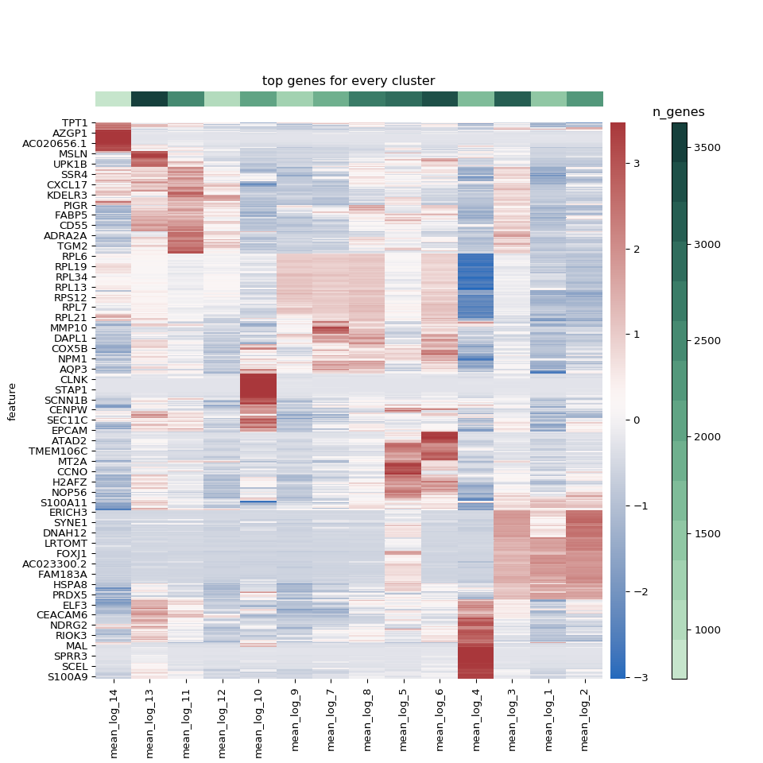

To make things more readable, we also made a heatmap where we kept the columns clustered such that phenotypically similar clusters were grouped together, but manually ordered the rows.

``` python
n_heatmap_genes = {}
heatmap_genes = []
for key in col_order :
    cnt = 0
    for gene in top_genes[key] :
        if gene not in heatmap_genes :
            heatmap_genes.append(gene)
            cnt+=1
    n_heatmap_genes[key] = cnt

n_heatmap_genes = pd.DataFrame(n_heatmap_genes, index = ["n_genes"]).rename(columns = dict(zip(n_heatmap_genes.keys(),
                                                                                               ["cluster_{clust}".format(clust = clust) for
                                                                                                clust in n_heatmap_genes.keys()])))
# Add number of genes in the heatmap for each clusters
annot_genes = annot_genes.append(n_heatmap_genes)
annot_genes = annot_genes.reset_index()
annot_genes = annot_genes.fillna('')


# Get the mean expression of the top genes from each cluster
de_df = {"mean_log_{clust}".format(clust = clust) : epithelial_harmonized.varm["de_res_new"]["mean_logExpr:{clust}".format(clust = clust)] for clust in sorted(set(epithelial_harmonized.obs["new_clusters"]), key = int)}
de_df = pd.DataFrame(de_df, index = epithelial_harmonized.var.index)

heatmap_df = de_df.loc[heatmap_genes]

# Get the mean gene counts for sidebar
gene_val_list = []
gene_val_dict = {}
for clust in sorted(set(epithelial_harmonized.obs["new_clusters"]), key = int) :
    gene_vals = epithelial_harmonized.obs["n_genes"][epithelial_harmonized.obs["new_clusters"] == clust]

    mean = np.mean(gene_vals)
    gene_val_list.append(mean)
    gene_val_dict[clust] = mean

colors = sns.color_palette("ch:2.5,-.2,dark=.2", n_colors = len(gene_val_list)).as_hex()
# Put the gene values in order lowest to highest
sorted_cols = sorted(gene_val_list)

fig, ax = plt.subplots(1, 1, figsize = (10, 10))
divider = make_axes_locatable(ax)
axDivY = divider.append_axes( 'right', size=0.2, pad= 0.1)
axDivY2 = divider.append_axes( 'right', size=0.2, pad= 0.2)
axDivY3 = divider.append_axes( 'right', size=0.2, pad= 0.2)
axDivY4 = divider.append_axes( 'top', size=0.2, pad= 0.2)

# color_label_list =[random.randint(0,14) for i in range(14)]
ax1 = sns.clustermap(heatmap_df, method = "ward", row_cluster =False, col_cluster =True, z_score = 0, cmap = "vlag")
col_order = np.array([name.split("_")[-1] for name in ax1.data2d.columns])
index = [sorted_cols.index(gene_val_dict[clust]) for clust in col_order]
plt.close()

heatmap_carpet = ax1.data2d

ax1 = sns.heatmap(ax1.data2d, cmap = "vlag", ax = ax, cbar_ax = axDivY)
ax2 = axDivY2.imshow(np.array([[min(gene_val_list), max(gene_val_list)]]), cmap = mpl.colors.ListedColormap(list(colors)),
                     interpolation = "nearest", aspect = "auto")
axDivY2.set_axis_off()
axDivY2.set_visible(False)
_ = plt.colorbar(ax2, cax = axDivY3)
_ = axDivY3.set_title("n_genes")
ax3 = axDivY4.imshow(np.array([index]),cmap=mpl.colors.ListedColormap(list(colors)),
              interpolation="nearest", aspect="auto")
axDivY4.set_axis_off()
_ = plt.title("top genes for every cluster")
plt.show()
```

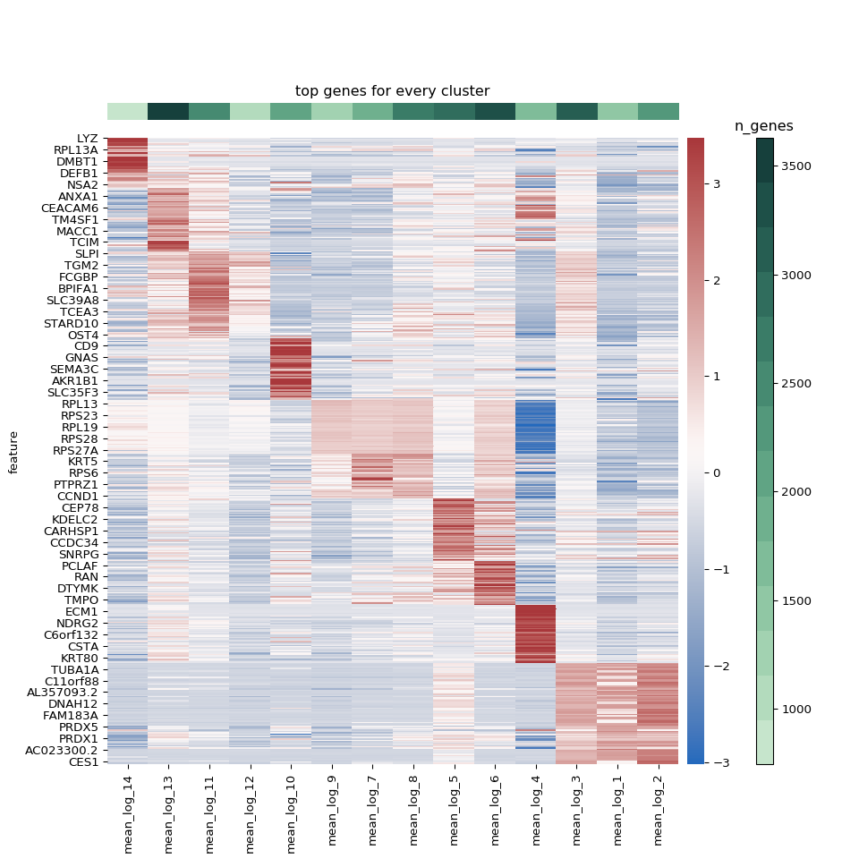

Finally, we wanted to make a publication-ready figure using the wonderful `ComplexHeatmap` package, where we can add some annotations for each cluster and add spaces between clusters to make it even more readable.

``` r
library(ComplexHeatmap)
library(tidyverse)
library(magrittr)
library(circlize)

heatmap_data <- reticulate::py$heatmap_carpet
annotation_info <- reticulate::py$annot_genes
rownames(annotation_info) <- annotation_info$index
annotation_info$index <- NULL


for (c in colnames(annotation_info)){
  annotation_info[[c]] <- unlist(annotation_info[[c]])
}
# Change the column names to be cleaner
colnames(heatmap_data) <- paste("Cluster", unlist(strsplit(colnames(heatmap_data), "_"))[3*(1:length(colnames(heatmap_data)))], sep = " ")

# Make column names consistent with heatmap data
colnames(annotation_info) <- sapply(str_replace(colnames(annotation_info), "_", " "), str_to_title)

# Lets just get the genes
annotation_genes <- unique(as.character(unlist(annotation_info[1:4,])))
annotation_genes <- annotation_genes[annotation_genes != ""]

# Now lets organize the color info that will be used for annotations
col_info = annotation_info %>%
  t() %>%
  as.data.frame() %>%
  dplyr::select(-mean_genes) %>%
  rownames_to_column(var = "cluster") %>%
  reshape2::melt(id.vars = c("cluster", "col")) %>%
  select(-variable)

# Get the gene colors
gene_cols = c()
for (gene in annotation_genes){
  color = as.character(filter(col_info, value == gene)["col"][[1]])
  gene_cols = c(gene_cols, color)
}

# Get the cluster colors
clust_cols <- c()
for (clust in colnames(heatmap_data)){
  color <- col_info %>%
    select(cluster, col) %>%
    distinct() %>%
    filter(cluster == clust)
  clust_cols <- c(clust_cols, as.character(color$col))
}

mean_genes <- annotation_info["mean_genes",] %>%
  mutate_each(funs(as.numeric(as.character(.)))) %>%
  select(colnames(heatmap_data)) # To order them like they will be ordered in the heatmap (same as how GEX data was read in)

gene_col_fun <- colorRamp2(c(min(mean_genes), max(mean_genes)), c("#1d111d", "#bbe7c8"))
gene_bar <-  HeatmapAnnotation("mean # genes" = as.numeric(mean_genes), col = list("mean # genes" = gene_col_fun), show_legend = FALSE)
gene_lgd <- Legend(col_fun = gene_col_fun, title = "# genes", legend_height = unit(4, "cm"), title_position = "topcenter")


heatmap_col_fun = colorRamp2(c(min(heatmap_data), 0, max(heatmap_data)), c("purple", "black", "yellow"))
heatmap_lgd = Legend(col_fun = heatmap_col_fun, title = "z-score", legend_height = unit(4, "cm"), title_position = "topcenter")

lgd_list <- packLegend(heatmap_lgd, gene_lgd, column_gap = unit(1,"cm"), direction = "horizontal")

split <- c()
for (clust in colnames(heatmap_data)){
  n_split <- as.numeric(as.character(annotation_info["n_genes", clust]))
  split <- c(split, rep(gsub("Cluster ", "", clust), n_split))
}
split <- factor(split, levels = as.character(unique(split)))

### WANT TO FLIP THE ORDER OF THE CLUSTERS ###
new_order <- 14:1

clustering = hclust(dist(t(heatmap_data), method = "euclidean"), method = "ward.D2")

hc <- as.dendrogram(clustering)
# hc <- reorder(hc, new_order)
hc <- rev(hc)

# Now need to get the genes in the right order
new_clust_order <- clustering$labels[new_order]

# This is tough with the info on hand, need to use the split info I have
indx <- c()
for (cl in new_clust_order){
  cl <- sub("Cluster ", "", cl)
  indx <- c(indx, which(split == cl))
}

new_heatmap_data <- heatmap_data[indx,]
new_split <- c()
for (clust in new_clust_order){
  n_split <- as.numeric(as.character(annotation_info["n_genes", clust]))
  new_split <- c(new_split, rep(gsub("Cluster ", "", clust), n_split))
}
new_split <- factor(new_split, levels = as.character(unique(new_split)))

# New colors for clusters
new_clust_cols <- c()
for (clust in new_clust_order){
  color <- col_info %>%
    select(cluster, col) %>%
    distinct() %>%
    filter(cluster == clust)
  new_clust_cols <- c(new_clust_cols, as.character(color$col))
}

left_annotation = HeatmapAnnotation(blk = anno_block(gp = gpar(fill = new_clust_cols, col = new_clust_cols)),
                                    which = "row", width = unit(1.5, "mm"))

heatmap_list = Heatmap(new_heatmap_data, name = "z-score", col = heatmap_col_fun, cluster_rows = FALSE, cluster_columns = hc,
                       cluster_row_slices = FALSE, row_km = 1, cluster_column_slices = FALSE,
                       column_dend_reorder = FALSE, top_annotation = gene_bar, show_heatmap_legend = FALSE,
                       column_names_gp = gpar(col = new_clust_cols, fontface = "bold"),
                       split = new_split, left_annotation = left_annotation, show_column_names = FALSE) +
  rowAnnotation(link = anno_mark(at = match(annotation_genes, rownames(new_heatmap_data)),labels = annotation_genes,
                                 labels_gp = gpar(col = gene_cols, fontsize = 8, fontface = "bold")))

draw(heatmap_list, heatmap_legend_list =lgd_list, padding = unit(c(0.5, 0.5, 2, 2), "cm"), cluster_rows = FALSE,
     cluster_row_slices = FALSE)
```

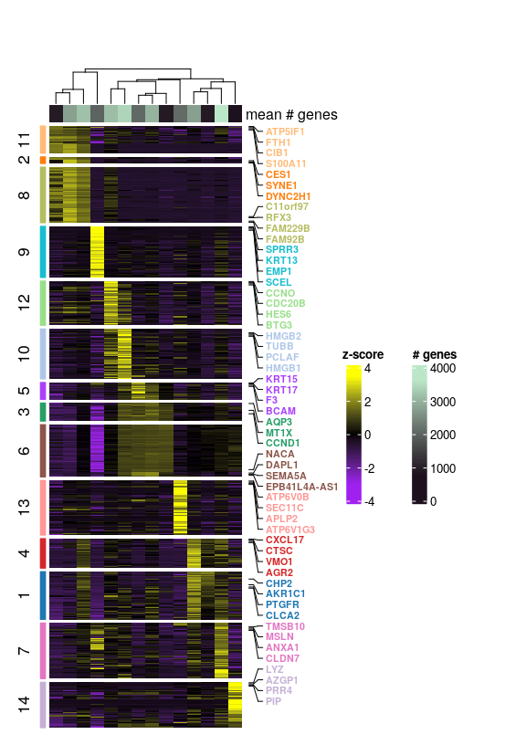

Beyond looking at unbiased markers, we wanted to use legacy knowledge to better understand the biological role of our clusters. Using dot plots, we can see some cannonical genes expressed by the clusters.

``` python
epithelial_gene_dict = {
    "epithelial_markers" : ["FOXJ1", "PIFO", "DNAH2", "PLK4", "CDC20B", "KRT13", "KRT4", "KRT5", "S100A2", "TP63",
                            "FOXI1", "CFTR", "ASCL3", "SCGB1A1", "SCGB3A1", "MUC5AC", "MUC5B", "ZG16B", "CEACAM5",
                            "LYZ", "PRB3"],
    "epithelial_cell_specialization" : ["DNAH5", "DNALI1", "S100A8", "IL18", "IL1A", "IL33", "TSLP", "POSTN",
                                        "PTGS2", "PTGER3", "BPIFA1", "FCGBP"]
}
colormap = clr.LinearSegmentedColormap.from_list('gene_cmap', ["#d3d3d3", "#a5cde3", "#6dafd6", '#08306b'], N=200)

for key in epithelial_gene_dict.keys() :
    plot = sc.pl.dotplot(epithelial_harmonized, epithelial_gene_dict[key], groupby = "new_clusters",
                         # categories_order = ["11", "2", "8", "9", "12", "10", "5", "3", "6", "13", "4", "1", "7", "14"],
                         show = False, return_fig = True, title = "{key} markers".format(key = key),
                         cmap = colormap)
    # plot.add_totals().style(dot_edge_color='black', dot_edge_lw=0.5).show()
    axes_dict = plot.get_axes()
    axes_dict["mainplot_ax"].set_axisbelow(True)
    axes_dict["mainplot_ax"].grid()
    plt.show()
    plt.close()
```

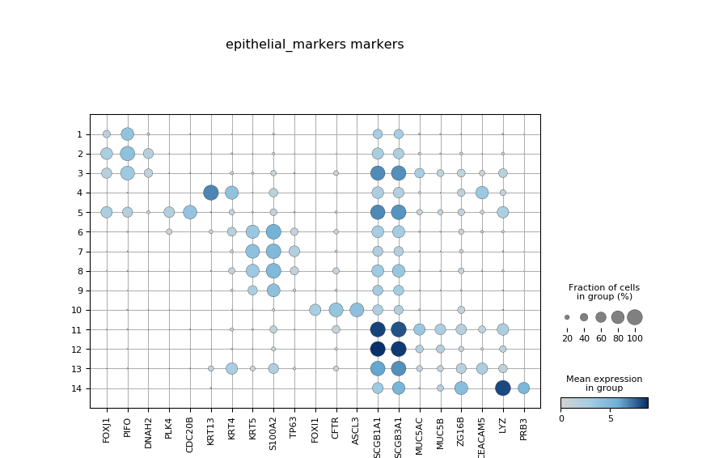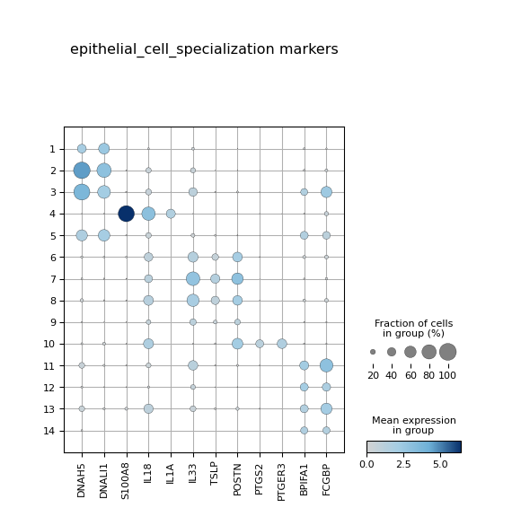

# Differential expression analysis

To perform differential expression analyses we used `DESeq2` on a pseudobulk count matrix where we summed the UMI counts across cells for each unique cluster/sample combination, creating a matrix of n genes x (n samples \* n clusters). First, we were curious about the differences between the baseline and allergen timepoints. We used a simple model of `gene ~ sample` where sample was a factor with 2 levels (Pre, Ag) indicating which condition the sample was from. When we compare the number of DEGs from Pre:Ag between AA and AC, we see that AA has significantly more. This suggests epithelial cells change much more when exposed to allergen in AA than AC.

``` r
library(DESeq2)
library(glue)
library(tidyverse)

count_mtx <- as.matrix(read.csv("/home/nealpsmith/projects/medoff/data/pseudobulk_epithelial_harmonized_counts_for_github.csv",
                                row.names = 1))
meta_data <- read.csv("/home/nealpsmith/projects/medoff/data/pseudobulk_epithelial_harmonized_meta_for_github.csv", row.names = 1)
meta_data$phenotype <- factor(meta_data$phenotype, levels = c("ANA", "AA"))

de_list <- list()
for (clust in unique(meta_data$cluster)){
  clust_meta <-meta_data[meta_data$cluster == clust,]
  clust_count <- count_mtx[,rownames(clust_meta)]

  # Lets do a comparison of groups at Pre and Ag
  pheno_list <- list()
  for (pheno in c("AA", "ANA")){

    # Get just the samples from that phenotype and only pre and Ag
    meta_temp <- clust_meta[clust_meta$phenotype ==pheno & clust_meta$sample %in% c("Pre", "Ag"),]
    meta_temp$sample <- factor(meta_temp$sample, levels = c("Pre", "Ag"))

    if(nrow(meta_temp) > 5){
      count_temp <- clust_count[,rownames(meta_temp)]

      n_samp <- rowSums(count_temp != 0)
      count_temp <- count_temp[n_samp > round(nrow(meta_temp) / 2),]

      stopifnot(rownames(meta_temp) == colnames(count_temp))
      dds <- DESeqDataSetFromMatrix(countData = count_temp,
                                    colData = meta_temp,
                                    design = ~sample)

      dds <- DESeq(dds)
      res <- results(dds)
      plot_data <- as.data.frame(res)
      plot_data <- plot_data[!is.na(plot_data$padj),]
      plot_data$gene <- rownames(plot_data)
      n_de <- nrow(plot_data[plot_data$padj < 0.1,])
      pheno_list[[pheno]] <- n_de
    } else {
      pheno_list[[pheno]] <- 0
    }

  }
  df <- as.data.frame(pheno_list)
  df$new_clusters <- clust
  de_list[[clust]] <- df

}

de_counts <- do.call(rbind, de_list)

de_counts <- de_counts[order(rowSums(de_counts), decreasing = FALSE),]

de_counts$new_clusters <- factor(rownames(de_counts), levels = rownames(de_counts))
plot_df <- reshape2::melt(de_counts, id.vars = "new_clusters") %>%
  mutate(value = ifelse(variable == "ANA", -value, value))

ggplot(plot_df, aes(x = new_clusters, y = value, group = variable, fill = variable)) +
  geom_bar(stat = "identity") + coord_flip() +
  scale_fill_manual(values = c("#FF8000", "#40007F")) +
  scale_y_continuous(labels = abs) +
  ggtitle(glue("Number of DE genes at Ag")) +
  ylab("# of DE genes") + xlab("") +
  theme_bw(base_size = 20)
```


We can also look at this in UMAP space.

``` python
cell_info = epithelial_harmonized.obs
cell_info["umap_1"] = epithelial_harmonized.obsm["X_umap"][:,0]
cell_info["umap_2"] = epithelial_harmonized.obsm["X_umap"][:,1]
```


``` r
library(ggpubr)

umap_info <- reticulate::py$cell_info
umap_info$new_clusters <- factor(umap_info$new_clusters)


plot_df <- umap_info %>%
  dplyr::select(umap_1, umap_2, phenotype, new_clusters) %>%
  left_join(de_counts, by = "new_clusters")

aa_plot <- ggplot(plot_df[plot_df$phenotype == "AA",], aes(x = umap_1, y = umap_2, color = AA)) +
  geom_point(size = 0.5) +
  scale_color_gradient(low="#d3d3d3", high="#FF8000", limits = c(0, max(plot_df$AA))) +
  # ggtitle(glue("# of DE genes Pre vs Ag")) +
  theme_classic(base_size = 20) +
  theme(axis.text.x=element_blank(),
        axis.ticks.x=element_blank(),
        axis.text.y=element_blank(),
        axis.ticks.y=element_blank())

ana_plot <- ggplot(plot_df[plot_df$phenotype == "ANA",], aes(x = umap_1, y = umap_2, color = ANA)) +
  geom_point(size = 0.5) +
  scale_color_gradient(low="#d3d3d3", high="#40007F", limits = c(0, max(plot_df$AA))) +
  # ggtitle(glue("# of DE genes Pre vs Ag")) +
  theme_classic(base_size = 20) +
  theme(axis.text.x=element_blank(),
        axis.ticks.x=element_blank(),
        axis.text.y=element_blank(),
        axis.ticks.y=element_blank())

all_plots <- ggarrange(plotlist = list("AA" = aa_plot, "ANA" = ana_plot), nrow = 1, widths = c(3,3), heights = c(4))
all_plots
```

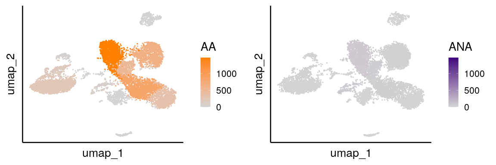

Next, we wanted to look for genes that were significant with an interaction between the phenotype (AA vs. AC) and sample (Pre vs. Ag) terms. To do this, we followed the suggestion in the `DESeq2` vignette and combined the factor levels of phenotype and sample to create a new factor called "interaction". We then used a model of `gene ~ interaction`. A likelihood ratio test was performed to find statistically significant genes.

``` r
#Limit to just Ag samples
meta_data <- meta_data[meta_data$sample != "Dil",]
count_mtx <- count_mtx[,rownames(meta_data)]

de_list <- list()
for (clust in unique(meta_data$cluster)){
  clust_meta <-meta_data[meta_data$cluster == clust,]
  clust_meta$sample <- factor(clust_meta$sample, levels = c("Pre", "Ag"))
  clust_meta$phenotype <- factor(clust_meta$phenotype, levels = c("ANA", "AA"))
  clust_meta$interaction <- factor(paste(clust_meta$phenotype, clust_meta$sample, sep = "_"),
                                  levels = c("ANA_Pre", "ANA_Ag", "AA_Pre", "AA_Ag"))

  clust_count <- count_mtx[,rownames(clust_meta)]
    if (nrow(clust_meta) > 5){

      n_samp <- rowSums(clust_count != 0)
      clust_count <- clust_count[n_samp > round(nrow(clust_meta) / 2),]

      stopifnot(rownames(clust_meta) == colnames(clust_count))

      dds <- DESeqDataSetFromMatrix(countData = clust_count,
                                    colData = clust_meta,
                                    design = ~interaction)
      dds <- DESeq(dds, test = "LRT", reduced = ~1)
      res <- results(dds, contrast = c("interaction", "AA_Ag",  "ANA_Ag"))
      plot_data <- as.data.frame(res)
      plot_data <- plot_data[!is.na(plot_data$padj),]
      plot_data$gene <- rownames(plot_data)
      de_list[[glue("cluster_{clust}")]] <- plot_data
    }

}

de_counts <- lapply(seq_along(de_list), function(x){
    data <- de_list[[x]]
    up_aa <- nrow(data[data$padj < 0.1 & data$log2FoldChange > 0,])
    up_ana <- nrow(data[data$padj < 0.1 & data$log2FoldChange < 0,])
    info_df <- data.frame("AA" = up_aa,
                          "ANA" = up_ana, row.names = names(de_list[x]))
    return(info_df)
  }) %>%
    do.call(rbind, .)

de_counts <- de_counts[order(rowSums(de_counts), decreasing = FALSE),]

de_counts$cluster <- factor(rownames(de_counts), levels = rownames(de_counts))
plot_df <- reshape2::melt(de_counts, id.vars = "cluster") %>%
  mutate(value = ifelse(variable == "ANA", -value, value))


ggplot(plot_df, aes(x = cluster, y = value, group = variable, fill = variable)) +
  geom_bar(stat = "identity") + coord_flip() +
  scale_fill_manual(values = c("#FF8000", "#40007F")) +
  scale_y_continuous(labels = abs) +
  ggtitle(glue("Number of DE genes at Ag")) +
  ylab("# of DE genes") + xlab("") +
  theme_bw(base_size = 20)
```

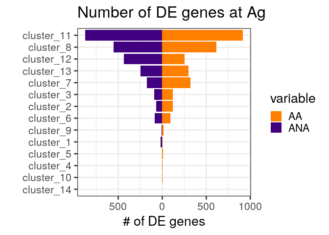

We went through the lists of DEGs to look for biological patterns among the genes. We noticed a few themes in our DEG results. Below, we highlight genes involved in immune response, tissue remodelling and repair, barrier function and metabolism.

``` r
gene_lists <- list("immune_mediators" = c("CCL26", "IL1R2", "HRH1", "IL13RA1", "CX3CL1", "CXCL6", "IL33",
                                          "HMGB1", "HMGB2", "S100A8", "LGALS3", "MIF", "CST1", "ANXA3",
                                          "CXCL2", "CXCL8"),
                   "tissue_remodelling" = c("MMP13", "MMP1", "LOXL4", "MMP7", "LOXL1", "VEGFA", "EGFR", "VCAN",
                                            "ANGPT1", "SPDEF", "SCIN", "HAS3", "POSTN"),
                   "barrier_function" = c("SCGB1A1", "TFF3", "SCGB2A1", "SCGB3A1", "SLC26A4", "CDH26", "ANO1", "CA2",
                                          "GCNT4", "GALNT10", "CLCA2", "PCDH17", "OCLN", "CLDN8"),
                   "metabolism" = c("IDO1", "SLC16A1", "SLC16A7", "ARG2", "GLUL", "TXN", "MAOA", "LTC4S",
                                    "GSTA1", "GSTA2", "GSTA4", "SOD3", "PYCR1")
                   )

plot_clusts <- c("cluster_8", "cluster_7", "cluster_13", "cluster_12", "cluster_11")

for (gset in names(gene_lists)) {
  # Get the log-FC values for each gene in each cluster
  fc_vals <- lapply(gene_lists[[gset]], function(gene){
    log_fc_vals <- lapply(de_list, function(df){
      return(df[gene, "log2FoldChange"])
    }) %>%
      as.data.frame(., row.names = gene) %>%
      t() %>%
      as.data.frame() %>%
      rownames_to_column(var = "cluster")
    return(log_fc_vals)
  }) %>%
    purrr::reduce(left_join, by= "cluster") %>%
    column_to_rownames(var = "cluster") %>%
    t() %>%
    replace_na(0)
  p_vals <- lapply(gene_lists[[gset]], function(gene){
    log_fc_vals <- lapply(de_list, function(df){
      return(df[gene, "padj"])
    }) %>%
      as.data.frame(., row.names = gene) %>%
      t() %>%
      as.data.frame() %>%
      rownames_to_column(var = "cluster")
    return(log_fc_vals)
  }) %>%
    purrr::reduce(left_join, by= "cluster") %>%
    column_to_rownames(var = "cluster") %>%
    t() %>%
    replace_na(1)

  # Remove clusters that we do not need
  fc_vals <- fc_vals[,plot_clusts]
  p_vals <- p_vals[,plot_clusts]

  # make a list for cluster colors
  clust_cols <-list("clust" = c("cluster_8" = "#279e68",
                                "cluster_7" = "#aa40fc",
                                "cluster_13" = "#e377c2",
                                "cluster_12" = "#1f77b4",
                                "cluster_11" = "#d62728"))

  clust_annotation <- HeatmapAnnotation("names" =  anno_mark(at = 1:ncol(fc_vals),
                                                             labels = sapply(colnames(fc_vals), function(x) strsplit(x, "_")[[1]][2]),
                                                             which = "column", side = "top", labels_rot = 360, link_height = unit(2.5, "mm")),
                                        "clust" = colnames(fc_vals),
                                        col = clust_cols, which = "column", show_legend = FALSE)
  clust_num_annotation <- HeatmapAnnotation(link = anno_mark(at = 1:ncol(fc_vals), labels = colnames(fc_vals), which = "column", side = "top"))

  # The color function
  fc_cols <- colorRamp2(c(min(fc_vals), 0, max(fc_vals)), c("#40007F", "white",  "#FF8000"))

  hmap <- Heatmap(fc_vals,
                  col = fc_cols,
                  cluster_columns = FALSE,
                  top_annotation = clust_annotation,
                  heatmap_legend_param = list(title = "log-FC"),
                  show_column_dend = FALSE,
                  show_column_names = FALSE,
                  column_title = gset,
                  cell_fun = function(j, i, x, y, width, height, fill){
                    if (p_vals[i, j] < 0.1){
                      grid.circle(x, y, r = unit(1, "mm"), gp = gpar(fill = "light grey"))
                    }
                  })
  draw(hmap)
}
```

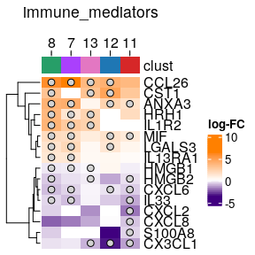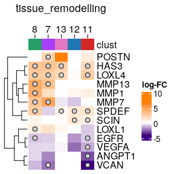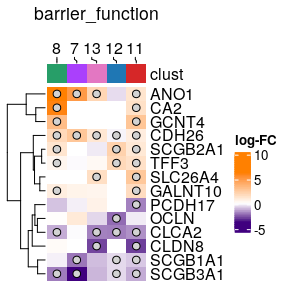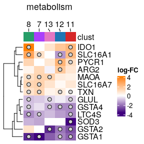

# Hillock cells

Another notable discovery in our dataset was the presence of what looked to Hillock cells. These cells were first reported by Montoro et al. Nature, 2018 in mice, but they are yet to be reported in the airway of humans. We noticed cluster 9 had the major markers of these cells (KRT13, KRT4, etc.). To test the hypothesis that these cells do in fact represent what was found by Montoro et al., we too the top genes they reported as markers for these cells and created a gene set score. As we expect, we see that the distibutuion of the score is much higher in cluster 9 cells vs. all other clusters.

``` python
hillock_genes = ["Upk3bl", "Krt4", "S100g", "Tppp3", "Ecm1", "Lgals3", "Ly6g6c", "Anxa1", "Calml3", "Crip1", "Plac8",
                 "Ltf", "Krt7", "S100a6", "Upk1b", "Aqp5", "Krt15", "S100a10", "Serpinb2", "Krt13", "Pglyrp1",
                 "2200002D01Rik", "Anxa2", "Pmm1", "Cldn4", "Cldn3", "Mal", "Ly6a", "Tacstd2", "Pdzk1ip1", "Nupr1",
                 "Anxa3", "Gsto1", "Dusp1", "Krt19", "Pdlim1", "S100a11", "Gsta4", "Krt8", "Selenbp1", "Tmsb4x",
                 "Mgst3", "Adh7", "Tspo", "S100a14", "Capg", "Ifitm1", "Crip2", "Ffar4", "Porcn", "Cldn23", "Ndufa4",
                 "Cxcl17", "Igfbp5", "Cyp2b10", "Cav1", "Gprc5a", "Map1lc3a", "Aqp3"]

# These are mouse genes, lets get the human ones
human_to_mouse_db = pd.read_csv("/home/nealpsmith/data/useful/human_to_mouse_genes.csv")

human_to_mouse_dict = dict(zip(human_to_mouse_db["MGI.symbol"], human_to_mouse_db["HGNC.symbol"]))

hillock_genes = [human_to_mouse_dict[g] for g in hillock_genes if g in human_to_mouse_dict.keys()]

pg.calc_signature_score(epithelial_harmonized, signatures={"hillock": hillock_genes})

sc.pl.violin(epithelial_harmonized, keys = "hillock", groupby = "new_clusters", show = False)
plt.xlabel("")
figure = plt.gcf()
figure.set_size_inches(6, 2)
plt.show()
```

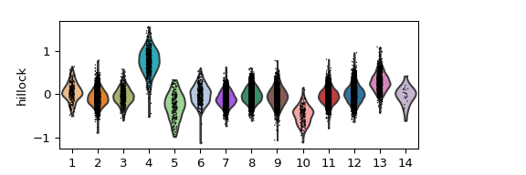
