Figure 5
================

``` r
library(reticulate)
use_python("/home/nealpsmith/.conda/envs/sc_analysis/bin/python")
```

**For figure 5, we wanted to focus in on the mononuclear phagocytes (MNP). We subsetted our main data object to just the MNP clusters. From there we wanted to find the heterogeneity among the MNP and find out which MNP clusters were enriched in AA or AC.**

First, we isolated just the MNP clusters from our original data object. Next, we wanted to determine the optimal number of clusters for our MNP. Briefly, similar to Reyes et al., we quantified cluster stability at many Leiden resolutions to determine which one should be used for downstream analyses. First, data was clustered at many different resolutions ranging from 0.3 to 1.9. Next, we iteratively subsampled 90% of the data (20 iterations) and at each iteration, we made a new clustering solution with the subsampled data and used the Adjusted Rand Index (ARI) to compare it to the clustering solution from the full data.

``` python
import pegasus as pg
import numpy as np
import pandas as pd
import concurrent.futures
from sklearn.metrics.cluster import adjusted_rand_score
import random
import time
import leidenalg
import concurrent.futures
import os
from pegasus.tools import construct_graph
from scipy.sparse import csr_matrix

# Use Rand index to determine leiden resolution to use
def rand_index_plot(
        W,  # adata.uns['W_' + rep] or adata.uns['neighbors']
        resamp_perc=0.9,
        resolutions=(0.3, 0.5, 0.7, 0.9, 1.1, 1.3, 1.5, 1.7, 1.9),
        max_workers=25,
        n_samples=25,
        random_state=0
    ):
    assert isinstance(W, csr_matrix)
    rand_indx_dict = {}
    n_cells = W.shape[0]
    resamp_size = round(n_cells * resamp_perc)

    for resolution in resolutions:

        true_class = leiden(W, resolution, random_state)

        with concurrent.futures.ProcessPoolExecutor(max_workers=max_workers) as executor:
            futures = [executor.submit(_collect_samples, W, resolution, n_cells, resamp_size, true_class, random_state)
                       for i in range(n_samples)]
            rand_list = [f.result() for f in futures]

        rand_indx_dict[str(resolution)] = rand_list
        print("Finished {res}".format(res=resolution))
    return rand_indx_dict
def leiden(W, resolution, random_state=0):

    start = time.perf_counter()

    G = construct_graph(W)
    partition_type = leidenalg.RBConfigurationVertexPartition
    partition = leidenalg.find_partition(
        G,
        partition_type,
        seed=random_state,
        weights="weight",
        resolution_parameter=resolution,
        n_iterations=-1,
    )

    labels = np.array([str(x + 1) for x in partition.membership])

    end = time.perf_counter()
    n_clusters = len(set(labels))
    return pd.Series(labels)

def _collect_samples(W, resolution, n_cells, resamp_size, true_class, random_state=0):
    samp_indx = random.sample(range(n_cells), resamp_size)
    samp_data = W[samp_indx][:, samp_indx]
    true_class = true_class[samp_indx]
    new_class = leiden(samp_data, resolution, random_state)
    return adjusted_rand_score(true_class, new_class)
```


``` python
import matplotlib.pyplot as plt
import seaborn as sns

mnp_harmonized = pg.read_input("/home/nealpsmith/projects/medoff/data/anndata_for_publication/mnp_harmonized.h5ad")

# rand_indx_dict = rand_index_plot(W = mnp_harmonized.uns["W_pca_harmony"],
#                                       resolutions  = [0.3, 0.5, 0.7, 0.9, 1.1, 1.3, 1.5, 1.7, 1.9],
#                                       n_samples = 2)
#
# plot_df = pd.DataFrame(rand_indx_dict).T
# plot_df = plot_df.reset_index()
# plot_df = plot_df.melt(id_vars="index")
# plot_df.to_csv(os.path.join(file_path(), "data", "ari_plots", "myeloid_harmonized_ARI.csv"))
plot_df = pd.read_csv("/home/nealpsmith/projects/medoff/data/ari_plots/myeloid_harmonized_ARI.csv")
fig, ax = plt.subplots(1)
_ = sns.boxplot(x="index", y="value", data=plot_df, ax = ax)
for box in ax.artists:
    box.set_facecolor("grey")
# ax.artists[6].set_facecolor("red") # The one we chose!
ax.spines['right'].set_visible(False)
ax.spines['top'].set_visible(False)
ax.tick_params(axis='both', which='major', labelsize=15)
_ = ax.set_ylabel("Adjusted Rand index", size = 20)
_ = ax.set_xlabel("leiden resolution", size = 20)
_ = plt.axhline(y = 0.9, color = "black", linestyle = "--")
fig.tight_layout()
fig
```

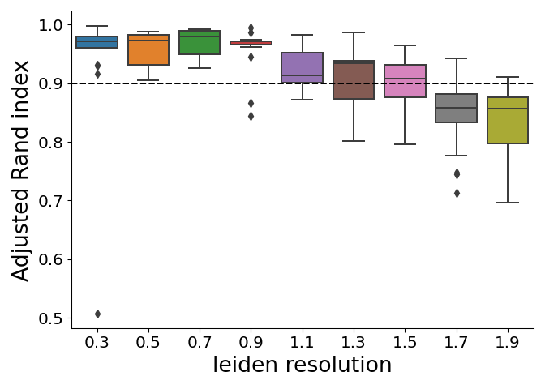

Based on this rand index approach, we can see that a leiden resolution of 1.5 is the highest resolution where the median ARI of all iterations was &gt; 0.9. Given this, we started our clustering at this resolution.

``` python
import scanpy as sc
import matplotlib.colors as clr
colormap = clr.LinearSegmentedColormap.from_list('gene_cmap', ["#d3d3d3" ,'#482cc7'], N=200)

# pg.leiden(mnp_harmonized, resolution = 1.5, rep = "pca_harmony", random_state = 2)

sc.pl.umap(mnp_harmonized, color = ["leiden_labels"], legend_loc = "on data")
```


After visually assessing many genes and through expert annotation, we could see that there was a small cluster of CLEC9A+ cDC1 cells among cluster 3. Given we know that cDC1s have a distinct biological function, we manually subsetted these cells to represent their own cluster. We can defend this choice by scoring cells using a cDC1 gene set that was published by Villani et al. Cell 2017.

``` python

### Want to look at DC1 gene set (we think we see a small cluster of them) ###
def score_cells(data, gene_set):
    # Get rid of genes that aren't in data
    gene_set = [gene for gene in gene_set if gene in data.var_names]
    print(gene_set)
    # Limit the data to just those genes
    dat = data[:, gene_set].X
    dat = dat.toarray()
    mean = dat.mean(axis=0)
    var = dat.var(axis=0)
    std = np.sqrt(var)

    with np.errstate(divide="ignore", invalid="ignore"):
        dat = (dat - mean) / std
    dat[dat < -5] = -5
    dat[dat > 5] = 5

    scores = dat.mean(axis=1)
    return (scores)

dc1_genes = ["CLEC9A", "C1ORF54", "HLA-DPA1", "CADM1", "CAMK2D", "CPVL", "HLA-DPB2", "WDFY4", "CPNE3", "IDO1",
            "HLA-DPB1", "LOC645638", "HLA-DOB", "HLA-DQB1", "HLA-DQB", "CLNK", "CSRP1", "SNX3", "ZNF366",
             "KIAA1598", "NDRG2", "ENPP1", "RGS10", "AX747832", "CYB5R3", "ID2", "XCR1", "FAM190A", "ASAP1",
             "SLAMF8", "CD59", "DHRS3", "GCET2", "FNBP1", "TMEM14A", "NET1", "BTLA", "BCL6", "FLT3", "ADAM28", "SLAMF7",
             "BATF3", "LGALS2", "VAC14", "PPA1", "APOL3", "C1ORF21", "CCND1", "ANPEP", "ELOVL5", "NCALD", "ACTN1",
             "PIK3CB", "HAVCR2", "GYPC", "TLR10", "ASB2", "KIF16B", "LRRC18", "DST", "DENND1B", "DNASE1L3", "SLC24A4",
             "VAV3", "THBD", "NAV1", "GSTM4", "TRERF1", "B3GNT7", "LACC1", "LMNA", "PTK2", "IDO2", "MTERFD3", "CD93",
             "DPP4", "SLC9A9", "FCRL6", "PDLIM7", "CYP2E1", "PDE4DIP", "LIMA1", "CTTNBP2NL", "PPM1M", "OSBPL3", "PLCD1",
             "CD38", "EHD4", "ACSS2", "LOC541471", "FUCA1", "SNX22", "APOL1", "DUSP10", "FAM160A2", "INF2", "DUSP2",
             "PALM2", "RAB11FIP4", "DSE", "FAM135A", "KCNK6", "PPM1H", "PAFAH1B3", "PDLIM1", "TGM2", "SCARF1", "CD40",
             "STX3", "WHAMMP3", "PRELID2", "PQLC2"]
dc1_genes = [gene for gene in dc1_genes if gene in mnp_harmonized.var_names]
mnp_harmonized.obs["dc1_score"] = score_cells(mnp_harmonized, dc1_genes)

sc.pl.umap(mnp_harmonized, color="dc1_score", cmap = colormap)
```

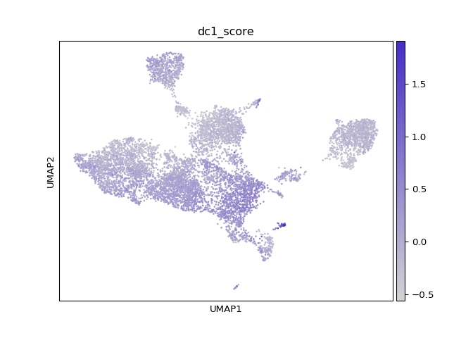

Additionally, after expert annotation, we did not think cluster 10 represented any unique set of cells and seemed to share all major markers with cluster 1. Therefore, we refined our clustering by combining clusters 1 and 10 and manually segregating the cDC1 cells. Below is the final clustering solution. Cluster numbers were also adjusted to have them ordered by the phenotypic similarities (the order they fall in the marker heatmap below)

``` python
sc.pl.umap(mnp_harmonized, color = "new_clusters", legend_loc = "on data")
```

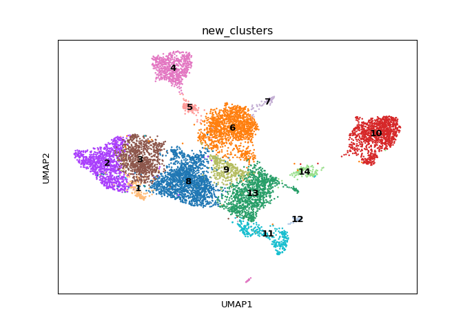

# Marker genes

First we can look at marker genes by AUROC. The motivation here is to determine for each cluster which specific genes are good classifiers for cluster membership. These stats were calculated using the Pegasus `de_analysis` function.

``` python
# pg.de_analysis(mnp_harmonized, cluster = "new_clusters", auc = True,
#                n_jobs = len(set(mnp_harmonized.obs["new_clusters"])))

top_auc = {}
top_genes = {}
for clust in sorted(set(mnp_harmonized.obs["new_clusters"]), key = int) :
    df_dict = {"auc": mnp_harmonized.varm["de_res"]["auroc:{clust}".format(clust=clust)]}
    df = pd.DataFrame(df_dict, index=mnp_harmonized.var.index)
    df = df.sort_values(by=["auc"], ascending=False)
    auc_df = df.iloc[0:50]
    genes = auc_df[auc_df["auc"] >= 0.75].index.values
    top_genes[clust] = genes

top_gene_df = pd.DataFrame(dict([(k,pd.Series(v)) for k,v in top_genes.items() ]))
top_gene_df = top_gene_df.rename(columns = {clust : "cluster_{clust}".format(clust=clust) for clust in top_genes.keys()})
top_gene_df = top_gene_df.replace(np.nan, "")
```


``` r
library(knitr)
kable(reticulate::py$top_gene_df, caption = "genes with AUC > 0.75")
```

<table style="width:100%;">
<caption>genes with AUC &gt; 0.75</caption>
<colgroup>
<col width="6%" />
<col width="6%" />
<col width="6%" />
<col width="7%" />
<col width="6%" />
<col width="6%" />
<col width="6%" />
<col width="6%" />
<col width="6%" />
<col width="7%" />
<col width="7%" />
<col width="7%" />
<col width="7%" />
<col width="7%" />
</colgroup>
<thead>
<tr class="header">
<th align="left">cluster_1</th>
<th align="left">cluster_2</th>
<th align="left">cluster_3</th>
<th align="left">cluster_4</th>
<th align="left">cluster_5</th>
<th align="left">cluster_6</th>
<th align="left">cluster_7</th>
<th align="left">cluster_8</th>
<th align="left">cluster_9</th>
<th align="left">cluster_10</th>
<th align="left">cluster_11</th>
<th align="left">cluster_12</th>
<th align="left">cluster_13</th>
<th align="left">cluster_14</th>
</tr>
</thead>
<tbody>
<tr class="odd">
<td align="left">GBP1</td>
<td align="left">CTSB</td>
<td align="left">NAMPT</td>
<td align="left">APOC1</td>
<td align="left">FTL</td>
<td align="left"></td>
<td align="left">H2AFZ</td>
<td align="left">VSIR</td>
<td align="left">A2M</td>
<td align="left">GZMB</td>
<td align="left">CD83</td>
<td align="left">CLEC9A</td>
<td align="left">CD1C</td>
<td align="left">PPP1R14A</td>
</tr>
<tr class="even">
<td align="left">STAT1</td>
<td align="left">CSTB</td>
<td align="left">SRGN</td>
<td align="left">FTL</td>
<td align="left">FTH1</td>
<td align="left"></td>
<td align="left">STMN1</td>
<td align="left">FGL2</td>
<td align="left">CD74</td>
<td align="left">JCHAIN</td>
<td align="left">BIRC3</td>
<td align="left">WDFY4</td>
<td align="left">CD1E</td>
<td align="left">SEPT6</td>
</tr>
<tr class="odd">
<td align="left">C15orf48</td>
<td align="left">CTSD</td>
<td align="left">NEAT1</td>
<td align="left">FABP4</td>
<td align="left">APOC1</td>
<td align="left"></td>
<td align="left">HMGB1</td>
<td align="left">AOAH</td>
<td align="left">HLA-DQA1</td>
<td align="left">TCF4</td>
<td align="left">LAMP3</td>
<td align="left">SNX3</td>
<td align="left">CIITA</td>
<td align="left">LTB</td>
</tr>
<tr class="even">
<td align="left">WARS</td>
<td align="left">LGALS3</td>
<td align="left">PLAUR</td>
<td align="left">MARCO</td>
<td align="left">FABP4</td>
<td align="left"></td>
<td align="left">TUBA1B</td>
<td align="left">CPVL</td>
<td align="left">HLA-DPA1</td>
<td align="left">UGCG</td>
<td align="left">NFKB1</td>
<td align="left">IRF8</td>
<td align="left">TLR10</td>
<td align="left">C12orf75</td>
</tr>
<tr class="odd">
<td align="left">LAP3</td>
<td align="left">CD63</td>
<td align="left">SLC2A3</td>
<td align="left">GCHFR</td>
<td align="left">CTSD</td>
<td align="left"></td>
<td align="left">PTMA</td>
<td align="left">MS4A6A</td>
<td align="left">C1QC</td>
<td align="left">ITM2C</td>
<td align="left">DAPP1</td>
<td align="left">NAAA</td>
<td align="left">CKLF</td>
<td align="left">CDH1</td>
</tr>
<tr class="even">
<td align="left">GBP4</td>
<td align="left">FABP5</td>
<td align="left">SAT1</td>
<td align="left">C1QA</td>
<td align="left">CSTB</td>
<td align="left"></td>
<td align="left">PCLAF</td>
<td align="left">SORL1</td>
<td align="left">HLA-DQB1</td>
<td align="left">IGKC</td>
<td align="left">REL</td>
<td align="left">ID2</td>
<td align="left">PPA1</td>
<td align="left">NKG7</td>
</tr>
<tr class="odd">
<td align="left">GBP5</td>
<td align="left">CTSL</td>
<td align="left">IL1RN</td>
<td align="left">C1QB</td>
<td align="left">MARCO</td>
<td align="left"></td>
<td align="left">HMGB2</td>
<td align="left">TMEM176B</td>
<td align="left">HLA-DRB1</td>
<td align="left">PPP1R14B</td>
<td align="left">CCR7</td>
<td align="left">CPNE3</td>
<td align="left">HLA-DQA1</td>
<td align="left">AXL</td>
</tr>
<tr class="even">
<td align="left">GBP2</td>
<td align="left">BRI3</td>
<td align="left">FTH1</td>
<td align="left">FTH1</td>
<td align="left">LGALS3</td>
<td align="left"></td>
<td align="left">TYMS</td>
<td align="left">MNDA</td>
<td align="left">C1QA</td>
<td align="left">BCL11A</td>
<td align="left">BASP1</td>
<td align="left">SHTN1</td>
<td align="left">PPP1R14A</td>
<td align="left">MYL12A</td>
</tr>
<tr class="odd">
<td align="left">SOD2</td>
<td align="left">GPNMB</td>
<td align="left">VEGFA</td>
<td align="left">APOE</td>
<td align="left">APOE</td>
<td align="left"></td>
<td align="left">TUBB</td>
<td align="left">CLEC10A</td>
<td align="left">C1QB</td>
<td align="left">IRF7</td>
<td align="left">IL7R</td>
<td align="left">CST3</td>
<td align="left">ACTG1</td>
<td align="left">CD2</td>
</tr>
<tr class="even">
<td align="left">CXCL10</td>
<td align="left">PSAP</td>
<td align="left">CEBPB</td>
<td align="left">MS4A7</td>
<td align="left"></td>
<td align="left"></td>
<td align="left">DUT</td>
<td align="left">F13A1</td>
<td align="left">ITM2B</td>
<td align="left">CCDC50</td>
<td align="left">CST7</td>
<td align="left">CADM1</td>
<td align="left">CD74</td>
<td align="left">ARL4C</td>
</tr>
<tr class="odd">
<td align="left">PARP14</td>
<td align="left">SDCBP</td>
<td align="left">MCL1</td>
<td align="left">MSR1</td>
<td align="left"></td>
<td align="left"></td>
<td align="left">CKS1B</td>
<td align="left">GGT5</td>
<td align="left">HLA-DMB</td>
<td align="left">TSPAN13</td>
<td align="left">CCL22</td>
<td align="left">CD226</td>
<td align="left">HLA-DPA1</td>
<td align="left">TCF4</td>
</tr>
<tr class="even">
<td align="left">EPSTI1</td>
<td align="left">CEBPB</td>
<td align="left">BTG1</td>
<td align="left">TFRC</td>
<td align="left"></td>
<td align="left"></td>
<td align="left">HMGN2</td>
<td align="left">AIF1</td>
<td align="left">HLA-DRA</td>
<td align="left">MZB1</td>
<td align="left">CFLAR</td>
<td align="left">TAP1</td>
<td align="left">SLC38A1</td>
<td align="left">SULF2</td>
</tr>
<tr class="odd">
<td align="left">TYMP</td>
<td align="left">ATP6V1F</td>
<td align="left">TIMP1</td>
<td align="left">LGALS3</td>
<td align="left"></td>
<td align="left"></td>
<td align="left">PCNA</td>
<td align="left">VASH1</td>
<td align="left">HLA-DPB1</td>
<td align="left">IRF8</td>
<td align="left">GPR157</td>
<td align="left">HLA-DPA1</td>
<td align="left">DENND1B</td>
<td align="left">LGMN</td>
</tr>
<tr class="even">
<td align="left">NAMPT</td>
<td align="left">FTH1</td>
<td align="left">METRNL</td>
<td align="left">CTSD</td>
<td align="left"></td>
<td align="left"></td>
<td align="left">DEK</td>
<td align="left">JAML</td>
<td align="left">AXL</td>
<td align="left">SMPD3</td>
<td align="left">MARCKS</td>
<td align="left">RAB7B</td>
<td align="left">LIMD2</td>
<td align="left">HINT1</td>
</tr>
<tr class="odd">
<td align="left">TAP1</td>
<td align="left">EMP3</td>
<td align="left">DUSP1</td>
<td align="left">NUPR1</td>
<td align="left"></td>
<td align="left"></td>
<td align="left">TK1</td>
<td align="left">CD93</td>
<td align="left">MS4A6A</td>
<td align="left">IL3RA</td>
<td align="left">NR4A3</td>
<td align="left">ENPP1</td>
<td align="left">KCNK6</td>
<td align="left">BID</td>
</tr>
<tr class="even">
<td align="left">BCL2A1</td>
<td align="left">ANXA2</td>
<td align="left">OLR1</td>
<td align="left">SERPING1</td>
<td align="left"></td>
<td align="left"></td>
<td align="left">GAPDH</td>
<td align="left">NAIP</td>
<td align="left">FGL2</td>
<td align="left">C12orf75</td>
<td align="left">IL4I1</td>
<td align="left">CPVL</td>
<td align="left">HLA-DPB1</td>
<td align="left">ATF5</td>
</tr>
<tr class="odd">
<td align="left">PSME2</td>
<td align="left">ANXA5</td>
<td align="left">ATP13A3</td>
<td align="left">TSPO</td>
<td align="left"></td>
<td align="left"></td>
<td align="left">MKI67</td>
<td align="left">GIMAP7</td>
<td align="left"></td>
<td align="left">CLIC3</td>
<td align="left">BTG1</td>
<td align="left">BATF3</td>
<td align="left">NDRG2</td>
<td align="left">PLAC8</td>
</tr>
<tr class="even">
<td align="left">APOL6</td>
<td align="left">GSTO1</td>
<td align="left">SGK1</td>
<td align="left">SCD</td>
<td align="left"></td>
<td align="left"></td>
<td align="left"></td>
<td align="left">SIGLEC10</td>
<td align="left"></td>
<td align="left">PLAC8</td>
<td align="left">GPR183</td>
<td align="left">HLA-DPB1</td>
<td align="left">HLA-DQB1</td>
<td align="left">RPS23</td>
</tr>
<tr class="odd">
<td align="left"></td>
<td align="left">SGK1</td>
<td align="left">CD44</td>
<td align="left">MGST3</td>
<td align="left"></td>
<td align="left"></td>
<td align="left"></td>
<td align="left">CEBPA</td>
<td align="left"></td>
<td align="left">MALAT1</td>
<td align="left">ETV3</td>
<td align="left">XCR1</td>
<td align="left">LRRK1</td>
<td align="left">TUBA1A</td>
</tr>
<tr class="even">
<td align="left"></td>
<td align="left">SLC11A1</td>
<td align="left">SOD2</td>
<td align="left">CSTB</td>
<td align="left"></td>
<td align="left"></td>
<td align="left"></td>
<td align="left">COTL1</td>
<td align="left"></td>
<td align="left">SEC61B</td>
<td align="left">CSF2RA</td>
<td align="left">IDO1</td>
<td align="left">GDI2</td>
<td align="left">LRRFIP1</td>
</tr>
<tr class="odd">
<td align="left"></td>
<td align="left">ASAH1</td>
<td align="left">FOSL2</td>
<td align="left">AC026369.3</td>
<td align="left"></td>
<td align="left"></td>
<td align="left"></td>
<td align="left"></td>
<td align="left"></td>
<td align="left">APP</td>
<td align="left">EIF1</td>
<td align="left">HLA-DQA1</td>
<td align="left">RUNX3</td>
<td align="left">CSF2RB</td>
</tr>
<tr class="even">
<td align="left"></td>
<td align="left">PDXK</td>
<td align="left">HIF1A</td>
<td align="left">CES1</td>
<td align="left"></td>
<td align="left"></td>
<td align="left"></td>
<td align="left"></td>
<td align="left"></td>
<td align="left">SELL</td>
<td align="left">CMTM6</td>
<td align="left">CD74</td>
<td align="left"></td>
<td align="left">SPIB</td>
</tr>
<tr class="odd">
<td align="left"></td>
<td align="left">PLA2G7</td>
<td align="left">H3F3B</td>
<td align="left">LTA4H</td>
<td align="left"></td>
<td align="left"></td>
<td align="left"></td>
<td align="left"></td>
<td align="left"></td>
<td align="left">SERPINF1</td>
<td align="left">CDKN1A</td>
<td align="left">BASP1</td>
<td align="left"></td>
<td align="left">RAB11FIP1</td>
</tr>
<tr class="even">
<td align="left"></td>
<td align="left">FTL</td>
<td align="left">LITAF</td>
<td align="left">GLRX</td>
<td align="left"></td>
<td align="left"></td>
<td align="left"></td>
<td align="left"></td>
<td align="left"></td>
<td align="left">LILRA4</td>
<td align="left">PNRC1</td>
<td align="left">CCND1</td>
<td align="left"></td>
<td align="left">MRPS6</td>
</tr>
<tr class="odd">
<td align="left"></td>
<td align="left">AQP9</td>
<td align="left">GK</td>
<td align="left">CYP27A1</td>
<td align="left"></td>
<td align="left"></td>
<td align="left"></td>
<td align="left"></td>
<td align="left"></td>
<td align="left">MAP1A</td>
<td align="left">EEF1A1</td>
<td align="left">CLNK</td>
<td align="left"></td>
<td align="left">CRYBG1</td>
</tr>
<tr class="even">
<td align="left"></td>
<td align="left">LAMP1</td>
<td align="left"></td>
<td align="left">C1QC</td>
<td align="left"></td>
<td align="left"></td>
<td align="left"></td>
<td align="left"></td>
<td align="left"></td>
<td align="left">DERL3</td>
<td align="left"></td>
<td align="left">HLA-DQB1</td>
<td align="left"></td>
<td align="left">PLP2</td>
</tr>
<tr class="odd">
<td align="left"></td>
<td align="left">GLUL</td>
<td align="left"></td>
<td align="left">GPNMB</td>
<td align="left"></td>
<td align="left"></td>
<td align="left"></td>
<td align="left"></td>
<td align="left"></td>
<td align="left">ALOX5AP</td>
<td align="left"></td>
<td align="left">C1orf54</td>
<td align="left"></td>
<td align="left">SYNGR2</td>
</tr>
<tr class="even">
<td align="left"></td>
<td align="left">S100A11</td>
<td align="left"></td>
<td align="left">CD52</td>
<td align="left"></td>
<td align="left"></td>
<td align="left"></td>
<td align="left"></td>
<td align="left"></td>
<td align="left">SCT</td>
<td align="left"></td>
<td align="left">RAB11FIP1</td>
<td align="left"></td>
<td align="left">S100A10</td>
</tr>
<tr class="odd">
<td align="left"></td>
<td align="left">CD9</td>
<td align="left"></td>
<td align="left">FABP5</td>
<td align="left"></td>
<td align="left"></td>
<td align="left"></td>
<td align="left"></td>
<td align="left"></td>
<td align="left">SPCS1</td>
<td align="left"></td>
<td align="left">ASAP1</td>
<td align="left"></td>
<td align="left">NFAT5</td>
</tr>
<tr class="even">
<td align="left"></td>
<td align="left">CD44</td>
<td align="left"></td>
<td align="left">PPARG</td>
<td align="left"></td>
<td align="left"></td>
<td align="left"></td>
<td align="left"></td>
<td align="left"></td>
<td align="left">HERPUD1</td>
<td align="left"></td>
<td align="left">SLAMF7</td>
<td align="left"></td>
<td align="left">ACTG1</td>
</tr>
<tr class="odd">
<td align="left"></td>
<td align="left">SH3BGRL3</td>
<td align="left"></td>
<td align="left">TXNIP</td>
<td align="left"></td>
<td align="left"></td>
<td align="left"></td>
<td align="left"></td>
<td align="left"></td>
<td align="left">SPIB</td>
<td align="left"></td>
<td align="left">ICAM3</td>
<td align="left"></td>
<td align="left">CCND3</td>
</tr>
<tr class="even">
<td align="left"></td>
<td align="left">MGAT1</td>
<td align="left"></td>
<td align="left">LGALS3BP</td>
<td align="left"></td>
<td align="left"></td>
<td align="left"></td>
<td align="left"></td>
<td align="left"></td>
<td align="left">CYB561A3</td>
<td align="left"></td>
<td align="left">FNBP1</td>
<td align="left"></td>
<td align="left">SUSD1</td>
</tr>
<tr class="odd">
<td align="left"></td>
<td align="left">VIM</td>
<td align="left"></td>
<td align="left">FAM89A</td>
<td align="left"></td>
<td align="left"></td>
<td align="left"></td>
<td align="left"></td>
<td align="left"></td>
<td align="left">LINC00996</td>
<td align="left"></td>
<td align="left">ARF6</td>
<td align="left"></td>
<td align="left">ALOX5AP</td>
</tr>
<tr class="even">
<td align="left"></td>
<td align="left">PLIN2</td>
<td align="left"></td>
<td align="left">S100A11</td>
<td align="left"></td>
<td align="left"></td>
<td align="left"></td>
<td align="left"></td>
<td align="left"></td>
<td align="left">LTB</td>
<td align="left"></td>
<td align="left">CST7</td>
<td align="left"></td>
<td align="left">SEC61B</td>
</tr>
<tr class="odd">
<td align="left"></td>
<td align="left">FBP1</td>
<td align="left"></td>
<td align="left">CFD</td>
<td align="left"></td>
<td align="left"></td>
<td align="left"></td>
<td align="left"></td>
<td align="left"></td>
<td align="left">PLD4</td>
<td align="left"></td>
<td align="left">RAB32</td>
<td align="left"></td>
<td align="left">UGCG</td>
</tr>
<tr class="even">
<td align="left"></td>
<td align="left">DAB2</td>
<td align="left"></td>
<td align="left">ALDH2</td>
<td align="left"></td>
<td align="left"></td>
<td align="left"></td>
<td align="left"></td>
<td align="left"></td>
<td align="left">CLEC4C</td>
<td align="left"></td>
<td align="left">HLA-DRB1</td>
<td align="left"></td>
<td align="left">INPP4A</td>
</tr>
<tr class="odd">
<td align="left"></td>
<td align="left">CD68</td>
<td align="left"></td>
<td align="left">FBP1</td>
<td align="left"></td>
<td align="left"></td>
<td align="left"></td>
<td align="left"></td>
<td align="left"></td>
<td align="left">STMN1</td>
<td align="left"></td>
<td align="left">ACTG1</td>
<td align="left"></td>
<td align="left">RASSF5</td>
</tr>
<tr class="even">
<td align="left"></td>
<td align="left">CD163</td>
<td align="left"></td>
<td align="left">S100A6</td>
<td align="left"></td>
<td align="left"></td>
<td align="left"></td>
<td align="left"></td>
<td align="left"></td>
<td align="left">CD2AP</td>
<td align="left"></td>
<td align="left">DENND1B</td>
<td align="left"></td>
<td align="left"></td>
</tr>
<tr class="odd">
<td align="left"></td>
<td align="left">C15orf48</td>
<td align="left"></td>
<td align="left">VSIG4</td>
<td align="left"></td>
<td align="left"></td>
<td align="left"></td>
<td align="left"></td>
<td align="left"></td>
<td align="left">SLC15A4</td>
<td align="left"></td>
<td align="left">RGCC</td>
<td align="left"></td>
<td align="left"></td>
</tr>
<tr class="even">
<td align="left"></td>
<td align="left">S100A10</td>
<td align="left"></td>
<td align="left">ACP5</td>
<td align="left"></td>
<td align="left"></td>
<td align="left"></td>
<td align="left"></td>
<td align="left"></td>
<td align="left">PMEPA1</td>
<td align="left"></td>
<td align="left">BCL6</td>
<td align="left"></td>
<td align="left"></td>
</tr>
<tr class="odd">
<td align="left"></td>
<td align="left">NCF2</td>
<td align="left"></td>
<td align="left">FCGR3A</td>
<td align="left"></td>
<td align="left"></td>
<td align="left"></td>
<td align="left"></td>
<td align="left"></td>
<td align="left">CCDC186</td>
<td align="left"></td>
<td align="left">HLA-DOB</td>
<td align="left"></td>
<td align="left"></td>
</tr>
<tr class="even">
<td align="left"></td>
<td align="left">CCL2</td>
<td align="left"></td>
<td align="left">CD81</td>
<td align="left"></td>
<td align="left"></td>
<td align="left"></td>
<td align="left"></td>
<td align="left"></td>
<td align="left">FCHSD2</td>
<td align="left"></td>
<td align="left">HLA-DRB5</td>
<td align="left"></td>
<td align="left"></td>
</tr>
<tr class="odd">
<td align="left"></td>
<td align="left"></td>
<td align="left"></td>
<td align="left">PCOLCE2</td>
<td align="left"></td>
<td align="left"></td>
<td align="left"></td>
<td align="left"></td>
<td align="left"></td>
<td align="left">ZFAT</td>
<td align="left"></td>
<td align="left">RGS10</td>
<td align="left"></td>
<td align="left"></td>
</tr>
<tr class="even">
<td align="left"></td>
<td align="left"></td>
<td align="left"></td>
<td align="left">ALDH1A1</td>
<td align="left"></td>
<td align="left"></td>
<td align="left"></td>
<td align="left"></td>
<td align="left"></td>
<td align="left">MPEG1</td>
<td align="left"></td>
<td align="left">DNASE1L3</td>
<td align="left"></td>
<td align="left"></td>
</tr>
<tr class="odd">
<td align="left"></td>
<td align="left"></td>
<td align="left"></td>
<td align="left">TYROBP</td>
<td align="left"></td>
<td align="left"></td>
<td align="left"></td>
<td align="left"></td>
<td align="left"></td>
<td align="left">PLP2</td>
<td align="left"></td>
<td align="left">DST</td>
<td align="left"></td>
<td align="left"></td>
</tr>
<tr class="even">
<td align="left"></td>
<td align="left"></td>
<td align="left"></td>
<td align="left">TREM1</td>
<td align="left"></td>
<td align="left"></td>
<td align="left"></td>
<td align="left"></td>
<td align="left"></td>
<td align="left">OFD1</td>
<td align="left"></td>
<td align="left">ZNF366</td>
<td align="left"></td>
<td align="left"></td>
</tr>
<tr class="odd">
<td align="left"></td>
<td align="left"></td>
<td align="left"></td>
<td align="left">PLIN2</td>
<td align="left"></td>
<td align="left"></td>
<td align="left"></td>
<td align="left"></td>
<td align="left"></td>
<td align="left">NUCB2</td>
<td align="left"></td>
<td align="left">LGALS2</td>
<td align="left"></td>
<td align="left"></td>
</tr>
<tr class="even">
<td align="left"></td>
<td align="left"></td>
<td align="left"></td>
<td align="left">CTSL</td>
<td align="left"></td>
<td align="left"></td>
<td align="left"></td>
<td align="left"></td>
<td align="left"></td>
<td align="left">SELENOS</td>
<td align="left"></td>
<td align="left">CCSER1</td>
<td align="left"></td>
<td align="left"></td>
</tr>
<tr class="odd">
<td align="left"></td>
<td align="left"></td>
<td align="left"></td>
<td align="left">PLA2G16</td>
<td align="left"></td>
<td align="left"></td>
<td align="left"></td>
<td align="left"></td>
<td align="left"></td>
<td align="left">RPS12</td>
<td align="left"></td>
<td align="left">HLA-DRA</td>
<td align="left"></td>
<td align="left"></td>
</tr>
<tr class="even">
<td align="left"></td>
<td align="left"></td>
<td align="left"></td>
<td align="left">IFI6</td>
<td align="left"></td>
<td align="left"></td>
<td align="left"></td>
<td align="left"></td>
<td align="left"></td>
<td align="left">SEL1L3</td>
<td align="left"></td>
<td align="left">CAMK2D</td>
<td align="left"></td>
<td align="left"></td>
</tr>
</tbody>
</table>

We can see from the above AUROC genes, that we don't have a strong enough signal from some clusters to get a good sense of their phenotype solely on that. So we can also find markers using an OVA pseudobulk approach. To do this, we first created a psedudobulk matrix by summing the UMI counts across cells for each unique cluster/sample combination, creating a matrix of n genes x (n samples \* n clusters). Using this matrix with DESeq2, For each cluster, we used an input model gene ~ in\_clust where in\_clust is a factor with two levels indicating if the sample was in or not in the cluster being tested. Genes with an FDR &lt; 5% were considered marker genes.

``` python
# import neals_python_functions as nealsucks
# # Read in the raw count data
# raw_data = pg.read_input("/home/nealpsmith/projects/medoff/data/all_data.h5sc")
# raw_data = raw_data[mnp_harmonized.obs_names]
# raw_data = raw_data[:, mnp_harmonized.var_names]
# raw_data.obs = mnp_harmonized.obs[["leiden_labels", "Channel"]]
#
# # Create the matrix
# raw_sum_dict = {}
# cell_num_dict = {}
# for samp in set(raw_data.obs["Channel"]):
#     for clust in set(raw_data.obs["leiden_labels"]):
#         dat = raw_data[(raw_data.obs["Channel"] == samp) & (raw_data.obs["leiden_labels"] == clust)]
#         if len(dat) == 0:
#             continue
#         cell_num_dict["samp_{samp}_{clust}".format(samp=samp, clust=clust)] = len(dat)
#         count_sum = np.array(dat.X.sum(axis=0)).flatten()
#         raw_sum_dict["samp_{samp}_{clust}".format(samp=samp, clust=clust)] = count_sum
#
# count_mtx = pd.DataFrame(raw_sum_dict, index=raw_data.var.index.values)
#
# meta_df = pd.DataFrame(cell_num_dict, index=["n_cells"]).T
# meta_df["cluster"] = [name.split("_")[-1] for name in meta_df.index.values]
# meta_df["sample"] = [name.split("_")[-2] for name in meta_df.index.values]
# meta_df["phenotype"] = [name.split("_")[-3] for name in meta_df.index.values]
# meta_df["id"] = ["_".join(name.split("_")[0:2]) for name in meta_df.index.values]
#
# clust_df = pd.DataFrame(index=count_mtx.index)
# # Lets run pseudobulk on clusters
# for clust in set(mnp_harmonized.obs["leiden_labels"]):
#     print(clust)
#     meta_temp = meta_df.copy()
#     meta_temp["isclust"] = ["yes" if cluster == clust else "no" for cluster in meta_temp["cluster"]]
#
#     assert all(meta_temp.index.values == count_mtx.columns)
#     # Run DESeq2
#     deseq = nealsucks.analysis.deseq2.py_DESeq2(count_matrix=count_mtx, design_matrix=meta_temp,
#                                                 design_formula="~ isclust")
#     deseq.run_deseq()
#     res = deseq.get_deseq_result()
#     clust_df = clust_df.join(res[["pvalue"]].rename(
#         columns={"pvalue": "pseudobulk_p_val:{clust}".format(clust=clust)}))

de_res = mnp_harmonized.varm["de_res"]
# de_res = pd.DataFrame(de_res, index=res.index)
# de_res = de_res.join(clust_df)
de_res = pd.DataFrame(de_res, index = mnp_harmonized.var_names)
de_res = de_res.fillna(0)
names = [name for name in de_res.columns if name.startswith("pseudobulk_p_val")]

import statsmodels.stats.multitest as stats
for name in names :
    clust = name.split(":")[1]
    de_res["pseudobulk_q_val:{clust}".format(clust = clust)] = stats.fdrcorrection(de_res[name])[1]

de_res = de_res.to_records(index=False)
mnp_harmonized.varm["de_res"] = de_res

top_genes = {}
for clust in sorted(set(mnp_harmonized.obs["leiden_labels"]), key = int) :
    df_dict = {"auc": mnp_harmonized.varm["de_res"]["auroc:{clust}".format(clust=clust)],
               "pseudo_q" : mnp_harmonized.varm["de_res"]["pseudobulk_q_val:{clust}".format(clust = clust)],
               "pseudo_p" : mnp_harmonized.varm["de_res"]["pseudobulk_p_val:{clust}".format(clust = clust)],
               "pseudo_log_fc" : mnp_harmonized.varm["de_res"]["pseudobulk_log_fold_change:{clust}".format(clust = clust)],
               "percent" : mnp_harmonized.varm["de_res"]["percentage:{clust}".format(clust = clust)]}
    df = pd.DataFrame(df_dict, index=mnp_harmonized.var.index)
    # Lets limit to genes where at least 20% cells express it
    df = df[df["percent"] > 20]
    df = df.sort_values(by=["auc"], ascending=False)
    auc_df = df.iloc[0:50]
    # genes = df.index.values
    # Get top 50 genes (first by AUC, then by pseudobulk)
    genes = auc_df[auc_df["auc"] >= 0.75].index.values

    n_from_pseudo = 50 - len(genes)
    if n_from_pseudo > 0 :
        # Dont want to repeat genes
        pseudobulk = df.drop(genes)
        pseudobulk = pseudobulk[(pseudobulk["pseudo_q"] < 0.05)]
        pseudobulk = pseudobulk.sort_values(by = "pseudo_log_fc", ascending = False).iloc[0:n_from_pseudo,:].index.values
        pseudobulk = [name for name in pseudobulk if name not in genes]
        genes = np.concatenate((genes, pseudobulk))

    print("Cluster {clust}: {length}".format(clust = clust, length = len(genes)))
    top_genes[clust] = genes

top_gene_df = pd.DataFrame(dict([(k,pd.Series(v)) for k,v in top_genes.items() ]))
top_gene_df = top_gene_df.rename(columns = {clust : "cluster_{clust}".format(clust=clust) for clust in top_genes.keys()})
top_gene_df = top_gene_df.replace(np.nan, "")
```


``` r
kable(reticulate::py$top_gene_df, caption = "genes with AUC> 0.75 or pseudo q < 0.05")
```

<table>
<caption>genes with AUC&gt; 0.75 or pseudo q &lt; 0.05</caption>
<colgroup>
<col width="6%" />
<col width="6%" />
<col width="6%" />
<col width="7%" />
<col width="7%" />
<col width="6%" />
<col width="6%" />
<col width="7%" />
<col width="7%" />
<col width="7%" />
<col width="7%" />
<col width="7%" />
<col width="7%" />
<col width="7%" />
</colgroup>
<thead>
<tr class="header">
<th align="left">cluster_1</th>
<th align="left">cluster_2</th>
<th align="left">cluster_3</th>
<th align="left">cluster_4</th>
<th align="left">cluster_5</th>
<th align="left">cluster_6</th>
<th align="left">cluster_7</th>
<th align="left">cluster_8</th>
<th align="left">cluster_9</th>
<th align="left">cluster_10</th>
<th align="left">cluster_11</th>
<th align="left">cluster_12</th>
<th align="left">cluster_13</th>
<th align="left">cluster_14</th>
</tr>
</thead>
<tbody>
<tr class="odd">
<td align="left">GBP1</td>
<td align="left">CTSB</td>
<td align="left">NAMPT</td>
<td align="left">APOC1</td>
<td align="left">FTL</td>
<td align="left">SCGB1A1</td>
<td align="left">H2AFZ</td>
<td align="left">VSIR</td>
<td align="left">A2M</td>
<td align="left">GZMB</td>
<td align="left">CD83</td>
<td align="left">CLEC9A</td>
<td align="left">CD1C</td>
<td align="left">PPP1R14A</td>
</tr>
<tr class="even">
<td align="left">STAT1</td>
<td align="left">CSTB</td>
<td align="left">SRGN</td>
<td align="left">FTL</td>
<td align="left">FTH1</td>
<td align="left">SCGB3A1</td>
<td align="left">STMN1</td>
<td align="left">FGL2</td>
<td align="left">CD74</td>
<td align="left">JCHAIN</td>
<td align="left">BIRC3</td>
<td align="left">WDFY4</td>
<td align="left">CD1E</td>
<td align="left">SEPT6</td>
</tr>
<tr class="odd">
<td align="left">C15orf48</td>
<td align="left">CTSD</td>
<td align="left">NEAT1</td>
<td align="left">FABP4</td>
<td align="left">APOC1</td>
<td align="left">PKIB</td>
<td align="left">HMGB1</td>
<td align="left">AOAH</td>
<td align="left">HLA-DQA1</td>
<td align="left">TCF4</td>
<td align="left">LAMP3</td>
<td align="left">SNX3</td>
<td align="left">CIITA</td>
<td align="left">LTB</td>
</tr>
<tr class="even">
<td align="left">WARS</td>
<td align="left">LGALS3</td>
<td align="left">PLAUR</td>
<td align="left">MARCO</td>
<td align="left">FABP4</td>
<td align="left">FCER1A</td>
<td align="left">TUBA1B</td>
<td align="left">CPVL</td>
<td align="left">HLA-DPA1</td>
<td align="left">UGCG</td>
<td align="left">NFKB1</td>
<td align="left">IRF8</td>
<td align="left">TLR10</td>
<td align="left">C12orf75</td>
</tr>
<tr class="odd">
<td align="left">LAP3</td>
<td align="left">CD63</td>
<td align="left">SLC2A3</td>
<td align="left">GCHFR</td>
<td align="left">CTSD</td>
<td align="left">HLA-DQB2</td>
<td align="left">PTMA</td>
<td align="left">MS4A6A</td>
<td align="left">C1QC</td>
<td align="left">ITM2C</td>
<td align="left">DAPP1</td>
<td align="left">NAAA</td>
<td align="left">CKLF</td>
<td align="left">CDH1</td>
</tr>
<tr class="even">
<td align="left">GBP4</td>
<td align="left">FABP5</td>
<td align="left">SAT1</td>
<td align="left">C1QA</td>
<td align="left">CSTB</td>
<td align="left">ABI3</td>
<td align="left">PCLAF</td>
<td align="left">SORL1</td>
<td align="left">HLA-DQB1</td>
<td align="left">IGKC</td>
<td align="left">REL</td>
<td align="left">ID2</td>
<td align="left">PPA1</td>
<td align="left">NKG7</td>
</tr>
<tr class="odd">
<td align="left">GBP5</td>
<td align="left">CTSL</td>
<td align="left">IL1RN</td>
<td align="left">C1QB</td>
<td align="left">MARCO</td>
<td align="left">TMEM14C</td>
<td align="left">HMGB2</td>
<td align="left">TMEM176B</td>
<td align="left">HLA-DRB1</td>
<td align="left">PPP1R14B</td>
<td align="left">CCR7</td>
<td align="left">CPNE3</td>
<td align="left">HLA-DQA1</td>
<td align="left">AXL</td>
</tr>
<tr class="even">
<td align="left">GBP2</td>
<td align="left">BRI3</td>
<td align="left">FTH1</td>
<td align="left">FTH1</td>
<td align="left">LGALS3</td>
<td align="left">YWHAH</td>
<td align="left">TYMS</td>
<td align="left">MNDA</td>
<td align="left">C1QA</td>
<td align="left">BCL11A</td>
<td align="left">BASP1</td>
<td align="left">SHTN1</td>
<td align="left">PPP1R14A</td>
<td align="left">MYL12A</td>
</tr>
<tr class="odd">
<td align="left">SOD2</td>
<td align="left">GPNMB</td>
<td align="left">VEGFA</td>
<td align="left">APOE</td>
<td align="left">APOE</td>
<td align="left">IL18</td>
<td align="left">TUBB</td>
<td align="left">CLEC10A</td>
<td align="left">C1QB</td>
<td align="left">IRF7</td>
<td align="left">IL7R</td>
<td align="left">CST3</td>
<td align="left">ACTG1</td>
<td align="left">CD2</td>
</tr>
<tr class="even">
<td align="left">CXCL10</td>
<td align="left">PSAP</td>
<td align="left">CEBPB</td>
<td align="left">MS4A7</td>
<td align="left">NUPR1</td>
<td align="left">RAB32</td>
<td align="left">DUT</td>
<td align="left">F13A1</td>
<td align="left">ITM2B</td>
<td align="left">CCDC50</td>
<td align="left">CST7</td>
<td align="left">CADM1</td>
<td align="left">CD74</td>
<td align="left">ARL4C</td>
</tr>
<tr class="odd">
<td align="left">PARP14</td>
<td align="left">SDCBP</td>
<td align="left">MCL1</td>
<td align="left">MSR1</td>
<td align="left">AC026369.3</td>
<td align="left">HLA-DPB1</td>
<td align="left">CKS1B</td>
<td align="left">GGT5</td>
<td align="left">HLA-DMB</td>
<td align="left">TSPAN13</td>
<td align="left">CCL22</td>
<td align="left">CD226</td>
<td align="left">HLA-DPA1</td>
<td align="left">TCF4</td>
</tr>
<tr class="even">
<td align="left">EPSTI1</td>
<td align="left">CEBPB</td>
<td align="left">BTG1</td>
<td align="left">TFRC</td>
<td align="left">MT2A</td>
<td align="left">RGS10</td>
<td align="left">HMGN2</td>
<td align="left">AIF1</td>
<td align="left">HLA-DRA</td>
<td align="left">MZB1</td>
<td align="left">CFLAR</td>
<td align="left">TAP1</td>
<td align="left">SLC38A1</td>
<td align="left">SULF2</td>
</tr>
<tr class="odd">
<td align="left">TYMP</td>
<td align="left">ATP6V1F</td>
<td align="left">TIMP1</td>
<td align="left">LGALS3</td>
<td align="left">GCHFR</td>
<td align="left">CIB1</td>
<td align="left">PCNA</td>
<td align="left">VASH1</td>
<td align="left">HLA-DPB1</td>
<td align="left">IRF8</td>
<td align="left">GPR157</td>
<td align="left">HLA-DPA1</td>
<td align="left">DENND1B</td>
<td align="left">LGMN</td>
</tr>
<tr class="even">
<td align="left">NAMPT</td>
<td align="left">FTH1</td>
<td align="left">METRNL</td>
<td align="left">CTSD</td>
<td align="left">SMIM25</td>
<td align="left">LST1</td>
<td align="left">DEK</td>
<td align="left">JAML</td>
<td align="left">AXL</td>
<td align="left">SMPD3</td>
<td align="left">MARCKS</td>
<td align="left">RAB7B</td>
<td align="left">LIMD2</td>
<td align="left">HINT1</td>
</tr>
<tr class="odd">
<td align="left">TAP1</td>
<td align="left">EMP3</td>
<td align="left">DUSP1</td>
<td align="left">NUPR1</td>
<td align="left">SLC11A1</td>
<td align="left">HLA-DPA1</td>
<td align="left">TK1</td>
<td align="left">CD93</td>
<td align="left">MS4A6A</td>
<td align="left">IL3RA</td>
<td align="left">NR4A3</td>
<td align="left">ENPP1</td>
<td align="left">KCNK6</td>
<td align="left">BID</td>
</tr>
<tr class="even">
<td align="left">BCL2A1</td>
<td align="left">ANXA2</td>
<td align="left">OLR1</td>
<td align="left">SERPING1</td>
<td align="left">FAM89A</td>
<td align="left">CLTB</td>
<td align="left">GAPDH</td>
<td align="left">NAIP</td>
<td align="left">FGL2</td>
<td align="left">C12orf75</td>
<td align="left">IL4I1</td>
<td align="left">CPVL</td>
<td align="left">HLA-DPB1</td>
<td align="left">ATF5</td>
</tr>
<tr class="odd">
<td align="left">PSME2</td>
<td align="left">ANXA5</td>
<td align="left">ATP13A3</td>
<td align="left">TSPO</td>
<td align="left">TGM2</td>
<td align="left">SMIM26</td>
<td align="left">MKI67</td>
<td align="left">GIMAP7</td>
<td align="left">SLC40A1</td>
<td align="left">CLIC3</td>
<td align="left">BTG1</td>
<td align="left">BATF3</td>
<td align="left">NDRG2</td>
<td align="left">PLAC8</td>
</tr>
<tr class="even">
<td align="left">APOL6</td>
<td align="left">GSTO1</td>
<td align="left">SGK1</td>
<td align="left">SCD</td>
<td align="left">PLIN2</td>
<td align="left">ECHS1</td>
<td align="left">TOP2A</td>
<td align="left">SIGLEC10</td>
<td align="left">CTTNBP2</td>
<td align="left">PLAC8</td>
<td align="left">GPR183</td>
<td align="left">HLA-DPB1</td>
<td align="left">HLA-DQB1</td>
<td align="left">RPS23</td>
</tr>
<tr class="odd">
<td align="left">CXCL11</td>
<td align="left">SGK1</td>
<td align="left">CD44</td>
<td align="left">MGST3</td>
<td align="left">TFRC</td>
<td align="left">RPL26</td>
<td align="left">UBE2C</td>
<td align="left">CEBPA</td>
<td align="left">CLEC4F</td>
<td align="left">MALAT1</td>
<td align="left">ETV3</td>
<td align="left">XCR1</td>
<td align="left">LRRK1</td>
<td align="left">TUBA1A</td>
</tr>
<tr class="even">
<td align="left">APOBEC3A</td>
<td align="left">SLC11A1</td>
<td align="left">SOD2</td>
<td align="left">CSTB</td>
<td align="left">ALDH1A1</td>
<td align="left">CLNS1A</td>
<td align="left">ASPM</td>
<td align="left">COTL1</td>
<td align="left">LPAR6</td>
<td align="left">SEC61B</td>
<td align="left">CSF2RA</td>
<td align="left">IDO1</td>
<td align="left">GDI2</td>
<td align="left">LRRFIP1</td>
</tr>
<tr class="odd">
<td align="left">ANKRD22</td>
<td align="left">ASAH1</td>
<td align="left">FOSL2</td>
<td align="left">AC026369.3</td>
<td align="left">ABCG1</td>
<td align="left">SNHG8</td>
<td align="left">CENPF</td>
<td align="left">S100A12</td>
<td align="left">GPR155</td>
<td align="left">APP</td>
<td align="left">EIF1</td>
<td align="left">HLA-DQA1</td>
<td align="left">RUNX3</td>
<td align="left">CSF2RB</td>
</tr>
<tr class="even">
<td align="left">RSAD2</td>
<td align="left">PDXK</td>
<td align="left">HIF1A</td>
<td align="left">CES1</td>
<td align="left">PPARG</td>
<td align="left">GDI2</td>
<td align="left">CENPM</td>
<td align="left">CDA</td>
<td align="left">ADAM28</td>
<td align="left">SELL</td>
<td align="left">CMTM6</td>
<td align="left">CD74</td>
<td align="left">ENHO</td>
<td align="left">SPIB</td>
</tr>
<tr class="odd">
<td align="left">GCH1</td>
<td align="left">PLA2G7</td>
<td align="left">H3F3B</td>
<td align="left">LTA4H</td>
<td align="left">MSR1</td>
<td align="left">ALKBH7</td>
<td align="left">TPX2</td>
<td align="left">FCN1</td>
<td align="left">C3</td>
<td align="left">SERPINF1</td>
<td align="left">CDKN1A</td>
<td align="left">BASP1</td>
<td align="left">CD207</td>
<td align="left">RAB11FIP1</td>
</tr>
<tr class="even">
<td align="left">ETV7</td>
<td align="left">FTL</td>
<td align="left">LITAF</td>
<td align="left">GLRX</td>
<td align="left">SERPING1</td>
<td align="left">COMMD6</td>
<td align="left">FAM111B</td>
<td align="left">GIMAP1</td>
<td align="left">AL138899.1</td>
<td align="left">LILRA4</td>
<td align="left">PNRC1</td>
<td align="left">CCND1</td>
<td align="left">GIPR</td>
<td align="left">MRPS6</td>
</tr>
<tr class="odd">
<td align="left">TNFSF10</td>
<td align="left">AQP9</td>
<td align="left">GK</td>
<td align="left">CYP27A1</td>
<td align="left">GLUL</td>
<td align="left">RPL31</td>
<td align="left">RRM2</td>
<td align="left">ASGR1</td>
<td align="left">USP53</td>
<td align="left">MAP1A</td>
<td align="left">EEF1A1</td>
<td align="left">CLNK</td>
<td align="left">PIK3R6</td>
<td align="left">CRYBG1</td>
</tr>
<tr class="even">
<td align="left">IFIT3</td>
<td align="left">LAMP1</td>
<td align="left">EREG</td>
<td align="left">C1QC</td>
<td align="left">CYB5A</td>
<td align="left">RPL34</td>
<td align="left">GTSE1</td>
<td align="left">CCR2</td>
<td align="left">GPR34</td>
<td align="left">DERL3</td>
<td align="left">CCL19</td>
<td align="left">HLA-DQB1</td>
<td align="left">SUSD3</td>
<td align="left">PLP2</td>
</tr>
<tr class="odd">
<td align="left">IFIT2</td>
<td align="left">GLUL</td>
<td align="left">THBS1</td>
<td align="left">GPNMB</td>
<td align="left">HDDC2</td>
<td align="left">FAM162A</td>
<td align="left">CDKN3</td>
<td align="left">CXCR2</td>
<td align="left">CCL4L2</td>
<td align="left">ALOX5AP</td>
<td align="left">LAD1</td>
<td align="left">C1orf54</td>
<td align="left">RAB33A</td>
<td align="left">SYNGR2</td>
</tr>
<tr class="even">
<td align="left">FPR2</td>
<td align="left">S100A11</td>
<td align="left">OSM</td>
<td align="left">CD52</td>
<td align="left">MS4A7</td>
<td align="left">ATP5MC2</td>
<td align="left">CEP55</td>
<td align="left">ASGR2</td>
<td align="left">SRGAP1</td>
<td align="left">SCT</td>
<td align="left">FSCN1</td>
<td align="left">RAB11FIP1</td>
<td align="left">SYTL1</td>
<td align="left">S100A10</td>
</tr>
<tr class="odd">
<td align="left">HAPLN3</td>
<td align="left">CD9</td>
<td align="left">CD300E</td>
<td align="left">FABP5</td>
<td align="left">S100A9</td>
<td align="left">RPL38</td>
<td align="left">CDK1</td>
<td align="left">GIMAP6</td>
<td align="left">NPFFR1</td>
<td align="left">SPCS1</td>
<td align="left">EBI3</td>
<td align="left">ASAP1</td>
<td align="left">LINC02381</td>
<td align="left">NFAT5</td>
</tr>
<tr class="even">
<td align="left">ISG15</td>
<td align="left">CD44</td>
<td align="left">VCAN</td>
<td align="left">PPARG</td>
<td align="left">BLVRB</td>
<td align="left">NDUFS8</td>
<td align="left">ZWINT</td>
<td align="left">GIMAP8</td>
<td align="left">CCL3L1</td>
<td align="left">HERPUD1</td>
<td align="left">SLCO5A1</td>
<td align="left">SLAMF7</td>
<td align="left">KCNMB1</td>
<td align="left">ACTG1</td>
</tr>
<tr class="odd">
<td align="left">VAMP5</td>
<td align="left">SH3BGRL3</td>
<td align="left">HBEGF</td>
<td align="left">TXNIP</td>
<td align="left">NCF4</td>
<td align="left">RTRAF</td>
<td align="left">BIRC5</td>
<td align="left">CD1D</td>
<td align="left">GUCY1A1</td>
<td align="left">SPIB</td>
<td align="left">ANKRD33B</td>
<td align="left">ICAM3</td>
<td align="left">FILIP1L</td>
<td align="left">CCND3</td>
</tr>
<tr class="even">
<td align="left">IL1B</td>
<td align="left">MGAT1</td>
<td align="left">SDS</td>
<td align="left">LGALS3BP</td>
<td align="left">CHCHD10</td>
<td align="left">RPL32</td>
<td align="left">AURKB</td>
<td align="left">CEACAM4</td>
<td align="left">ARHGEF12</td>
<td align="left">CYB561A3</td>
<td align="left">MIR155HG</td>
<td align="left">FNBP1</td>
<td align="left">CACNA2D3</td>
<td align="left">SUSD1</td>
</tr>
<tr class="odd">
<td align="left">HERC5</td>
<td align="left">VIM</td>
<td align="left">IL1B</td>
<td align="left">FAM89A</td>
<td align="left">GYPC</td>
<td align="left">BTF3</td>
<td align="left">CCNB2</td>
<td align="left">DUSP6</td>
<td align="left">CX3CR1</td>
<td align="left">LINC00996</td>
<td align="left">HMSD</td>
<td align="left">ARF6</td>
<td align="left">ABCB4</td>
<td align="left">ALOX5AP</td>
</tr>
<tr class="even">
<td align="left">RARRES3</td>
<td align="left">PLIN2</td>
<td align="left">SLC16A10</td>
<td align="left">S100A11</td>
<td align="left">SCD</td>
<td align="left">RPL36</td>
<td align="left">ESCO2</td>
<td align="left">RCBTB2</td>
<td align="left">MERTK</td>
<td align="left">LTB</td>
<td align="left">DUSP4</td>
<td align="left">CST7</td>
<td align="left">PPP1R16A</td>
<td align="left">SEC61B</td>
</tr>
<tr class="odd">
<td align="left">OAS2</td>
<td align="left">FBP1</td>
<td align="left">MMP19</td>
<td align="left">CFD</td>
<td align="left">HSPA1A</td>
<td align="left">SEC11A</td>
<td align="left">KIF11</td>
<td align="left">PTGFRN</td>
<td align="left">PCNX2</td>
<td align="left">PLD4</td>
<td align="left">TNFRSF9</td>
<td align="left">RAB32</td>
<td align="left">SCARF1</td>
<td align="left">UGCG</td>
</tr>
<tr class="even">
<td align="left">APOL3</td>
<td align="left">DAB2</td>
<td align="left">CXCL8</td>
<td align="left">ALDH2</td>
<td align="left">VSIG4</td>
<td align="left">EIF3F</td>
<td align="left">NUSAP1</td>
<td align="left">GIMAP4</td>
<td align="left">UNC5B</td>
<td align="left">CLEC4C</td>
<td align="left">IL32</td>
<td align="left">HLA-DRB1</td>
<td align="left">ITGB2-AS1</td>
<td align="left">INPP4A</td>
</tr>
<tr class="odd">
<td align="left">FCGR1B</td>
<td align="left">CD68</td>
<td align="left">ZNF331</td>
<td align="left">FBP1</td>
<td align="left">CSTA</td>
<td align="left">RPL12</td>
<td align="left">NDC80</td>
<td align="left">CFP</td>
<td align="left">FCER1A</td>
<td align="left">STMN1</td>
<td align="left">TRAF1</td>
<td align="left">ACTG1</td>
<td align="left">AL118516.1</td>
<td align="left">RASSF5</td>
</tr>
<tr class="even">
<td align="left">FCGR1A</td>
<td align="left">CD163</td>
<td align="left">MXD1</td>
<td align="left">S100A6</td>
<td align="left">FBP1</td>
<td align="left">UQCR10</td>
<td align="left">CCNA2</td>
<td align="left">CSF3R</td>
<td align="left">MAF</td>
<td align="left">CD2AP</td>
<td align="left">GADD45A</td>
<td align="left">DENND1B</td>
<td align="left">HOMER2</td>
<td align="left">CD5</td>
</tr>
<tr class="odd">
<td align="left">CLEC4E</td>
<td align="left">C15orf48</td>
<td align="left">S100A12</td>
<td align="left">VSIG4</td>
<td align="left">CEBPA</td>
<td align="left">RPL39</td>
<td align="left">CCNB1</td>
<td align="left">MAP3K3</td>
<td align="left">STAB1</td>
<td align="left">SLC15A4</td>
<td align="left">TBC1D4</td>
<td align="left">RGCC</td>
<td align="left">PCNX2</td>
<td align="left">UPK3A</td>
</tr>
<tr class="even">
<td align="left">IFI44</td>
<td align="left">S100A10</td>
<td align="left">SLC25A37</td>
<td align="left">ACP5</td>
<td align="left">STXBP2</td>
<td align="left">RPL29</td>
<td align="left">CDCA3</td>
<td align="left">NFAM1</td>
<td align="left">MMP14</td>
<td align="left">PMEPA1</td>
<td align="left">KIF2A</td>
<td align="left">BCL6</td>
<td align="left">NFATC2</td>
<td align="left">GPR153</td>
</tr>
<tr class="odd">
<td align="left">IFI44L</td>
<td align="left">NCF2</td>
<td align="left">CXCL2</td>
<td align="left">FCGR3A</td>
<td align="left">CD59</td>
<td align="left">SLC25A5</td>
<td align="left">UHRF1</td>
<td align="left">AC096667.1</td>
<td align="left">DNASE1L3</td>
<td align="left">CCDC186</td>
<td align="left">SOCS2</td>
<td align="left">HLA-DOB</td>
<td align="left">RAB11FIP4</td>
<td align="left">IGLON5</td>
</tr>
<tr class="even">
<td align="left">IFITM3</td>
<td align="left">CCL2</td>
<td align="left">AREG</td>
<td align="left">CD81</td>
<td align="left">LRP1</td>
<td align="left">ATP5F1C</td>
<td align="left">BUB1B</td>
<td align="left">AGTRAP</td>
<td align="left">GIMAP7</td>
<td align="left">FCHSD2</td>
<td align="left">CD80</td>
<td align="left">HLA-DRB5</td>
<td align="left">PAOX</td>
<td align="left">ABCA6</td>
</tr>
<tr class="odd">
<td align="left">XAF1</td>
<td align="left">SPP1</td>
<td align="left">FCN1</td>
<td align="left">PCOLCE2</td>
<td align="left">SLCO2B1</td>
<td align="left">RAP1A</td>
<td align="left">CLSPN</td>
<td align="left">SH3PXD2B</td>
<td align="left">LTC4S</td>
<td align="left">ZFAT</td>
<td align="left">RAMP1</td>
<td align="left">RGS10</td>
<td align="left">FAM89B</td>
<td align="left">GADD45A</td>
</tr>
<tr class="even">
<td align="left">PSTPIP2</td>
<td align="left">RNASE1</td>
<td align="left">INSIG1</td>
<td align="left">ALDH1A1</td>
<td align="left">TNFSF12</td>
<td align="left">RPS24</td>
<td align="left">CENPU</td>
<td align="left">KCNE3</td>
<td align="left">GATM</td>
<td align="left">MPEG1</td>
<td align="left">PTGIR</td>
<td align="left">DNASE1L3</td>
<td align="left">GOLGA8N</td>
<td align="left">MYOM1</td>
</tr>
<tr class="odd">
<td align="left">P2RX7</td>
<td align="left">EMP1</td>
<td align="left">NR4A1</td>
<td align="left">TYROBP</td>
<td align="left">AKR1B1</td>
<td align="left">HIGD2A</td>
<td align="left">NUF2</td>
<td align="left">IRAK3</td>
<td align="left">SRGAP3</td>
<td align="left">PLP2</td>
<td align="left">POGLUT1</td>
<td align="left">DST</td>
<td align="left">AC009093.2</td>
<td align="left">SOX4</td>
</tr>
<tr class="even">
<td align="left">IFIH1</td>
<td align="left">PLPP3</td>
<td align="left">VPS37B</td>
<td align="left">TREM1</td>
<td align="left">GLRX</td>
<td align="left">RPL35</td>
<td align="left">CENPK</td>
<td align="left">CATSPER1</td>
<td align="left">EGR1</td>
<td align="left">OFD1</td>
<td align="left">SLC7A11</td>
<td align="left">ZNF366</td>
<td align="left">LPAR5</td>
<td align="left">AC124319.2</td>
</tr>
<tr class="odd">
<td align="left">CD274</td>
<td align="left">OTOA</td>
<td align="left">C5AR1</td>
<td align="left">PLIN2</td>
<td align="left">ALOX5</td>
<td align="left">SUMO3</td>
<td align="left">ATAD2</td>
<td align="left">TLR8</td>
<td align="left">QPRT</td>
<td align="left">NUCB2</td>
<td align="left">MARCKSL1</td>
<td align="left">LGALS2</td>
<td align="left">PAK1</td>
<td align="left">ACSM3</td>
</tr>
<tr class="even">
<td align="left">FPR1</td>
<td align="left">SDC2</td>
<td align="left">PPIF</td>
<td align="left">CTSL</td>
<td align="left">PPDPF</td>
<td align="left">RPS15</td>
<td align="left">MAD2L1</td>
<td align="left">TPCN1</td>
<td align="left">SLCO2B1</td>
<td align="left">SELENOS</td>
<td align="left">DUSP5</td>
<td align="left">CCSER1</td>
<td align="left">TMEM273</td>
<td align="left">GPR171</td>
</tr>
<tr class="odd">
<td align="left">PIM1</td>
<td align="left">NPL</td>
<td align="left">SEMA6B</td>
<td align="left">PLA2G16</td>
<td align="left">NCF2</td>
<td align="left">TPT1</td>
<td align="left">CENPA</td>
<td align="left">FHL3</td>
<td align="left">HLA-DQB2</td>
<td align="left">RPS12</td>
<td align="left">CCL17</td>
<td align="left">HLA-DRA</td>
<td align="left">GSE1</td>
<td align="left">DAPK2</td>
</tr>
<tr class="even">
<td align="left">DDX60</td>
<td align="left">GSDME</td>
<td align="left">PTGS2</td>
<td align="left">IFI6</td>
<td align="left">HNMT</td>
<td align="left">UQCRB</td>
<td align="left">PTTG1</td>
<td align="left">CAMK1</td>
<td align="left">FILIP1L</td>
<td align="left">SEL1L3</td>
<td align="left">G0S2</td>
<td align="left">CAMK2D</td>
<td align="left">PON2</td>
<td align="left">ECE1</td>
</tr>
</tbody>
</table>

Now with the AUROC and OVA marker genes, we can visualize the markers with a heatmap. First, we looked at the data with a heatmap where both the rows and columns were clustered.

``` python
from mpl_toolkits.axes_grid1 import make_axes_locatable
import matplotlib as mpl
heatmap_genes = []
repeated_genes = [] # Get genes that are not unique, do not want to annotate them
for key in top_genes.keys() :
    for gene in top_genes[key] :
        if gene not in heatmap_genes :
            heatmap_genes.append(gene)
        else :
            repeated_genes.append(gene)

# Get the genes for annotation: top markers that are not in repeated genes
annot_genes = {}
for clust in top_genes.keys() :
    non_rep_genes = [gene for gene in top_genes[clust] if gene not in repeated_genes and not gene.startswith("RP")]
    annot_genes[clust] = non_rep_genes

# Write out the annotation genes for the heatmap (making with ComplexHeatmap)
annot_genes = pd.DataFrame(dict([ (k,pd.Series(v)) for k,v in annot_genes.items() ]))
annot_genes = annot_genes.rename(columns = {clust : "cluster_{clust}".format(clust=clust) for clust in annot_genes.columns})
# Lets add the colors for each cluster from the UMAP
clust_cols = dict(zip(sorted(set(mnp_harmonized.obs["new_clusters"]), key = int),
                      mnp_harmonized.uns["new_clusters_colors"]))
clust_cols = pd.DataFrame(clust_cols,
                          index = ["col"]).rename(columns = dict(zip(clust_cols.keys(),
                                                                     ["cluster_{clust}".format(clust = clust) for clust
                                                                      in clust_cols.keys()])))

annot_genes = annot_genes.append(clust_cols)

# Also need to add mean gene counts
# Get the mean gene counts for sidebar
gene_val_list = []
gene_val_dict = {}
for clust in sorted(set(mnp_harmonized.obs["new_clusters"]), key = int) :
    gene_vals = mnp_harmonized.obs["n_genes"][mnp_harmonized.obs["new_clusters"] == clust]

    mean = np.mean(gene_vals)
    gene_val_list.append(mean)
    gene_val_dict[clust] = mean

# Append these mean gene counts to the dataframe
annot_genes = annot_genes.append(pd.DataFrame(gene_val_dict,
                          index = ["mean_genes"]).rename(columns = dict(zip(gene_val_dict.keys(),
                                                                     ["cluster_{clust}".format(clust = clust) for clust
                                                                      in gene_val_dict.keys()]))))


# Get the mean expression of the top genes from each cluster
de_df = {"mean_log_{clust}".format(clust = clust) : mnp_harmonized.varm["de_res"]["mean_logExpr:{clust}".format(clust = clust)] for clust in sorted(set(mnp_harmonized.obs["new_clusters"]), key = int)}
de_df = pd.DataFrame(de_df, index = mnp_harmonized.var.index)

heatmap_df = de_df.loc[heatmap_genes]


colors = sns.color_palette("ch:2.5,-.2,dark=.2", n_colors = len(gene_val_list)).as_hex()
# Put the gene values in order lowest to highest
sorted_cols = sorted(gene_val_list)

fig, ax = plt.subplots(1, 1, figsize = (10, 10))
divider = make_axes_locatable(ax)
axDivY = divider.append_axes( 'right', size=0.2, pad= 0.1)
axDivY2 = divider.append_axes( 'right', size=0.2, pad= 0.2)
axDivY3 = divider.append_axes( 'right', size=0.2, pad= 0.2)
axDivY4 = divider.append_axes( 'top', size=0.2, pad= 0.2)

ax1 = sns.clustermap(heatmap_df, method = "ward", row_cluster =True, col_cluster =True, z_score = 0, cmap = "vlag")
col_order = np.array([name.split("_")[-1] for name in ax1.data2d.columns])
index = [sorted_cols.index(gene_val_dict[clust]) for clust in col_order]
plt.close()
ax1 = sns.heatmap(ax1.data2d, cmap = "vlag", ax = ax, cbar_ax = axDivY)
ax2 = axDivY2.imshow(np.array([[min(gene_val_list), max(gene_val_list)]]), cmap = mpl.colors.ListedColormap(list(colors)),
                     interpolation = "nearest", aspect = "auto")
axDivY2.set_axis_off()
axDivY2.set_visible(False)
_ = plt.colorbar(ax2, cax = axDivY3)
_ = axDivY3.set_title("n_genes")
ax3 = axDivY4.imshow(np.array([index]),cmap=mpl.colors.ListedColormap(list(colors)),
              interpolation="nearest", aspect="auto")
axDivY4.set_axis_off()
_ = plt.title("top genes for every cluster")
plt.show()
```

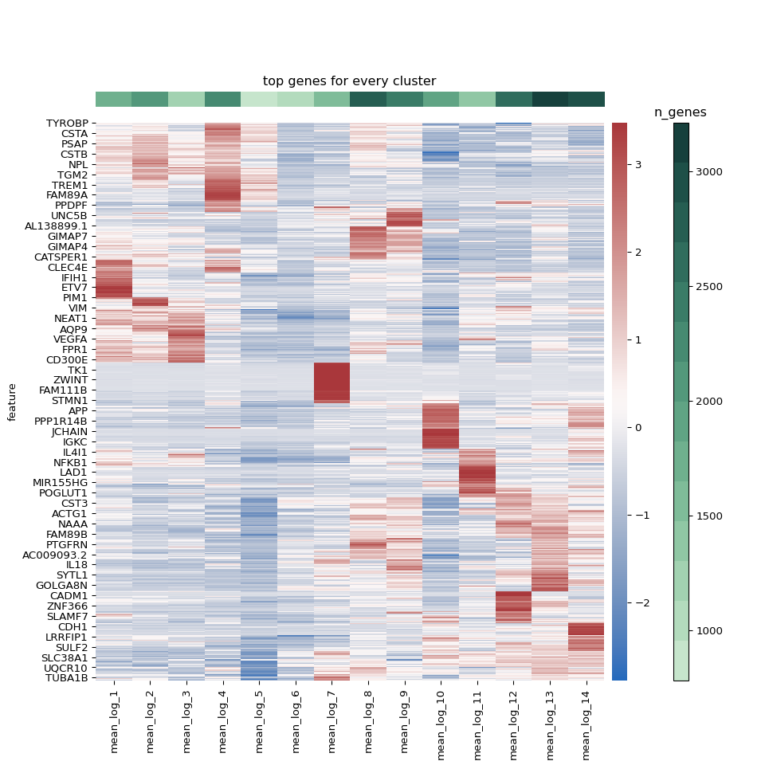

To make things more readable, we also made a heatmap where we kept the columns clustered such that phenotypically similar clusters were grouped together, but manually ordered the rows.

``` python
n_heatmap_genes = {}
heatmap_genes = []
for key in col_order :
    cnt = 0
    for gene in top_genes[key] :
        if gene not in heatmap_genes :
            heatmap_genes.append(gene)
            cnt+=1
    n_heatmap_genes[key] = cnt

n_heatmap_genes = pd.DataFrame(n_heatmap_genes, index = ["n_genes"]).rename(columns = dict(zip(n_heatmap_genes.keys(),
                                                                                               ["cluster_{clust}".format(clust = clust) for
                                                                                                clust in n_heatmap_genes.keys()])))
# Add number of genes in the heatmap for each clusters
annot_genes = annot_genes.append(n_heatmap_genes)
annot_genes = annot_genes.reset_index()
annot_genes = annot_genes.fillna('')


# Get the mean expression of the top genes from each cluster
de_df = {"mean_log_{clust}".format(clust = clust) : mnp_harmonized.varm["de_res"]["mean_logExpr:{clust}".format(clust = clust)] for clust in sorted(set(mnp_harmonized.obs["new_clusters"]), key = int)}
de_df = pd.DataFrame(de_df, index = mnp_harmonized.var.index)

heatmap_df = de_df.loc[heatmap_genes]

# Get the mean gene counts for sidebar
gene_val_list = []
gene_val_dict = {}
for clust in sorted(set(mnp_harmonized.obs["new_clusters"]), key = int) :
    gene_vals = mnp_harmonized.obs["n_genes"][mnp_harmonized.obs["new_clusters"] == clust]

    mean = np.mean(gene_vals)
    gene_val_list.append(mean)
    gene_val_dict[clust] = mean

colors = sns.color_palette("ch:2.5,-.2,dark=.2", n_colors = len(gene_val_list)).as_hex()
# Put the gene values in order lowest to highest
sorted_cols = sorted(gene_val_list)

fig, ax = plt.subplots(1, 1, figsize = (10, 10))
divider = make_axes_locatable(ax)
axDivY = divider.append_axes( 'right', size=0.2, pad= 0.1)
axDivY2 = divider.append_axes( 'right', size=0.2, pad= 0.2)
axDivY3 = divider.append_axes( 'right', size=0.2, pad= 0.2)
axDivY4 = divider.append_axes( 'top', size=0.2, pad= 0.2)

# color_label_list =[random.randint(0,14) for i in range(14)]
ax1 = sns.clustermap(heatmap_df, method = "ward", row_cluster =False, col_cluster =True, z_score = 0, cmap = "vlag")
col_order = np.array([name.split("_")[-1] for name in ax1.data2d.columns])
index = [sorted_cols.index(gene_val_dict[clust]) for clust in col_order]
plt.close()

heatmap_carpet = ax1.data2d

ax1 = sns.heatmap(ax1.data2d, cmap = "vlag", ax = ax, cbar_ax = axDivY)
ax2 = axDivY2.imshow(np.array([[min(gene_val_list), max(gene_val_list)]]), cmap = mpl.colors.ListedColormap(list(colors)),
                     interpolation = "nearest", aspect = "auto")
axDivY2.set_axis_off()
axDivY2.set_visible(False)
_ = plt.colorbar(ax2, cax = axDivY3)
_ = axDivY3.set_title("n_genes")
ax3 = axDivY4.imshow(np.array([index]),cmap=mpl.colors.ListedColormap(list(colors)),
              interpolation="nearest", aspect="auto")
axDivY4.set_axis_off()
_ = plt.title("top genes for every cluster")
plt.show()
```

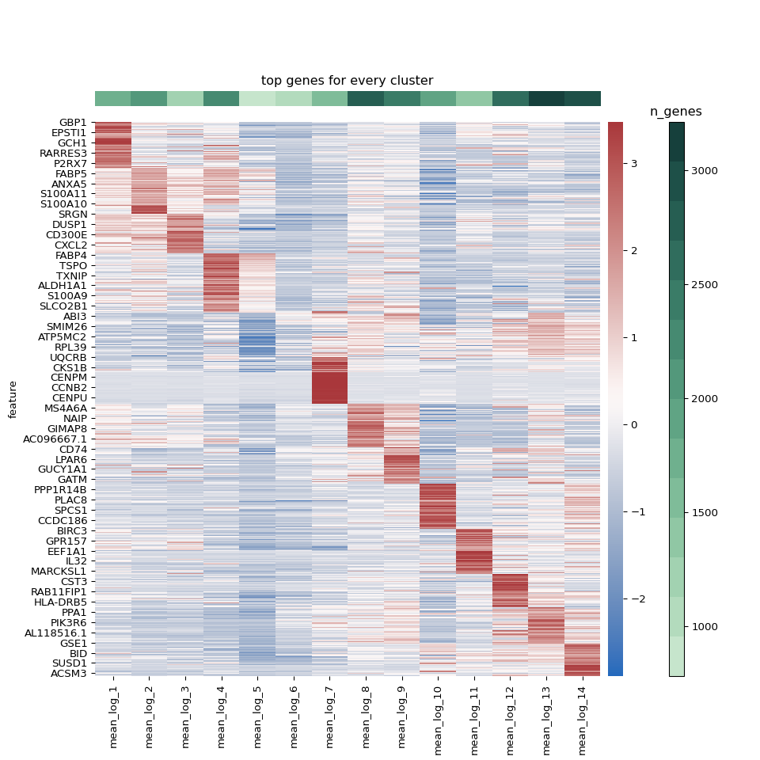

Finally, we wanted to make a publication-ready figure using the wonderful `ComplexHeatmap` package, where we can add some annotations for each cluster and add spaces between clusters to make it even more readable.

``` r
library(ComplexHeatmap)
library(tidyverse)
library(magrittr)
library(circlize)

heatmap_data <- reticulate::py$heatmap_carpet
annotation_info <- reticulate::py$annot_genes
rownames(annotation_info) <- annotation_info$index
annotation_info$index <- NULL


for (c in colnames(annotation_info)){
  annotation_info[[c]] <- unlist(annotation_info[[c]])
}
# Change the column names to be cleaner
colnames(heatmap_data) <- paste("Cluster", unlist(strsplit(colnames(heatmap_data), "_"))[3*(1:length(colnames(heatmap_data)))], sep = " ")

# Make column names consistent with heatmap data
colnames(annotation_info) <- sapply(str_replace(colnames(annotation_info), "_", " "), str_to_title)

# Lets just get the genes
annotation_genes <- unique(as.character(unlist(annotation_info[1:5,])))
annotation_genes <- annotation_genes[annotation_genes != ""]

# Now lets organize the color info that will be used for annotations
col_info = annotation_info %>%
  t() %>%
  as.data.frame() %>%
  dplyr::select(-mean_genes) %>%
  rownames_to_column(var = "cluster") %>%
  reshape2::melt(id.vars = c("cluster", "col")) %>%
  select(-variable)

# Get the gene colors
gene_cols = c()
for (gene in annotation_genes){
  color = as.character(filter(col_info, value == gene)["col"][[1]])
  gene_cols = c(gene_cols, color)
}

# Get the cluster colors
clust_cols <- c()
for (clust in colnames(heatmap_data)){
  color <- col_info %>%
    dplyr::select(cluster, col) %>%
    distinct() %>%
    filter(cluster == clust)
  clust_cols <- c(clust_cols, as.character(color$col))
}

mean_genes <- annotation_info["mean_genes",] %>%
  mutate_each(funs(as.numeric(as.character(.)))) %>%
  select(colnames(heatmap_data)) # To order them like they will be ordered in the heatmap (same as how GEX data was read in)

gene_col_fun <- colorRamp2(c(min(mean_genes), max(mean_genes)), c("#1d111d", "#bbe7c8"))
gene_bar <-  HeatmapAnnotation("mean # genes" = as.numeric(mean_genes), col = list("mean # genes" = gene_col_fun), show_legend = FALSE)
gene_lgd <- Legend(col_fun = gene_col_fun, title = "# genes", legend_height = unit(4, "cm"), title_position = "topcenter")


heatmap_col_fun = colorRamp2(c(min(heatmap_data), 0, max(heatmap_data)), c("purple", "black", "yellow"))
heatmap_lgd = Legend(col_fun = heatmap_col_fun, title = "z-score", legend_height = unit(4, "cm"), title_position = "topcenter")

lgd_list <- packLegend(heatmap_lgd, gene_lgd, column_gap = unit(1,"cm"), direction = "horizontal")

split <- c()
for (clust in colnames(heatmap_data)){
  n_split <- as.numeric(as.character(annotation_info["n_genes", clust]))
  split <- c(split, rep(gsub("Cluster ", "", clust), n_split))
}
split <- factor(split, levels = as.character(unique(split)))

# Make block annotation
left_annotation =   HeatmapAnnotation(blk = anno_block(gp = gpar(fill = clust_cols, col = clust_cols)), which = "row", width = unit(1.5, "mm"))

heatmap_list = Heatmap(heatmap_data, name = "z-score", col = heatmap_col_fun, cluster_rows = FALSE, cluster_columns = TRUE,
                       cluster_row_slices = FALSE, row_km = 1, cluster_column_slices = FALSE,
                       clustering_method_columns = "ward.D2", clustering_distance_columns = "euclidean",
                       column_dend_reorder = FALSE, top_annotation = gene_bar, show_heatmap_legend = FALSE,
                       column_names_gp = gpar(col = clust_cols, fontface = "bold"),
                       split = split, left_annotation = left_annotation, show_column_names = FALSE) +
  rowAnnotation(link = anno_mark(at = match(annotation_genes, rownames(heatmap_data)),labels = annotation_genes,
                                 labels_gp = gpar(col = gene_cols, fontsize = 8, fontface = "bold")))

draw(heatmap_list, heatmap_legend_list =lgd_list, padding = unit(c(0.5, 0.5, 2, 2), "cm"), cluster_rows = FALSE,
     cluster_row_slices = FALSE)
```

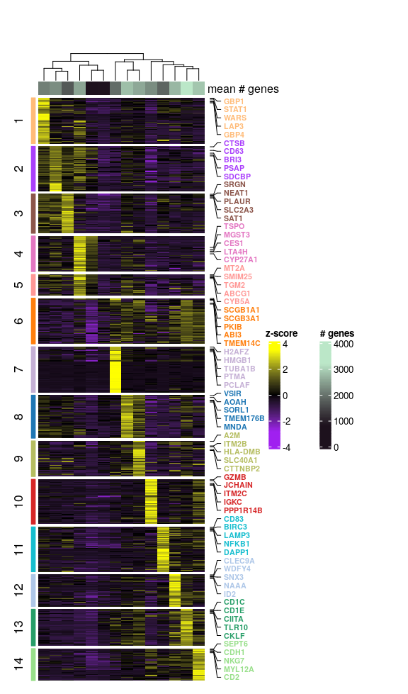

Beyond looking at unbiased markers, we wanted to use legacy knowledge to better understand the biological role of our clusters. Using dot plots, we can see some cannonical genes expressed by the clusters.

``` python
MNP_gene_dict = {
    "monocyte" : ["CD14", "FCGR3A", "S100A8", "C5AR1", "FCN1", "VCAN", "CCR1", "CCR2"],
    "cDC" : ["IRF4", "CD1C", "CD1E", "FCER1A", "CLEC10A", "IRF8", "BATF3", "CLEC9A", "XCR1", "CCR7", "LAMP3",
             "AXL", "PPP1R14A", "TCF4", "GZMB", "JCHAIN", "IL3RA"],
    "macrophage" : ["MARCO", "MSR1", "VSIG4", "C1QA", "C1QB", "C1QC", "PPARG", "CD163"],
    "macrophage_specialization" : ["FABP4", "APOE", "VEGFA", "AREG", "SPP1", "MERTK", "CCL2", "CCL3", "CCL4",
                                   "CXCL9", "CXCL10", "CXCL11"]
}

dot_cmap = clr.LinearSegmentedColormap.from_list('gene_cmap', ["#d3d3d3", "#a5cde3", "#6dafd6", '#08306b'], N=200)

for key in MNP_gene_dict.keys() :
    plot = sc.pl.dotplot(mnp_harmonized, MNP_gene_dict[key], groupby = "new_clusters",
                  categories_order = ["11", "5", "6", "7", "13", "2", "14", "1", "8", "4", "9", "10", "3", "12"],
                         show = False, return_fig = True, title = "{key} markers".format(key = key),
                         cmap = dot_cmap, dot_max = 1)
    axes_dict = plot.get_axes()
    axes_dict["mainplot_ax"].set_axisbelow(True)
    axes_dict["mainplot_ax"].grid()
    plt.show()
    plt.close()
```

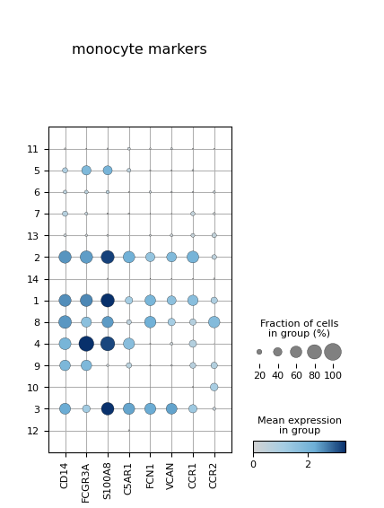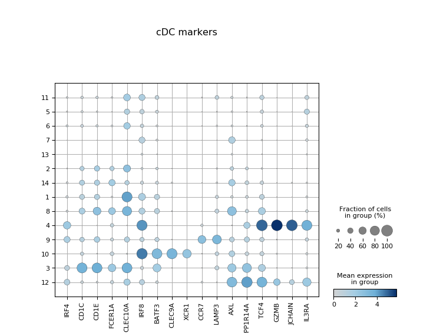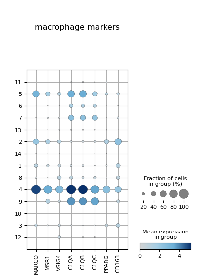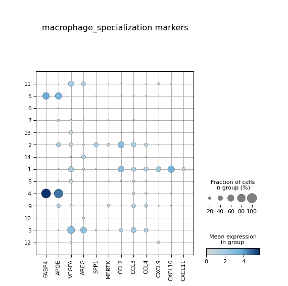

After inspecting all of the top marker genes for each cluster, we assigned the clusters specific annotations, which are shown below.

``` python

annotation_dict = {"1" : "MC1 (CXCL10)",
                   "2" : "MC2 (SPP1)",
                   "3" : "MC3 (AREG)",
                   "4" : "Mac1 (FABP4)",
                   "5" : "quiesMac",
                   "6" : "quiesMC",
                   "7" : "Cycling (PCLAF)",
                   "8" : "MC4 (CCR2)",
                   "9" : "Mac2 (A2M)",
                   "10" : "pDC (TCF4)",
                   "11" : "migDC (CCR7)",
                   "12" : "DC1 (CLEC9A)",
                   "13" : "DC2 (CD1C)",
                   "14" : "AS DC (AXL)"}


color_dict = dict(zip(annotation_dict.values(), mnp_harmonized.uns["new_clusters_colors"]))

mnp_harmonized.obs["annotation"] = [annotation_dict[c] for c in mnp_harmonized.obs["new_clusters"]]
figure = sc.pl.umap(mnp_harmonized, color = ["annotation"],
                    palette = color_dict, return_fig = True, show = False, legend_loc = "on data")
figure.set_size_inches(8, 8)
figure
```

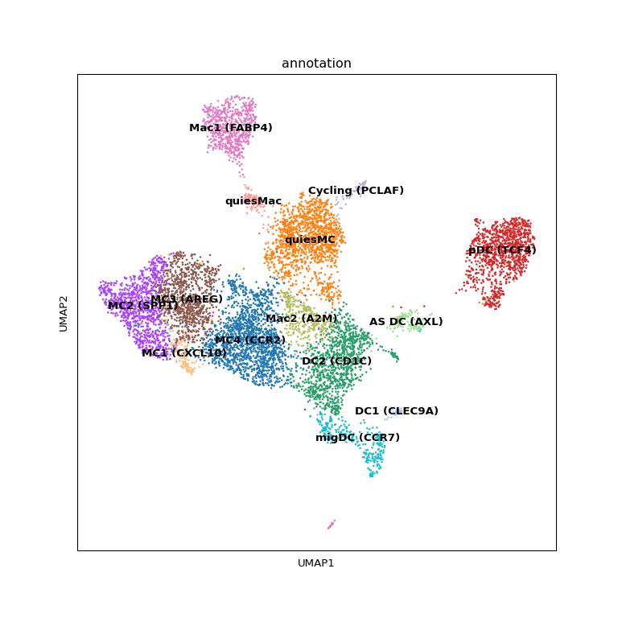

# Differential abundance analysis

We can look for abundance differences between groups and conditions. First, we used stacked bars to assess the amount of the total cells each MNP cluster represented in every sample.

``` python
cell_info = mnp_harmonized.obs
all_cell_info = pg.read_input("/home/nealpsmith/projects/medoff/data/anndata_for_publication/all_data_harmonized.h5ad")
all_cell_info = all_cell_info.obs
```


``` r
cols <- c('MC1 (CXCL10)'= '#ffbb78',
 'MC2 (SPP1)'= '#aa40fc',
 'MC3 (AREG)'= '#8c564b',
 'Mac1 (FABP4)'= '#e377c2',
 'quiesMac'= '#ff9896',
 'quiesMC'= '#ff7f0e',
 'Cycling (PCLAF)'= '#c5b0d5',
 'MC4 (CCR2)'= '#1f77b4',
 'Mac2 (A2M)'= '#b5bd61',
 'pDC (TCF4)'= '#d62728',
 'migDC (CCR7)'= '#17becf',
 'DC1 (CLEC9A)'= '#aec7e8',
 'DC2 (CD1C)'= '#279e68',
 'AS DC (AXL)'= '#98df8a')

all_cell_info <- reticulate::py$all_cell_info
mnp_info <- reticulate::py$cell_info


cells_per_donor <- all_cell_info %>%
  dplyr::select(id, sample, phenotype) %>%
  group_by(id, sample, phenotype) %>%
  summarise(n_total = n())
```

    ## `summarise()` has grouped output by 'id', 'sample'. You can override using the `.groups` argument.

``` r
# Need to fix old nomenclature
cells_per_donor$sample <- as.character(cells_per_donor$sample)
cells_per_donor$sample[cells_per_donor$sample == "Pre"] <- "Bln"
cells_per_donor$phenotype <- as.character(cells_per_donor$phenotype)
cells_per_donor$phenotype[cells_per_donor$phenotype == "ANA"] <- "AC"

mnp_counts <- mnp_info %>%
  dplyr::select(id, sample, annotation, phenotype) %>%
  group_by(id, sample, annotation, phenotype) %>%
  summarise(n_cells = n())
```

    ## `summarise()` has grouped output by 'id', 'sample', 'annotation'. You can override using the `.groups` argument.

``` r
plot_df <- mnp_counts %>%
  dplyr::left_join(cells_per_donor, by = c("id", "sample", "phenotype")) %>%
  mutate(perc_cells = n_cells / n_total * 100)

plot_df <- plot_df[plot_df$sample != "Dil",]
plot_df$sample <- as.character(plot_df$sample)
plot_df$sample[plot_df$sample == "Pre"] <- "Bln"
plot_df$sample <- factor(plot_df$sample, levels = c("Bln", "Ag"))
plot_df$annotation <- factor(plot_df$annotation)

ggplot(plot_df, aes(x = sample, fill = annotation, y = perc_cells)) + geom_bar(stat = "identity") +
  facet_grid(~id) +
  ylab("percent") +
  scale_fill_manual(values = cols) +
  scale_y_continuous(limits = c(0, 60)) +
  theme_classic(base_size = 20)
```

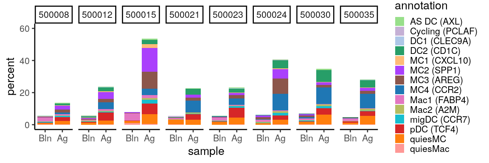

Below, we are looking at the distributions of percents and total number of MNP cells for our disease groups. The percents represent the percent of each MNP cell subcluster as a function of all MNP cells.

``` r
plot_df <- mnp_counts %>%
  group_by(id, sample) %>%
  mutate(total_cells = sum(n_cells)) %>%
  mutate(percent = n_cells / total_cells * 100)


order <- plot_df %>%
  group_by(annotation) %>%
  summarise(n_total = sum(n_cells)) %>%
  arrange(desc(n_total)) %>%
  .$annotation

plot_df$annotation <- factor(plot_df$annotation, levels = order)

plot_df$sample <- as.character(plot_df$sample)
plot_df <- plot_df[plot_df$sample != "Dil",]
plot_df$sample <- factor(plot_df$sample, levels = c("Bln", "Ag"))
plot_df$phenotype <- factor(plot_df$phenotype, levels = c("AC", "AA"))

ggplot(plot_df, aes(x = annotation, y = percent, fill = phenotype)) +
        geom_boxplot() +
        scale_fill_manual(values = c("#40007F", "#FF8000")) +
        scale_y_log10() +
        annotation_logticks(side = "l") +
        facet_wrap(~sample) +
        ylab("Percent of MNP cells") +
        xlab("cluster") +
        theme_classic(base_size = 20) +
        theme(axis.text.x = element_text(angle = 90, vjust = 0.5, hjust=1))
```

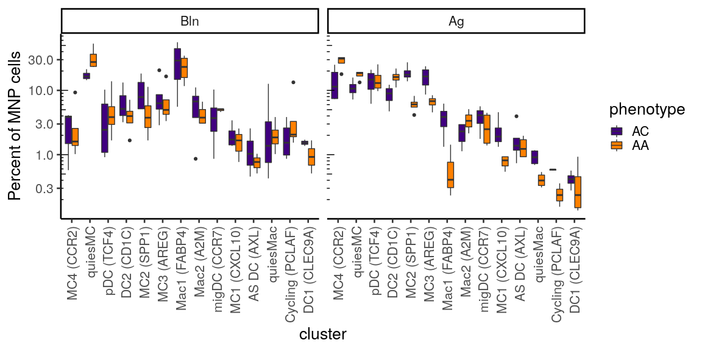

``` r
ggplot(plot_df, aes(x = annotation, y = n_cells, fill = phenotype)) +
        geom_boxplot() +
        scale_fill_manual(values = c("#40007F", "#FF8000")) +
        scale_y_log10() +
        annotation_logticks(side = "l") +
        facet_wrap(~sample) +
        ylab("Number of MNP cells") +
        xlab("cluster") +
        theme_classic(base_size = 20) +
        theme(axis.text.x = element_text(angle = 90, vjust = 0.5, hjust=1))
```

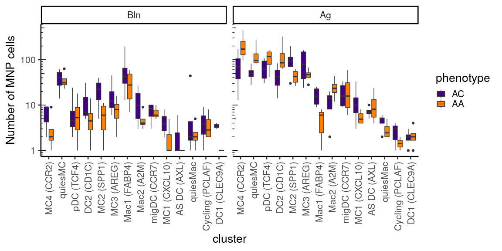

Next we wanted to evaluate which clusters were associated with particular group:condition combinations. First, we can do this in a qualitative way, looking at the UMAP embedding density of the cells that are in our different categorical groups. The takeaway from these plots are that the cells are not uniformly distributed across the categorical groups and there are some biases.

``` python
mnp_harmonized.obs["pheno_tmpt"] = ["_".join([pheno, tmpt]) for pheno, tmpt in zip(mnp_harmonized.obs["phenotype"],
                                                                                   mnp_harmonized.obs["sample"])]
sc.tl.embedding_density(mnp_harmonized, basis = "umap", groupby = "pheno_tmpt", key_added = "pheno_tmpt_dens")
dens_plot = sc.pl.embedding_density(mnp_harmonized, basis = "umap", key = "pheno_tmpt_dens", ncols = 3,
                                    return_fig = True, show = False, wspace = 0.3)
dens_plot.set_size_inches(7, 5)
dens_plot
```

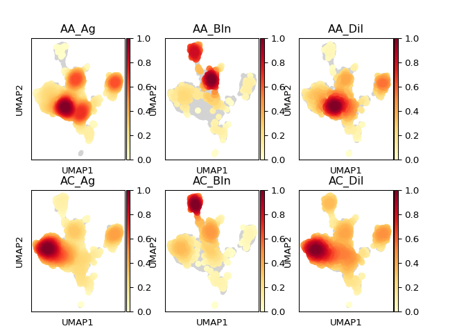

To look at the data in a more quantitative way, we used a mixed-effects association logistic regression model similar to that described by Fonseka et al. We fit a logistic regression modelfor each cell cluster. Each cluster was modelled independently as follows : `cluster ~ 1 + condition:group + condition + group + (1 | id)`

The least-squares means of the factors in the model were calculated and all pairwise contrasts between the means of the groups at each condition (e.g. AA vs AC within baseline, AA vs AC within allergen, etc.) were compared. The OR with confidence interval for each sample/condition combination were plotted.

``` r
library(lme4)
library(ggplot2)
library(emmeans)

# A function to perform the mixed-effects logistic regression modelling, returning, p-values, odds-ratio and confidence intervals
get_abund_info <- function(dataset, cluster, contrast, random_effects = NULL, fixed_effects = NULL){
  # Generate design matrix from cluster assignments
  cluster <- as.character(cluster)
  designmat <- model.matrix(~ cluster + 0, data.frame(cluster = cluster))
  dataset <- cbind(designmat, dataset)
  # Create output list to hold results
  res <- vector(mode = "list", length = length(unique(cluster)))
  names(res) <- attributes(designmat)$dimnames[[2]]

  # Create model formulas
  model_rhs <- paste0(c(paste0(fixed_effects, collapse = " + "),
                        paste0("(1|", random_effects, ")", collapse = " + ")),
                      collapse = " + ")

  # Initialize list to store model objects for each cluster
  cluster_models <- vector(mode = "list",
                           length = length(attributes(designmat)$dimnames[[2]]))
  names(cluster_models) <- attributes(designmat)$dimnames[[2]]

  for (i in seq_along(attributes(designmat)$dimnames[[2]])) {
    test_cluster <- attributes(designmat)$dimnames[[2]][i]

    # Make it a non-intercept model to get odds for each variable
    full_fm <- as.formula(paste0(c(paste0(test_cluster, " ~ 1 + ", contrast, " + "),
                                   model_rhs), collapse = ""))

    full_model <- lme4::glmer(formula = full_fm, data = dataset,
                              family = binomial, nAGQ = 1, verbose = 0,
                              control = glmerControl(optimizer = "bobyqa"))

    pvals <-lsmeans(full_model, pairwise ~ "phenotype | sample")

    p_val_df <- summary(pvals$contrasts)
    p_val_df$cluster <- test_cluster

    ci <- eff_size(pvals, sigma = sigma(full_model), edf = df.residual(full_model))
    ci_df <- summary(ci) %>%
    dplyr::select(sample, asymp.LCL, asymp.UCL)
    ci_df$cluster <- test_cluster

    info_df <- left_join(p_val_df, ci_df, by = c("sample", "cluster"))

    cluster_models[[i]] <- info_df

  }
  return(cluster_models)
}

clust_df <- reticulate::py$cell_info

abund_info <- get_abund_info(clust_df, cluster = clust_df$new_clusters,
                            contrast = "sample:phenotype",
                            random_effects = "id",
                            fixed_effects = c("sample", "phenotype"))

plot_df <- do.call(rbind, abund_info)
plot_df$direction <- ifelse(plot_df$estimate > 0, "AA", "AC")

plot_df$cluster <- as.numeric(gsub("cluster", "", plot_df$cluster))
plot_df$sig <- ifelse(plot_df$p.value < 0.05, plot_df$direction, "non_sig")
plot_df$sample <- factor(plot_df$sample, levels = c("Bln", "Dil", "Ag"))


annotations = c("1" = "MC1 (CXCL10)",
                   "2" = "MC2 (SPP1)",
                   "3" = "MC3 (AREG)",
                   "4" = "Mac1 (FABP4)",
                   "5" = "quiesMac",
                   "6" = "quiesMC",
                   "7" = "Cycling (PCLAF)",
                   "8" = "MC4 (CCR2)",
                   "9" = "Mac2 (A2M)",
                   "10" = "pDC (TCF4)",
                   "11" = "migDC (CCR7)",
                   "12" = "DC1 (CLEC9A)",
                   "13" = "DC2 (CD1C)",
                   "14" = "AS DC (AXL)")

plot_df$annotation <- sapply(plot_df$cluster, function(x) annotations[as.character(x)])
plot_df$annotation <- factor(plot_df$annotation, levels = rev(unlist(annotations, use.names = FALSE)))


ggplot(plot_df[plot_df$sample != "Dil",], aes(x = estimate, y = annotation, color = sig)) +
  geom_point(size = 3) +
  geom_errorbarh(mapping = aes(xmin = asymp.LCL, xmax = asymp.UCL, y = annotation, color = sig),
                 height = 0) +
  geom_vline(xintercept = 0, size = 0.2) +
  scale_color_manual(
      name = "P < 0.05",
      values = c("#FF8000", "#40007F", "grey60"),
      breaks = c("AA", "AC")
    ) +
    scale_x_continuous(
      breaks = log(c(0.125, 0.5, 1, 2, 4)),
      labels = function(x) exp(x)
    ) +
    # scale_y_discrete(labels = levels(plot_df$cluster)) +
  xlab("Odds Ratio") +
  facet_wrap(~sample) +
  theme_classic(base_size = 20)
```

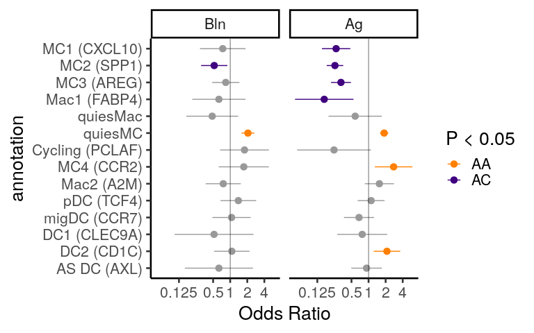
