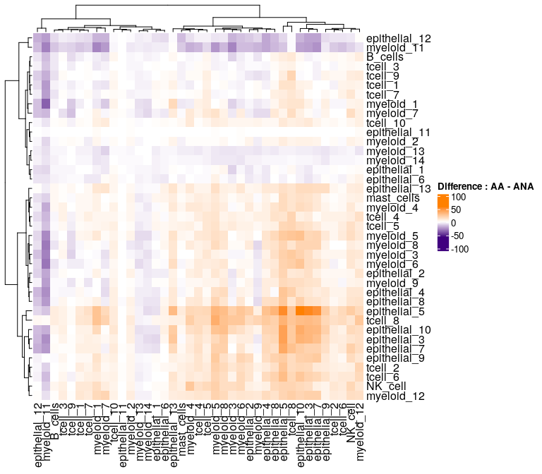
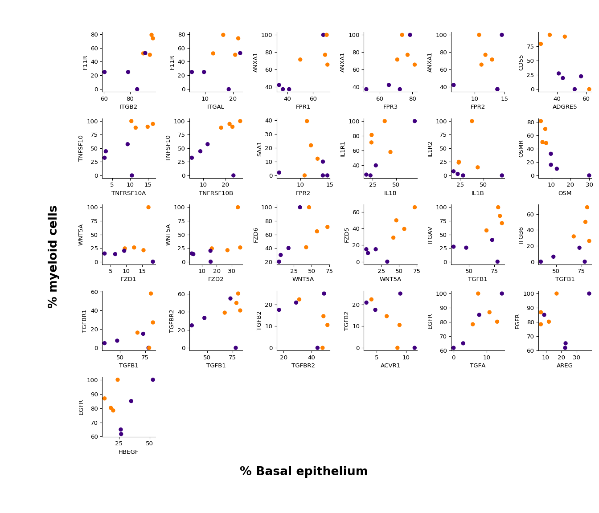

Figure 7 : CellPhoneDB
================

``` r
library(reticulate)
use_python("/home/nealpsmith/.conda/envs/sc_analysis/bin/python")
```

In figure 7, we wanted to look at potential cell:cell interactions. We first did this using `CellPhoneDB`

# CellPhoneDB

When using CellPhonedb, we isolated the AA and AC cells at allergen seperately. Then we ran cellphonedb as follows :

<pre>
<p>
#!/bin/bash
cellphonedb method statistical_analysis meta_data.csv count_mtx.h5ad --output-path aa_ag_high_iter --result-precision 20 --iterations 10000 --threads 16
cellphonedb method statistical_analysis meta_data.csv count_mtx.h5ad --output-path ana_ag_high_iter --result-precision 20 --iterations 10000 --threads 16
</p>
</pre>
With the outputs, we next wanted to aggregate the significant interactions and compare what we see with AA and AC. One drawback of cellphonedb is that it does not have great type-I error control. Therefore, we set additional criteria when determining what interactions to consider significant. The criteria were as follows : -imperical p-value &lt;0.001 -receptor in &gt; 10% of receptor cells -receptor in &gt; 20 cells total -ligand in &gt; 10% of ligand cells -ligand in &gt; 20 total cells

``` r
library(tidyverse)
library(glue)
library(magrittr)

pvals_aa <- read.csv("/home/nealpsmith/projects/medoff/data/cellphonedb/aa/aa_ag/pvalues.txt", sep = "\t")
pvals_ana <- read.csv("/home/nealpsmith/projects/medoff/data/cellphonedb/ana/ana_ag/pvalues.txt", sep = "\t")

means_aa <- read.csv("/home/nealpsmith/projects/medoff/data/cellphonedb/aa/aa_ag/means.txt", sep = "\t")
means_ana <- read.csv("/home/nealpsmith/projects/medoff/data/cellphonedb/ana/ana_ag/means.txt", sep = "\t")

# This has the ranks
sig_means_aa <- read.csv("/home/nealpsmith/projects/medoff/data/cellphonedb/aa/aa_ag/significant_means.txt", sep = "\t")
sig_means_ana <- read.csv("/home/nealpsmith/projects/medoff/data/cellphonedb/ana/ana_ag/significant_means.txt", sep = "\t")

# Need the deconvolution file to get all genes in a complex
deconv_aa <- read.csv("/home/nealpsmith/projects/medoff/data/cellphonedb/aa/aa_ag/deconvoluted.txt", sep = "\t")
deconv_ana <- read.csv("/home/nealpsmith/projects/medoff/data/cellphonedb/ana/ana_ag/deconvoluted.txt", sep = "\t")

# Also want to read in the percent of cells/number of cells expressing every gene
perc_cells_aa <- read.csv("/home/nealpsmith/projects/medoff/data/cellphonedb/perc_of_cells_for_each_gene_AA.csv",
                          row.names = 1)
# Need to fix the T cell names (I'm dumb and inconsistent)
colnames(perc_cells_aa)[grep("t_cell_", colnames(perc_cells_aa))] <- sapply(colnames(perc_cells_aa)[grep("t_cell_", colnames(perc_cells_aa))], function(x) sub("t_", "t", x))

perc_cells_ana <- read.csv("/home/nealpsmith/projects/medoff/data/cellphonedb/perc_of_cells_for_each_gene_ANA.csv",
                          row.names = 1)
colnames(perc_cells_ana)[grep("t_cell_", colnames(perc_cells_ana))] <- sapply(colnames(perc_cells_ana)[grep("t_cell_", colnames(perc_cells_ana))], function(x) sub("t_", "t", x))


n_cells_aa <- read.csv("/home/nealpsmith/projects/medoff/data/cellphonedb/n_cells_for_each_gene_AA.csv", row.names = 1)
colnames(n_cells_aa)[grep("t_cell_", colnames(n_cells_aa))] <- sapply(colnames(n_cells_aa)[grep("t_cell_", colnames(n_cells_aa))], function(x) sub("t_", "t", x))

n_cells_ana <- read.csv("/home/nealpsmith/projects/medoff/data/cellphonedb/n_cells_for_each_gene_ANA.csv", row.names = 1)
colnames(n_cells_ana)[grep("t_cell_", colnames(n_cells_ana))] <- sapply(colnames(n_cells_ana)[grep("t_cell_", colnames(n_cells_ana))], function(x) sub("t_", "t", x))

# Get the columns of interactions
interact_cols <- colnames(pvals_aa)[grepl("\\.", colnames(pvals_aa))]

# Now get all of the unique cellular subsets
cluster_names <- lapply(interact_cols, function(x) strsplit(x, "\\.")[[1]]) %>%
  unlist(use.names = FALSE) %>%
  unique()


perc_cutoff <- 10
ncell_cutoff <- 20

if (! file.exists("/home/nealpsmith/projects/medoff/data/cellphonedb/all_sig_interactions_by_group_strict_cutoff.csv")){
  all_interactions_df <- data.frame("interacting_pair" = character(),
                                  "cluster_pair" = character(),
                                  "aa_perc_a" = numeric(),
                                  "aa_perc_b" = numeric(),
                                  "aa_ncells_a" = numeric(),
                                  "aa_ncells_b" = numeric(),
                                  "aa_rank" = numeric(),
                                  "aa_mean" = numeric(),
                                  "ana_perc_a" = numeric(),
                                  "ana_perc_b" = numeric(),
                                  "ana_ncells_a" = numeric(),
                                  "ana_ncells_b" = numeric(),
                                  "ana_rank" = numeric(),
                                  "ana_mean" = numeric(),
                                  "group" = character())

    for (pair in interact_cols){
    aa_interact <- pvals_aa %>%
      dplyr::select(interacting_pair, pair)
    aa_interact <- aa_interact[aa_interact[[pair]] == 0,]["interacting_pair"]
    if (nrow(aa_interact) > 0){
       aa_interact$cluster_pair <- pair

    # Lets add the other info
    aa_interact$aa_perc_a <- sapply(aa_interact$interacting_pair, function(p){
      exp_cells <- strsplit(pair, ".", fixed = TRUE)[[1]][1]
      gene <- strsplit(p, "_(?!.*_)", perl=TRUE)[[1]][1] # Get the first gene/complex
      if (grepl(" ", gene)){
        # Get the complex members
        genes <- deconv_aa %>%
          dplyr::filter(complex_name == gene) %>%
          .$gene_name
        perc <- max(perc_cells_aa[genes, exp_cells])
        return(perc)
      }  else if (grepl(":", gene)){
        genes <- deconv_aa %>%
          dplyr::filter(complex_name == gene) %>%
          .$gene_name
        perc <- max(perc_cells_aa[genes, exp_cells])
        return(perc)
      } else {
        perc <- perc_cells_aa[gene, exp_cells]
        return(perc)
      }

    })

    aa_interact$aa_perc_b <- sapply(aa_interact$interacting_pair, function(p){
        exp_cells <- strsplit(pair, ".", fixed = TRUE)[[1]][2]
        gene <- strsplit(p, "_(?!.*_)", perl=TRUE)[[1]][2] # Get the second gene/complex
        if (grepl(" ", gene)){
          # Get the complex members
          genes <- deconv_aa %>%
            dplyr::filter(complex_name == gene) %>%
            .$gene_name %>%
            unique()
          perc <- max(perc_cells_aa[genes, exp_cells])
          return(perc)
        }  else if (grepl(":", gene)){
          genes <- deconv_aa %>%
            dplyr::filter(complex_name == gene) %>%
            .$gene_name
          perc <- max(perc_cells_aa[genes, exp_cells])
          return(perc)
        } else {
          perc <- perc_cells_aa[gene, exp_cells]
          return(perc)
        }

      })

     aa_interact$aa_ncells_a <- sapply(aa_interact$interacting_pair, function(p){
      exp_cells <- strsplit(pair, ".", fixed = TRUE)[[1]][1]
      gene <- strsplit(p, "_(?!.*_)", perl=TRUE)[[1]][1] # Get the first gene/complex
      if (grepl(" ", gene)){
        # Get the complex members
        genes <- deconv_aa %>%
          dplyr::filter(complex_name == gene) %>%
          .$gene_name
        perc <- max(n_cells_aa[genes, exp_cells])
        return(perc)
      }  else if (grepl(":", gene)){
        genes <- deconv_aa %>%
          dplyr::filter(complex_name == gene) %>%
          .$gene_name
        perc <- max(n_cells_aa[genes, exp_cells])
        return(perc)
      } else {
        perc <- n_cells_aa[gene, exp_cells]
        return(perc)
      }

    })

    aa_interact$aa_ncells_b <- sapply(aa_interact$interacting_pair, function(p){
      exp_cells <- strsplit(pair, ".", fixed = TRUE)[[1]][2]
      gene <- strsplit(p, "_(?!.*_)", perl=TRUE)[[1]][2] # Get the second gene/complex
      if (grepl(" ", gene)){
        # Get the complex members
        genes <- deconv_aa %>%
          dplyr::filter(complex_name == gene) %>%
          .$gene_name %>%
          unique()
        perc <- max(n_cells_aa[genes, exp_cells])
        return(perc)
      }  else if (grepl(":", gene)){
        genes <- deconv_aa %>%
          dplyr::filter(complex_name == gene) %>%
          .$gene_name
        perc <- max(n_cells_aa[genes, exp_cells])
        return(perc)
      } else {
        perc <- n_cells_aa[gene, exp_cells]
        return(perc)
      }

    })

    # Now want to add the means/rank
    aa_means <- sig_means_aa %>%
      dplyr::select(interacting_pair, rank, pair) %>%
      dplyr::filter(interacting_pair %in% aa_interact$interacting_pair) %>%
     `colnames<-`(c("interacting_pair", "aa_rank", "aa_mean"))
    aa_interact %<>%
      left_join(aa_means, by = "interacting_pair") %>%
      dplyr::filter(aa_perc_a > perc_cutoff, aa_perc_b > perc_cutoff, aa_ncells_a > ncell_cutoff, aa_ncells_b > ncell_cutoff)

    } else {
      aa_interact <- data.frame("interacting_pair" = character(),
                                    "cluster_pair" = character(),
                                    "aa_perc_a" = numeric(),
                                    "aa_perc_b" = numeric(),
                                    "aa_ncells_a" = numeric(),
                                    "aa_ncells_b" = numeric(),
                                    "aa_rank" = numeric(),
                                    "aa_mean" = numeric())
    }

    # Now the ANA info
    ana_interact <- pvals_ana %>%
      dplyr::select(interacting_pair, pair)
    ana_interact <- ana_interact[ana_interact[[pair]] == 0,]["interacting_pair"]

    if(nrow(ana_interact) > 0){
      ana_interact$cluster_pair <- pair

    # Lets add the other info
    ana_interact$ana_perc_a <- sapply(ana_interact$interacting_pair, function(p){
      exp_cells <- strsplit(pair, ".", fixed = TRUE)[[1]][1]
      gene <- strsplit(p, "_(?!.*_)", perl=TRUE)[[1]][1] # Get the first gene/complex
      if (grepl(" ", gene)){
        # Get the complex members
        genes <- deconv_ana %>%
          dplyr::filter(complex_name == gene) %>%
          .$gene_name
        perc <- max(perc_cells_ana[genes, exp_cells])
        return(perc)
      }  else if (grepl(":", gene)){
        genes <- deconv_ana %>%
          dplyr::filter(complex_name == gene) %>%
          .$gene_name
        perc <- max(perc_cells_ana[genes, exp_cells])
        return(perc)
      } else {
        perc <- perc_cells_ana[gene, exp_cells]
        return(perc)
      }

    })

    ana_interact$ana_perc_b <- sapply(ana_interact$interacting_pair, function(p){
        exp_cells <- strsplit(pair, ".", fixed = TRUE)[[1]][2]
        gene <- strsplit(p, "_(?!.*_)", perl=TRUE)[[1]][2] # Get the second gene/complex
        if (grepl(" ", gene)){
          # Get the complex members
          genes <- deconv_ana %>%
            dplyr::filter(complex_name == gene) %>%
            .$gene_name %>%
            unique()
          perc <- max(perc_cells_ana[genes, exp_cells])
          return(perc)
        }  else if (grepl(":", gene)){
          genes <- deconv_ana %>%
            dplyr::filter(complex_name == gene) %>%
            .$gene_name
          perc <- max(perc_cells_ana[genes, exp_cells])
          return(perc)
        } else {
          perc <- perc_cells_ana[gene, exp_cells]
          return(perc)
        }

      })

     ana_interact$ana_ncells_a <- sapply(ana_interact$interacting_pair, function(p){
      exp_cells <- strsplit(pair, ".", fixed = TRUE)[[1]][1]
      gene <- strsplit(p, "_(?!.*_)", perl=TRUE)[[1]][1] # Get the first gene/complex
      if (grepl(" ", gene)){
        # Get the complex members
        genes <- deconv_ana %>%
          dplyr::filter(complex_name == gene) %>%
          .$gene_name
        perc <- max(n_cells_ana[genes, exp_cells])
        return(perc)
      }  else if (grepl(":", gene)){
        genes <- deconv_ana %>%
          dplyr::filter(complex_name == gene) %>%
          .$gene_name
        perc <- max(n_cells_ana[genes, exp_cells])
        return(perc)
      } else {
        perc <- n_cells_ana[gene, exp_cells]
        return(perc)
      }

    })

    ana_interact$ana_ncells_b <- sapply(ana_interact$interacting_pair, function(p){
      exp_cells <- strsplit(pair, ".", fixed = TRUE)[[1]][2]
      gene <- strsplit(p, "_(?!.*_)", perl=TRUE)[[1]][2] # Get the second gene/complex
      if (grepl(" ", gene)){
        # Get the complex members
        genes <- deconv_ana %>%
          dplyr::filter(complex_name == gene) %>%
          .$gene_name %>%
          unique()
        perc <- max(n_cells_ana[genes, exp_cells])
        return(perc)
      }  else if (grepl(":", gene)){
        genes <- deconv_ana %>%
          dplyr::filter(complex_name == gene) %>%
          .$gene_name
        perc <- max(n_cells_ana[genes, exp_cells])
        return(perc)
      } else {
        perc <- n_cells_ana[gene, exp_cells]
        return(perc)
      }

    })

    # Now want to add the means/rank
    ana_means <- sig_means_ana %>%
      dplyr::select(interacting_pair, rank, pair) %>%
      dplyr::filter(interacting_pair %in% ana_interact$interacting_pair) %>%
     `colnames<-`(c("interacting_pair", "ana_rank", "ana_mean"))
    ana_interact %<>%
      left_join(ana_means, by = "interacting_pair") %>%
      dplyr::filter(ana_perc_a > perc_cutoff, ana_perc_b > perc_cutoff, ana_ncells_a > ncell_cutoff, ana_ncells_b > ncell_cutoff)

    } else {
       ana_interact <- data.frame("interacting_pair" = character(),
                                    "cluster_pair" = character(),
                                    "ana_perc_a" = numeric(),
                                    "ana_perc_b" = numeric(),
                                    "ana_ncells_a" = numeric(),
                                    "ana_ncells_b" = numeric(),
                                    "ana_rank" = numeric(),
                                    "ana_mean" = numeric())
    }

    all_interactions <- aa_interact %>%
        dplyr::full_join(ana_interact, by = c("interacting_pair", "cluster_pair")) %>%
        mutate(group = ifelse(!is.na(aa_rank) & !is.na(ana_rank), "both",
                            ifelse(!is.na(aa_rank), "AA", "ANA")))
    # add it to the big df
    all_interactions_df <- rbind(all_interactions_df, all_interactions)

  }

  write.csv(all_interactions_df, "/home/nealpsmith/projects/medoff/data/cellphonedb/all_sig_interactions_by_group_strict_cutoff.csv")

} else {
  all_interactions_df <- read.csv("/home/nealpsmith/projects/medoff/data/cellphonedb/all_sig_interactions_by_group_strict_cutoff.csv", row.names = 1)
}
```

Next, we wanted to make a heatmap comparing the number of interactions that meet our criteria

``` r
library(ComplexHeatmap)
library(circlize)

inter_count_df <- all_interactions_df %>%
  group_by(cluster_pair, group) %>%
  summarise(n_interactions = n())

heatmap_df <- data.frame(matrix(nrow = length(cluster_names),
                                ncol = length(cluster_names)),
                         row.names = cluster_names) %>%
  `colnames<-`(cluster_names)

for (cl1 in rownames(heatmap_df)){
  for (cl2 in colnames(heatmap_df)){
    pair_info <- inter_count_df %>%
      dplyr::filter(cluster_pair == glue("{cl1}.{cl2}"), group != "both")
    if (nrow(pair_info) == 0){
      heatmap_df[cl1, cl2] <- 0
    } else if (!"AA" %in% pair_info$group){
      heatmap_df[cl1, cl2] <- -pair_info$n_interactions
    } else if (!"ANA" %in% pair_info$group){
      heatmap_df[cl1, cl2] <- pair_info$n_interactions
    } else {
      diff <- pair_info$n_interactions[pair_info$group == "AA"] - pair_info$n_interactions[pair_info$group == "ANA"]
      heatmap_df[cl1, cl2] <- diff
    }
  }
}

# Remove rows with all 0s
heatmap_df <- heatmap_df[rowSums(heatmap_df) != 0,]
heatmap_df <- heatmap_df[,colSums(heatmap_df) != 0]

color_fun <-colorRamp2(c(-max(heatmap_df), 0, max(heatmap_df)), c("#40007F", "white",  "#FF8000"))
clustering <- hclust(dist(heatmap_df), method = "ward.D2")

hmap <- Heatmap(heatmap_df, col = color_fun, name = "Difference : AA - ANA", cluster_rows = clustering,
                cluster_columns = clustering)
draw(hmap)
```



Next, we wanted to focus in on some interactions of biological interest. We curated a list specific to Th2 interactions. Given Th2 cells are predominantly found in the AA subjects, we displayed the significant ones for the AA only in a dot plot. A large point means it meets our statistical criteria listed at the top. The rank is a value produced by CellPhoneDB and represents how specific an interaction is to given clusters. The more cluster pairs an interaction is found to be significant, the lower the rank. We took the -log10(rank) such that darker points represent interactions that were found in less cluster pairs.

``` r
th2_interact_info <- read.csv("/home/nealpsmith/projects/medoff/data/cellphonedb/th2_interactions_for_dotplot_v3.csv")
t_cell_clusts <- c("tcell_8")
other_clusts <- c("myeloid_1", "myeloid_3", "myeloid_5", "myeloid_6", "myeloid_8", "myeloid_11", "myeloid_12",
                  "epithelial_1", "epithelial_3", "epithelial_4", "epithelial_5", "epithelial_7")


# Lets get the Th2:clust first
th2_first_interactions <- th2_interact_info$interaction[grep("tcell_+", th2_interact_info$pair)]


pval_df <- data.frame()

for (cl1 in t_cell_clusts){
  for(cl2 in other_clusts){
    spec_pvals_aa <- pvals_aa %>%
    dplyr::select(interacting_pair, glue("{cl1}.{cl2}")) %>%
    dplyr::filter(interacting_pair %in% th2_first_interactions) %>%
    `colnames<-`(c("interacting_pair", "p_val")) %>%
    mutate(clust_pair = glue("{cl1}.{cl2}"))

    spec_means_aa <- means_aa %>%
      dplyr::select(interacting_pair, glue("{cl1}.{cl2}")) %>%
      dplyr::filter(interacting_pair %in% th2_first_interactions) %>%
      `colnames<-`(c("interacting_pair", "mean")) %>%
      mutate(clust_pair = glue("{cl1}.{cl2}"))

    # Get the ranks as well
    spec_ranks_aa <- sig_means_aa %>%
      dplyr::select(interacting_pair, rank) %>%
      dplyr::filter(interacting_pair %in% th2_first_interactions) %>%
      `colnames<-`(c("interacting_pair", "rank")) %>%
      mutate(clust_pair = glue("{cl1}.{cl2}"))

    all_info_aa <- list(spec_pvals_aa, spec_means_aa, spec_ranks_aa) %>%
      reduce(left_join, by = c("interacting_pair", "clust_pair")) %>%
      mutate(pheno = "AA")

    spec_pvals_ana <- pvals_ana %>%
    dplyr::select(interacting_pair, glue("{cl1}.{cl2}")) %>%
    dplyr::filter(interacting_pair %in% th2_first_interactions) %>%
    `colnames<-`(c("interacting_pair", "p_val")) %>%
    mutate(clust_pair = glue("{cl1}.{cl2}"))

    spec_means_ana <- means_ana %>%
      dplyr::select(interacting_pair, glue("{cl1}.{cl2}")) %>%
      dplyr::filter(interacting_pair %in% th2_first_interactions) %>%
      `colnames<-`(c("interacting_pair", "mean")) %>%
      mutate(clust_pair = glue("{cl1}.{cl2}"))

    spec_ranks_ana <- sig_means_ana %>%
      dplyr::select(interacting_pair, rank) %>%
      dplyr::filter(interacting_pair %in% th2_first_interactions) %>%
      `colnames<-`(c("interacting_pair", "rank")) %>%
      mutate(clust_pair = glue("{cl1}.{cl2}"))

    all_info_ana <-list(spec_pvals_ana, spec_means_aa, spec_ranks_ana) %>%
      reduce(left_join, by = c("interacting_pair", "clust_pair")) %>%
      mutate(pheno = "ANA")

    all_info <- rbind(all_info_aa, all_info_ana)

    pval_df <- rbind(pval_df, all_info)

  }
}

### Okay now lets get the myl:th2 interactions
th2_second_interactions <- th2_interact_info$interaction[grep("_tcell", th2_interact_info$pair)]

for (cl1 in t_cell_clusts){
  for(cl2 in other_clusts){
    spec_pvals_aa <- pvals_aa %>%
    dplyr::select(interacting_pair, glue("{cl2}.{cl1}")) %>%
    dplyr::filter(interacting_pair %in% th2_second_interactions) %>%
    `colnames<-`(c("interacting_pair", "p_val")) %>%
    mutate(clust_pair = glue("{cl2}.{cl1}"))

    spec_means_aa <- means_aa %>%
      dplyr::select(interacting_pair, glue("{cl2}.{cl1}")) %>%
      dplyr::filter(interacting_pair %in% th2_second_interactions) %>%
      `colnames<-`(c("interacting_pair", "mean")) %>%
      mutate(clust_pair = glue("{cl2}.{cl1}"))

    spec_ranks_aa <- sig_means_aa %>%
      dplyr::select(interacting_pair, rank) %>%
      dplyr::filter(interacting_pair %in% th2_second_interactions) %>%
      `colnames<-`(c("interacting_pair", "rank")) %>%
      mutate(clust_pair = glue("{cl2}.{cl1}"))

    all_info_aa <- list(spec_pvals_aa, spec_means_aa, spec_ranks_aa) %>%
      reduce(left_join, by = c("interacting_pair", "clust_pair")) %>%
      mutate(pheno = "AA")

    spec_pvals_ana <- pvals_ana %>%
    dplyr::select(interacting_pair, glue("{cl2}.{cl1}")) %>%
    dplyr::filter(interacting_pair %in% th2_second_interactions) %>%
    `colnames<-`(c("interacting_pair", "p_val")) %>%
    mutate(clust_pair = glue("{cl2}.{cl1}"))

    spec_means_ana <- means_ana %>%
      dplyr::select(interacting_pair, glue("{cl2}.{cl1}")) %>%
      dplyr::filter(interacting_pair %in% th2_second_interactions) %>%
      `colnames<-`(c("interacting_pair", "mean")) %>%
      mutate(clust_pair = glue("{cl2}.{cl1}"))

    spec_ranks_ana <- sig_means_ana %>%
      dplyr::select(interacting_pair, rank) %>%
      dplyr::filter(interacting_pair %in% th2_second_interactions) %>%
      `colnames<-`(c("interacting_pair", "rank")) %>%
      mutate(clust_pair = glue("{cl2}.{cl1}"))

    all_info_ana <-list(spec_pvals_ana, spec_means_aa, spec_ranks_ana) %>%
      reduce(left_join, by = c("interacting_pair", "clust_pair")) %>%
      mutate(pheno = "ANA")

    all_info <- rbind(all_info_aa, all_info_ana)

    pval_df <- rbind(pval_df, all_info)

  }
}

# Now need to go through the rows and adjust those that we are not considering significant because of additional filters
# (see lines 53-54 for those cutoffs)
# cl_pair <- "tcell_8.myeloid_1"
# inter_pair <- "ICAM2_aLb2 complex"

pval_df$p_val <- apply(pval_df,1, function(df){
  cl_pair <- df[["clust_pair"]]
  inter_pair <- df[["interacting_pair"]]
  info <- all_interactions_df %>%
  dplyr::filter(interacting_pair == inter_pair, cluster_pair == cl_pair)
  if (nrow(info) > 0) {
    if (info$group == "both"){
      pval <- df[["p_val"]]
    } else if (info$group == "AA" & df[["pheno"]] == "AA"){
      pval <- df[["p_val"]]
    } else if (info$group == "AA" & df[["pheno"]] == "ANA"){
      pval <- 1
    } else if (info$group == "ANA" & df[["pheno"]] == "ANA"){
      pval <- df[["p_val"]]
    } else if (info$group == "ANA" & df[["pheno"]] == "AA"){
      pval <- 1
    }
  } else {
    pval <- 1
  }
  return(as.numeric(pval))
})

pval_df$neglogp <- -log10(pval_df$p_val + 0.0001)
pval_df$neglogrank <- -log10(pval_df$rank)


# Lets add the group info
pval_df %<>%
  left_join(dplyr::select(th2_interact_info, interaction, group), by = c("interacting_pair" = "interaction"))

# Okay now the dumb stuff...fix the pairs so they match
pval_df$interacting_pair[grep("[myeloid|epithelial]_[0-9]+.tcell", pval_df$clust_pair)] <-
  sapply(pval_df$interacting_pair[grep("[myeloid|epithelial]_[0-9]+.tcell", pval_df$clust_pair, perl = TRUE)], function(x){
    genes <- strsplit(x, "_")[[1]]
    new_pair <- paste(genes[2], genes[1], sep = "_")
  })

pval_df$clust_pair[grep("[myeloid|epithelial]_[0-9]+.tcell", pval_df$clust_pair)] <-
  sapply(pval_df$clust_pair[grep("[myeloid|epithelial]_[0-9]+.tcell", pval_df$clust_pair)], function(x){
    clusts <- strsplit(x, ".", fixed = TRUE)[[1]]
    new_pair <- paste(clusts[2], clusts[1], sep = ".")
  })

row_order <- c("TNF_TNFRSF1A", "TNFSF14_LTBR", "LTA_LTBR", "CXCR6_CXCL16", "IL13_IL13 receptor", "IL4_IL13 receptor", "IL4_IL4 receptor",
               "CSF1_CSF1R", "CCR4_CCL17", "TGFBR3_TGFB1", "CTLA4_CD86", "CD28_CD86", "ICAM2_aLb2 complex",
               "ICOS_ICOSLG", "PDCD1_CD274", "CCR2_CCL2", "CCR4_CCL22", "CD226_PVR", "TIGIT_PVR", "aEb7 complex_CDH1",
               "IL33 receptor_IL33", "LIF_LIFR")

pval_df$interacting_pair <- factor(pval_df$interacting_pair, levels = rev(row_order))
# Want to just do AA for now
plot_df_aa <- pval_df[pval_df$pheno == "AA",]

# Want to order the columns in a specific way
col_order <- c("tcell_8.epithelial_3", "tcell_8.epithelial_5", "tcell_8.epithelial_7","tcell_8.epithelial_1",
               "tcell_8.epithelial_4", "tcell_8.myeloid_11", "tcell_8.myeloid_6", "tcell_8.myeloid_5", "tcell_8.myeloid_1",
               "tcell_8.myeloid_3", "tcell_8.myeloid_8", "tcell_8.myeloid_12")
plot_df_aa$clust_pair <- factor(plot_df_aa$clust_pair, levels = col_order)
# plot_df_aa$interacting_pair <- factor(plot_df_aa$interacting_pair, levels = levels)
ggplot(plot_df_aa, aes(x = clust_pair, y = interacting_pair, size = neglogp, color = neglogrank)) +
  geom_point() +
  scale_size_continuous(name = "-log10(p-value)") +
  scale_color_continuous(low = "#d3d3d3", high = "#FF8000", limits = c(0, 2.2), name = "-log10(rank)") +
  theme_classic(base_size = 20) +
  theme(axis.text.x = element_text(angle = 90, vjust = 0.5, hjust=1))
```


We can also visualize it where the color represents the mean of the receptor:ligand pair (calculated by cellphonedb)

``` r
ggplot(plot_df_aa, aes(x = clust_pair, y = interacting_pair, size = neglogp, color = mean)) +
  geom_point() +
  scale_size_continuous(name = "-log10(p-value)") +
  scale_color_continuous(low = "#d3d3d3", high = "#FF8000", limits = c(0, max(pval_df$mean))) +
  theme_classic(base_size = 20) +
  theme(axis.text.x = element_text(angle = 90, vjust = 0.5, hjust=1))
```


Next, we wanted to look at some interactions between basal and myeloid cells. Our prior analyses point at a strong role for basal cells to be playing in the pathology of allergic asthma. Here, we curated a list of interactions that we think could be biologically important.

``` r
epi_myl_interact_info <- read.csv("/home/nealpsmith/projects/medoff/data/cellphonedb/basal_myl_interactions_for_dotplot_v4.csv")
epithelial_clusts <- c("epithelial_5")
myeloid_clusts <- c("myeloid_1", "myeloid_3", "myeloid_5", "myeloid_6", "myeloid_8", "myeloid_11", "myeloid_12")


epi_first_interactions <- epi_myl_interact_info$interaction[grep("epithelial_+", epi_myl_interact_info$pair)]


pval_df <- data.frame()

for (cl1 in epithelial_clusts){
  for(cl2 in myeloid_clusts){
    spec_pvals_aa <- pvals_aa %>%
    dplyr::select(interacting_pair, glue("{cl1}.{cl2}")) %>%
    dplyr::filter(interacting_pair %in% epi_first_interactions) %>%
    `colnames<-`(c("interacting_pair", "p_val")) %>%
    mutate(clust_pair = glue("{cl1}.{cl2}"))

    spec_means_aa <- means_aa %>%
      dplyr::select(interacting_pair, glue("{cl1}.{cl2}")) %>%
      dplyr::filter(interacting_pair %in% epi_first_interactions) %>%
      `colnames<-`(c("interacting_pair", "mean")) %>%
      mutate(clust_pair = glue("{cl1}.{cl2}"))

    # Get the ranks as well
    spec_ranks_aa <- sig_means_aa %>%
      dplyr::select(interacting_pair, rank) %>%
      dplyr::filter(interacting_pair %in% epi_first_interactions) %>%
      `colnames<-`(c("interacting_pair", "rank")) %>%
      mutate(clust_pair = glue("{cl1}.{cl2}"))

    all_info_aa <- list(spec_pvals_aa, spec_means_aa, spec_ranks_aa) %>%
      reduce(left_join, by = c("interacting_pair", "clust_pair")) %>%
      mutate(pheno = "AA")

    spec_pvals_ana <- pvals_ana %>%
    dplyr::select(interacting_pair, glue("{cl1}.{cl2}")) %>%
    dplyr::filter(interacting_pair %in% epi_first_interactions) %>%
    `colnames<-`(c("interacting_pair", "p_val")) %>%
    mutate(clust_pair = glue("{cl1}.{cl2}"))

    spec_means_ana <- means_ana %>%
      dplyr::select(interacting_pair, glue("{cl1}.{cl2}")) %>%
      dplyr::filter(interacting_pair %in% epi_first_interactions) %>%
      `colnames<-`(c("interacting_pair", "mean")) %>%
      mutate(clust_pair = glue("{cl1}.{cl2}"))

    spec_ranks_ana <- sig_means_ana %>%
      dplyr::select(interacting_pair, rank) %>%
      dplyr::filter(interacting_pair %in% epi_first_interactions) %>%
      `colnames<-`(c("interacting_pair", "rank")) %>%
      mutate(clust_pair = glue("{cl1}.{cl2}"))

    all_info_ana <-list(spec_pvals_ana, spec_means_aa, spec_ranks_ana) %>%
      reduce(left_join, by = c("interacting_pair", "clust_pair")) %>%
      mutate(pheno = "ANA")

    all_info <- rbind(all_info_aa, all_info_ana)

    pval_df <- rbind(pval_df, all_info)

  }
}

### Okay now lets get the myl:th2 interactions
epi_second_interactions <- epi_myl_interact_info$interaction[grep("_epithelial", epi_myl_interact_info$pair)]

for (cl1 in epithelial_clusts){
  for(cl2 in myeloid_clusts){
    spec_pvals_aa <- pvals_aa %>%
    dplyr::select(interacting_pair, glue("{cl2}.{cl1}")) %>%
    dplyr::filter(interacting_pair %in% epi_second_interactions) %>%
    `colnames<-`(c("interacting_pair", "p_val")) %>%
    mutate(clust_pair = glue("{cl2}.{cl1}"))

    spec_means_aa <- means_aa %>%
      dplyr::select(interacting_pair, glue("{cl2}.{cl1}")) %>%
      dplyr::filter(interacting_pair %in% epi_second_interactions) %>%
      `colnames<-`(c("interacting_pair", "mean")) %>%
      mutate(clust_pair = glue("{cl2}.{cl1}"))

    spec_ranks_aa <- sig_means_aa %>%
      dplyr::select(interacting_pair, rank) %>%
      dplyr::filter(interacting_pair %in% epi_second_interactions) %>%
      `colnames<-`(c("interacting_pair", "rank")) %>%
      mutate(clust_pair = glue("{cl2}.{cl1}"))

    all_info_aa <- list(spec_pvals_aa, spec_means_aa, spec_ranks_aa) %>%
      reduce(left_join, by = c("interacting_pair", "clust_pair")) %>%
      mutate(pheno = "AA")

    spec_pvals_ana <- pvals_ana %>%
    dplyr::select(interacting_pair, glue("{cl2}.{cl1}")) %>%
    dplyr::filter(interacting_pair %in% epi_second_interactions) %>%
    `colnames<-`(c("interacting_pair", "p_val")) %>%
    mutate(clust_pair = glue("{cl2}.{cl1}"))

    spec_means_ana <- means_ana %>%
      dplyr::select(interacting_pair, glue("{cl2}.{cl1}")) %>%
      dplyr::filter(interacting_pair %in% epi_second_interactions) %>%
      `colnames<-`(c("interacting_pair", "mean")) %>%
      mutate(clust_pair = glue("{cl2}.{cl1}"))

    spec_ranks_ana <- sig_means_ana %>%
      dplyr::select(interacting_pair, rank) %>%
      dplyr::filter(interacting_pair %in% epi_second_interactions) %>%
      `colnames<-`(c("interacting_pair", "rank")) %>%
      mutate(clust_pair = glue("{cl2}.{cl1}"))

    all_info_ana <-list(spec_pvals_ana, spec_means_aa, spec_ranks_ana) %>%
      reduce(left_join, by = c("interacting_pair", "clust_pair")) %>%
      mutate(pheno = "ANA")

    all_info <- rbind(all_info_aa, all_info_ana)

    pval_df <- rbind(pval_df, all_info)

  }
}

pval_df$p_val <- apply(pval_df,1, function(df){
  cl_pair <- df[["clust_pair"]]
  inter_pair <- df[["interacting_pair"]]
  info <- all_interactions_df %>%
  dplyr::filter(interacting_pair == inter_pair, cluster_pair == cl_pair)
  if (nrow(info) > 0) {
    if (info$group == "both"){
      pval <- df[["p_val"]]
    } else if (info$group == "AA" & df[["pheno"]] == "AA"){
      pval <- df[["p_val"]]
    } else if (info$group == "AA" & df[["pheno"]] == "ANA"){
      pval <- 1
    } else if (info$group == "ANA" & df[["pheno"]] == "ANA"){
      pval <- df[["p_val"]]
    } else if (info$group == "ANA" & df[["pheno"]] == "AA"){
      pval <- 1
    }
  } else {
    pval <- 1
  }
  return(as.numeric(pval))
})

pval_df$neglogp <- -log10(pval_df$p_val + 0.0001)
pval_df$neglogrank <- -log10(pval_df$rank)

# Lets add the group info
pval_df %<>%
  left_join(dplyr::select(epi_myl_interact_info, interaction, group), by = c("interacting_pair" = "interaction"))

# Okay now the dumb stuff...fix the pairs so they match
pval_df$interacting_pair[grep("[myeloid]_[0-9]+.epithelial", pval_df$clust_pair)] <-
  sapply(pval_df$interacting_pair[grep("[myeloid]_[0-9]+.epithelial", pval_df$clust_pair, perl = TRUE)], function(x){
    genes <- strsplit(x, "_")[[1]]
    new_pair <- paste(genes[2], genes[1], sep = "_")
  })

pval_df$clust_pair[grep("[myeloid]_[0-9]+.epithelial", pval_df$clust_pair)] <-
  sapply(pval_df$clust_pair[grep("[myeloid]_[0-9]+.epithelial", pval_df$clust_pair)], function(x){
    clusts <- strsplit(x, ".", fixed = TRUE)[[1]]
    new_pair <- paste(clusts[2], clusts[1], sep = ".")
  })

# row_order <- c("F11R_aLb2 complex", "ANXA1_FPR1", "ANXA1_FPR2", "ANXA1_FPR3", "CD55_ADGRE5",
#                "IL1 receptor_IL1B", "IL1 receptor inhibitor_IL1B", "OSMR_OSM",
#                "WNT5A_FZD1", "WNT5A_FZD2", "FZD6_WNT5A", "FZD5_WNT5A",
#                "aVb6 complex_TGFB1", "TGFbeta receptor1_TGFB1","TGFB2_TGFbeta receptor2",
#                "EGFR_TGFA", "EGFR_AREG", "EGFR_HBEGF", "TNFSF10_TNFRSF10A", "TNFSF10_TNFRSF10B",
#                "TNFSF10_TNFRSF10C", "TNFSF10_TNFRSF10D")
row_order <- c("F11R_aLb2 complex", "ANXA1_FPR1", "ANXA1_FPR2", "ANXA1_FPR3", "CD55_ADGRE5",
               "TNFSF10_TNFRSF10A", "TNFSF10_TNFRSF10B", "SAA1_FPR2", "IL1 receptor_IL1B",
               "IL1 receptor inhibitor_IL1B", "OSMR_OSM", "WNT5A_FZD1", "WNT5A_FZD2", "FZD6_WNT5A",
               "FZD5_WNT5A", "aVb6 complex_TGFB1", "TGFbeta receptor1_TGFB1","TGFB2_TGFbeta receptor2",
               "EGFR_TGFA", "EGFR_AREG", "EGFR_HBEGF")


pval_df$interacting_pair <- factor(pval_df$interacting_pair, levels = rev(row_order))
# Want to just do AA for now
plot_df_aa <- pval_df[pval_df$pheno == "AA",]

# Want to order the columns in a specific way
col_order <- c("epithelial_5.myeloid_11", "epithelial_5.myeloid_6", "epithelial_5.myeloid_5",
               "epithelial_5.myeloid_1", "epithelial_5.myeloid_3", "epithelial_5.myeloid_8",
               "epithelial_5.myeloid_12")
pval_df$clust_pair <- factor(pval_df$clust_pair, levels = col_order)
# plot_df_aa$clust_pair <- factor(plot_df_aa$clust_pair, levels = col_order)

# Lets make the plots facetted, and by major cell type
basal_df <- pval_df[grep("epithelial_[35]", pval_df$clust_pair),]

basal_df$group <- factor(basal_df$group, levels = c("Wnt signaling", "TGFb family", "Leukocyte adhesion", "cytokine", "EGFR signaling", "TNFSF10 signaling"))

plot_list <- lapply(c("AA", "ANA"), function(pheno){
  if (pheno == "AA"){
    high_val <- "#FF8000"
  } else {
    high_val <- "#40007F"
  }
# Want to make a faceted one
  facet_plot <- ggplot(basal_df[basal_df$pheno == pheno,], aes(x = clust_pair, y = interacting_pair, size = neglogp, color = neglogrank)) +
    geom_point() +
    scale_size_continuous(name = "-log10(p-value)") +
    scale_color_continuous(low = "#d3d3d3", high = high_val, limits = c(0, 2.5), name = "-log10(rank)") +
    # facet_wrap(~group + pheno, scales = "free_y", ncol = 1) +
    theme_classic(base_size = 20) +
    theme(axis.text.x = element_text(angle = 90, vjust = 0.5, hjust=1))

  # convert ggplot object to grob object
  gp <- ggplotGrob(facet_plot)

  # get gtable columns corresponding to the facets (5 & 9, in this case)
  facet_rows <- gp$layout$t[grepl("panel", gp$layout$name)]

  # get the number of unique x-axis values per facet (1 & 3, in this case)
  y_var <- sapply(ggplot_build(facet_plot)$layout$panel_scales_y,
                  function(l) length(l$range$range))

  # change the relative widths of the facet columns based on
  # how many unique x-axis values are in each facet
  gp$heights[facet_rows] <- gp$heights[facet_rows] * y_var
  return(gp)
})
combined_figure <- ggpubr::ggarrange(plotlist = plot_list, nrow = 1, widths = c(1.7, 1.7))
combined_figure
```


We were also interested in some of these interactions with the goblet cells. Here, we show similar plots, between goblet cells and myeloid cells.

``` r
epi_myl_interact_info <- read.csv("/home/nealpsmith/projects/medoff/data/cellphonedb/goblet_myl_interactions_for_dotplot.csv")
epithelial_clusts <- c("epithelial_4")
myeloid_clusts <- c("myeloid_1", "myeloid_3", "myeloid_5", "myeloid_6", "myeloid_8", "myeloid_11", "myeloid_12")


epi_first_interactions <- epi_myl_interact_info$interaction[grep("epithelial_+", epi_myl_interact_info$pair)]


pval_df <- data.frame()

for (cl1 in epithelial_clusts){
  for(cl2 in myeloid_clusts){
    spec_pvals_aa <- pvals_aa %>%
    dplyr::select(interacting_pair, glue("{cl1}.{cl2}")) %>%
    dplyr::filter(interacting_pair %in% epi_first_interactions) %>%
    `colnames<-`(c("interacting_pair", "p_val")) %>%
    mutate(clust_pair = glue("{cl1}.{cl2}"))

    spec_means_aa <- means_aa %>%
      dplyr::select(interacting_pair, glue("{cl1}.{cl2}")) %>%
      dplyr::filter(interacting_pair %in% epi_first_interactions) %>%
      `colnames<-`(c("interacting_pair", "mean")) %>%
      mutate(clust_pair = glue("{cl1}.{cl2}"))

    # Get the ranks as well
    spec_ranks_aa <- sig_means_aa %>%
      dplyr::select(interacting_pair, rank) %>%
      dplyr::filter(interacting_pair %in% epi_first_interactions) %>%
      `colnames<-`(c("interacting_pair", "rank")) %>%
      mutate(clust_pair = glue("{cl1}.{cl2}"))

    all_info_aa <- list(spec_pvals_aa, spec_means_aa, spec_ranks_aa) %>%
      reduce(left_join, by = c("interacting_pair", "clust_pair")) %>%
      mutate(pheno = "AA")

    spec_pvals_ana <- pvals_ana %>%
    dplyr::select(interacting_pair, glue("{cl1}.{cl2}")) %>%
    dplyr::filter(interacting_pair %in% epi_first_interactions) %>%
    `colnames<-`(c("interacting_pair", "p_val")) %>%
    mutate(clust_pair = glue("{cl1}.{cl2}"))

    spec_means_ana <- means_ana %>%
      dplyr::select(interacting_pair, glue("{cl1}.{cl2}")) %>%
      dplyr::filter(interacting_pair %in% epi_first_interactions) %>%
      `colnames<-`(c("interacting_pair", "mean")) %>%
      mutate(clust_pair = glue("{cl1}.{cl2}"))

    spec_ranks_ana <- sig_means_ana %>%
      dplyr::select(interacting_pair, rank) %>%
      dplyr::filter(interacting_pair %in% epi_first_interactions) %>%
      `colnames<-`(c("interacting_pair", "rank")) %>%
      mutate(clust_pair = glue("{cl1}.{cl2}"))

    all_info_ana <-list(spec_pvals_ana, spec_means_aa, spec_ranks_ana) %>%
      reduce(left_join, by = c("interacting_pair", "clust_pair")) %>%
      mutate(pheno = "ANA")

    all_info <- rbind(all_info_aa, all_info_ana)

    pval_df <- rbind(pval_df, all_info)

  }
}

### Okay now lets get the myl:th2 interactions
epi_second_interactions <- epi_myl_interact_info$interaction[grep("_epithelial", epi_myl_interact_info$pair)]

for (cl1 in epithelial_clusts){
  for(cl2 in myeloid_clusts){
    spec_pvals_aa <- pvals_aa %>%
    dplyr::select(interacting_pair, glue("{cl2}.{cl1}")) %>%
    dplyr::filter(interacting_pair %in% epi_second_interactions) %>%
    `colnames<-`(c("interacting_pair", "p_val")) %>%
    mutate(clust_pair = glue("{cl2}.{cl1}"))

    spec_means_aa <- means_aa %>%
      dplyr::select(interacting_pair, glue("{cl2}.{cl1}")) %>%
      dplyr::filter(interacting_pair %in% epi_second_interactions) %>%
      `colnames<-`(c("interacting_pair", "mean")) %>%
      mutate(clust_pair = glue("{cl2}.{cl1}"))

    spec_ranks_aa <- sig_means_aa %>%
      dplyr::select(interacting_pair, rank) %>%
      dplyr::filter(interacting_pair %in% epi_second_interactions) %>%
      `colnames<-`(c("interacting_pair", "rank")) %>%
      mutate(clust_pair = glue("{cl2}.{cl1}"))

    all_info_aa <- list(spec_pvals_aa, spec_means_aa, spec_ranks_aa) %>%
      reduce(left_join, by = c("interacting_pair", "clust_pair")) %>%
      mutate(pheno = "AA")

    spec_pvals_ana <- pvals_ana %>%
    dplyr::select(interacting_pair, glue("{cl2}.{cl1}")) %>%
    dplyr::filter(interacting_pair %in% epi_second_interactions) %>%
    `colnames<-`(c("interacting_pair", "p_val")) %>%
    mutate(clust_pair = glue("{cl2}.{cl1}"))

    spec_means_ana <- means_ana %>%
      dplyr::select(interacting_pair, glue("{cl2}.{cl1}")) %>%
      dplyr::filter(interacting_pair %in% epi_second_interactions) %>%
      `colnames<-`(c("interacting_pair", "mean")) %>%
      mutate(clust_pair = glue("{cl2}.{cl1}"))

    spec_ranks_ana <- sig_means_ana %>%
      dplyr::select(interacting_pair, rank) %>%
      dplyr::filter(interacting_pair %in% epi_second_interactions) %>%
      `colnames<-`(c("interacting_pair", "rank")) %>%
      mutate(clust_pair = glue("{cl2}.{cl1}"))

    all_info_ana <-list(spec_pvals_ana, spec_means_aa, spec_ranks_ana) %>%
      reduce(left_join, by = c("interacting_pair", "clust_pair")) %>%
      mutate(pheno = "ANA")

    all_info <- rbind(all_info_aa, all_info_ana)

    pval_df <- rbind(pval_df, all_info)

  }
}

pval_df$p_val <- apply(pval_df,1, function(df){
  cl_pair <- df[["clust_pair"]]
  inter_pair <- df[["interacting_pair"]]
  info <- all_interactions_df %>%
  dplyr::filter(interacting_pair == inter_pair, cluster_pair == cl_pair)
  if (nrow(info) > 0) {
    if (info$group == "both"){
      pval <- df[["p_val"]]
    } else if (info$group == "AA" & df[["pheno"]] == "AA"){
      pval <- df[["p_val"]]
    } else if (info$group == "AA" & df[["pheno"]] == "ANA"){
      pval <- 1
    } else if (info$group == "ANA" & df[["pheno"]] == "ANA"){
      pval <- df[["p_val"]]
    } else if (info$group == "ANA" & df[["pheno"]] == "AA"){
      pval <- 1
    }
  } else {
    pval <- 1
  }
  return(as.numeric(pval))
})

pval_df$neglogp <- -log10(pval_df$p_val + 0.0001)
pval_df$neglogrank <- -log10(pval_df$rank)

# Lets add the group info
pval_df %<>%
  left_join(dplyr::select(epi_myl_interact_info, interaction, group), by = c("interacting_pair" = "interaction"))

# Okay now the dumb stuff...fix the pairs so they match
pval_df$interacting_pair[grep("[myeloid]_[0-9]+.epithelial", pval_df$clust_pair)] <-
  sapply(pval_df$interacting_pair[grep("[myeloid]_[0-9]+.epithelial", pval_df$clust_pair, perl = TRUE)], function(x){
    genes <- strsplit(x, "_")[[1]]
    new_pair <- paste(genes[2], genes[1], sep = "_")
  })

pval_df$clust_pair[grep("[myeloid]_[0-9]+.epithelial", pval_df$clust_pair)] <-
  sapply(pval_df$clust_pair[grep("[myeloid]_[0-9]+.epithelial", pval_df$clust_pair)], function(x){
    clusts <- strsplit(x, ".", fixed = TRUE)[[1]]
    new_pair <- paste(clusts[2], clusts[1], sep = ".")
  })

# row_order <- c("F11R_aLb2 complex", "ANXA1_FPR1", "ANXA1_FPR2", "ANXA1_FPR3", "CD55_ADGRE5",
#                "IL1 receptor_IL1B", "IL1 receptor inhibitor_IL1B", "OSMR_OSM",
#                "WNT5A_FZD1", "WNT5A_FZD2", "FZD6_WNT5A", "FZD5_WNT5A",
#                "aVb6 complex_TGFB1", "TGFbeta receptor1_TGFB1","TGFB2_TGFbeta receptor2",
#                "EGFR_TGFA", "EGFR_AREG", "EGFR_HBEGF", "TNFSF10_TNFRSF10A", "TNFSF10_TNFRSF10B",
#                "TNFSF10_TNFRSF10C", "TNFSF10_TNFRSF10D")
row_order <- c("F11R_aLb2 complex", "ANXA1_FPR1", "ANXA1_FPR2", "ANXA1_FPR3", "CD55_ADGRE5",
               "TNFSF10_TNFRSF10A", "TNFSF10_TNFRSF10B", "SAA1_FPR2", "IL1 receptor_IL1B",
               "IL1 receptor inhibitor_IL1B", "OSMR_OSM", "WNT5A_FZD1", "WNT5A_FZD2", "FZD6_WNT5A",
               "FZD5_WNT5A", "aVb6 complex_TGFB1", "TGFbeta receptor1_TGFB1","TGFB2_TGFbeta receptor2",
               "EGFR_TGFA", "EGFR_AREG", "EGFR_HBEGF", "VEGFA_NRP2")


pval_df$interacting_pair <- factor(pval_df$interacting_pair, levels = rev(row_order))
# Want to just do AA for now
plot_df_aa <- pval_df[pval_df$pheno == "AA",]

# Want to order the columns in a specific way
col_order <- c("epithelial_4.myeloid_11", "epithelial_4.myeloid_6", "epithelial_4.myeloid_5",
               "epithelial_4.myeloid_1", "epithelial_4.myeloid_3", "epithelial_4.myeloid_8",
               "epithelial_4.myeloid_12")
pval_df$clust_pair <- factor(pval_df$clust_pair, levels = col_order)
# plot_df_aa$clust_pair <- factor(plot_df_aa$clust_pair, levels = col_order)

# Lets make the plots facetted, and by major cell type
goblet_df <- pval_df[grep("epithelial_[14]", pval_df$clust_pair),]

goblet_df$group <- factor(goblet_df$group, levels = c("Wnt signaling", "TGFb family", "Leukocyte adhesion", "cytokine", "EGFR signaling", "TNFSF10 signaling"))

plot_list <- lapply(c("AA", "ANA"), function(pheno){
  if (pheno == "AA"){
    high_val <- "#FF8000"
  } else {
    high_val <- "#40007F"
  }
# Want to make a faceted one
  facet_plot <- ggplot(goblet_df[goblet_df$pheno == pheno,], aes(x = clust_pair, y = interacting_pair, size = neglogp, color = neglogrank)) +
    geom_point() +
    scale_size_continuous(name = "-log10(p-value)") +
    scale_color_continuous(low = "#d3d3d3", high = high_val, limits = c(0, 2.5), name = "-log10(rank)") +
    # facet_wrap(~group + pheno, scales = "free_y", ncol = 1) +
    theme_classic(base_size = 20) +
    theme(axis.text.x = element_text(angle = 90, vjust = 0.5, hjust=1))

  # convert ggplot object to grob object
  gp <- ggplotGrob(facet_plot)

  # get gtable columns corresponding to the facets (5 & 9, in this case)
  facet_rows <- gp$layout$t[grepl("panel", gp$layout$name)]

  # get the number of unique x-axis values per facet (1 & 3, in this case)
  y_var <- sapply(ggplot_build(facet_plot)$layout$panel_scales_y,
                  function(l) length(l$range$range))

  # change the relative widths of the facet columns based on
  # how many unique x-axis values are in each facet
  gp$heights[facet_rows] <- gp$heights[facet_rows] * y_var
  return(gp)
})
combined_figure <- ggpubr::ggarrange(plotlist = plot_list, nrow = 1, widths = c(1.7, 1.7))

ggsave("/home/nealpsmith/projects/medoff/figures/cellphonedb/strict_cutoff/dot_plots/goblet_myl_interactions_oi_goblet_facet_with_rank.pdf",
       combined_figure, useDingbats = FALSE, width = 16, height = 8)

plot_list <- lapply(c("AA", "ANA"), function(pheno){
  if (pheno == "AA"){
    high_val <- "#FF8000"
  } else {
    high_val <- "#40007F"
  }
# Want to make a faceted one
  facet_plot <- ggplot(goblet_df[goblet_df$pheno == pheno,], aes(x = clust_pair, y = interacting_pair, size = neglogp, color = mean)) +
    geom_point() +
    scale_size_continuous(name = "-log10(p-value)") +
    scale_color_continuous(low = "#d3d3d3", high = high_val, limits = c(0, 4), name = "mean") +
    # facet_wrap(~group + pheno, scales = "free_y", ncol = 1) +
    theme_classic(base_size = 20) +
    theme(axis.text.x = element_text(angle = 90, vjust = 0.5, hjust=1))

  # convert ggplot object to grob object
  gp <- ggplotGrob(facet_plot)

  # get gtable columns corresponding to the facets (5 & 9, in this case)
  facet_rows <- gp$layout$t[grepl("panel", gp$layout$name)]

  # get the number of unique x-axis values per facet (1 & 3, in this case)
  y_var <- sapply(ggplot_build(facet_plot)$layout$panel_scales_y,
                  function(l) length(l$range$range))

  # change the relative widths of the facet columns based on
  # how many unique x-axis values are in each facet
  gp$heights[facet_rows] <- gp$heights[facet_rows] * y_var
  return(gp)
})
combined_figure <- ggpubr::ggarrange(plotlist = plot_list, nrow = 1, widths = c(1.7, 1.7))
combined_figure
```


One important thing to consider when performing CellPhoneDB is that it dosen't look at interactions on a per-donor basis. Therefore, we wanted to look at the expression of the ligands/receptors of interest on a per-donor basis to ensure signatures were not being driven by a single donor. Below are plots that show the % of myeloid cells that express the myeloid genes and % basal cells that express the basal genes. We can see that for the most part, results are consistent across subject groups.

``` python
import matplotlib.pyplot as plt
from collections import Counter
import pandas as pd
import numpy as np
import pegasus as pg
import scanpy as sc
import seaborn as sns

# Load in the myeloid data and T cell data
myeloid_data = pg.read_input("/home/nealpsmith/projects/medoff/data/myeloid_harmonized.h5ad")
t_cell_data = pg.read_input("/home/nealpsmith/projects/medoff/data/t_cell_harmonized.h5ad")
epithelial_data = pg.read_input("/home/nealpsmith/projects/medoff/data/epithelial_harmonized.h5ad")

myeloid_data.obs["comm_clust"] = ["_".join(["myeloid", clust]) for clust in myeloid_data.obs["new_clusters"]]
t_cell_data.obs["comm_clust"] = ["_".join(["tcell", clust]) for clust in t_cell_data.obs["leiden_labels"]]
epithelial_data.obs["comm_clust"] = ["_".join(["epithelial", clust]) for clust in epithelial_data.obs["new_clusters"]]

myl_t_epi_data = myeloid_data.concatenate(t_cell_data, epithelial_data)

pairs_oi = pd.read_csv("/home/nealpsmith/projects/medoff/data/cellphonedb/interactions_for_percent_plots_basal_myl.csv")
all_genes = set(pairs_oi["ligand"])
all_genes.update(set(pairs_oi["receptor"]))
all_genes = list(all_genes)

# Lets filter the anndatas to get just the genes we need
myl_t_epi_data = myl_t_epi_data[:,all_genes]

clust_chan_dict = {}
for clust in set(myl_t_epi_data.obs["comm_clust"]) :
    clust_dict = {}
    for chan in set(myl_t_epi_data.obs["Channel"]) :
        data = myl_t_epi_data[(myl_t_epi_data.obs["comm_clust"] == clust) & (myl_t_epi_data.obs["Channel"] == chan)]
        if len(data) == 0 :
            continue
        mtx = data.X.toarray()
        percs = np.count_nonzero(mtx, axis = 0) / len(data) * 100
        gene_dict = dict(zip(data.var_names, percs))
        clust_dict[chan] = gene_dict
    clust_chan_dict[clust] = clust_dict

# Lets make one for groups of clusters
myl_t_epi_data.obs["lineage"] = [n.split("_")[0] for n in myl_t_epi_data.obs["comm_clust"]]
myl_t_epi_data.obs["lineage"] = ["myeloid_oi" if c in ["myeloid_1", "myeloid_3", "myeloid_5",
                                                       "myeloid_6", "myeloid_8", "myeloid_11", "myeloid_12"]
                                 else l for c, l in zip(myl_t_epi_data.obs["comm_clust"], myl_t_epi_data.obs["lineage"])]

lin_chan_dict = {}
for lin in set(myl_t_epi_data.obs["lineage"]):
    lin_dict = {}
    for chan in set(myl_t_epi_data.obs["Channel"]) :
        data = myl_t_epi_data[(myl_t_epi_data.obs["lineage"] == lin) & (myl_t_epi_data.obs["Channel"] == chan)]
        if len(data) == 0 :
            continue
        mtx = data.X.toarray()
        percs = np.count_nonzero(mtx, axis = 0) / len(data) * 100
        gene_dict = dict(zip(data.var_names, percs))
        lin_dict[chan] = gene_dict
    lin_chan_dict[lin] = lin_dict

pairs = zip(pairs_oi["ligand"], pairs_oi["receptor"])

nrows = int(round(np.sqrt(pairs_oi.shape[0])))
fig, ax = plt.subplots(nrows = nrows, ncols = nrows + 1, figsize = (14, 12))
ax = ax.ravel()
for num, (lig, rec) in enumerate(pairs) :

    lig_df = pd.DataFrame(clust_chan_dict["epithelial_5"]).T[[lig]]
    rec_df = pd.DataFrame(lin_chan_dict["myeloid_oi"]).T[[rec]]

    plot_df = lig_df.merge(rec_df, left_index = True, right_index = True)
    plot_df["pheno"] = [n.split("_")[1] for n in plot_df.index]
    plot_df["tmpt"] = [n.split("_")[2] for n in plot_df.index]
    plot_df["color"] = ["#FF8000" if p == "AA" else "#40007F" for p in plot_df["pheno"]]

    plot_df = plot_df[plot_df["tmpt"] == "Ag"]

    ax[num].scatter(plot_df[rec], plot_df[lig], c = plot_df["color"])
    # ax[num].set_xscale("log")
    # ax[num].set_yscale("log")
    ax[num].set_xlabel(rec)
    ax[num].set_ylabel(lig)
    ax[num].spines['right'].set_visible(False)
    ax[num].spines['top'].set_visible(False)
for noplot in range(num + 1, len(ax)) :
    ax[noplot].axis("off")
fig.tight_layout(rect=[0.12, 0.1, 1, 0.95])
_ = fig.text(0.08, 0.5, '% myeloid cells', va='center', rotation='vertical', size = 20, fontweight = "bold")
_ = fig.text(0.4, 0.08, '% Basal epithelium', va='center', size = 20, fontweight = "bold")
fig
```


