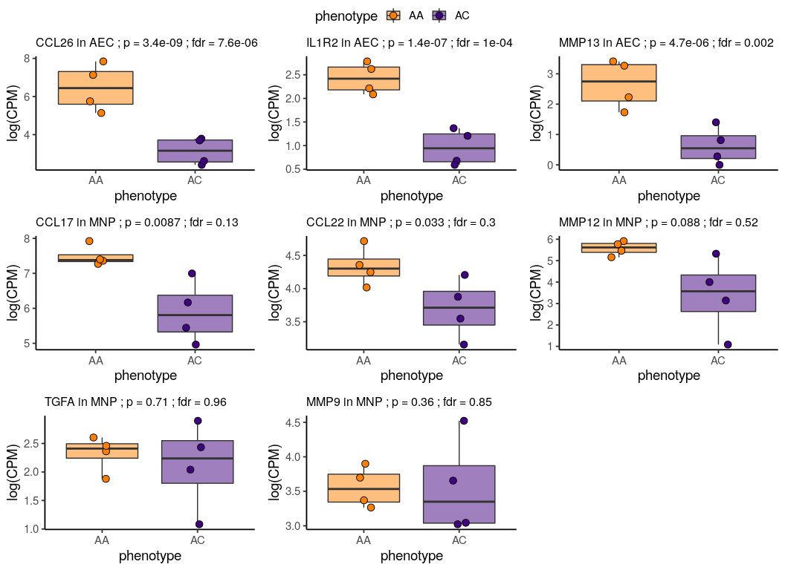
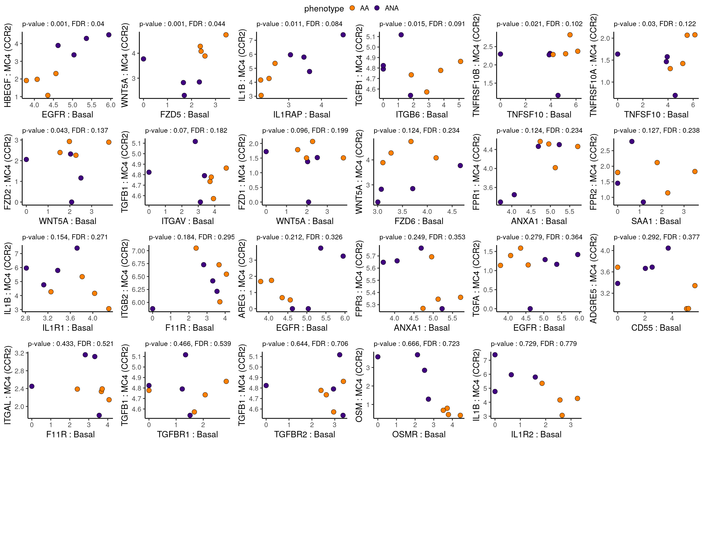

Figure 7 : DEGs
================

In figure 7, we want to look at some DEGs on our global clustering to see what might've matched our luminex results

``` r
# library(tidyverse)
library(dplyr)
library(tibble)
library(ggplot2)
library(glue)
library(ggpubr)
library(magrittr)

# Look at these genes and see if they are DEGs on global clusters between AA and AC at Ag
deg_info <- data.frame()
deg_files <- list.files("/home/nealpsmith/projects/medoff/data/pseudobulk/lineage/pheno_by_samp")
deg_files <- deg_files[grepl("Ag_by_pheno", deg_files)]

for (f in deg_files){
  df <- read.csv(glue("/home/nealpsmith/projects/medoff/data/pseudobulk/lineage/pheno_by_samp/{f}"), row.names = 1)
  clust <- sub("de_cluster_", "", f)
  clust <- sub("_Ag_by_pheno.csv", "", clust)
  df$clust <- clust
  deg_info <- rbind(deg_info, df)
}

# sig_degs <- deg_info %>%
#   dplyr::filter(gene %in% genes_oi, clust %in% c("Epithelial.cells", "MNP")) %>%
#   write.csv("/home/nealpsmith/projects/medoff/data/pseudobulk/lineage/pheno_by_samp/bal_protein_genes.csv")

overall_count_mtx <-read.csv("/home/nealpsmith/projects/medoff/data/pseudobulk_harmonized_data_counts.csv", row.names = 1)
overall_meta_data <- read.csv("/home/nealpsmith/projects/medoff/data/pseudobulk_harmonized_data_meta.csv", row.names = 1)

overall_log_norm <- apply(overall_count_mtx, 2, function(c){
  n_total <- sum(c)
  per_100k <- (c * 1000000) / n_total
  return(per_100k)
}) %>%
  log1p(.)

clust_gene_df = data.frame("clust" = c(rep("Epithelial.cells", 3), rep("MNP", 5)),
                           "gene" = c("CCL26", "IL1R2", "MMP13", "CCL17", "CCL22", "MMP12", "TGFA", "MMP9"))

clust_gene_df %<>%
  dplyr::left_join(deg_info, by = c("clust", "gene"))
plot_list <- list()
for (i in 1:nrow(clust_gene_df)){
  g <- clust_gene_df[i, "gene"]
  clust <- clust_gene_df[i, "clust"]
  new_clust =  sub(".", " ", clust, fixed = TRUE)
  pval <- signif(clust_gene_df[i, "pvalue"], digits = 2)
  fdr <- signif(clust_gene_df[i, "padj"], digits = 2)

  data_keep <- overall_meta_data[overall_meta_data$cluster == new_clust & overall_meta_data$sample == "Ag",]
  keep_cols <- gsub(" ", ".", rownames(data_keep), fixed = TRUE)
  g_exp <- overall_log_norm[g,keep_cols] %>%
    as.data.frame() %>%
    `colnames<-`(c(g)) %>%
    rownames_to_column(var = "samp") %>%
    mutate(samp = sub(".", " ", samp, fixed = TRUE)) %>%
    left_join(overall_meta_data %>% rownames_to_column(var = "samp"), by = "samp")

  g_exp$phenotype[g_exp$phenotype == "ANA"] <- "AC"
  if (clust == "Epithelial.cells"){
    plot_clust <- "AEC"
  } else {
    plot_clust <- clust
  }
  p <- ggplot(g_exp, aes_string(x = "phenotype", y = g, fill = "phenotype")) +
    geom_boxplot(outlier.shape = NA, alpha = 0.5) +
    geom_jitter(pch = 21, size = 3, width = 0.1, height = 0) +
    scale_fill_manual(values = c("#FF8000", "#40007F")) +
    ggtitle(glue("{g} in {plot_clust} ; p = {pval} ; fdr = {fdr}")) +
          ylab("log(CPM)") +
    theme_classic(base_size = 14) +
          theme(plot.title = element_text(size=12))

  plot_list <- c(plot_list, list(p))
}

ggarrange(plotlist = plot_list, common.legend = TRUE, ncol = 3, nrow = 3)
```



Lastly, we wanted to test our Basal cellphonedb interactions of interest with an alternative approach. We wanted to test if the sum of receptor:ligand pairs were associated with AA or AC. To do this, we used `limma`. There were a few that were significant between MC4 and Basal cells, which we show in supplemental figure 6. Below, we are showing all of the MC4:Basal interactions

``` r
library(Matrix)
library(stringr)
library(data.table)
library(magrittr)
library(dplyr)
library(qs)
library(glue)
library(rlang)
library(tidyverse)
# library(Seurat)
library(SeuratDisk)
library(pbapply)
library(ggpubr)

do_log2cpm <- function(A, total = 1e4) {
  A@x <- A@x / rep.int(Matrix::colSums(A), diff(A@p))
  A@x <- total * A@x
  A@x <- log2(A@x + 1)
  return(A)
}

gene_gene_analysis <- function(
  counts, cluster, donor, case,
  source_ens, target_ens,
  min_donors = 3,
  min_cells = 25,
  ensembl_to_symbol = NULL
) {
  stopifnot(is(counts, "dgCMatrix"))
  # stopifnot(!is.null(ensembl_to_symbol))
  stopifnot(length(cluster) == length(donor))
  stopifnot(length(case) == length(donor))
  stopifnot(length(cluster) == ncol(counts))
  stopifnot(length(source_ens) == length(target_ens))
  stopifnot(all(source_ens %in% rownames(counts)))
  stopifnot(all(target_ens %in% rownames(counts)))
  all_ens <- unique(c(source_ens, target_ens))
  message(glue("counts matrix has {nrow(counts)} genes, {ncol(counts)} samples"))
  my_obs <- data.table(cluster = cluster, donor = donor, case = case)
  # Pseudobulk at the cluster level
  ########################################################################
  message("creating pseudobulk log2cpm matrix")
  y <- with(my_obs, model.matrix(~ 0 + factor(cluster):factor(donor)))
  y <- as(y, "dgCMatrix")
  pb <- as(counts %*% y, "dgCMatrix")
  pb <- do_log2cpm(pb, median(Matrix::colSums(pb)))
  colnames(pb) <- str_replace(colnames(pb), "factor\\(cluster\\)", "")
  colnames(pb) <- str_replace(colnames(pb), "factor\\(donor\\)", "")
  pb <- pb[all_ens,]
  my_counts <- counts[all_ens,]
  #
  pb_meta <- str_split_fixed(colnames(pb), ":", 2)
  colnames(pb_meta) <- c("cluster", "donor")
  pb_meta <- as_tibble(pb_meta)
  pb_meta <- left_join(pb_meta, unique(my_obs[,c("donor","case")]), by = "donor")
  pb_meta$case <- factor(pb_meta$case, c("ANA", "AA"))
  stopifnot(nrow(pb_meta) == ncol(pb))
  d <- as.data.table(summary(pb))
  d$cluster <- pb_meta$cluster[d$j]
  d$donor <- pb_meta$donor[d$j]
  d$ens <- rownames(pb)[d$i]
  pb <- as.matrix(pb)
  my_pairs <- data.frame(source_ens = source_ens, target_ens = target_ens)
  message(glue("testing {nrow(my_pairs)} gene pairs"))
  #
  # Test one gene pair at a time
  res <- pblapply(seq(nrow(my_pairs)), function(omni_i) {
    e1 <- my_pairs$source_ens[omni_i]
    e2 <- my_pairs$target_ens[omni_i]
    # g1 <- ensembl_to_symbol[e1]
    # g2 <- ensembl_to_symbol[e2]
    g1 <- e1
    g2 <- e2
    #
    x <- cbind.data.frame(pb_meta, value = pb[e1,])
    y <- cbind.data.frame(pb_meta, value = pb[e2,])
    stopifnot(nrow(x) == nrow(y))
    xx <- data.table::dcast(as.data.table(x), donor ~ cluster, value.var = "value")
    xx_donor <- xx$donor
    xx <- as.matrix(xx[,2:ncol(xx)])
    rownames(xx) <- xx_donor
    yy <- data.table::dcast(as.data.table(y), donor ~ cluster, value.var = "value")
    yy_donor <- yy$donor
    yy <- as.matrix(yy[,2:ncol(yy)])
    rownames(yy) <- yy_donor
    # Remove NAs
    xx[is.na(xx)] <- 0
    yy[is.na(yy)] <- 0
    #
    # Add logCPM of gene1 to logCPM of gene2
    res <- t(do.call(cbind, lapply(1:ncol(xx), function(i) (xx[,i] + yy) / 2)))
    #
    # Dataframe with one row for each pair of cell clusters
    d_res <- expand.grid(c2 = colnames(xx), c1 = colnames(xx))
    d_res$g1 <- g1
    d_res$g2 <- g2
    #
    res_meta <- left_join(
      x = data.frame(donor = colnames(res)),
      y = unique(pb_meta[,c("donor","case")]),
      by = "donor"
    )
    des1 <- with(res_meta, model.matrix(~ case))
    #

    fit1 <- limma::lmFit(object = res, design = des1)
    fit1 <- limma::eBayes(fit1)
    limma_res <- limma::topTable(
      fit     = fit1,
      coef    = "caseAA",
      sort.by = "none",
      number  = nrow(res),
      confint = TRUE
    )
    limma_res <- as.data.table(cbind.data.frame(d_res, limma_res))
    #
    return(list("limma" = limma_res, "product" = res))
  })
  #
  limma_res <- rbindlist(lapply(res, "[[", "limma")) %>% select(-ID)
  # Drop duplicates
  limma_res <- limma_res %>%
    rowwise() %>%
    mutate(c_rank = diff(rank(c(c1, c2)))) %>%
    mutate(
      id = ifelse(c_rank == 1, glue("{c1} {g1} {c2} {g2}"), glue("{c2} {g2} {c1} {g1}"))
    ) %>%
    select(-c_rank) %>%
    ungroup()
  ix_dup <- duplicated(limma_res$id)
  limma_res <- limma_res[!ix_dup,]
  limma_res <- as.data.table(limma_res)
  #
  d_n <- d[, .(donors = sum(x > 0)), by = .(cluster, ens)]
  d_n$cluster <- as.character(d_n$cluster)
  d_n$symbol <- ensembl_to_symbol[d_n$ens]
  d_n$symbol <- d_n$ens

  #
  res2 <- d_n[limma_res, on = c("symbol" = "g1", "cluster" = "c1")]
  res3 <- d_n[res2, on = c("cluster" = "c2", "symbol" = "g2")]
  colnames(res3) <- c(
    "c1", "e1", "donors1", "g1", "c2", "e2", "donors2", "g2", "logFC",
    "CI.L", "CI.R", "AveExpr", "t", "P.Value", "adj.P.Val", "B", "id"
  )
  limma_res <- res3
  rm(res2)
  rm(res3)
  #
  limma_res %<>% arrange(P.Value)
  limma_res <- limma_res[donors1 >= min_donors & donors2 >= min_donors,]
  # Get statistics for each cluster, regardless of donors.
  d2 <- as.data.table(summary(my_counts))
  d2$ens <- rownames(my_counts)[d2$i]
  d2$cluster <- my_obs$cluster[d2$j]
  y <- my_obs %>% group_by(cluster) %>% count() %>% as.data.table
  d2 <- y[d2, on = c("cluster")]
  d2 <- d2[
    ,
    .(
      percent = sum(x > 0) / n[1]
    ),
    by = .(cluster, ens)
  ]
  limma_res <- left_join(
    x = limma_res,
    y = d2 %>% select(c1 = cluster, e1 = ens, p1 = percent),
    by = c("c1", "e1")
  )
  limma_res <- left_join(
    x = limma_res,
    y = d2 %>% select(c2 = cluster, e2 = ens, p2 = percent),
    by = c("c2", "e2")
  )
  limma_res %<>%
    group_by(c1, c2) %>%
    mutate(fdr = p.adjust(P.Value, method = "fdr")) %>%
    ungroup()
  return(list(
    pb = pb,
    pb_meta = pb_meta,
    limma = limma_res
  ))
}


# Need to add annotations
annotations <- c("tcell_7" = "CD8 T (GZMK)",
                 "tcell_3" = "quiesCD8 T ",
                 "tcell_1" = "CD8 T (CLIC3)",
                 "tcell_5" = "Tgd (TRDC)",
                 "tcell_9" = "CD8 T (EGR2)",
                 "tcell_6" = "CD4 Treg (FOXP3)",
                 "tcell_8" = "CD4 Th2 (GATA3)",
                 "tcell_10" = "CD4 ThIFNR (ISG15)",
                 "tcell_2" = "CD4 T (CD40LG)",
                 "tcell_4" = "CD4 Th17 (RORA)",
                 "myeloid_11" = "MC1 (CXCL10)",
                 "myeloid_5" = "MC2 (SPP1)",
                 "myeloid_6" = "MC3 (AREG)",
                 "myeloid_7" = "Mac (FABP4)",
                 "myeloid_13" = "quiesMac",
                 "myeloid_2" = "quiesMC",
                 "myeloid_14" = "Cycling (PCLAF)",
                 "myeloid_1" = "MC4 (CCR2)",
                 "myeloid_8" = "DC3 (A2M)",
                 "myeloid_4" = "pDC (TCF4)",
                 "myeloid_9" = "migDC (CCR7)",
                 "myeloid_10" = "DC1 (CLEC9A)",
                 "myeloid_3" = "DC2 (CD1C)",
                 "myeloid_12" = "AS DC (AXL)",
                 "epithelial_11" = "Early ciliated",
                 "epithelial_2" = "Ciliated",
                 "epithelial_8" = "Mucous-ciliated",
                 "epithelial_9" = "Hillock",
                 "epithelial_12" = "Deuterosomal",
                 "epithelial_10" = "Cycling basal",
                 "epithelial_5" = "Basal",
                 "epithelial_3" = "Suprabasal",
                 "epithelial_6" = "quiesBasal",
                 "epithelial_13" = "Ionocyte",
                 "epithelial_4" = "Goblet-2",
                 "epithelial_1" = "Goblet-1",
                 "epithelial_7" = "Club",
                 "epithelial_14" = "Serous",
                 "NK_cell" = "NK cell",
                 "B_cells" = "B cells",
                 "mast_cells" = "mast cells")

all_path <- "/home/nealpsmith/projects/medoff/data/ag_data_for_gene_gene_analysis"
# Convert(glue("{all_path}.h5ad"), des = "h5seurat")
all_data = LoadH5Seurat(glue("{all_path}.h5seurat"))

my_genes <- rownames(all_data@assays$RNA@counts)
all_interactions_df <- read.csv("/home/nealpsmith/projects/medoff/data/cellphonedb/all_sig_interactions_by_group_strict_cutoff.csv", row.names = 1)

pvals_aa <- read.csv("/home/nealpsmith/projects/medoff/data/cellphonedb/aa/aa_ag/pvalues.txt", sep = "\t")
pvals_ana <- read.csv("/home/nealpsmith/projects/medoff/data/cellphonedb/ana/ana_ag/pvalues.txt", sep = "\t")

means_aa <- read.csv("/home/nealpsmith/projects/medoff/data/cellphonedb/aa/aa_ag/means.txt", sep = "\t")
means_ana <- read.csv("/home/nealpsmith/projects/medoff/data/cellphonedb/ana/ana_ag/means.txt", sep = "\t")

# This has the ranks
sig_means_aa <- read.csv("/home/nealpsmith/projects/medoff/data/cellphonedb/aa/aa_ag/significant_means.txt", sep = "\t")
sig_means_ana <- read.csv("/home/nealpsmith/projects/medoff/data/cellphonedb/ana/ana_ag/significant_means.txt", sep = "\t")

# Need the deconvolution file to get all genes in a complex
deconv_aa <- read.csv("/home/nealpsmith/projects/medoff/data/cellphonedb/aa/aa_ag/deconvoluted.txt", sep = "\t")
deconv_ana <- read.csv("/home/nealpsmith/projects/medoff/data/cellphonedb/ana/ana_ag/deconvoluted.txt", sep = "\t")


epi_myl_interact_info <- read.csv("/home/nealpsmith/projects/medoff/data/cellphonedb/basal_myl_interactions_for_dotplot_v4.csv")
epithelial_clusts <- c("epithelial_5")
myeloid_clusts <- c("myeloid_1", "myeloid_3", "myeloid_5", "myeloid_6", "myeloid_8", "myeloid_11", "myeloid_12")


epi_first_interactions <- epi_myl_interact_info$interaction[grep("epithelial_+", epi_myl_interact_info$pair)]


pval_df <- data.frame()

for (cl1 in epithelial_clusts){
  for(cl2 in myeloid_clusts){
    spec_pvals_aa <- pvals_aa %>%
    dplyr::select(interacting_pair, glue("{cl1}.{cl2}")) %>%
    dplyr::filter(interacting_pair %in% epi_first_interactions) %>%
    `colnames<-`(c("interacting_pair", "p_val")) %>%
    mutate(clust_pair = glue("{cl1}.{cl2}"))

    spec_means_aa <- means_aa %>%
      dplyr::select(interacting_pair, glue("{cl1}.{cl2}")) %>%
      dplyr::filter(interacting_pair %in% epi_first_interactions) %>%
      `colnames<-`(c("interacting_pair", "mean")) %>%
      mutate(clust_pair = glue("{cl1}.{cl2}"))

    # Get the ranks as well
    spec_ranks_aa <- sig_means_aa %>%
      dplyr::select(interacting_pair, rank) %>%
      dplyr::filter(interacting_pair %in% epi_first_interactions) %>%
      `colnames<-`(c("interacting_pair", "rank")) %>%
      mutate(clust_pair = glue("{cl1}.{cl2}"))

    all_info_aa <- list(spec_pvals_aa, spec_means_aa, spec_ranks_aa) %>%
      reduce(left_join, by = c("interacting_pair", "clust_pair")) %>%
      mutate(pheno = "AA")

    spec_pvals_ana <- pvals_ana %>%
    dplyr::select(interacting_pair, glue("{cl1}.{cl2}")) %>%
    dplyr::filter(interacting_pair %in% epi_first_interactions) %>%
    `colnames<-`(c("interacting_pair", "p_val")) %>%
    mutate(clust_pair = glue("{cl1}.{cl2}"))

    spec_means_ana <- means_ana %>%
      dplyr::select(interacting_pair, glue("{cl1}.{cl2}")) %>%
      dplyr::filter(interacting_pair %in% epi_first_interactions) %>%
      `colnames<-`(c("interacting_pair", "mean")) %>%
      mutate(clust_pair = glue("{cl1}.{cl2}"))

    spec_ranks_ana <- sig_means_ana %>%
      dplyr::select(interacting_pair, rank) %>%
      dplyr::filter(interacting_pair %in% epi_first_interactions) %>%
      `colnames<-`(c("interacting_pair", "rank")) %>%
      mutate(clust_pair = glue("{cl1}.{cl2}"))

    all_info_ana <-list(spec_pvals_ana, spec_means_aa, spec_ranks_ana) %>%
      reduce(left_join, by = c("interacting_pair", "clust_pair")) %>%
      mutate(pheno = "ANA")

    all_info <- rbind(all_info_aa, all_info_ana)

    pval_df <- rbind(pval_df, all_info)

  }
}

### Okay now lets get the myl:th2 interactions
epi_second_interactions <- epi_myl_interact_info$interaction[grep("_epithelial", epi_myl_interact_info$pair)]

for (cl1 in epithelial_clusts){
  for(cl2 in myeloid_clusts){
    spec_pvals_aa <- pvals_aa %>%
    dplyr::select(interacting_pair, glue("{cl2}.{cl1}")) %>%
    dplyr::filter(interacting_pair %in% epi_second_interactions) %>%
    `colnames<-`(c("interacting_pair", "p_val")) %>%
    mutate(clust_pair = glue("{cl2}.{cl1}"))

    spec_means_aa <- means_aa %>%
      dplyr::select(interacting_pair, glue("{cl2}.{cl1}")) %>%
      dplyr::filter(interacting_pair %in% epi_second_interactions) %>%
      `colnames<-`(c("interacting_pair", "mean")) %>%
      mutate(clust_pair = glue("{cl2}.{cl1}"))

    spec_ranks_aa <- sig_means_aa %>%
      dplyr::select(interacting_pair, rank) %>%
      dplyr::filter(interacting_pair %in% epi_second_interactions) %>%
      `colnames<-`(c("interacting_pair", "rank")) %>%
      mutate(clust_pair = glue("{cl2}.{cl1}"))

    all_info_aa <- list(spec_pvals_aa, spec_means_aa, spec_ranks_aa) %>%
      reduce(left_join, by = c("interacting_pair", "clust_pair")) %>%
      mutate(pheno = "AA")

    spec_pvals_ana <- pvals_ana %>%
    dplyr::select(interacting_pair, glue("{cl2}.{cl1}")) %>%
    dplyr::filter(interacting_pair %in% epi_second_interactions) %>%
    `colnames<-`(c("interacting_pair", "p_val")) %>%
    mutate(clust_pair = glue("{cl2}.{cl1}"))

    spec_means_ana <- means_ana %>%
      dplyr::select(interacting_pair, glue("{cl2}.{cl1}")) %>%
      dplyr::filter(interacting_pair %in% epi_second_interactions) %>%
      `colnames<-`(c("interacting_pair", "mean")) %>%
      mutate(clust_pair = glue("{cl2}.{cl1}"))

    spec_ranks_ana <- sig_means_ana %>%
      dplyr::select(interacting_pair, rank) %>%
      dplyr::filter(interacting_pair %in% epi_second_interactions) %>%
      `colnames<-`(c("interacting_pair", "rank")) %>%
      mutate(clust_pair = glue("{cl2}.{cl1}"))

    all_info_ana <-list(spec_pvals_ana, spec_means_aa, spec_ranks_ana) %>%
      reduce(left_join, by = c("interacting_pair", "clust_pair")) %>%
      mutate(pheno = "ANA")

    all_info <- rbind(all_info_aa, all_info_ana)

    pval_df <- rbind(pval_df, all_info)

  }
}

pval_df$p_val <- apply(pval_df,1, function(df){
  cl_pair <- df[["clust_pair"]]
  inter_pair <- df[["interacting_pair"]]
  info <- all_interactions_df %>%
  dplyr::filter(interacting_pair == inter_pair, cluster_pair == cl_pair)
  if (nrow(info) > 0) {
    if (info$group == "both"){
      pval <- df[["p_val"]]
    } else if (info$group == "AA" & df[["pheno"]] == "AA"){
      pval <- df[["p_val"]]
    } else if (info$group == "AA" & df[["pheno"]] == "ANA"){
      pval <- 1
    } else if (info$group == "ANA" & df[["pheno"]] == "ANA"){
      pval <- df[["p_val"]]
    } else if (info$group == "ANA" & df[["pheno"]] == "AA"){
      pval <- 1
    }
  } else {
    pval <- 1
  }
  return(as.numeric(pval))
})

pval_df$neglogp <- -log10(pval_df$p_val + 0.0001)
pval_df$neglogrank <- -log10(pval_df$rank)

# Lets add the group info
pval_df %<>%
  left_join(dplyr::select(epi_myl_interact_info, interaction, group), by = c("interacting_pair" = "interaction"))

# Okay now the dumb stuff...fix the pairs so they match
pval_df$interacting_pair[grep("[myeloid]_[0-9]+.epithelial", pval_df$clust_pair)] <-
  sapply(pval_df$interacting_pair[grep("[myeloid]_[0-9]+.epithelial", pval_df$clust_pair, perl = TRUE)], function(x){
    genes <- strsplit(x, "_")[[1]]
    new_pair <- paste(genes[2], genes[1], sep = "_")
  })

pval_df$clust_pair[grep("[myeloid]_[0-9]+.epithelial", pval_df$clust_pair)] <-
  sapply(pval_df$clust_pair[grep("[myeloid]_[0-9]+.epithelial", pval_df$clust_pair)], function(x){
    clusts <- strsplit(x, ".", fixed = TRUE)[[1]]
    new_pair <- paste(clusts[2], clusts[1], sep = ".")
  })

pairs_to_test_basal <- pval_df %>%
  dplyr::filter(p_val == 0) %>%
  dplyr::select(interacting_pair, clust_pair)


# Need to fix the complexes so we get the single genes
new_pairs_to_test_basal <- data.frame()

for (r in 1:nrow(pairs_to_test_basal)) {
  info <- pairs_to_test_basal[r,]
  info$target_genesymbol <- strsplit(info$interacting_pair, "_")[[1]][1]
  info$source_genesymbol <- strsplit(info$interacting_pair, "_")[[1]][2]

  if(grepl(" ", info$target_genesymbol)){
    comp_genes <- deconv_aa %>%
      dplyr::filter(complex_name == info$target_genesymbol) %>%
      .$gene_name %>%
      unique()
    new_pairs <- paste(comp_genes, info$source_genesymbol, sep = "_")
    new_info <- data.frame(interacting_pair = rep(info$interacting_pair, length(comp_genes)),
                           clust_pair = rep(info$clust_pair, length(comp_genes)),
                           target_genesymbol = comp_genes,
                           source_genesymbol = info$source_genesymbol)
    new_pairs_to_test_basal <- rbind(new_pairs_to_test_basal, new_info)
  } else if (grepl(" ", info$source_genesymbol)){
    comp_genes <- deconv_aa %>%
      dplyr::filter(complex_name == info$source_genesymbol) %>%
      .$gene_name %>%
      unique()
    # new_pairs <- paste(comp_genes, info$target_genesymbol, sep = "_")
    new_info <- data.frame(interacting_pair = rep(info$interacting_pair, length(comp_genes)),
                           clust_pair = rep(info$clust_pair, length(comp_genes)),
                           target_genesymbol = rep(info$target_genesymbol, length(comp_genes)),
                           source_genesymbol = comp_genes)
    new_pairs_to_test_basal <- rbind(new_pairs_to_test_basal, new_info)
  } else {
    new_pairs_to_test_basal <- rbind(new_pairs_to_test_basal, info)
  }
}

# Okay limit to unique pairs (the complexes make some of these not unique)
unique_basal_gene_pairs <- new_pairs_to_test_basal %>%
  dplyr::select(target_genesymbol, source_genesymbol) %>%
  distinct()

gg1 <- gene_gene_analysis(
    counts            = all_data@assays$RNA@counts,
    cluster           = all_data@meta.data$subcluster,
    donor             = all_data@meta.data$id,
    case              = all_data@meta.data$phenotype,
    source_ens        = unique_basal_gene_pairs$source_genesymbol, # Ensembl gene ids
    target_ens        = unique_basal_gene_pairs$target_genesymbol, # Ensembl gene ids
    min_donors        = 3,
    min_cells         = 25,
    ensembl_to_symbol = NULL # Named character vector that maps from Ensembl ID to symbol
  )
res_basal <- gg1$limma


# Now lets limit to the gene pairs/cluster pairs we want
gene_clust_pairs <- paste(new_pairs_to_test_basal$clust_pair, new_pairs_to_test_basal$target_genesymbol, new_pairs_to_test_basal$source_genesymbol, sep = "_")

res_basal$g_cl_pair <- paste(paste(res_basal$c1, res_basal$c2, sep = "."), res_basal$g1, res_basal$g2, sep = "_")

cellphonedb_gg_res_basal <- res_basal %>%
  dplyr::filter(g_cl_pair %in% gene_clust_pairs) %>%
  dplyr::select(c1, c2, g1, g2, logFC, P.Value)

cellphonedb_gg_res_basal$adj_p_val <- p.adjust(cellphonedb_gg_res_basal$P.Value, method = "fdr")

# Add the annotations
cellphonedb_gg_res_basal$annot_1 <- sapply(cellphonedb_gg_res_basal$c1, function(c) annotations[[c]])
cellphonedb_gg_res_basal$annot_2 <- sapply(cellphonedb_gg_res_basal$c2, function(c) annotations[[c]])
cellphonedb_gg_res_basal %<>%
  dplyr::select(g1, g2, annot_1, annot_2, c1, c2, logFC, P.Value, adj_p_val)

#### Lets make scatter plots for all of these ####
pheno_info <- all_data@meta.data %>%
  dplyr::select(id, phenotype) %>%
  distinct()

# Organize them by pairs of clusters
myl_clusts <- unique(cellphonedb_gg_res_basal$annot_2)

# Lets visualize the MC4 ones
# for (myl in myl_clusts){
plot_list = list()

interactions <- cellphonedb_gg_res_basal[cellphonedb_gg_res_basal$annot_2 == "MC4 (CCR2)",]

for (i in 1:nrow(interactions)){
  inter_info <- interactions[i,]
  g1 <- inter_info$g1
  g2 <- inter_info$g2

  g1_cells <- inter_info$c1
  g2_cells <- inter_info$c2

  annot1 <- inter_info$annot_1
  annot2 <- inter_info$annot_2

  pval <- round(inter_info$P.Value, 3)
  fdr <- round(inter_info$adj_p_val, 3)

  g1_vals <- gg1$pb[g1,grepl(glue("{g1_cells}:"), colnames(gg1$pb))] %>%
    as.data.frame() %>%
    `colnames<-`(g1)
  g1_vals$id <- sapply(rownames(g1_vals), function(x) strsplit(x, ":")[[1]][2])

  g2_vals <- gg1$pb[g2, grepl(glue("{g2_cells}:"), colnames(gg1$pb))] %>%
    as.data.frame() %>%
    `colnames<-`(g2)
  g2_vals$id <- sapply(rownames(g2_vals), function(x) strsplit(x, ":")[[1]][2])

  plot_df <- g1_vals %>%
    full_join(g2_vals, by = "id") %>%
    left_join(pheno_info, by = "id")

  p <- ggplot(plot_df, aes_string(x = g1, y = g2, fill = "phenotype")) +
    geom_point(pch = 21, size = 5) +
    ylab(glue("{g2} : {annot2}")) +
    xlab(glue("{g1} : {annot1}")) +
    scale_fill_manual(values = c("#FF8000", "#40007F")) +
    ggtitle(glue("p-value : {pval}, FDR : {fdr}")) +
    theme_classic(base_size = 20) +
    theme(plot.title = element_text(size = 16))
  plot_list <- c(plot_list, list(p))
}
nrows = round(sqrt(length(plot_list)))
ncols = round(sqrt(length(plot_list))) + 1

plots <- ggarrange(plotlist = plot_list, ncol = ncols, nrow = nrows, common.legend = TRUE)
plots
```


