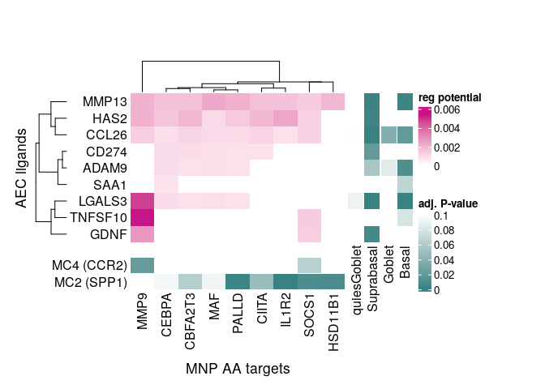
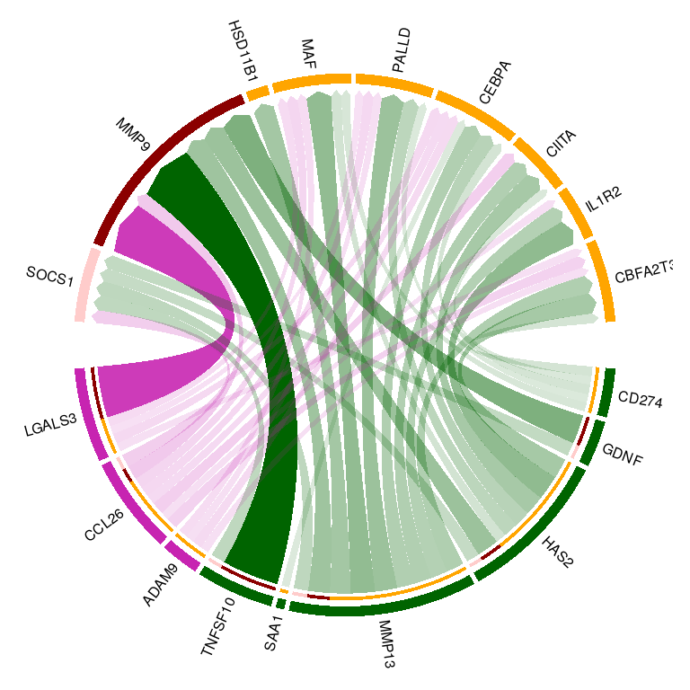
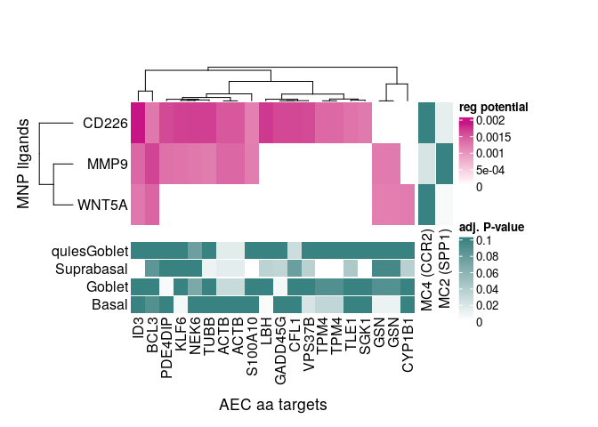
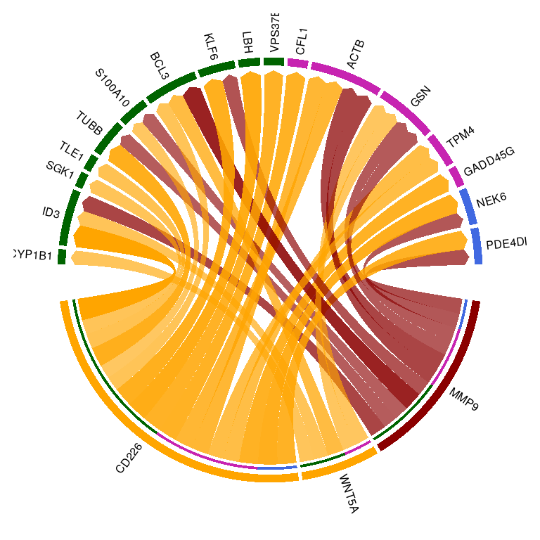
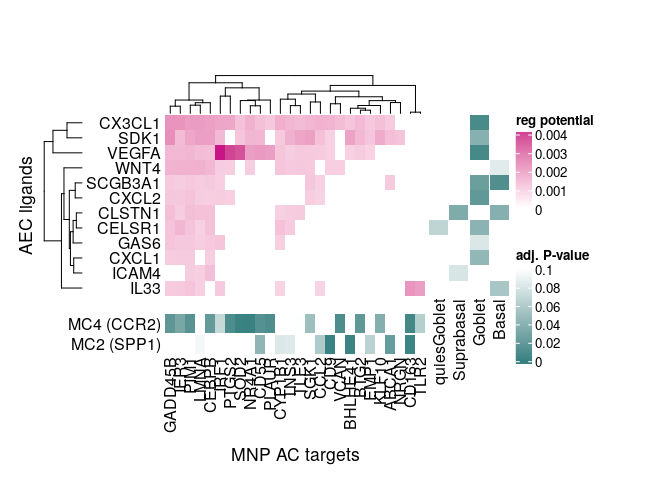
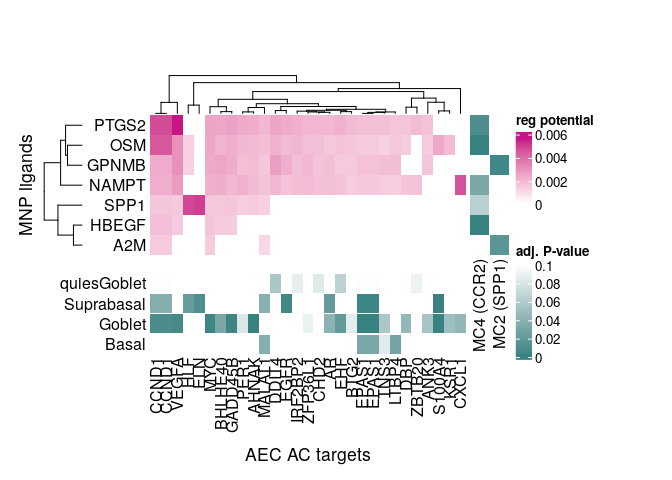
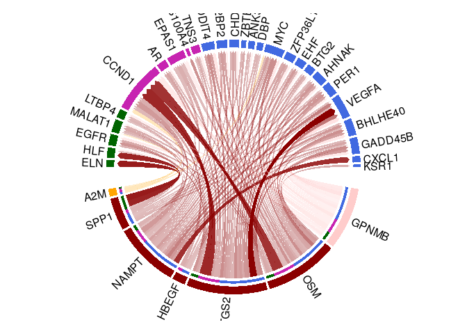

Figure 7 : NicheNet
================

In figure 6, we wanted to look at potential regulatory networks in our data. We did this using `NicheNet`.

``` r
library(nichenetr)
library(Seurat)
library(SeuratDisk)
library(tidyverse)
library(rhdf5)
library(circlize)
library(magrittr)
library(gplots)
library(ComplexHeatmap)
library(glue)

switch(Sys.info()[['user']],
       neal = {file_path <- "/home/neal/Documents/Dropbox (Partners HealthCare)/Chloe&Mazen/Collaborator_projects/Medoff_Asthma/neal_analysis"},
       nealpsmith = {file_path <- "/home/nealpsmith/projects/medoff"},
       stop("I don't recognize your username, type Sys.info() to find out what it is.")
)

# Will use this palette for plotting
godsnot_102 = c(
  "#FFFF00", "#1CE6FF", "#FF34FF", "#FF4A46", "#008941", "#006FA6", "#A30059",
  "#FFDBE5", "#7A4900", "#0000A6", "#63FFAC", "#B79762", "#004D43", "#8FB0FF", "#997D87",
  "#5A0007", "#809693", "#6A3A4C", "#1B4400", "#4FC601", "#3B5DFF", "#4A3B53", "#FF2F80",
  "#61615A", "#BA0900", "#6B7900", "#00C2A0", "#FFAA92", "#FF90C9", "#B903AA", "#D16100",
  "#DDEFFF", "#000035", "#7B4F4B", "#A1C299", "#300018", "#0AA6D8", "#013349", "#00846F",
  "#372101", "#FFB500", "#C2FFED", "#A079BF", "#CC0744", "#C0B9B2", "#C2FF99", "#001E09",
  "#00489C", "#6F0062", "#0CBD66", "#EEC3FF", "#456D75", "#B77B68", "#7A87A1", "#788D66",
  "#885578", "#FAD09F", "#FF8A9A", "#D157A0", "#BEC459", "#456648", "#0086ED", "#886F4C",
  "#34362D", "#B4A8BD", "#00A6AA", "#452C2C", "#636375", "#A3C8C9", "#FF913F", "#938A81",
  "#575329", "#00FECF", "#B05B6F", "#8CD0FF", "#3B9700", "#04F757", "#C8A1A1", "#1E6E00",
  "#7900D7", "#A77500", "#6367A9", "#A05837", "#6B002C", "#772600", "#D790FF", "#9B9700",
  "#549E79", "#FFF69F", "#201625", "#72418F", "#BC23FF", "#99ADC0", "#3A2465", "#922329",
  "#5B4534", "#FDE8DC", "#404E55", "#0089A3", "#CB7E98", "#A4E804", "#324E72"
)

# Load in all data
all_path <- paste(file_path, "data", "all_data_harmonized", sep = "/")
# Convert(paste(all_path, ".h5ad", sep = ""), des = "h5seurat")
all_data <- LoadH5Seurat(paste(all_path, ".h5seurat", sep = ""))

# Myeloid
myeloid_path <- paste(file_path, "data", "myeloid_harmonized", sep = "/")
# Convert(paste(myeloid_path, ".h5ad", sep = ""), des = "h5seurat")
myeloid_data <- LoadH5Seurat(paste(myeloid_path, ".h5seurat", sep = ""))

# Epithelial
epithelial_path <- paste(file_path, "data", "epithelial_harmonized", sep = "/")
# Convert(paste(epithelial_path, ".h5ad", sep = ""), des = "h5seurat")
epithelial_data <- LoadH5Seurat(paste(epithelial_path, ".h5seurat", sep = ""))

# # T cell
t_cell_path <- paste(file_path, "data", "t_cell_harmonized", sep = "/")
# Convert(paste(t_cell_path, ".h5ad", sep = ""), des = "h5seurat")
t_cell_data <- LoadH5Seurat(paste(t_cell_path, ".h5seurat", sep = ""))


# Need to annotate all data to have lineage subclusters
# Fix the names from lineages to be consistent
myeloid_clusters <- myeloid_data@meta.data %>% select(new_clusters) %>%
  rownames_to_column() %>%
  `colnames<-`(c("cell_id", "subclust")) %>%
  mutate(subclust = paste("myl", subclust, sep = "_"))

epithelial_clusters <- epithelial_data@meta.data %>% select(new_clusters) %>%
  rownames_to_column() %>%
  `colnames<-`(c("cell_id", "subclust")) %>%
  mutate(subclust = paste("epi", subclust, sep = "_"))

t_cell_clusters <- t_cell_data@meta.data %>% select(leiden_labels) %>%
  rownames_to_column() %>%
  `colnames<-`(c("cell_id" ,"subclust")) %>%
  mutate(subclust = paste("t_cell", subclust, sep = "_"))

subclust_annotations <- rbind(myeloid_clusters, epithelial_clusters, t_cell_clusters)

# Need to add new level for subclust before adding
all_data@meta.data %<>% rownames_to_column(var = "cell_id") %>%
  left_join(subclust_annotations, by = "cell_id") %>%
  `rownames<-`(.$cell_id)

# Get Ligand-target model
ligand_target_matrix = readRDS(glue("{file_path}/data/ligand_target_matrix.rds"))
lr_network = readRDS(glue("{file_path}/data/lr_network.rds"))
```

Now we can perform Nichnet, where we are looking at the potential for epithelial ligands up-regaulted in AA that have the potential to regulate target genes that were up-regulated in AA myeloid cells

``` r
Idents(all_data) <- "subclust"
senders <- c("epi_1", "epi_3", "epi_4", "epi_5")

# Iterate across the recievers
reg_pot_list <- list()
de_info_list_receiver <- list()
de_info_list_sender <- list()
receivers <- c("myl_1", "myl_5")
for (receiver in receivers){
  idents <- c(senders, receiver)
  # Subset the data
  subset_data <- subset(all_data, idents = idents)

  # Get the DE info for the senders
  up_aa_genes_sender <- list()
  for (sender in senders){
    clust <- sub("epi_", "", sender)
    de_info <- read.csv(glue("{file_path}/data/pseudobulk/epithelial/pheno_by_samp/de_cluster_{clust}_Ag_by_pheno.csv"), row.names = 1)
    de_info_list_sender[[sender]] <- de_info

    up_genes <- de_info %>%
      dplyr::filter(padj < 0.1 & log2FoldChange > 0) %>%
      .$gene
    up_aa_genes_sender[[sender]] <- up_genes
  }

  up_aa_genes_sender_all <- unlist(up_aa_genes_sender, use.names = FALSE) %>%
    unique()

  clust <- sub("myl_", "", receiver)
  receiver_de_info <- read.csv(glue("{file_path}/data/pseudobulk/myeloid/pheno_by_samp/de_cluster_{clust}_Ag_by_pheno.csv"), row.names = 1)
  up_aa_genes_receiver <-  receiver_de_info %>%
    dplyr::filter(padj < 0.1 & log2FoldChange > 0) %>% .$gene %>% as.character()

  weighted_networks = readRDS(glue("{file_path}/data/weighted_networks.rds"))
  weighted_networks_lr = weighted_networks$lr_sig %>% inner_join(lr_network %>% distinct(from,to), by = c("from","to"))

  # Get genes expressed by the reciever cluster
  expressed_genes_receiver = get_expressed_genes(receiver, subset_data, pct = 0.10)

  background_expressed_genes = expressed_genes_receiver %>% .[. %in% rownames(ligand_target_matrix)]

  # Get the genes expressed by the senders
  list_expressed_genes_sender = senders %>% unique() %>% lapply(get_expressed_genes, all_data, 0.10) # lapply to get the expressed genes of every sender cell type separately here
  expressed_genes_sender = list_expressed_genes_sender %>% unlist() %>% unique()

  ### Step 3 : Define potential ligands in sender cells (epi_3) ###
  ligands = lr_network %>% pull(from) %>% unique()
  receptors = lr_network %>% pull(to) %>% unique()

  # Get the ligands expressed in of the sender cells
  up_reg_ligands = intersect(ligands,up_aa_genes_sender_all)
  # Get the receptors expressed in the receiver cells
  expressed_receptors = intersect(receptors,expressed_genes_receiver)

  # Get a list of potential ligands
  potential_ligands = lr_network %>% filter(from %in% up_reg_ligands & to %in% expressed_receptors) %>%
          pull(from) %>%
          unique()

  # The Nichenet goods...predict activities of ligands in regulating the genes of reciever
  ligand_activities = predict_ligand_activities(geneset = up_aa_genes_receiver, background_expressed_genes = background_expressed_genes,
                                                ligand_target_matrix = ligand_target_matrix, potential_ligands = potential_ligands)

  # Gives a tibble ranking ligands based on how well they predict the observed differentially expressed genes compared to background of expressed genes
  ligand_activities = ligand_activities %>% arrange(-pearson) %>% mutate(rank = rank(desc(pearson)))

  best_upstream_ligands = ligand_activities %>% top_n(20, pearson) %>% arrange(-pearson) %>% pull(test_ligand) %>% unique()

  active_ligand_target_links_df = best_upstream_ligands %>%
          lapply(get_weighted_ligand_target_links,geneset = up_aa_genes_receiver, ligand_target_matrix = ligand_target_matrix, n = 250) %>%
          bind_rows() %>%
          drop_na()
  active_ligand_target_links = prepare_ligand_target_visualization(ligand_target_df = active_ligand_target_links_df,
                                                                   ligand_target_matrix = ligand_target_matrix, cutoff = 0.33)

  vis_ligand_target = active_ligand_target_links %>% t()

  reg_pot_list[[receiver]] <- vis_ligand_target
  de_info_list_receiver[[receiver]] <- receiver_de_info
}
```

    ## Warning: Keys should be one or more alphanumeric characters followed by an
    ## underscore, setting key from pca_harmony_ to pcaharmony_

    ## Warning: Keys should be one or more alphanumeric characters followed by an
    ## underscore, setting key from pca_harmony_ to pcaharmony_

We can visualize the top AA ligand:downstream target with a heatmap. The inside of the heatmap reflects the regulatory potential as determined by Nichenet. The outside reflects the p-values from our own DEG analysis to indicate which clusters the given genes were significant in

``` r
# Now need to combine the two matrices, clean it up
merged_pot_mtx <- merge(reg_pot_list$myl_1, reg_pot_list$myl_5, by = "row.names", all.x = TRUE, all.y = TRUE) %>%
  `rownames<-`(.$Row.names)
merged_pot_mtx$Row.names <- NULL
# SOCS1 as up-regulated in both sets, no need to have it in matrix twice
merged_pot_mtx$SOCS1.y <- NULL
colnames(merged_pot_mtx)[colnames(merged_pot_mtx) == "SOCS1.x"] <- "SOCS1"
merged_pot_mtx[is.na(merged_pot_mtx)] <-0


# Lets make the plots
reg_color_scale <- colorRamp2(c(min(merged_pot_mtx), max(merged_pot_mtx)), c("#FFFFFF", "mediumvioletred"))
pval_col_fun <- colorRamp2(c(0, 0.1), c("#398282", "#FFFFFF"))

# Make block annotation for DE info
myl_1_cols <- sapply(colnames(merged_pot_mtx), function(x){
  val <- de_info_list_receiver[["myl_1"]][x,]$padj
  return(val)
})

myl_5_cols <- sapply(colnames(merged_pot_mtx), function(x){
  val <- de_info_list_receiver[["myl_5"]][x,]$padj
  return(val)
})

epi_cols <- lapply(senders, function(s){
  de <- de_info_list_sender[[s]]
  cols <- sapply(rownames(merged_pot_mtx), function(x){
    val <- de[x,]$padj
    return(val)
  })
  cols[is.na(cols)] <- 1
  return(cols)
})
names(epi_cols) <- senders

myl_block <- HeatmapAnnotation("MC4 (CCR2)" = myl_1_cols,
                               "MC2 (SPP1)"= myl_5_cols,
                               col = list("MC4 (CCR2)" = pval_col_fun,
                                          "MC2 (SPP1)" = pval_col_fun),
                               show_legend = FALSE,
                               show_annotation_name = TRUE,
                               annotation_name_side = "left")

epi_block <- HeatmapAnnotation("quiesGoblet" = epi_cols$epi_1,
                               "Suprabasal" = epi_cols$epi_3,
                               "Goblet" = epi_cols$epi_4,
                               "Basal" = epi_cols$epi_5,
                               col = list("quiesGoblet" = pval_col_fun,
                                          "Suprabasal" = pval_col_fun,
                                          "Goblet" = pval_col_fun,
                                          "Basal" = pval_col_fun),
                               show_legend = FALSE,
                               show_annotation_name = TRUE,
                               which = "row")
reg_lgd <- Legend(col_fun = reg_color_scale, title = "reg potential", legend_height = unit(2, "cm"))
pval_lgd <- Legend(col_fun = pval_col_fun, title = "adj. P-value", legend_height = unit(2, "cm"))
```

    ## Warning: `legend_height` you specified is too small, use the default minimal
    ## height.

``` r
lgd_list <- packLegend(reg_lgd, pval_lgd, row_gap = unit(1,"cm"), direction = "vertical")

reg_heatmap <- Heatmap(merged_pot_mtx, col = reg_color_scale, column_title = "MNP AA targets",
                       column_title_side = "bottom",
                       show_heatmap_legend = FALSE, row_title = "AEC ligands", row_title_side = "left",
                       row_names_side = "left", bottom_annotation = myl_block, right_annotation = epi_block)
```

    ## Warning: The input is a data frame, convert it to the matrix.

``` r
heatmap_list <- reg_heatmap

ht_opt(COLUMN_ANNO_PADDING = unit(0.5, "cm"))
draw(heatmap_list, ht_gap = unit(0.5, "cm"), heatmap_legend_list = lgd_list, padding = unit(c(0.5, 0.5, 2, 2), "cm"))
```



``` r
### Now a circos diagram ###
circ_data <- setNames(reshape2::melt(as.matrix(merged_pot_mtx)), c('to', 'from', 'value'))
transparency = circ_data %>% mutate(weight =(value-min(value))/(max(value)-min(value))) %>%
        mutate(transparency = 1-weight) %>%
        .$transparency

# Categorize the ligands
target_order <- sapply(as.character(unique(circ_data$from)), function(gene){
  pvals <- lapply(de_info_list_receiver, function(df) df[gene,]$padj)
  pvals <- pvals[!is.na(pvals)]
  if (length(names(pvals)[pvals < 0.1]) == 1){
    return(names(pvals)[pvals < 0.1])
  } else {
    return("both")
  }

}) %>% as.data.frame() %>%
  `colnames<-`("type") %>%
  arrange(type)

ligand_order <- sapply(as.character(unique(circ_data$to)), function(gene){
  pvals <- lapply(de_info_list_sender, function(df) df[gene,]$padj)
  pvals <- pvals[!is.na(pvals)]

  sig_clusts <- names(pvals)[pvals < 0.1]
  if (all(any(sig_clusts %in% c("epi_1", "epi_4")) & any(sig_clusts %in% c("epi_3", "epi_5")))){
    return("both")
  } else if(any(sig_clusts %in% c("epi_1", "epi_4"))){
    return("goblet")
  } else if (any(sig_clusts %in% c("epi_3", "epi_5"))){
    return("basal")
  }
}) %>% as.data.frame() %>%
  `colnames<-`("type") %>%
  arrange(type)

order <- c(rownames(ligand_order), rownames(target_order))


# Now set the colors
target_col_list <- c("myl_1" = "#8b0000",
                     "myl_5" = "orange",
                     "both" = "#FFCCCB")
ligand_col_list <- c("basal" = "#006400",
                     "goblet" = "royalblue",
                     "both" = "#C724B1")

target_order$color <- apply(target_order, 1, function(x) target_col_list[x[["type"]]])
ligand_order$color <- apply(ligand_order, 1, function(x) ligand_col_list[x[["type"]]])

target_cols <- target_order$color
names(target_cols) <- rownames(target_order)

ligand_cols <- ligand_order$color
names(ligand_cols) <- rownames(ligand_order)

all_cols = c(ligand_cols, target_cols)

# Lets make a legend
lgd_sender <- Legend(labels = names(ligand_col_list), legend_gp = gpar(fill = as.character(ligand_col_list)), title = "sender")
lgd_receiver <- Legend(labels = names(target_col_list), legend_gp = gpar(fill = as.character(target_col_list)), title = "target")
lgd_list = packLegend(lgd_sender, lgd_receiver)


chordDiagram(circ_data, directional = 1, link.visible = circ_data$value > 0, link.arr.type = "big.arrow",
             direction.type = c("diffHeight", "arrows"), transparency = transparency, annotationTrack = "grid",
             preAllocateTracks = list(track.height = 0.075), order=order, grid.col = all_cols)
circos.track(track.index = 1, panel.fun = function(x, y) {
  circos.text(CELL_META$xcenter, CELL_META$ylim[1], CELL_META$sector.index,
              facing = "clockwise", niceFacing = TRUE, adj = c(0, 0.55), cex = 1)
}, bg.border = NA)
draw(lgd_list, x = unit(27.5, "cm"), y = unit(5, "cm"))
```



We can also flip the analysis to look at MNP ligands signalling to AEC downstream targets

``` r
senders <- c("myl_1", "myl_5")
receivers <- c("epi_1", "epi_3", "epi_4", "epi_5")

# Iterate across the recievers
reg_pot_list <- list()
expression_list <- list()
de_info_list_receiver <- list()
de_info_list_sender <- list()
for (receiver in receivers){
  idents <- c(senders, receiver)
  # Subset the data
  subset_data <- subset(all_data, idents = idents)

  # Get the DE info for the senders
  up_aa_genes_sender <- list()
  for (sender in senders){
    clust <- sub("myl_", "", sender)
    de_info <- read.csv(glue("{file_path}/data/pseudobulk/myeloid/pheno_by_samp/de_cluster_{clust}_Ag_by_pheno.csv"), row.names = 1)
    de_info_list_sender[[sender]] <- de_info

    up_genes <- de_info %>%
      dplyr::filter(padj < 0.1 & log2FoldChange > 0) %>%
      .$gene
    up_aa_genes_sender[[sender]] <- up_genes
  }

  up_aa_genes_sender_all <- unlist(up_aa_genes_sender, use.names = FALSE) %>%
    unique()

  clust <- sub("epi_", "", receiver)
  receiver_de_info <- read.csv(glue("{file_path}/data/pseudobulk/epithelial/pheno_by_samp/de_cluster_{clust}_Ag_by_pheno.csv"), row.names = 1)

  up_aa_genes_receiver <- receiver_de_info %>%
    dplyr::filter(padj < 0.1 & log2FoldChange > 0) %>%
    .$gene %>%
    as.character()

  weighted_networks_lr = weighted_networks$lr_sig %>% inner_join(lr_network %>% distinct(from,to), by = c("from","to"))

  # Get genes expressed by the reciever cluster
  expressed_genes_receiver = get_expressed_genes(receiver, subset_data, pct = 0.10)

  background_expressed_genes = expressed_genes_receiver %>% .[. %in% rownames(ligand_target_matrix)]

  # Get the genes expressed by the senders
  list_expressed_genes_sender = senders %>% unique() %>% lapply(get_expressed_genes, all_data, 0.10) # lapply to get the expressed genes of every sender cell type separately here
  expressed_genes_sender = list_expressed_genes_sender %>% unlist() %>% unique()

  ### Step 3 : Define potential ligands in sender cells (epi_3) ###
  ligands = lr_network %>% pull(from) %>% unique()
  receptors = lr_network %>% pull(to) %>% unique()

  # Get the ligands expressed in of the sender cells
  up_reg_ligands = intersect(ligands,up_aa_genes_sender_all)
  # Get the receptors expressed in the receiver cells
  expressed_receptors = intersect(receptors,expressed_genes_receiver)

  # Get a list of potential ligands
  potential_ligands = lr_network %>% filter(from %in% up_reg_ligands & to %in% expressed_receptors) %>% pull(from) %>% unique()

  # The Nichenet goods...predict activities of ligands in regulating the genes of reciever
  ligand_activities = predict_ligand_activities(geneset = up_aa_genes_receiver, background_expressed_genes = background_expressed_genes, ligand_target_matrix = ligand_target_matrix, potential_ligands = potential_ligands)

  # Gives a tibble ranking ligands based on how well they predict the observed differentially expressed genes compared to background of expressed genes
  ligand_activities = ligand_activities %>% arrange(-pearson) %>% mutate(rank = rank(desc(pearson)))

  best_upstream_ligands = ligand_activities %>% top_n(20, pearson) %>% arrange(-pearson) %>% pull(test_ligand) %>% unique()

  ligand_expression_tibble <- data.frame(ligand = best_upstream_ligands)
  for(clust in senders) {
    clust_data = subset(subset_data, idents = clust)
    expr = data.frame(ligand = best_upstream_ligands,
                      exp = sapply(best_upstream_ligands, function(x) mean(clust_data@assays$RNA@counts[x,]))) %>%
      `colnames<-`(c("ligand", clust))
    ligand_expression_tibble %<>% left_join(expr, by = "ligand")
  }

  ligand_expression_tibble$ligand_type <- sapply(ligand_expression_tibble$ligand, function(gene){
    clusts <- lapply(up_aa_genes_sender, function(x) gene %in% x) %>%
      unlist()
    clusts <- names(clusts[clusts == TRUE])
    if (length(clusts) > 1){
      type <- "multi"
    } else{
      type <- clusts
    }
    return(type)
  })

  ligand_type_indication_df <- ligand_expression_tibble[,c("ligand", "ligand_type")]


  active_ligand_target_links_df = best_upstream_ligands %>% lapply(get_weighted_ligand_target_links,geneset = up_aa_genes_receiver, ligand_target_matrix = ligand_target_matrix, n = 250) %>% bind_rows() %>% drop_na()

  active_ligand_target_links = prepare_ligand_target_visualization(ligand_target_df = active_ligand_target_links_df, ligand_target_matrix = ligand_target_matrix, cutoff = 0.33)

  vis_ligand_target = active_ligand_target_links %>% t() %>% as.data.frame()
  vis_ligand_target$ligand <- rownames(vis_ligand_target)
  reg_pot_list[[receiver]] <- vis_ligand_target
  expression_list[[receiver]] <- ligand_expression_tibble
  de_info_list_receiver[[receiver]] <- receiver_de_info

}
```

    ## Warning: Keys should be one or more alphanumeric characters followed by an
    ## underscore, setting key from pca_harmony_ to pcaharmony_

    ## Warning: Keys should be one or more alphanumeric characters followed by an
    ## underscore, setting key from pca_harmony_ to pcaharmony_

    ## Warning: Keys should be one or more alphanumeric characters followed by an
    ## underscore, setting key from pca_harmony_ to pcaharmony_

    ## Warning: Keys should be one or more alphanumeric characters followed by an
    ## underscore, setting key from pca_harmony_ to pcaharmony_

``` r
# Now need to combine all of the matrices, clean it up
merged_pot_matrix <- reduce(reg_pot_list, full_join, by = "ligand")

# Remove duplicates
merged_pot_matrix <- merged_pot_matrix[,!grepl(".x", colnames(merged_pot_matrix))]

# Now adjust names
colnames(merged_pot_matrix)[grep(".y", colnames(merged_pot_matrix))] <- sub(".y", "", colnames(merged_pot_matrix)[grep(".y", colnames(merged_pot_matrix))])
merged_pot_matrix[is.na(merged_pot_matrix)] <-0

rownames(merged_pot_matrix) <- merged_pot_matrix$ligand
merged_pot_matrix$ligand <- NULL
merged_pot_matrix <- as.matrix(merged_pot_matrix)

# Make block annotation for DE info
epi_1_cols <- sapply(colnames(merged_pot_matrix), function(x){
  val <- de_info_list_receiver[["epi_1"]][x,]$padj
  val[is.na(val)] <- 1
  return(val)
})

epi_3_cols <- sapply(colnames(merged_pot_matrix), function(x){
  val <- de_info_list_receiver[["epi_3"]][x,]$padj
  val[is.na(val)] <- 1
  return(val)
})

epi_4_cols <- sapply(colnames(merged_pot_matrix), function(x){
  val <- de_info_list_receiver[["epi_4"]][x,]$padj
  val[is.na(val)] <- 1
  return(val)
})

epi_5_cols <- sapply(colnames(merged_pot_matrix), function(x){
  val <- de_info_list_receiver[["epi_5"]][x,]$padj
  val[is.na(val)] <- 1
  return(val)
})

myl_cols <- lapply(senders, function(s){
  de <- de_info_list_sender[[s]]
  cols <- sapply(rownames(merged_pot_matrix), function(x){
    val <- de[x,]$padj
    return(val)
  })
  cols[is.na(cols)] <- 1
  return(cols)
})
names(myl_cols) <- senders

reg_color_scale <- colorRamp2(c(min(merged_pot_matrix), max(merged_pot_matrix)), c("#FFFFFF", "mediumvioletred"))
pval_col_fun <- colorRamp2(c(0, 0.1), c("#FFFFFF","#398282"))

epi_block <- HeatmapAnnotation("quiesGoblet" = epi_1_cols,
                               "Suprabasal"= epi_3_cols,
                               "Goblet" = epi_4_cols,
                               "Basal" = epi_5_cols,
                               col = list("quiesGoblet" = pval_col_fun,
                                          "Suprabasal" = pval_col_fun,
                                          "Goblet" = pval_col_fun,
                                          "Basal" = pval_col_fun),
                               show_legend = FALSE,
                               show_annotation_name = TRUE,
                               annotation_name_side = "left")

myl_block <- HeatmapAnnotation("MC4 (CCR2)" = myl_cols$myl_1,
                               "MC2 (SPP1)" = myl_cols$myl_5,
                               col = list("MC4 (CCR2)" = pval_col_fun,
                                          "MC2 (SPP1)" = pval_col_fun),
                               show_legend = FALSE,
                               show_annotation_name = TRUE,
                               which = "row")

reg_lgd <- Legend(col_fun = reg_color_scale, title = "reg potential", legend_height = unit(2, "cm"))
```

    ## Warning: `legend_height` you specified is too small, use the default minimal
    ## height.

``` r
pval_lgd <- Legend(col_fun = pval_col_fun, title = "adj. P-value", legend_height = unit(2, "cm"))
```

    ## Warning: `legend_height` you specified is too small, use the default minimal
    ## height.

``` r
lgd_list <- packLegend(reg_lgd, pval_lgd, row_gap = unit(1,"cm"), direction = "vertical")

reg_heatmap <- Heatmap(merged_pot_matrix, col = reg_color_scale, column_title = "AEC aa targets", column_title_side = "bottom",
                       show_heatmap_legend = FALSE, row_title = "MNP ligands", row_title_side = "left",
                       row_names_side = "left", bottom_annotation = epi_block, right_annotation = myl_block)
heatmap_list <- reg_heatmap

ht_opt(COLUMN_ANNO_PADDING = unit(0.5, "cm"))
draw(heatmap_list, ht_gap = unit(0.5, "cm"), heatmap_legend_list = lgd_list, padding = unit(c(0.5, 0.5, 2, 2), "cm"))
```



Just like before, we can also visualize this with a circos diagram

``` r
circ_data <- setNames(reshape2::melt(as.matrix(merged_pot_matrix)), c('to', 'from', 'value'))
transparency = circ_data %>% mutate(weight =(value-min(value))/(max(value)-min(value))) %>% mutate(transparency = 1-weight) %>% .$transparency

# Categorize the ligands
ligand_order <- sapply(as.character(unique(circ_data$to)), function(gene){
  pvals <- lapply(de_info_list_sender, function(df) df[gene,]$padj)
  pvals <- pvals[!is.na(pvals)]
  if (length(names(pvals)[pvals < 0.1]) == 1){
    return(names(pvals)[pvals < 0.1])
  } else {
    return("both")
  }

}) %>% as.data.frame() %>%
  `colnames<-`("type") %>%
  arrange(type)

target_order <- sapply(as.character(unique(circ_data$from)), function(gene){
  pvals <- lapply(de_info_list_receiver, function(df) df[gene,]$padj)
  pvals <- pvals[!is.na(pvals)]

  sig_clusts <- names(pvals)[pvals < 0.1]
  if (all(any(sig_clusts %in% c("epi_1", "epi_4")) & any(sig_clusts %in% c("epi_3", "epi_5")))){
    return("both")
  } else if(any(sig_clusts %in% c("epi_1", "epi_4"))){
    return("goblet")
  } else if (any(sig_clusts %in% c("epi_3", "epi_5"))){
    return("basal")
  }
}) %>% as.data.frame() %>%
  `colnames<-`("type") %>%
  arrange(type)

order <- c(rownames(ligand_order), rownames(target_order))


# Now set the colors
ligand_col_list <- c("myl_1" = "#8b0000",
                     "myl_5" = "orange",
                     "both" = "#FFCCCB")
target_col_list <- c("basal" = "#006400",
                     "goblet" = "royalblue",
                     "both" = "#C724B1")

target_order$color <- apply(target_order, 1, function(x) target_col_list[x[["type"]]])
ligand_order$color <- apply(ligand_order, 1, function(x) ligand_col_list[x[["type"]]])

target_cols <- target_order$color
names(target_cols) <- rownames(target_order)

ligand_cols <- ligand_order$color
names(ligand_cols) <- rownames(ligand_order)

all_cols = c(ligand_cols, target_cols)

# Lets make a legend
lgd_sender <- Legend(labels = names(ligand_col_list), legend_gp = gpar(fill = as.character(ligand_col_list)), title = "sender")
lgd_receiver <- Legend(labels = names(target_col_list), legend_gp = gpar(fill = as.character(target_col_list)), title = "target")
lgd_list = packLegend(lgd_sender, lgd_receiver)

chordDiagram(circ_data, directional = 1, link.visible = circ_data$value > 0, link.arr.type = "big.arrow",
             direction.type = c("diffHeight", "arrows"), transparency = transparency, annotationTrack = "grid",
             preAllocateTracks = list(track.height = 0.075), order=order, grid.col = all_cols)
circos.track(track.index = 1, panel.fun = function(x, y) {
  circos.text(CELL_META$xcenter, CELL_META$ylim[1], CELL_META$sector.index,
              facing = "clockwise", niceFacing = TRUE, adj = c(0, 0.55), cex = 1)
}, bg.border = NA)
draw(lgd_list, x = unit(27.5, "cm"), y = unit(5, "cm"))
```



We can now look at all of the same things, but with the genes that were up-regulated in the AC

``` r
senders <- c("epi_1", "epi_3", "epi_4", "epi_5")

# Iterate across the recievers
reg_pot_list <- list()
expression_list <- list()
de_info_list_receiver <- list()
de_info_list_sender <- list()
receivers <- c("myl_1", "myl_5")
for (receiver in receivers){
  idents <- c(senders, receiver)
  # Subset the data
  subset_data <- subset(all_data, idents = idents)

  # Get the DE info for the senders
  up_ana_genes_sender <- list()
  for (sender in senders){
    clust <- sub("epi_", "", sender)
    de_info <- read.csv(glue("{file_path}/data/pseudobulk/epithelial/pheno_by_samp/de_cluster_{clust}_Ag_by_pheno.csv"), row.names = 1)
    de_info_list_sender[[sender]] <- de_info

    up_genes <- de_info %>%
      dplyr::filter(padj < 0.1 & log2FoldChange < 0) %>%
      .$gene
    up_ana_genes_sender[[sender]] <- up_genes
  }

  up_ana_genes_sender_all <- unlist(up_ana_genes_sender, use.names = FALSE) %>%
    unique()

  clust <- sub("myl_", "", receiver)
  receiver_de_info <- read.csv(glue("{file_path}/data/pseudobulk/myeloid/pheno_by_samp/de_cluster_{clust}_Ag_by_pheno.csv"), row.names = 1)

  up_ana_genes_receiver <- receiver_de_info %>%
    dplyr::filter(padj < 0.1 & log2FoldChange < 0) %>%
    .$gene %>%
    as.character()

  weighted_networks_lr = weighted_networks$lr_sig %>% inner_join(lr_network %>% distinct(from,to), by = c("from","to"))

  # Get genes expressed by the reciever cluster
  expressed_genes_receiver = get_expressed_genes(receiver, subset_data, pct = 0.10)

  background_expressed_genes = expressed_genes_receiver %>% .[. %in% rownames(ligand_target_matrix)]

  # Get the genes expressed by the senders
  list_expressed_genes_sender = senders %>% unique() %>% lapply(get_expressed_genes, all_data, 0.10) # lapply to get the expressed genes of every sender cell type separately here
  expressed_genes_sender = list_expressed_genes_sender %>% unlist() %>% unique()

  ### Step 3 : Define potential ligands in sender cells (epi_3) ###
  ligands = lr_network %>% pull(from) %>% unique()
  receptors = lr_network %>% pull(to) %>% unique()

  # Get the ligands expressed in of the sender cells
  up_reg_ligands = intersect(ligands,up_ana_genes_sender_all)
  # Get the receptors expressed in the receiver cells
  expressed_receptors = intersect(receptors,expressed_genes_receiver)

  # Get a list of potential ligands
  potential_ligands = lr_network %>% filter(from %in% up_reg_ligands & to %in% expressed_receptors) %>% pull(from) %>% unique()

  # The Nichenet goods...predict activities of ligands in regulating the genes of reciever
  ligand_activities = predict_ligand_activities(geneset = up_ana_genes_receiver, background_expressed_genes = background_expressed_genes, ligand_target_matrix = ligand_target_matrix, potential_ligands = potential_ligands)

  # Gives a tibble ranking ligands based on how well they predict the observed differentially expressed genes compared to background of expressed genes
  ligand_activities = ligand_activities %>% arrange(-pearson) %>% mutate(rank = rank(desc(pearson)))

  best_upstream_ligands = ligand_activities %>% top_n(20, pearson) %>% arrange(-pearson) %>% pull(test_ligand) %>% unique()

  ligand_expression_tibble <- data.frame(ligand = best_upstream_ligands)
  for(clust in senders) {
    clust_data = subset(subset_data, idents = clust)
    expr = data.frame(ligand = best_upstream_ligands,
                      exp = sapply(best_upstream_ligands, function(x) mean(clust_data@assays$RNA@counts[x,]))) %>%
      `colnames<-`(c("ligand", clust))
    ligand_expression_tibble %<>% left_join(expr, by = "ligand")
  }

  ligand_expression_tibble$ligand_type <- sapply(ligand_expression_tibble$ligand, function(gene){
    clusts <- lapply(up_ana_genes_sender, function(x) gene %in% x) %>%
      unlist()
    clusts <- names(clusts[clusts == TRUE])
    if (length(clusts) > 1){
      type <- "multi"
    } else{
      type <- clusts
    }
    return(type)
  })

  ligand_type_indication_df <- ligand_expression_tibble[,c("ligand", "ligand_type")]


  active_ligand_target_links_df = best_upstream_ligands %>% lapply(get_weighted_ligand_target_links,geneset = up_ana_genes_receiver, ligand_target_matrix = ligand_target_matrix, n = 250) %>% bind_rows() %>% drop_na()
  active_ligand_target_links = prepare_ligand_target_visualization(ligand_target_df = active_ligand_target_links_df, ligand_target_matrix = ligand_target_matrix, cutoff = 0.33)

  vis_ligand_target = active_ligand_target_links %>% t()

  reg_pot_list[[receiver]] <- vis_ligand_target
  expression_list[[receiver]] <- ligand_expression_tibble
  de_info_list_receiver[[receiver]] <- receiver_de_info

}
```

    ## Warning: Keys should be one or more alphanumeric characters followed by an
    ## underscore, setting key from pca_harmony_ to pcaharmony_

    ## Warning: Keys should be one or more alphanumeric characters followed by an
    ## underscore, setting key from pca_harmony_ to pcaharmony_

``` r
# Now need to combine the two matrices, clean it up
merged_pot_mtx <- merge(reg_pot_list$myl_1, reg_pot_list$myl_5, by = "row.names", all.x = TRUE, all.y = TRUE) %>%
  `rownames<-`(.$Row.names)
merged_pot_mtx$Row.names <- NULL
# SOCS1 as up-regulated in both sets, no need to have it in matrix twice
merged_pot_mtx$CD163.y <- NULL
merged_pot_mtx$CD55.y <- NULL
colnames(merged_pot_mtx)[grep(".x", colnames(merged_pot_mtx))] <- sapply(grep(".x", colnames(merged_pot_mtx), value = TRUE),
                                                                         function(x) strsplit(x, ".x")[[1]][1])
merged_pot_mtx[is.na(merged_pot_mtx)] <-0

# Make block annotation for DE info
myl_1_cols <- sapply(colnames(merged_pot_mtx), function(x){
  val <- de_info_list_receiver[["myl_1"]][x,]$padj
  val[is.na(val)] <- 1
  return(val)
})

myl_5_cols <- sapply(colnames(merged_pot_mtx), function(x){
  val <- de_info_list_receiver[["myl_5"]][x,]$padj
  val[is.na(val)] <- 1
  return(val)
})

epi_cols <- lapply(senders, function(s){
  de <- de_info_list_sender[[s]]
  cols <- sapply(rownames(merged_pot_mtx), function(x){
    val <- de[x,]$padj
    return(val)
  })
  cols[is.na(cols)] <- 1
  return(cols)
})
names(epi_cols) <- senders

reg_color_scale <- colorRamp2(c(min(merged_pot_mtx), max(merged_pot_mtx)), c("#FFFFFF", "mediumvioletred"))
pval_col_fun <- colorRamp2(c(0, 0.1), c("#398282", "#FFFFFF"))

myl_block <- HeatmapAnnotation("MC4 (CCR2)" = myl_1_cols,
                               "MC2 (SPP1)"= myl_5_cols,
                               col = list("MC4 (CCR2)" = pval_col_fun,
                                          "MC2 (SPP1)" = pval_col_fun),
                               show_legend = FALSE,
                               show_annotation_name = TRUE,
                               annotation_name_side = "left")

epi_block <- HeatmapAnnotation("quiesGoblet" = epi_cols$epi_1,
                               "Suprabasal" = epi_cols$epi_3,
                               "Goblet" = epi_cols$epi_4,
                               "Basal" = epi_cols$epi_5,
                               col = list("quiesGoblet" = pval_col_fun,
                                          "Suprabasal" = pval_col_fun,
                                          "Goblet" = pval_col_fun,
                                          "Basal" = pval_col_fun),
                               show_legend = FALSE,
                               show_annotation_name = TRUE,
                               which = "row")

reg_lgd <- Legend(col_fun = reg_color_scale, title = "reg potential", legend_height = unit(2, "cm"))
```

    ## Warning: `legend_height` you specified is too small, use the default minimal
    ## height.

``` r
pval_lgd <- Legend(col_fun = pval_col_fun, title = "adj. P-value", legend_height = unit(2, "cm"))
```

    ## Warning: `legend_height` you specified is too small, use the default minimal
    ## height.

``` r
lgd_list <- packLegend(reg_lgd, pval_lgd, row_gap = unit(1,"cm"), direction = "vertical")

reg_heatmap <- Heatmap(merged_pot_mtx, col = reg_color_scale, column_title = "MNP AC targets", column_title_side = "bottom",
                       show_heatmap_legend = FALSE,
                       row_title = "AEC ligands", row_title_side = "left",
                       row_names_side = "left", bottom_annotation = myl_block, right_annotation = epi_block)
```

    ## Warning: The input is a data frame, convert it to the matrix.

``` r
heatmap_list <- reg_heatmap

ht_opt(COLUMN_ANNO_PADDING = unit(0.5, "cm"))
draw(heatmap_list, ht_gap = unit(0.5, "cm"), heatmap_legend_list = lgd_list, padding = unit(c(0.5, 0.5, 2, 2), "cm"))
```



We can visualize this with a circos as well

``` r
circ_data <- setNames(reshape2::melt(as.matrix(merged_pot_mtx)), c('to', 'from', 'value'))
transparency = circ_data %>% mutate(weight =(value-min(value))/(max(value)-min(value))) %>% mutate(transparency = 1-weight) %>% .$transparency

# Categorize the ligands
target_order <- sapply(as.character(unique(circ_data$from)), function(gene){
  pvals <- lapply(de_info_list_receiver, function(df) df[gene,]$padj)
  pvals <- pvals[!is.na(pvals)]
  if (length(names(pvals)[pvals < 0.1]) == 1){
    return(names(pvals)[pvals < 0.1])
  } else {
    return("both")
  }

}) %>% as.data.frame() %>%
  `colnames<-`("type") %>%
  arrange(type)

ligand_order <- sapply(as.character(unique(circ_data$to)), function(gene){
  pvals <- lapply(de_info_list_sender, function(df) df[gene,]$padj)
  pvals <- pvals[!is.na(pvals)]

  sig_clusts <- names(pvals)[pvals < 0.1]
  if (all(any(sig_clusts %in% c("epi_1", "epi_4")) & any(sig_clusts %in% c("epi_3", "epi_5")))){
    return("both")
  } else if(any(sig_clusts %in% c("epi_1", "epi_4"))){
    return("goblet")
  } else if (any(sig_clusts %in% c("epi_3", "epi_5"))){
    return("basal")
  }
}) %>% as.data.frame() %>%
  `colnames<-`("type") %>%
  arrange(type)

order <- c(rownames(ligand_order), rownames(target_order))


# Now set the colors
target_col_list <- c("myl_1" = "#8b0000",
                     "myl_5" = "orange",
                     "both" = "#FFCCCB")
ligand_col_list <- c("basal" = "#006400",
                     "goblet" = "royalblue",
                     "both" = "#C724B1")

target_order$color <- apply(target_order, 1, function(x) target_col_list[x[["type"]]])
ligand_order$color <- apply(ligand_order, 1, function(x) ligand_col_list[x[["type"]]])

target_cols <- target_order$color
names(target_cols) <- rownames(target_order)

ligand_cols <- ligand_order$color
names(ligand_cols) <- rownames(ligand_order)

all_cols = c(ligand_cols, target_cols)

# Lets make a legend
lgd_sender <- Legend(labels = names(ligand_col_list), legend_gp = gpar(fill = as.character(ligand_col_list)), title = "sender")
lgd_receiver <- Legend(labels = names(target_col_list), legend_gp = gpar(fill = as.character(target_col_list)), title = "target")
lgd_list = packLegend(lgd_sender, lgd_receiver)

chordDiagram(circ_data, directional = 1, link.visible = circ_data$value > 0, link.arr.type = "big.arrow",
               direction.type = c("diffHeight", "arrows"), transparency = transparency, annotationTrack = "grid",
             preAllocateTracks = list(track.height = 0.075), order=order, grid.col = all_cols)
```

    ## Note: The first link end is drawn out of sector 'IL33'.

    ## Note: The second link end is drawn out of sector 'SOD2'.

    ## Note: The second link end is drawn out of sector 'IER3'.

    ## Note: The first link end is drawn out of sector 'CX3CL1'.

    ## Note: The first link end is drawn out of sector 'VEGFA'.

    ## Note: The second link end is drawn out of sector 'GADD45B'.

    ## Note: The second link end is drawn out of sector 'CCL2'.

    ## Note: The second link end is drawn out of sector 'CYP1B1'.

    ## Note: The second link end is drawn out of sector 'CD9'.

``` r
circos.track(track.index = 1, panel.fun = function(x, y) {
  circos.text(CELL_META$xcenter, CELL_META$ylim[1], CELL_META$sector.index,
              facing = "clockwise", niceFacing = TRUE, adj = c(0, 0.55), cex = 1)
}, bg.border = NA)
draw(lgd_list, x = unit(27.5, "cm"), y = unit(5, "cm"))
```


Now we can look at MNP ligands to AEC targets

``` r
senders <- c("myl_1", "myl_5")
receivers <- c("epi_1", "epi_3", "epi_4", "epi_5")

# Iterate across the recievers
reg_pot_list <- list()
expression_list <- list()
de_info_list_receiver <- list()
de_info_list_sender <- list()
for (receiver in receivers){
  idents <- c(senders, receiver)
  # Subset the data
  subset_data <- subset(all_data, idents = idents)

  # Get the DE info for the senders
  up_ana_genes_sender <- list()
  for (sender in senders){
    clust <- sub("myl_", "", sender)
    de_info <- read.csv(glue("{file_path}/data/pseudobulk/myeloid/pheno_by_samp/de_cluster_{clust}_Ag_by_pheno.csv"), row.names = 1)
    de_info_list_sender[[sender]] <- de_info

    up_genes <- de_info %>%
      dplyr::filter(padj < 0.1 & log2FoldChange < 0) %>%
      .$gene
    up_ana_genes_sender[[sender]] <- up_genes
  }

  up_ana_genes_sender_all <- unlist(up_ana_genes_sender, use.names = FALSE) %>%
    unique()

  clust <- sub("epi_", "", receiver)
  receiver_de_info <- read.csv(glue("{file_path}/data/pseudobulk/epithelial/pheno_by_samp/de_cluster_{clust}_Ag_by_pheno.csv"), row.names = 1)

  up_ana_genes_receiver <- receiver_de_info %>%
    dplyr::filter(padj < 0.1 & log2FoldChange < 0) %>%
    .$gene %>%
    as.character()

  weighted_networks_lr = weighted_networks$lr_sig %>% inner_join(lr_network %>% distinct(from,to), by = c("from","to"))

  # Get genes expressed by the reciever cluster
  expressed_genes_receiver = get_expressed_genes(receiver, subset_data, pct = 0.10)

  background_expressed_genes = expressed_genes_receiver %>% .[. %in% rownames(ligand_target_matrix)]

  # Get the genes expressed by the senders
  list_expressed_genes_sender = senders %>% unique() %>% lapply(get_expressed_genes, all_data, 0.10) # lapply to get the expressed genes of every sender cell type separately here
  expressed_genes_sender = list_expressed_genes_sender %>% unlist() %>% unique()

  ### Step 3 : Define potential ligands in sender cells (epi_3) ###
  ligands = lr_network %>% pull(from) %>% unique()
  receptors = lr_network %>% pull(to) %>% unique()

  # Get the ligands expressed in of the sender cells
  up_reg_ligands = intersect(ligands,up_ana_genes_sender_all)
  # Get the receptors expressed in the receiver cells
  expressed_receptors = intersect(receptors,expressed_genes_receiver)

  # Get a list of potential ligands
  potential_ligands = lr_network %>% filter(from %in% up_reg_ligands & to %in% expressed_receptors) %>% pull(from) %>% unique()

  # The Nichenet goods...predict activities of ligands in regulating the genes of reciever
  ligand_activities = predict_ligand_activities(geneset = up_ana_genes_receiver, background_expressed_genes = background_expressed_genes, ligand_target_matrix = ligand_target_matrix, potential_ligands = potential_ligands)

  # Gives a tibble ranking ligands based on how well they predict the observed differentially expressed genes compared to background of expressed genes
  ligand_activities = ligand_activities %>% arrange(-pearson) %>% mutate(rank = rank(desc(pearson)))

  best_upstream_ligands = ligand_activities %>% top_n(20, pearson) %>% arrange(-pearson) %>% pull(test_ligand) %>% unique()

  ligand_expression_tibble <- data.frame(ligand = best_upstream_ligands)
  for(clust in senders) {
    clust_data = subset(subset_data, idents = clust)
    expr = data.frame(ligand = best_upstream_ligands,
                      exp = sapply(best_upstream_ligands, function(x) mean(clust_data@assays$RNA@counts[x,]))) %>%
      `colnames<-`(c("ligand", clust))
    ligand_expression_tibble %<>% left_join(expr, by = "ligand")
  }

  ligand_expression_tibble$ligand_type <- sapply(ligand_expression_tibble$ligand, function(gene){
    clusts <- lapply(up_ana_genes_sender, function(x) gene %in% x) %>%
      unlist()
    clusts <- names(clusts[clusts == TRUE])
    if (length(clusts) > 1){
      type <- "multi"
    } else{
      type <- clusts
    }
    return(type)
  })

  ligand_type_indication_df <- ligand_expression_tibble[,c("ligand", "ligand_type")]


  active_ligand_target_links_df = best_upstream_ligands %>% lapply(get_weighted_ligand_target_links,geneset = up_ana_genes_receiver, ligand_target_matrix = ligand_target_matrix, n = 250) %>% bind_rows() %>% drop_na()
  active_ligand_target_links = prepare_ligand_target_visualization(ligand_target_df = active_ligand_target_links_df, ligand_target_matrix = ligand_target_matrix, cutoff = 0.33)

  vis_ligand_target = active_ligand_target_links %>% t() %>% as.data.frame()
  vis_ligand_target$ligand <- rownames(vis_ligand_target)
  reg_pot_list[[receiver]] <- vis_ligand_target
  expression_list[[receiver]] <- ligand_expression_tibble
  de_info_list_receiver[[receiver]] <- receiver_de_info

}
```

    ## Warning: Keys should be one or more alphanumeric characters followed by an
    ## underscore, setting key from pca_harmony_ to pcaharmony_

    ## Warning: Keys should be one or more alphanumeric characters followed by an
    ## underscore, setting key from pca_harmony_ to pcaharmony_

    ## Warning: Keys should be one or more alphanumeric characters followed by an
    ## underscore, setting key from pca_harmony_ to pcaharmony_

    ## Warning: Keys should be one or more alphanumeric characters followed by an
    ## underscore, setting key from pca_harmony_ to pcaharmony_

``` r
# Now need to combine all of the matrices, clean it up
merged_pot_matrix <- reduce(reg_pot_list, full_join, by = "ligand")

# Remove duplicates
merged_pot_matrix <- merged_pot_matrix[,!grepl(".x", colnames(merged_pot_matrix))]

# Now adjust names
colnames(merged_pot_matrix)[grep(".y", colnames(merged_pot_matrix))] <- sub(".y", "", colnames(merged_pot_matrix)[grep(".y", colnames(merged_pot_matrix))])
merged_pot_matrix[is.na(merged_pot_matrix)] <-0

rownames(merged_pot_matrix) <- merged_pot_matrix$ligand
merged_pot_matrix$ligand <- NULL
merged_pot_matrix <- as.matrix(merged_pot_matrix)

# Make block annotation for DE info
epi_1_cols <- sapply(colnames(merged_pot_matrix), function(x){
  val <- de_info_list_receiver[["epi_1"]][x,]$padj
  val[is.na(val)] <- 1
  return(val)
})

epi_3_cols <- sapply(colnames(merged_pot_matrix), function(x){
  val <- de_info_list_receiver[["epi_3"]][x,]$padj
  val[is.na(val)] <- 1
  return(val)
})

epi_4_cols <- sapply(colnames(merged_pot_matrix), function(x){
  val <- de_info_list_receiver[["epi_4"]][x,]$padj
  val[is.na(val)] <- 1
  return(val)
})

epi_5_cols <- sapply(colnames(merged_pot_matrix), function(x){
  val <- de_info_list_receiver[["epi_5"]][x,]$padj
  val[is.na(val)] <- 1
  return(val)
})

myl_cols <- lapply(senders, function(s){
  de <- de_info_list_sender[[s]]
  cols <- sapply(rownames(merged_pot_matrix), function(x){
    val <- de[x,]$padj
    return(val)
  })
  cols[is.na(cols)] <- 1
  return(cols)
})
names(myl_cols) <- senders

reg_color_scale <- colorRamp2(c(min(merged_pot_matrix), max(merged_pot_matrix)),c("#FFFFFF", "mediumvioletred"))
pval_col_fun <- colorRamp2(c(0, 0.1),c("#398282", "#FFFFFF"))

epi_block <- HeatmapAnnotation("quiesGoblet" = epi_1_cols,
                               "Suprabasal"= epi_3_cols,
                               "Goblet" = epi_4_cols,
                               "Basal" = epi_5_cols,
                               col = list("quiesGoblet" = pval_col_fun,
                                          "Suprabasal" = pval_col_fun,
                                          "Goblet" = pval_col_fun,
                                          "Basal" = pval_col_fun),
                               show_legend = FALSE,
                               show_annotation_name = TRUE,
                               annotation_name_side = "left")

myl_block <- HeatmapAnnotation("MC4 (CCR2)" = myl_cols$myl_1,
                               "MC2 (SPP1)" = myl_cols$myl_5,
                               col = list("MC4 (CCR2)" = pval_col_fun,
                                          "MC2 (SPP1)" = pval_col_fun),
                               show_legend = FALSE,
                               show_annotation_name = TRUE,
                               which = "row")

reg_lgd <- Legend(col_fun = reg_color_scale, title = "reg potential", legend_height = unit(2, "cm"))
pval_lgd <- Legend(col_fun = pval_col_fun, title = "adj. P-value", legend_height = unit(2, "cm"))
```

    ## Warning: `legend_height` you specified is too small, use the default minimal
    ## height.

``` r
lgd_list <- packLegend(reg_lgd, pval_lgd, row_gap = unit(1,"cm"), direction = "vertical")

reg_heatmap <- Heatmap(merged_pot_matrix, col = reg_color_scale, column_title = "AEC AC targets", column_title_side = "bottom",
                       show_heatmap_legend = FALSE, row_title = "MNP ligands", row_title_side = "left",
                       row_names_side = "left", bottom_annotation = epi_block, right_annotation = myl_block)
heatmap_list <- reg_heatmap

ht_opt(COLUMN_ANNO_PADDING = unit(0.5, "cm"))
draw(heatmap_list, ht_gap = unit(0.5, "cm"), heatmap_legend_list = lgd_list, padding = unit(c(0.5, 0.5, 2, 2), "cm"))
```



``` r
circ_data <- setNames(reshape2::melt(as.matrix(merged_pot_matrix)), c('to', 'from', 'value'))
transparency = circ_data %>% mutate(weight =(value-min(value))/(max(value)-min(value))) %>% mutate(transparency = 1-weight) %>% .$transparency

# Categorize the ligands
ligand_order <- sapply(as.character(unique(circ_data$to)), function(gene){
  pvals <- lapply(de_info_list_sender, function(df) df[gene,]$padj)
  pvals <- pvals[!is.na(pvals)]
  if (length(names(pvals)[pvals < 0.1]) == 1){
    return(names(pvals)[pvals < 0.1])
  } else {
    return("both")
  }

}) %>% as.data.frame() %>%
  `colnames<-`("type") %>%
  arrange(type)

target_order <- sapply(as.character(unique(circ_data$from)), function(gene){
  pvals <- lapply(de_info_list_receiver, function(df) df[gene,]$padj)
  pvals <- pvals[!is.na(pvals)]

  sig_clusts <- names(pvals)[pvals < 0.1]
  if (all(any(sig_clusts %in% c("epi_1", "epi_4")) & any(sig_clusts %in% c("epi_3", "epi_5")))){
    return("both")
  } else if(any(sig_clusts %in% c("epi_1", "epi_4"))){
    return("goblet")
  } else if (any(sig_clusts %in% c("epi_3", "epi_5"))){
    return("basal")
  }
}) %>% as.data.frame() %>%
  `colnames<-`("type") %>%
  arrange(type)

order <- c(rownames(ligand_order), rownames(target_order))


# Now set the colors
ligand_col_list <- c("myl_1" = "#8b0000",
                     "myl_5" = "orange",
                     "both" = "#FFCCCB")
target_col_list <- c("basal" = "#006400",
                     "goblet" = "royalblue",
                     "both" = "#C724B1")

target_order$color <- apply(target_order, 1, function(x) target_col_list[x[["type"]]])
ligand_order$color <- apply(ligand_order, 1, function(x) ligand_col_list[x[["type"]]])

target_cols <- target_order$color
names(target_cols) <- rownames(target_order)

ligand_cols <- ligand_order$color
names(ligand_cols) <- rownames(ligand_order)

all_cols = c(ligand_cols, target_cols)

# Lets make a legend
lgd_sender <- Legend(labels = names(ligand_col_list), legend_gp = gpar(fill = as.character(ligand_col_list)), title = "sender")
lgd_receiver <- Legend(labels = names(target_col_list), legend_gp = gpar(fill = as.character(target_col_list)), title = "target")
lgd_list = packLegend(lgd_sender, lgd_receiver)

chordDiagram(circ_data, directional = 1, link.visible = circ_data$value > 0, link.arr.type = "big.arrow",
             direction.type = c("diffHeight", "arrows"), transparency = transparency, annotationTrack = "grid",
             preAllocateTracks = list(track.height = 0.075), order=order, grid.col = all_cols)
```

    ## Note: The second link end is drawn out of sector 'IRF2BP2'.

    ## Note: The second link end is drawn out of sector 'CHD2'.

    ## Note: The first link end is drawn out of sector 'PTGS2'.

    ## Note: The second link end is drawn out of sector 'EGFR'.

    ## Note: The second link end is drawn out of sector 'EHF'.

    ## Note: The second link end is drawn out of sector 'BTG2'.

    ## Note: The second link end is drawn out of sector 'MALAT1'.

    ## Note: The second link end is drawn out of sector 'LTBP4'.

``` r
circos.track(track.index = 1, panel.fun = function(x, y) {
  circos.text(CELL_META$xcenter, CELL_META$ylim[1], CELL_META$sector.index,
              facing = "clockwise", niceFacing = TRUE, adj = c(0, 0.55), cex = 1)
}, bg.border = NA)
draw(lgd_list, x = unit(27.5, "cm"), y = unit(5, "cm"))
```


